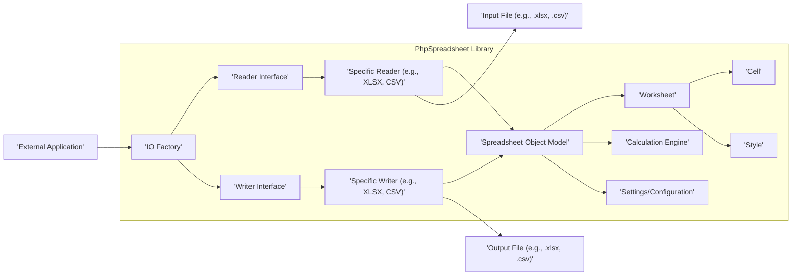
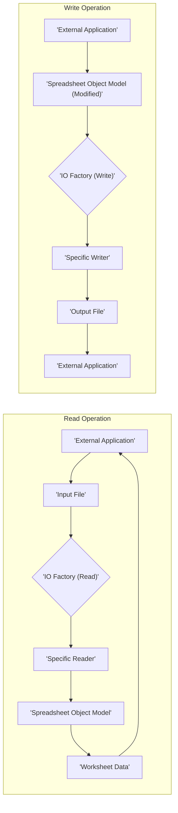

# Project Design Document: PhpSpreadsheet Library

**Version:** 1.1
**Date:** October 26, 2023
**Author:** AI Software Architect

## 1. Project Overview

PhpSpreadsheet is a mature, pure PHP library dedicated to reading and writing spreadsheet files. It empowers PHP developers to interact with various spreadsheet formats, including modern formats like XLSX (Microsoft Excel 2007 and later), older formats like XLS (Microsoft Excel 97-2003), and open standards like ODS (OpenDocument Spreadsheet), as well as simpler formats like CSV. The library provides a comprehensive set of classes for manipulating spreadsheet data, formatting, and metadata. This document outlines the architectural design and key components of PhpSpreadsheet to facilitate a thorough threat modeling exercise.

## 2. Goals

*   Present a refined and detailed overview of the PhpSpreadsheet library's architecture.
*   Clearly identify the core components, their responsibilities, and their interactions within the library.
*   Illustrate the flow of data through the library during read and write operations.
*   Explicitly highlight potential security vulnerabilities and areas of concern within each component to guide subsequent threat modeling activities.

## 3. Non-Goals

*   In-depth analysis of specific code implementations or algorithms within the library.
*   Benchmarking or performance evaluation of the library's operations.
*   User guides or tutorials on how to utilize the PhpSpreadsheet library in application development.
*   An exhaustive catalog of every class, method, or property available within the library.

## 4. Architectural Overview

PhpSpreadsheet employs an object-oriented architecture, structuring its functionality into distinct layers and components. This modular design promotes maintainability and allows for the extension of supported file formats. The core architectural layers are:

*   **IO Layer:**  Handles the input and output of spreadsheet files, including format detection and the creation of appropriate reader/writer instances.
*   **Reader Layer:**  Responsible for parsing data from various spreadsheet file formats and populating the internal object model.
*   **Core Layer (Spreadsheet Object Model):**  The central representation of the spreadsheet data in memory, consisting of objects like `Spreadsheet`, `Worksheet`, `Cell`, and `Style`.
*   **Writer Layer:**  Responsible for serializing the data from the object model into the desired output file format.
*   **Calculation Engine:**  Provides the functionality to evaluate formulas within spreadsheet cells.
*   **Settings and Configuration:**  Allows for customization of library behavior, such as locale settings and caching mechanisms.

## 5. Data Flow

The data flow within PhpSpreadsheet can be broadly categorized into read and write operations:

**Read Operation:**

1. **Initiation:** An external application provides a spreadsheet file to the library.
2. **Format Detection:** The `IO Factory` analyzes the file (typically by extension or magic number) to determine the appropriate reader.
3. **Reader Instantiation:** The `IO Factory` instantiates the specific reader class for the detected file format.
4. **Parsing:** The selected reader parses the input file, extracting data and metadata according to the file format specification.
5. **Object Model Population:** The reader populates the internal `Spreadsheet` object model with the parsed data, creating `Worksheet`, `Cell`, and `Style` objects.
6. **Access and Manipulation:** The external application interacts with the `Spreadsheet` object model to access and manipulate the spreadsheet data.

**Write Operation:**

1. **Modification (Optional):** The external application may modify the `Spreadsheet` object model.
2. **Writer Selection:** The `IO Factory` determines the appropriate writer based on the desired output file format (specified by the application).
3. **Writer Instantiation:** The `IO Factory` instantiates the specific writer class for the target file format.
4. **Serialization:** The selected writer serializes the data from the `Spreadsheet` object model into the format required by the output file.
5. **File Generation:** The writer generates the output spreadsheet file.

## 6. Key Components

*   **IO Factory:**
    *   **Responsibility:**  Central point for creating reader and writer instances. Determines the correct class to use based on file extensions or content.
    *   **Potential Security Concerns:**
        *   **Mismatched Reader/Writer:**  If file type detection is flawed, a malicious file could be processed by an incorrect reader, potentially leading to parsing errors or vulnerabilities.
        *   **Path Traversal:** If the factory allows user-controlled file paths without proper sanitization, it could be exploited to access or overwrite arbitrary files.

*   **Reader Interface and Specific Readers (e.g., XLSX, CSV, ODS):**
    *   **Responsibility:**  Implement the logic for parsing specific spreadsheet file formats. Each reader handles the unique structure and encoding of its format.
    *   **Potential Security Concerns:**
        *   **XML External Entity (XXE) Injection (XLSX, ODS):**  Vulnerable XML parsers within these readers could allow attackers to include external entities, potentially leading to information disclosure or denial of service.
        *   **CSV Injection:**  Readers might not properly sanitize cell values in CSV files, allowing attackers to inject formulas that execute arbitrary commands when the file is opened in spreadsheet software.
        *   **Buffer Overflows/Memory Corruption:**  Bugs in the parsing logic could lead to memory corruption if malformed files are processed.
        *   **Denial of Service:**  Processing extremely large or deeply nested files could exhaust server resources.

*   **Writer Interface and Specific Writers (e.g., XLSX, CSV, ODS):**
    *   **Responsibility:**  Implement the logic for writing data from the internal `Spreadsheet` object model to specific spreadsheet file formats.
    *   **Potential Security Concerns:**
        *   **Formula Injection:**  If user-provided data is directly written into formula fields without sanitization, it could lead to arbitrary code execution when the generated file is opened.
        *   **Information Disclosure:**  Writers might inadvertently include sensitive information in file metadata or comments.
        *   **Path Traversal (Less Common):**  In scenarios where the output file path is partially user-controlled, vulnerabilities could arise if not properly validated.

*   **Spreadsheet Object Model:**
    *   **Responsibility:**  The in-memory representation of the spreadsheet data. Provides a structured way to access and manipulate worksheets, cells, and styles.
    *   **Potential Security Concerns:**
        *   **Serialization/Deserialization Issues:** If the object model is serialized and deserialized (e.g., for caching), vulnerabilities could arise if the process is not secure against object injection attacks.
        *   **Logical Vulnerabilities:**  Improper handling of data within the object model could lead to unexpected behavior or vulnerabilities in dependent code.

*   **Worksheet:**
    *   **Responsibility:** Represents a single sheet within the spreadsheet, containing rows, columns, and cells.
    *   **Potential Security Concerns:**  Similar to the Spreadsheet Object Model, vulnerabilities are less direct but could arise from logical flaws in how worksheet data is managed or accessed.

*   **Cell:**
    *   **Responsibility:** Represents a single cell within a worksheet, holding data, formulas, and formatting information.
    *   **Potential Security Concerns:**  A primary target for injection attacks, particularly through formula fields. Improper handling of cell data could also lead to cross-site scripting (XSS) vulnerabilities if the data is later displayed in a web application without proper encoding.

*   **Style:**
    *   **Responsibility:**  Manages the visual formatting of cells, including fonts, colors, and borders.
    *   **Potential Security Concerns:**  Less likely to be a direct attack vector, but could potentially be used for obfuscation or social engineering if malicious formatting is applied.

*   **Calculation Engine:**
    *   **Responsibility:**  Evaluates formulas within spreadsheet cells.
    *   **Potential Security Concerns:**
        *   **Remote Code Execution (Less Likely in Pure PHP):**  While less common in pure PHP libraries, vulnerabilities in the formula parsing or evaluation logic could theoretically be exploited for code execution.
        *   **Denial of Service:**  Maliciously crafted formulas (e.g., infinite loops, excessively complex calculations) could consume significant server resources, leading to denial of service.

*   **Settings and Configuration:**
    *   **Responsibility:**  Allows for customization of library behavior, such as locale settings, caching mechanisms, and security-related options.
    *   **Potential Security Concerns:**
        *   **Insecure Defaults:**  Default settings might not be optimal from a security perspective.
        *   **Improper Configuration:**  Incorrectly configured settings could introduce vulnerabilities.

## 7. Security Considerations

Based on the architectural overview and key components, the following security considerations are crucial for PhpSpreadsheet:

*   **Strict Input Validation and Sanitization:**  Thoroughly validate and sanitize all input data, especially when reading files from untrusted sources. This includes:
    *   Verifying file headers and magic numbers to ensure the file type matches the expected format.
    *   Sanitizing cell values to prevent CSV injection attacks (e.g., by escaping or removing characters like '=', '+', '-', '@').
    *   Disabling or carefully controlling the processing of external entities in XML-based formats (XLSX, ODS) to prevent XXE attacks.
*   **Protection Against Injection Attacks:** Implement robust measures to prevent various injection attacks:
    *   **XXE Prevention:**  Configure XML parsers to disallow external entities and disable inline DTDs.
    *   **CSV Injection Prevention:**  Sanitize cell data, especially when writing CSV files, to prevent formulas from being interpreted by spreadsheet applications.
    *   **Formula Injection Prevention:**  Exercise caution when writing user-provided data into formula fields. Consider using a safe formula evaluation mechanism or sanitizing formula inputs.
*   **Secure Dependency Management:**  Keep all dependencies up-to-date to patch known vulnerabilities in underlying libraries. Regularly audit dependencies for security issues.
*   **Robust Error Handling:** Implement secure error handling to prevent the leakage of sensitive information in error messages. Avoid displaying internal paths or configuration details in error outputs.
*   **Resource Management:** Implement safeguards against resource exhaustion attacks:
    *   Limit the maximum size of uploaded files.
    *   Implement timeouts for file processing operations.
    *   Be mindful of memory usage when processing large spreadsheets.
*   **Secure Output Encoding:** Ensure proper encoding of output files to prevent character encoding issues or potential vulnerabilities in consuming applications. Use appropriate character sets (e.g., UTF-8).
*   **Principle of Least Privilege:** When integrating PhpSpreadsheet into a larger application, ensure that the library operates with the minimum necessary privileges.
*   **Security Audits and Penetration Testing:** Regularly conduct security audits and penetration testing to identify potential vulnerabilities in the library and its integration.

This improved design document provides a more detailed and security-focused foundation for conducting a comprehensive threat model of the PhpSpreadsheet library. By understanding the intricacies of its architecture, data flow, and potential security concerns within each component, developers and security professionals can effectively identify and mitigate potential risks.