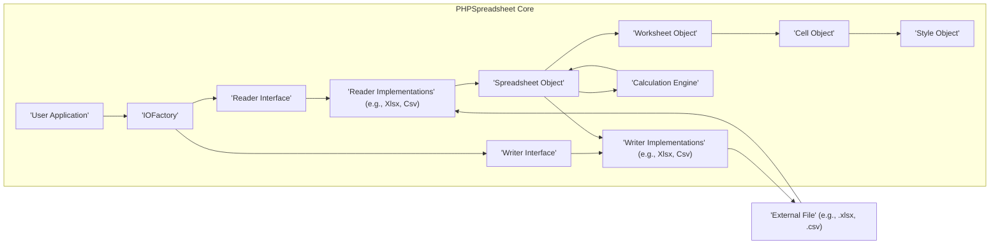

# Project Design Document: PHPSpreadsheet

**Version:** 1.1
**Date:** October 26, 2023
**Author:** AI Software Architect

## 1. Introduction

This document provides an enhanced architectural design of the PHPSpreadsheet library, a pure PHP library for reading and writing spreadsheet files. This detailed design serves as a robust foundation for understanding the system's components, data flow, and potential security considerations, which is essential for subsequent threat modeling activities. This version clarifies certain aspects and expands on security implications to better facilitate the threat modeling process.

## 2. Goals

*   Clearly define the major components and their interactions within the PHPSpreadsheet library, providing more granular detail.
*   Illustrate the data flow during typical read and write operations, explicitly highlighting potential security touchpoints.
*   Identify external dependencies and their roles, with a focus on security implications.
*   Highlight key areas that require careful consideration during threat modeling, providing more specific examples of potential threats.
*   Introduce a section on security architecture considerations within the library.

## 3. Architecture Overview

PHPSpreadsheet employs a modular architecture, effectively separating concerns related to reading, writing, and manipulating spreadsheet data. The central element is the `Spreadsheet` object, representing the in-memory structure of the spreadsheet.

## 4. Component Description

*   **User Application:** The PHP code that utilizes the PHPSpreadsheet library to interact with spreadsheet files. This is the initiating actor for all library operations.
    *   **Purpose:**  To leverage PHPSpreadsheet for spreadsheet data manipulation.
    *   **Key Functionality:** Instantiates reader/writer objects, loads/saves spreadsheets, accesses and modifies cell data.
    *   **Potential Security Implications:** The security of the application using PHPSpreadsheet directly impacts the overall security. Improper handling of user input or output can introduce vulnerabilities.
*   **IOFactory:** A factory class responsible for creating appropriate reader or writer instances based on file extensions or provided types.
    *   **Purpose:** Simplifies the instantiation of reader and writer objects.
    *   **Key Functionality:**  Determines the correct reader/writer class based on file information.
    *   **Potential Security Implications:** If the logic for determining the reader/writer is flawed, it could potentially lead to the use of an unexpected or malicious handler.
*   **Reader Interface:** Defines a contract for classes responsible for reading spreadsheet data from various file formats.
    *   **Purpose:** Provides an abstraction layer for reading different file types, promoting code reusability and maintainability.
    *   **Key Functionality:**  Declares methods like `load()` to parse the file and populate the `Spreadsheet` object.
    *   **Potential Security Implications:**  A well-defined interface helps enforce consistent behavior and allows for easier security audits of individual reader implementations.
*   **Reader Implementations (e.g., Xlsx, Csv, Ods):** Concrete classes that implement the `Reader Interface` for specific file formats.
    *   **Purpose:** Handles the format-specific parsing logic, translating the file format into the internal `Spreadsheet` object structure.
    *   **Key Functionality:**  Parsing XML structures (for XLSX), comma-separated values (for CSV), etc. This involves file I/O and data interpretation, making it a critical area for security vulnerabilities.
    *   **Potential Security Implications:**  Major attack surface. Vulnerabilities here can lead to:
        *   **XML External Entity (XXE) Injection:**  Especially relevant for XML-based formats like XLSX and ODS if XML parsing isn't secure.
        *   **Buffer Overflows:**  Possible in parsing routines if input validation is insufficient, leading to crashes or arbitrary code execution.
        *   **Denial of Service (DoS):**  By providing maliciously crafted files that consume excessive memory or processing power.
        *   **Path Traversal:** If the reader attempts to access external resources based on information within the file without proper sanitization.
*   **Spreadsheet Object:** The central data structure representing the entire spreadsheet in memory.
    *   **Purpose:** Holds all the worksheets, cell data, styles, and other properties of the spreadsheet in a structured format.
    *   **Key Functionality:**  Provides methods for accessing and manipulating worksheets, rows, columns, and individual cells.
    *   **Potential Security Implications:**  While primarily a data container, vulnerabilities in accessing or manipulating this object could lead to data corruption or unexpected behavior.
*   **Writer Interface:** Defines a contract for classes responsible for writing the `Spreadsheet` object to various file formats.
    *   **Purpose:** Provides an abstraction layer for writing to different file types.
    *   **Key Functionality:** Declares methods like `save()` to serialize the `Spreadsheet` object into a file.
    *   **Potential Security Implications:** Similar to the Reader Interface, a well-defined interface promotes consistent and auditable writer implementations.
*   **Writer Implementations (e.g., Xlsx, Csv, Html):** Concrete classes that implement the `Writer Interface` for specific file formats.
    *   **Purpose:** Handles the format-specific serialization logic, converting the in-memory `Spreadsheet` object into the target file format.
    *   **Key Functionality:**  Generating XML structures (for XLSX), comma-separated values (for CSV), HTML markup, etc.
    *   **Potential Security Implications:**
        *   **Data Injection:** If data is not properly encoded or sanitized before writing, it could lead to vulnerabilities in applications that subsequently process the generated files (e.g., CSV injection leading to formula execution in spreadsheet software).
        *   **Information Disclosure:**  Incorrect handling of metadata or sensitive information during the writing process could lead to unintended exposure.
*   **Calculation Engine:** Responsible for calculating formula values within the spreadsheet.
    *   **Purpose:** Evaluates cell formulas based on their dependencies and updates cell values accordingly.
    *   **Key Functionality:**  Parses formula strings, resolves cell references, performs calculations using a variety of functions.
    *   **Potential Security Implications:**
        *   **Formula Injection:** If user-provided data is incorporated into formulas without proper sanitization, attackers could inject malicious formulas to execute arbitrary code or access sensitive data *within* the spreadsheet context (though the impact is usually limited to the spreadsheet application itself).
        *   **Denial of Service:** Complex or deeply nested formulas could consume excessive resources, leading to performance issues or crashes.
*   **Cell Object:** Represents a single cell within a worksheet, containing its value, data type, and style information.
    *   **Purpose:** Stores individual cell data and associated attributes.
    *   **Key Functionality:** Holds the cell's value (string, number, date, formula), data type, and a reference to its style.
    *   **Potential Security Implications:** Less directly vulnerable, but the data it holds is subject to manipulation and potential injection vulnerabilities if not handled carefully by the user application.
*   **Worksheet Object:** Represents a single sheet within the spreadsheet, containing a collection of `Cell` objects.
    *   **Purpose:** Organizes cells into rows and columns, providing a logical grouping of data.
    *   **Key Functionality:** Provides methods for accessing and manipulating rows, columns, and ranges of cells.
    *   **Potential Security Implications:** Similar to the `Cell Object`, less directly vulnerable but part of the overall data structure that needs secure handling.
*   **Style Object:** Represents the formatting applied to cells, such as font, colors, borders, and number formats.
    *   **Purpose:** Stores styling information to control the visual presentation of cell data.
    *   **Key Functionality:** Contains properties for various styling attributes.
    *   **Potential Security Implications:**  Generally not a direct source of security vulnerabilities, but could be a target for data manipulation if an attacker aims to alter the presentation of information.
*   **External File (e.g., .xlsx, .csv):** The source or destination of the spreadsheet data.
    *   **Purpose:**  Persistent storage for spreadsheet data.
    *   **Key Functionality:** Holds the data in a specific file format.
    *   **Potential Security Implications:** The integrity and confidentiality of these files are paramount. Access control and secure storage mechanisms are crucial.

## 5. Data Flow with Security Considerations

### 5.1. Reading a Spreadsheet File

1. The **User Application** initiates the reading process, potentially based on user input (filename, upload). **Security Consideration:** Input validation is crucial here to prevent path traversal or attempts to load unexpected file types.
2. The **IOFactory** determines the appropriate **Reader Implementation** based on the file extension or provided type. **Security Consideration:** Ensure the logic for selecting the reader is robust and cannot be manipulated to force the use of a vulnerable reader.
3. The selected **Reader Implementation** parses the **External File**. **Security Consideration:** This is a critical stage where parsing vulnerabilities (XXE, buffer overflows, DoS) can be exploited. Secure parsing techniques and input sanitization within the reader are essential.
4. The **Reader Implementation** creates and populates the **Spreadsheet Object** with data from the file. **Security Consideration:**  Ensure data is handled securely during population, preventing potential data corruption or injection issues within the in-memory representation.
5. The populated **Spreadsheet Object** is returned to the **User Application**. **Security Consideration:** The application needs to handle the data securely and avoid introducing new vulnerabilities when processing the loaded spreadsheet.

### 5.2. Writing a Spreadsheet File

1. The **User Application** manipulates the **Spreadsheet Object**. **Security Consideration:** The application must ensure that modifications to the spreadsheet data do not introduce vulnerabilities that could be exploited when the file is written.
2. The **User Application** initiates the writing process, specifying the output file path and format. **Security Consideration:** Validate the output path to prevent directory traversal vulnerabilities.
3. The **IOFactory** determines the appropriate **Writer Implementation**.
4. The selected **Writer Implementation** serializes the **Spreadsheet Object** into the specified file format. **Security Consideration:**  Ensure proper encoding and sanitization of data during serialization to prevent injection vulnerabilities in the output file (e.g., CSV injection).
5. The **Writer Implementation** writes the serialized data to the **External File**. **Security Consideration:** Ensure proper file permissions and access controls are in place when writing the file.

### 5.3. Formula Calculation

1. When a cell containing a formula needs to be evaluated, the **Calculation Engine** is invoked.
2. The **Calculation Engine** parses the formula string. **Security Consideration:**  While typically not directly exposed to external input within PHPSpreadsheet's core functionality, if formula strings are constructed based on user input elsewhere, proper sanitization is necessary to prevent formula injection.
3. The **Calculation Engine** resolves cell references and performs calculations. **Security Consideration:**  Ensure the calculation engine handles potential errors or malicious formulas gracefully to prevent DoS or unexpected behavior.
4. The calculated result is stored back in the **Cell Object**.

## 6. External Dependencies and Security Implications

*   **PHP:** The underlying runtime environment.
    *   **Security Implications:**  Vulnerabilities in the PHP interpreter itself can impact PHPSpreadsheet. Keeping PHP updated is crucial.
*   **PHP Extensions (e.g., `zip`, `xml`, `gd`):**  Used for specific file format handling or functionalities.
    *   **Security Implications:** Vulnerabilities in these extensions can be exploited through PHPSpreadsheet. Ensure extensions are up-to-date and from trusted sources. Specifically, the `xml` extension is critical for parsing XLSX and ODS, making it a key area for potential XXE vulnerabilities if not configured securely.
*   **Third-party Libraries (Potentially):** While PHPSpreadsheet aims to be self-contained, specific reader or writer implementations *might* rely on external libraries.
    *   **Security Implications:**  Introduces a transitive dependency risk. Vulnerabilities in these third-party libraries could affect PHPSpreadsheet. Thoroughly audit dependencies and keep them updated.

## 7. Security Architecture Considerations

*   **Input Validation:**  PHPSpreadsheet should implement robust input validation at various stages, particularly within the reader implementations, to sanitize data from external files and prevent various injection attacks.
*   **Secure Parsing:**  For XML-based formats, secure XML parsing practices should be employed to mitigate XXE vulnerabilities. This includes disabling external entity resolution by default.
*   **Output Encoding:**  Writer implementations should properly encode data when generating output files to prevent injection vulnerabilities in applications that consume these files (e.g., CSV injection).
*   **Error Handling:**  Proper error handling is crucial to prevent information disclosure through error messages and to gracefully handle malicious input without crashing or exposing sensitive information.
*   **Principle of Least Privilege:**  The library itself should operate with the minimum necessary permissions. When used in a larger application, the application should also adhere to this principle.
*   **Regular Updates:**  Keeping PHPSpreadsheet and its dependencies updated is essential to patch known security vulnerabilities.

## 8. Key Security Considerations for Threat Modeling

This section provides more specific examples of potential threats to consider during threat modeling:

*   **Malicious File Upload:** An attacker uploads a crafted spreadsheet file designed to exploit parsing vulnerabilities in a Reader Implementation (e.g., XXE in XLSX, buffer overflow in CSV).
*   **CSV Injection:**  An attacker crafts a CSV file with malicious formulas that are executed when opened in spreadsheet software.
*   **Formula Injection (Indirect):** While direct user input into formulas might be limited within PHPSpreadsheet's core, if an application uses user input to construct formulas programmatically before passing them to PHPSpreadsheet, vulnerabilities can arise.
*   **Denial of Service via File Size:** An attacker provides an extremely large spreadsheet file that exhausts server resources during parsing or processing.
*   **Denial of Service via Complex Formulas:** An attacker crafts a spreadsheet with excessively complex or deeply nested formulas that consume significant CPU time during calculation.
*   **Path Traversal during Read/Write:** An attacker manipulates file paths to access or overwrite files outside the intended directories.
*   **Information Disclosure via Error Messages:**  Verbose error messages during parsing or processing reveal sensitive information about the server or application.
*   **Exploitation of Dependency Vulnerabilities:** Attackers target known vulnerabilities in PHP extensions or third-party libraries used by PHPSpreadsheet.

## 9. Conclusion

This enhanced design document provides a more detailed and security-focused overview of the PHPSpreadsheet library's architecture and data flow. By understanding these aspects, developers and security professionals can more effectively identify and mitigate potential security threats. The outlined security considerations and threat examples serve as a solid foundation for conducting thorough threat modeling and implementing appropriate security measures when using PHPSpreadsheet.