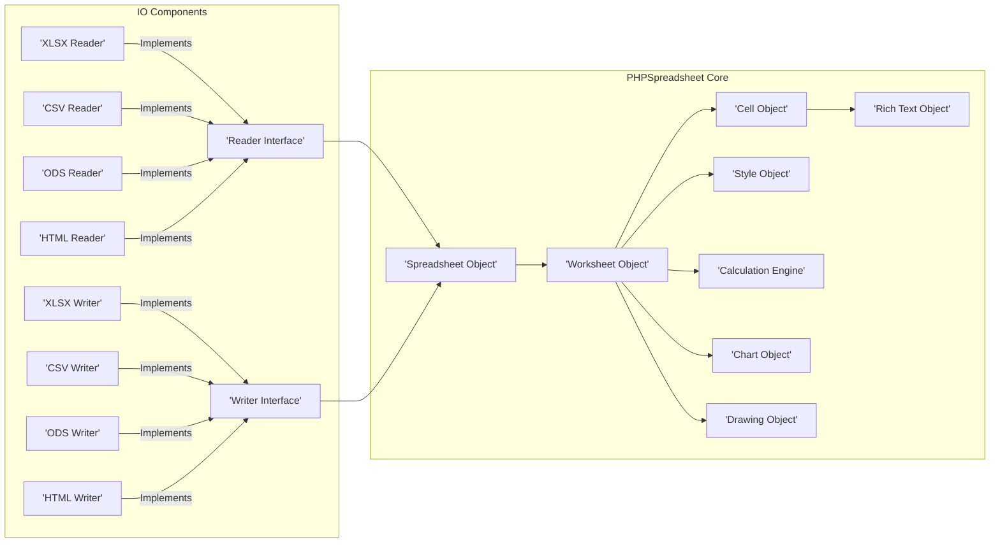
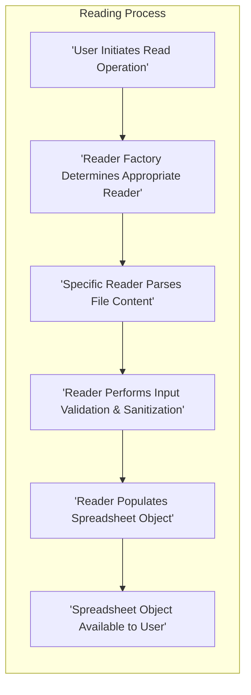
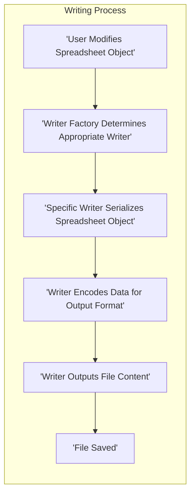

# Project Design Document: PHPSpreadsheet

**Version:** 1.1
**Date:** October 26, 2023
**Author:** AI Software Architect

## 1. Introduction

This document provides a detailed design overview of the PHPSpreadsheet library, a pure PHP library for reading and writing spreadsheet files. This document is intended to serve as a foundation for subsequent threat modeling activities. It outlines the key components, architecture, data flow, and external interactions of the library, with a stronger emphasis on security aspects.

## 2. Goals and Objectives

The primary goals of PHPSpreadsheet are:

*   Provide a robust and reliable library for manipulating spreadsheet files in PHP.
*   Support a wide range of spreadsheet formats (e.g., XLSX, CSV, ODS).
*   Offer a comprehensive API for reading, writing, and modifying spreadsheet data, formatting, and formulas.
*   Maintain a high level of code quality and security, minimizing potential vulnerabilities.
*   Provide a well-documented and easy-to-use API for developers.

## 3. Architectural Overview

PHPSpreadsheet follows a modular design, separating concerns into distinct components. The core architecture revolves around representing a spreadsheet document in memory and providing mechanisms to interact with different file formats. This separation allows for easier maintenance and extensibility.

**Key Architectural Components:**

*   **Spreadsheet Object:** The central object representing the entire spreadsheet document in memory. It acts as a container for `Worksheet` objects and manages global spreadsheet properties.
*   **Worksheet Object:** Represents a single sheet within the spreadsheet. It manages a collection of `Cell` objects, along with sheet-specific properties like name, visibility, and dimensions.
*   **Cell Object:** Represents a single cell within a worksheet. It stores the cell's value, data type (e.g., numeric, string, formula), and a reference to its associated `Style` object.
*   **Style Object:** Encapsulates formatting properties that can be applied to cells, rows, columns, or the entire worksheet. This includes font, borders, fill, alignment, and number formatting.
*   **Calculation Engine:** Responsible for parsing and evaluating formulas within cells. It manages dependencies between cells and recalculates formula results when necessary. This component is a critical area for potential security vulnerabilities.
*   **Chart Object:** Represents charts embedded within the spreadsheet, including their data sources, types, and formatting.
*   **Drawing Object:** Represents images and other graphical elements embedded within the spreadsheet. It handles the storage and rendering of these elements.
*   **Rich Text Object:** Allows for applying different formatting within a single cell's text content, such as bold, italics, and different fonts.
*   **Reader Interface:** Defines a common interface for all reader implementations, ensuring a consistent way to load spreadsheet data from various file formats.
*   **Writer Interface:** Defines a common interface for all writer implementations, ensuring a consistent way to save the in-memory `Spreadsheet` object to different file formats.
*   **Specific Reader Implementations (e.g., XLSX Reader, CSV Reader):**  Implement the `Reader Interface` and handle the specific logic for parsing and interpreting the structure and data of each supported file format. These are key areas for potential file parsing vulnerabilities.
*   **Specific Writer Implementations (e.g., XLSX Writer, CSV Writer):** Implement the `Writer Interface` and handle the specific logic for generating files in each supported format based on the data in the `Spreadsheet` object.

## 4. Data Flow

The typical data flow within PHPSpreadsheet involves either reading data from a file into the internal object model or writing data from the object model to a file. Understanding these flows is crucial for identifying potential data manipulation points and security risks.

**4.1. Reading a Spreadsheet File:**

**Steps:**

1. The user initiates the process of reading a spreadsheet file, providing the file path or content.
2. The `IOFactory` or a specific reader class is used to determine the appropriate reader implementation based on the file extension or content (e.g., by examining magic numbers).
3. The selected reader implementation (e.g., `XLSX Reader`) parses the file content according to the specific format's structure. This involves reading and interpreting the file's internal organization and data encoding.
4. **Crucially, the reader should perform input validation and sanitization on the data being read from the file.** This step is vital to prevent malicious data from being loaded into the `Spreadsheet` object. This includes checks for data types, ranges, and potentially harmful content.
5. The reader populates the internal `Spreadsheet` object with data extracted from the file, creating `Worksheet`, `Cell`, and other relevant objects.
6. The fully populated `Spreadsheet` object is then available for the user to interact with and manipulate within the PHP application.

**4.2. Writing a Spreadsheet File:**

**Steps:**

1. The user manipulates the `Spreadsheet` object in memory, modifying cell values, styles, and other properties.
2. The `IOFactory` or a specific writer class is used to determine the appropriate writer implementation based on the desired output file format.
3. The selected writer implementation (e.g., `XLSX Writer`) serializes the data from the `Spreadsheet` object into the target file format's structure. This involves converting the in-memory representation into the specific file format's encoding and organization.
4. The writer encodes the data appropriately for the output format, ensuring compatibility and proper representation in the saved file. This might involve character encoding conversions or format-specific data transformations.
5. The writer outputs the generated file content to a specified file path or stream.
6. The spreadsheet file is saved in the chosen format.

## 5. Security Considerations (Detailed)

A thorough understanding of potential security vulnerabilities is essential for secure usage of PHPSpreadsheet.

*   **File Parsing Vulnerabilities:** Maliciously crafted spreadsheet files can exploit weaknesses in the reader implementations.
    *   **XML External Entity (XXE) Injection:**  Particularly relevant for XML-based formats like XLSX and ODS. Attackers could embed malicious external entity references in the file, allowing them to read local files on the server, cause denial of service, or potentially achieve remote code execution. **Mitigation:** Ensure XML parsing libraries are configured to disable external entity resolution by default.
    *   **Zip Slip Vulnerability:** When extracting files from ZIP archives (common in XLSX), improper handling of file paths within the archive could allow attackers to write files to arbitrary locations on the server. **Mitigation:** Implement robust path sanitization during ZIP extraction.
    *   **Denial of Service (DoS):**  Providing extremely large or deeply nested files can consume excessive CPU and memory resources during parsing, leading to application crashes or slowdowns. **Mitigation:** Implement resource limits and timeouts during file parsing.
    *   **Buffer Overflows/Memory Corruption:**  Vulnerabilities in the parsing logic could potentially lead to buffer overflows or memory corruption if not handled carefully. **Mitigation:** Employ secure coding practices and thorough testing.
*   **Formula Evaluation Vulnerabilities:** Malicious formulas injected into spreadsheets can pose significant risks.
    *   **Remote Code Execution (RCE):** If the calculation engine allows execution of arbitrary code through specially crafted formulas (e.g., through external function calls or scripting capabilities), attackers could gain control of the server. **Mitigation:**  Strictly limit the functionality of the formula engine and sanitize or disallow potentially dangerous functions. Consider sandboxing the formula evaluation process.
    *   **Information Disclosure:** Formulas could be crafted to access sensitive data within the spreadsheet or potentially external resources if the calculation engine allows network access. **Mitigation:**  Restrict the capabilities of formulas to access external data or system resources.
    *   **Denial of Service (DoS):** Computationally intensive or infinite loop formulas can consume excessive CPU resources, leading to denial of service. **Mitigation:** Implement safeguards to detect and prevent excessively long or complex calculations.
*   **Path Traversal:** Improper handling of file paths during read or write operations can allow attackers to access or modify files outside the intended directories. **Mitigation:**  Always use absolute paths or carefully sanitize user-provided file paths. Avoid relying on relative paths where possible.
*   **Memory Exhaustion:** Processing very large spreadsheets, especially those with complex formulas or styling, can lead to excessive memory consumption, potentially causing application crashes. **Mitigation:** Implement mechanisms to handle large files efficiently, potentially using streaming or chunking techniques. Configure appropriate memory limits for the PHP process.
*   **Dependency Vulnerabilities:** Vulnerabilities in the underlying libraries used by PHPSpreadsheet (e.g., XML parsing libraries, ZIP libraries) can introduce security risks. **Mitigation:** Regularly update dependencies to their latest secure versions and monitor for known vulnerabilities.

## 6. Deployment Considerations

Proper deployment practices are crucial for maintaining the security and stability of applications using PHPSpreadsheet.

*   **PHP Version Compatibility:** Ensure the PHP environment meets the minimum requirements of the PHPSpreadsheet version being used. Older PHP versions may have known security vulnerabilities.
*   **Extension Requirements:** Verify that all necessary PHP extensions (e.g., `zip`, `xmlreader`, `xmlwriter`, `gd` or `imagick`) are enabled and properly configured.
*   **Memory Limits:**  Applications processing large spreadsheets may require increased PHP memory limits (`memory_limit` in `php.ini`). However, be mindful of potential memory exhaustion vulnerabilities.
*   **File System Permissions:**  Ensure the PHP process has appropriate read and write permissions to the directories where spreadsheet files are located. Restrict permissions to the minimum necessary level.
*   **Input Validation:** Always validate and sanitize user-provided input, especially file paths and spreadsheet data, before using it with PHPSpreadsheet.
*   **Regular Updates:** Keep PHPSpreadsheet updated to the latest version to benefit from bug fixes and security patches.
*   **Security Audits:** Periodically conduct security audits of the application and its usage of PHPSpreadsheet to identify potential vulnerabilities.

## 7. Dependencies

PHPSpreadsheet relies on several external libraries and PHP extensions. Keeping these dependencies up-to-date is crucial for security.

*   **PHP:** The core language. Ensure a supported and secure version is used.
*   **ext-xml (XML Parser Extension):** Required for handling XML-based formats like XLSX and ODS.
*   **ext-zip (Zip Extension):** Required for reading and writing XLSX files.
*   **ext-gd or ext-imagick (Optional):** For handling images in spreadsheets.
*   **Composer Packages (Managed via `composer.json`):**
    *   `psr/simple-cache`: For caching mechanisms.
    *   `markbaker/complex`: For handling complex numbers in calculations.
    *   `markbaker/matrix`: For matrix operations in calculations.

## 8. Future Considerations

Ongoing development and security enhancements are important for the long-term viability and security of PHPSpreadsheet.

*   **Improved Security Audits:** Implement a process for regular security audits and penetration testing by security professionals.
*   **Enhanced Input Validation and Sanitization:** Continuously improve the input validation and sanitization mechanisms within the reader implementations to prevent exploitation of parsing vulnerabilities.
*   **Sandboxing of Formula Evaluation:** Explore and implement robust sandboxing techniques for the formula evaluation engine to mitigate the risks associated with malicious formulas.
*   **Performance Optimization:** Continue to optimize the performance of reading and writing operations, especially for large and complex files, while ensuring security is not compromised.
*   **Cloud Storage Integration:** Consider adding native support for reading and writing spreadsheets directly from cloud storage services, while addressing the associated security considerations.
*   **Content Security Policy (CSP) Considerations:** For web applications that generate spreadsheets for download, consider how CSP headers might interact with embedded content within the spreadsheets.

This improved design document provides a more detailed and security-focused overview of the PHPSpreadsheet project. It highlights key components, data flows, and potential security vulnerabilities, serving as a valuable resource for threat modeling and secure development practices.