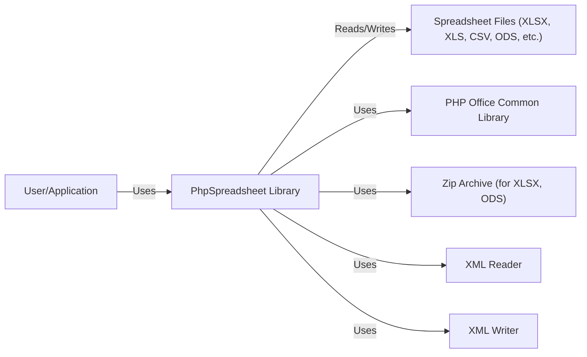
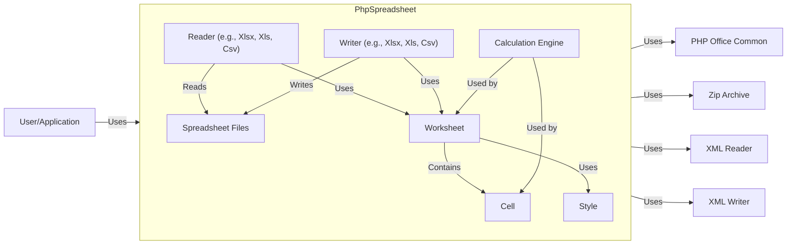
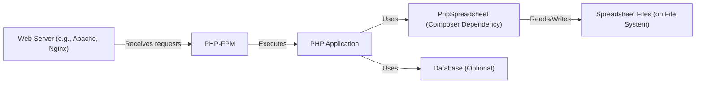
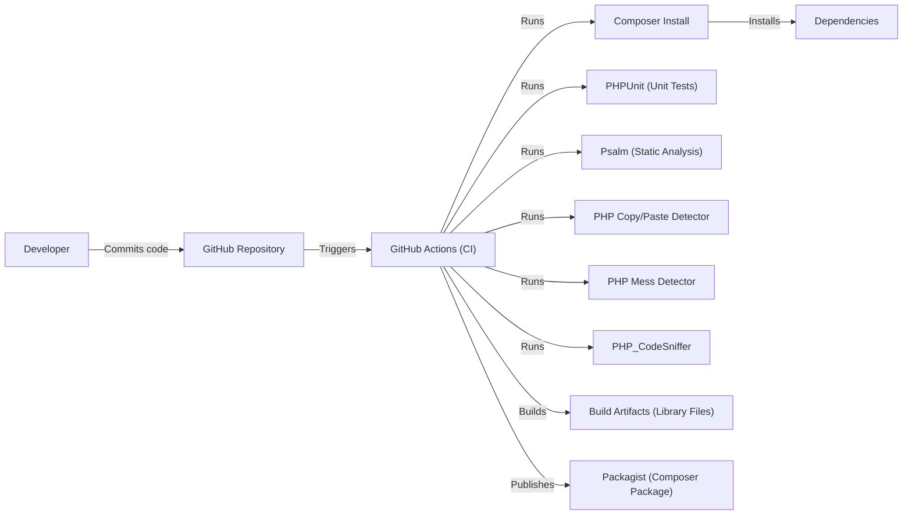

# BUSINESS POSTURE

PhpSpreadsheet is a widely used, mature open-source library. It's likely integrated into numerous business-critical applications across various industries. The primary business goal is to provide a stable, reliable, and feature-rich solution for reading and writing spreadsheet files. Given its widespread use, maintaining backward compatibility and stability are paramount.

Business Priorities:

*   Maintainability: Easy to understand, modify, and extend the codebase.
*   Reliability: Ensure the library functions correctly and handles various edge cases and error conditions gracefully.
*   Compatibility: Support a wide range of spreadsheet file formats (e.g., XLSX, XLS, CSV, ODS).
*   Performance: Efficiently handle large spreadsheets without excessive memory consumption or processing time.
*   Community Support: Foster an active community of users and contributors.
*   Security: Protect users from vulnerabilities that could lead to data breaches, code execution, or other security incidents.

Business Risks:

*   Data Corruption: Incorrectly reading or writing spreadsheet data could lead to financial losses, operational disruptions, or reputational damage.
*   Security Vulnerabilities: Exploitable vulnerabilities could allow attackers to compromise systems using the library, leading to data breaches or other malicious actions.
*   Dependency Issues: Vulnerabilities or compatibility problems in upstream dependencies could impact PhpSpreadsheet users.
*   Lack of Maintenance: Insufficient developer resources or community engagement could lead to the project becoming outdated or abandoned.
*   Compatibility Breaks: Changes that break backward compatibility could disrupt existing applications relying on the library.

# SECURITY POSTURE

Existing Security Controls:

*   security control: Input Validation: The library likely includes input validation to handle various data types and prevent common injection vulnerabilities. Implemented in various classes responsible for parsing and processing spreadsheet data.
*   security control: Regular Updates: The project maintainers release updates to address bug fixes and security vulnerabilities. Described in release notes and commit history.
*   security control: Community Scrutiny: Being open-source, the codebase is subject to scrutiny from the community, which can help identify and address security issues. Visible on GitHub through issues, pull requests, and discussions.
*   security control: Automated Tests: The project has a comprehensive test suite that helps ensure the correctness and stability of the code, reducing the risk of introducing vulnerabilities. Visible in the `tests/` directory and CI configuration.
*   security control: Static Analysis: The project uses static analysis tools to identify potential code quality and security issues. Described in the project's documentation and CI configuration.
*   security control: Dependency Management: The project uses Composer to manage dependencies, allowing for easier tracking and updating of external libraries. Described in `composer.json` and `composer.lock`.

Accepted Risks:

*   accepted risk: Complexity: The library's inherent complexity in handling various spreadsheet formats and features increases the potential for undiscovered vulnerabilities.
*   accepted risk: Third-Party Libraries: The library relies on external libraries (e.g., for XML parsing), which may have their own vulnerabilities.
*   accepted risk: User-Controlled Input: The library processes user-provided data, which inherently carries a risk of malicious input.

Recommended Security Controls:

*   Fuzzing: Implement fuzzing tests to identify potential vulnerabilities related to unexpected or malformed input.
*   Regular Security Audits: Conduct periodic security audits by independent experts to identify potential vulnerabilities.
*   Content Security Policy (CSP): If the library is used in a web context, implement CSP to mitigate the risk of cross-site scripting (XSS) attacks. (This is less likely to be directly applicable to PhpSpreadsheet itself, but relevant to applications using it).
*   Sandboxing: If feasible, explore sandboxing techniques to isolate the library's processing from the rest of the application, limiting the impact of potential vulnerabilities.

Security Requirements:

*   Authentication: Not directly applicable to the library itself, but applications using it should implement proper authentication mechanisms.
*   Authorization: Not directly applicable to the library itself, but applications using it should implement proper authorization mechanisms to control access to spreadsheet data.
*   Input Validation:
    *   Validate all input data to ensure it conforms to expected types and formats.
    *   Sanitize input to prevent common injection vulnerabilities (e.g., XML injection, CSV injection).
    *   Handle large files and potentially malicious formulas securely.
*   Cryptography:
    *   If the library supports encrypted spreadsheets, ensure it uses strong, up-to-date cryptographic algorithms and libraries.
    *   Securely manage cryptographic keys.
*   Output Encoding:
    *   If the library generates output that is displayed in a web browser, ensure proper output encoding to prevent XSS vulnerabilities.

# DESIGN

## C4 CONTEXT

Element Descriptions:

*   Element:
    *   Name: User/Application
    *   Type: Person/System
    *   Description: A user or an application that utilizes the PhpSpreadsheet library to interact with spreadsheet files.
    *   Responsibilities: Provides input data, initiates read/write operations, handles the results.
    *   Security controls: Authentication, Authorization, Input validation, Output encoding (in the application using PhpSpreadsheet).

*   Element:
    *   Name: PhpSpreadsheet Library
    *   Type: Library
    *   Description: The core library for reading and writing spreadsheet files.
    *   Responsibilities: Parsing spreadsheet files, creating spreadsheet files, manipulating spreadsheet data, handling different file formats.
    *   Security controls: Input validation, secure handling of temporary files, dependency management.

*   Element:
    *   Name: Spreadsheet Files (XLSX, XLS, CSV, ODS, etc.)
    *   Type: File
    *   Description: Spreadsheet files in various formats.
    *   Responsibilities: Storing spreadsheet data.
    *   Security controls: File system permissions, encryption (if supported by the format and used).

*   Element:
    *   Name: PHP Office Common Library
    *   Type: Library
    *   Description: Common functionalities used by PHP Office libraries.
    *   Responsibilities: Provide shared utilities and base classes.
    *   Security controls: Input validation, secure coding practices.

*   Element:
    *   Name: ZipArchive
    *   Type: Library
    *   Description: PHP extension for handling ZIP archives (used for XLSX and ODS formats).
    *   Responsibilities: Compressing and decompressing data.
    *   Security controls: Secure handling of compressed data, protection against zip bomb attacks.

*   Element:
    *   Name: XMLReader
    *   Type: Library
    *   Description: PHP extension for reading XML data.
    *   Responsibilities: Parsing XML content.
    *   Security controls: Secure XML parsing, protection against XXE attacks.

*   Element:
    *   Name: XMLWriter
    *   Type: Library
    *   Description: PHP extension for writing XML data.
    *   Responsibilities: Generating XML content.
    *   Security controls: Secure XML generation, proper encoding.

## C4 CONTAINER

Element Descriptions:

*   Element:
    *   Name: Reader (e.g., Xlsx, Xls, Csv)
    *   Type: Component
    *   Description: Components responsible for reading specific spreadsheet file formats.
    *   Responsibilities: Parsing the file format, extracting data, populating Worksheet objects.
    *   Security controls: Input validation, secure parsing of file format-specific structures.

*   Element:
    *   Name: Writer (e.g., Xlsx, Xls, Csv)
    *   Type: Component
    *   Description: Components responsible for writing specific spreadsheet file formats.
    *   Responsibilities: Generating the file format, writing data from Worksheet objects.
    *   Security controls: Secure generation of file format-specific structures, proper encoding.

*   Element:
    *   Name: Worksheet
    *   Type: Component
    *   Description: Represents a single worksheet within a spreadsheet.
    *   Responsibilities: Storing cell data, managing styles, handling calculations.
    *   Security controls: Input validation for cell data, secure handling of formulas.

*   Element:
    *   Name: Cell
    *   Type: Component
    *   Description: Represents a single cell within a worksheet.
    *   Responsibilities: Storing cell value, data type, and formatting.
    *   Security controls: Input validation for cell value, secure handling of formulas.

*   Element:
    *   Name: Style
    *   Type: Component
    *   Description: Represents the style of a cell or range of cells.
    *   Responsibilities: Storing formatting information (e.g., font, color, alignment).
    *   Security controls: None specific, relies on general secure coding practices.

*   Element:
    *   Name: Calculation Engine
    *   Type: Component
    *   Description: Responsible for evaluating formulas within cells.
    *   Responsibilities: Parsing and evaluating formulas, handling cell references, managing dependencies.
    *   Security controls: Secure formula parsing, protection against malicious formulas (e.g., remote code execution), resource limits to prevent denial-of-service.

*   Element:
    *   Name: PHPOfficeCommon, ZipArchive, XMLReader, XMLWriter
    *   Type: Library
    *   Description: Same as C4 Context diagram.
    *   Responsibilities: Same as C4 Context diagram.
    *   Security controls: Same as C4 Context diagram.

## DEPLOYMENT

Possible Deployment Solutions:

1.  Composer Dependency: The most common deployment method is as a dependency within a larger PHP application using Composer.
2.  Standalone Script:  Less common, but possible to use the library in a standalone PHP script.
3.  Docker Container: The library could be part of a Docker container that includes a PHP environment and the application using it.
4.  Cloud Functions/Serverless: The library could be used within cloud functions (e.g., AWS Lambda, Azure Functions, Google Cloud Functions) to process spreadsheets in a serverless environment.

Chosen Deployment Solution (Composer Dependency):

Element Descriptions:

*   Element:
    *   Name: Web Server (e.g., Apache, Nginx)
    *   Type: Software System
    *   Description: Receives HTTP requests from users.
    *   Responsibilities: Handling HTTP requests, serving static content, forwarding requests to PHP-FPM.
    *   Security controls: Web server configuration hardening, TLS/SSL encryption, input validation, protection against common web attacks (e.g., DDoS).

*   Element:
    *   Name: PHP-FPM
    *   Type: Software System
    *   Description: FastCGI Process Manager for PHP.
    *   Responsibilities: Executing PHP scripts, managing PHP processes.
    *   Security controls: Secure configuration, resource limits, process isolation.

*   Element:
    *   Name: Application
    *   Type: Software System
    *   Description: The PHP application that uses PhpSpreadsheet.
    *   Responsibilities: Handling application logic, interacting with PhpSpreadsheet, interacting with the database (if applicable).
    *   Security controls: Authentication, authorization, input validation, output encoding, secure coding practices.

*   Element:
    *   Name: PhpSpreadsheet (Composer Dependency)
    *   Type: Library
    *   Description: The PhpSpreadsheet library, installed as a Composer dependency.
    *   Responsibilities: Reading and writing spreadsheet files.
    *   Security controls: Input validation, secure handling of temporary files, dependency management.

*   Element:
    *   Name: Spreadsheet Files (on File System)
    *   Type: File
    *   Description: Spreadsheet files stored on the server's file system.
    *   Responsibilities: Storing spreadsheet data.
    *   Security controls: File system permissions, encryption (if supported by the format and used).

*   Element:
    *   Name: Database (Optional)
    *   Type: Database
    *   Description: A database used by the application (optional).
    *   Responsibilities: Storing application data.
    *   Security controls: Database security configuration, access controls, encryption, input validation (for data stored in the database).

## BUILD

The PhpSpreadsheet project uses a combination of tools and processes for building and publishing the library.

Build Process Description:

1.  Developers write code and commit it to the GitHub repository.
2.  GitHub Actions, the CI/CD system used by the project, is triggered by commits and pull requests.
3.  The GitHub Actions workflow performs the following steps:
    *   Installs dependencies using Composer.
    *   Runs unit tests using PHPUnit.
    *   Performs static analysis using Psalm.
    *   Checks for code duplication using PHP Copy/Paste Detector.
    *   Checks for code quality issues using PHP Mess Detector.
    *   Enforces coding standards using PHP_CodeSniffer.
    *   If all checks pass, the workflow builds the library artifacts (the library files).
    *   Publishes the library as a Composer package on Packagist.

Security Controls in Build Process:

*   Dependency Management: Composer is used to manage dependencies, ensuring that specific versions of external libraries are used. `composer.lock` file locks dependencies to precise versions.
*   Static Analysis: Psalm is used for static analysis, which helps identify potential security vulnerabilities and code quality issues before runtime.
*   Unit Tests: PHPUnit is used for unit testing, which helps ensure that the code functions as expected and reduces the risk of introducing bugs, including security vulnerabilities.
*   Code Quality Checks: PHP Copy/Paste Detector, PHP Mess Detector, and PHP_CodeSniffer are used to enforce code quality standards, which can indirectly improve security by reducing the likelihood of introducing vulnerabilities due to poor coding practices.
*   CI/CD: GitHub Actions provides a consistent and automated build environment, reducing the risk of manual errors and ensuring that security checks are always performed.
*   Supply Chain Security: While Composer and Packagist are generally trusted, it's important to be aware of the potential for supply chain attacks. Regularly auditing dependencies and using tools like Dependabot (which is often integrated with GitHub) can help mitigate this risk.

# RISK ASSESSMENT

Critical Business Processes:

*   Reading and writing spreadsheet data accurately and reliably.
*   Maintaining compatibility with various spreadsheet file formats.
*   Providing a stable and maintainable library for developers to use.

Data Sensitivity:

*   The data processed by PhpSpreadsheet can vary greatly in sensitivity, ranging from non-sensitive public data to highly confidential financial information, personal data, or trade secrets.
*   The library itself doesn't inherently know the sensitivity of the data it's processing. It's the responsibility of the applications using the library to handle data appropriately based on its sensitivity.
*   Data Sensitivity Levels:
    *   Public: Non-sensitive data that can be freely shared.
    *   Internal: Data intended for internal use within an organization.
    *   Confidential: Sensitive data that requires protection from unauthorized access.
    *   Restricted: Highly sensitive data with strict access controls.

# QUESTIONS & ASSUMPTIONS

Questions:

*   Are there any specific compliance requirements (e.g., GDPR, HIPAA) that applications using PhpSpreadsheet typically need to adhere to? This would influence recommendations for data handling and security controls within those applications.
*   What is the expected lifespan of the library? This helps determine the importance of long-term maintainability and security.
*   What are the most common use cases for the library? This helps prioritize security considerations for those specific scenarios.
*   Are there any plans to support new file formats or features that could introduce new security risks?
*   What level of security expertise is available within the PhpSpreadsheet development team and community?

Assumptions:

*   BUSINESS POSTURE: The primary users of PhpSpreadsheet are developers integrating it into their applications. The library is used in a wide range of applications, from small scripts to large enterprise systems.
*   SECURITY POSTURE: The PhpSpreadsheet maintainers are committed to security and follow best practices for secure software development. The community actively contributes to identifying and addressing security issues. The library is primarily used in server-side PHP environments.
*   DESIGN: The library's architecture is modular and well-structured. The code is generally well-documented and easy to understand. The library relies on standard PHP extensions and libraries. The deployment model is primarily through Composer.