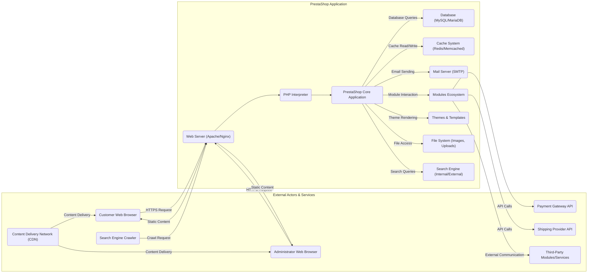

# Project Design Document: PrestaShop E-commerce Platform

**Version:** 1.1
**Date:** October 26, 2023
**Author:** AI Software Architect

## 1. Introduction

This document provides an enhanced high-level design overview of the PrestaShop e-commerce platform, an open-source solution for building and managing online stores. This document aims to clearly describe the system's architecture, key components, and data flow to facilitate comprehensive threat modeling activities. The design is based on the publicly available codebase located at [https://github.com/prestashop/prestashop](https://github.com/prestashop/prestashop). This revision expands on the initial design to provide a more detailed understanding of the system's workings.

## 2. Goals and Objectives

The primary goals of PrestaShop are to:

*   Provide a robust and feature-rich platform for creating and managing online stores of varying sizes.
*   Offer a highly customizable and extensible architecture through a modular design and theming system.
*   Empower merchants to efficiently manage their product catalogs, customer data, orders, and marketing campaigns.
*   Facilitate secure and reliable online transactions through integration with various payment gateways.
*   Support a diverse range of shipping options and integrations with shipping providers.
*   Provide built-in tools and features for Search Engine Optimization (SEO) and website analytics.

## 3. Scope

This design document covers the core functionalities and architecture of the PrestaShop platform, focusing on aspects relevant to security analysis and threat modeling. It includes:

*   A detailed high-level system architecture diagram illustrating key interactions.
*   In-depth descriptions of key components and their respective responsibilities within the system.
*   Elaborated data flow diagrams for critical user interactions and system processes.
*   Identification of technologies and frameworks utilized by the platform.
*   Considerations for typical deployment scenarios and potential security implications.

This document does not cover:

*   Fine-grained implementation details within specific modules or core functionalities.
*   Specific configurations, customizations, or third-party module implementations beyond general descriptions.
*   Detailed infrastructure specifications beyond a standard deployment environment.
*   The internal workings and APIs of specific third-party modules.

## 4. High-Level Architecture

PrestaShop employs a Model-View-Controller (MVC) architectural pattern, facilitating separation of concerns. The platform interacts with various external actors and services to provide its functionality.

## 5. Key Components

*   **Web Server (Apache/Nginx):**  Serves as the primary entry point for all HTTP/HTTPS requests. It handles request routing, SSL termination, and serving static assets.
*   **PHP Interpreter:** Executes the PrestaShop PHP code, processing business logic and interacting with other components.
*   **PrestaShop Core Application:** The central engine of the platform, responsible for:
    *   Request routing and dispatching to appropriate controllers.
    *   Managing core functionalities like product catalog, order processing, and customer management.
    *   Providing a framework for modules and themes.
    *   Handling security aspects like authentication and authorization.
*   **Modules Ecosystem:**  Provides a way to extend PrestaShop's functionality. Modules can:
    *   Integrate with external services (payment gateways, shipping providers).
    *   Add new features (blog, advanced SEO).
    *   Modify existing behavior.
    *   Introduce potential security vulnerabilities if not properly developed or vetted.
*   **Themes & Templates:** Control the visual presentation and user experience of the storefront and back office. They define the layout, styling, and rendering of data.
*   **Database (MySQL/MariaDB):** Stores all persistent data, including:
    *   Product information (descriptions, prices, images).
    *   Customer details (accounts, addresses).
    *   Order history and transaction data.
    *   Configuration settings and module data.
*   **Cache System (Redis/Memcached):** Improves performance by storing frequently accessed data in memory, reducing database load and response times. Caching can include:
    *   Page output.
    *   Database query results.
    *   Configuration data.
*   **Mail Server (SMTP):** Used for sending transactional and marketing emails, such as:
    *   Order confirmations.
    *   Shipping updates.
    *   Password resets.
    *   Newsletter subscriptions.
*   **File System (Images, Uploads):** Stores uploaded files, including product images, attachments, and potentially other media. Access control and security of this component are crucial.
*   **Search Engine (Internal/External):** Enables product search functionality. PrestaShop can use its internal search or integrate with external search engines like Elasticsearch.
*   **Content Delivery Network (CDN):**  An optional but common component to improve performance by caching and delivering static assets (images, CSS, JavaScript) from geographically distributed servers.

## 6. Data Flow

Let's examine the data flow for two critical user interactions: **Product Purchase** and **Administrator Login**.

**Product Purchase:**

1. **Customer Browses Products (Customer Web Browser -> Web Server):** The customer navigates the storefront, sending HTTP requests for product listings and details.
2. **Request Handling (Web Server -> PHP Interpreter -> PrestaShop Core):** The web server passes the request to PHP, which executes the PrestaShop core to retrieve product information from the database.
3. **Displaying Product Information (PrestaShop Core -> Themes -> Web Server -> Customer Web Browser):** The core retrieves data, the theme renders the product page, and the web server sends the HTML response to the customer.
4. **Adding to Cart (Customer Web Browser -> Web Server -> PrestaShop Core):** The customer adds a product to their cart. This action typically involves updating a session or database record.
5. **Checkout Process (Customer Web Browser -> Web Server -> PrestaShop Core -> Modules):** The customer proceeds to checkout. PrestaShop core interacts with shipping and payment modules.
6. **Payment Processing (PrestaShop Core -> Payment Gateway API -> External Payment Gateway -> PrestaShop Core):** PrestaShop redirects the customer to the payment gateway (or uses an embedded form). The payment gateway processes the transaction and sends a response back to PrestaShop.
7. **Order Confirmation (PrestaShop Core -> Database -> Mail Server -> Customer Web Browser):** Upon successful payment, PrestaShop updates the order status in the database and sends an order confirmation email to the customer.

**Administrator Login:**

1. **Admin Login Request (Administrator Web Browser -> Web Server):** The administrator accesses the back office login page.
2. **Login Form Submission (Administrator Web Browser -> Web Server -> PHP Interpreter -> PrestaShop Core):** The administrator submits their credentials.
3. **Authentication (PrestaShop Core -> Database):** PrestaShop core queries the database to verify the provided username and password (typically using a hashed password).
4. **Session Creation (PrestaShop Core -> Web Server -> Administrator Web Browser):** Upon successful authentication, PrestaShop creates a session and sets a session cookie in the administrator's browser.
5. **Access to Admin Interface (Administrator Web Browser -> Web Server -> PrestaShop Core):** Subsequent requests from the administrator's browser include the session cookie, allowing access to the back office functionalities based on their roles and permissions.

## 7. Security Considerations (Specific)

PrestaShop incorporates several security measures, but potential vulnerabilities exist:

*   **Input Validation and Sanitization:**  Crucial to prevent injection attacks (SQL injection, XSS). PrestaShop utilizes input filtering functions, but thorough validation across all modules is essential.
*   **Authentication and Authorization:**  Secure password hashing (e.g., using `password_hash()` in PHP), protection against brute-force attacks (rate limiting), and role-based access control (RBAC) for administrators are important.
*   **Session Management:**  Using secure session cookies (HTTPOnly, Secure flags), session regeneration after login, and protection against session fixation attacks are necessary.
*   **Cross-Site Request Forgery (CSRF) Protection:**  PrestaShop implements CSRF tokens in forms to prevent unauthorized actions on behalf of logged-in users.
*   **Protection Against Common Web Vulnerabilities:**  Efforts are made to mitigate OWASP Top 10 vulnerabilities, but vigilance and regular security audits are required.
*   **Third-Party Module Security:**  The security of third-party modules is a significant concern. Merchants should only install modules from trusted sources and keep them updated. PrestaShop's Addons marketplace has a review process, but vulnerabilities can still exist.
*   **File Upload Security:**  Proper validation of uploaded files (type, size, content) is essential to prevent malicious uploads. Storing uploaded files outside the web root and serving them through a dedicated handler can enhance security.
*   **Regular Security Updates:**  Applying security patches released by the PrestaShop team is critical to address known vulnerabilities.
*   **Secure Configuration:**  Properly configuring the web server (disabling unnecessary features, setting appropriate permissions), PHP environment (disabling dangerous functions), and PrestaShop settings is vital.

## 8. Technologies Used

*   **Programming Language:** PHP (primarily)
*   **Database:** MySQL or MariaDB
*   **Web Server:** Apache or Nginx
*   **Frontend Technologies:** HTML, CSS, JavaScript
*   **JavaScript Library:** jQuery (core dependency)
*   **Templating Engine:** Smarty
*   **Caching Systems:** Redis, Memcached
*   **Search Engine (Optional):** Elasticsearch
*   **Operating System:** Typically Linux-based distributions

## 9. Deployment

PrestaShop can be deployed in various environments:

*   **Shared Hosting:**  A basic and often less secure option, where multiple websites share the same server resources.
*   **Virtual Private Server (VPS):** Provides more control and isolation compared to shared hosting.
*   **Dedicated Server:** Offers maximum control and resources but requires more technical expertise to manage.
*   **Cloud Platforms (AWS, Google Cloud, Azure):**  Scalable and flexible deployment options, often utilizing services like EC2, Compute Engine, or Azure VMs, along with managed database and caching services.
*   **Containerization (Docker):**  Allows for consistent and reproducible deployments across different environments.

A typical deployment process involves:

*   Setting up the web server, PHP environment, and database.
*   Downloading and extracting the PrestaShop installation files.
*   Running the PrestaShop installer through a web browser.
*   Configuring database credentials and initial store settings.
*   Setting up an SSL certificate for HTTPS.
*   Configuring DNS records to point the domain to the server.
*   Optionally configuring a caching system and CDN.

## 10. Future Considerations

*   **Modernization of Core Architecture:**  Exploring opportunities to adopt more modern PHP frameworks and architectural patterns.
*   **Enhanced API Capabilities:**  Expanding and improving the REST API for better integrations and headless commerce solutions.
*   **Improved Security Auditing Tools:**  Providing better tools and guidance for developers and administrators to assess and improve the security of their PrestaShop installations and modules.
*   **Performance Optimization:**  Continuously working on performance improvements through code optimization, caching strategies, and database optimizations.
*   **Decoupled Frontend Options:**  Exploring options for more easily integrating with modern frontend frameworks (e.g., React, Vue.js) for building progressive web apps (PWAs).

This improved design document provides a more detailed and nuanced understanding of the PrestaShop platform, enhancing its value for subsequent threat modeling exercises. The added details on data flow and specific security considerations will be particularly beneficial in identifying potential attack vectors and vulnerabilities.
