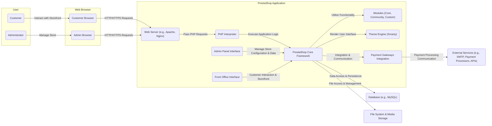
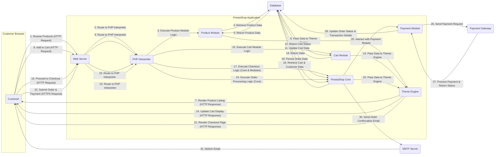

# Project Design Document: PrestaShop E-commerce Platform

**Version:** 1.1
**Date:** October 26, 2023
**Author:** AI Software Architect

## 1. Introduction

This document provides an enhanced architectural overview of the PrestaShop e-commerce platform. It details the key components, their interactions, data flows, and security considerations. This document is intended to serve as a robust foundation for subsequent threat modeling activities and provides a deeper understanding of the system's architecture. The design is based on the open-source PrestaShop project available at [https://github.com/prestashop/prestashop](https://github.com/prestashop/prestashop).

## 2. Goals

*   Provide a detailed and clear architectural description of PrestaShop.
*   Thoroughly identify key components and their specific responsibilities and interactions.
*   Clearly illustrate data flow within the platform for critical user journeys.
*   Highlight potential security considerations with actionable insights based on the architecture.
*   Serve as a comprehensive input for threat modeling exercises, enabling a more effective analysis.

## 3. Target Audience

*   Security engineers and architects responsible for threat modeling and security assessments.
*   Development team members involved in building, maintaining, and extending PrestaShop.
*   Operations and infrastructure teams responsible for deploying and managing PrestaShop environments.
*   Anyone involved in the security analysis, risk assessment, or compliance efforts related to PrestaShop.

## 4. High-Level Architecture

## 5. Detailed Component Design

### 5.1. Web Server (e.g., Apache, Nginx)

*   **Responsibility:**  The entry point for all web traffic, responsible for handling incoming HTTP/HTTPS requests and serving static content.
*   **Functionality:**
    *   Listens on standard ports (80 for HTTP, 443 for HTTPS).
    *   Receives requests from user browsers (customer and admin).
    *   Routes dynamic requests to the PHP interpreter via protocols like FastCGI or PHP-FPM.
    *   Serves static assets such as images, stylesheets (CSS), and JavaScript files.
    *   Handles SSL/TLS termination, encrypting and decrypting communication.
    *   Can implement security measures like request filtering, rate limiting, and basic authentication.
    *   May act as a reverse proxy, distributing traffic to multiple backend servers.

### 5.2. PHP Interpreter

*   **Responsibility:** Executes the PHP code that forms the core logic of the PrestaShop application.
*   **Functionality:**
    *   Receives requests from the web server.
    *   Parses and executes PHP scripts.
    *   Interacts with the PrestaShop Core Framework, Modules, and Theme Engine.
    *   Performs business logic, data processing, and validation.
    *   Generates dynamic HTML content to be sent back to the user's browser.
    *   Communicates with the database to retrieve and store data.

### 5.3. PrestaShop Core Framework

*   **Responsibility:** The foundational layer of the application, providing core functionalities and managing the overall application flow.
*   **Functionality:**
    *   Manages the Model-View-Controller (MVC) architecture.
    *   Provides core functionalities such as user management, product catalog management, order management, cart management, and address management.
    *   Handles request routing and dispatching to appropriate controllers.
    *   Offers APIs and hooks for modules and themes to extend functionality.
    *   Manages database interactions through an Object-Relational Mapper (ORM), abstracting database specifics.
    *   Handles security aspects like input sanitization and basic authorization checks.

### 5.4. Modules (Core, Community, Custom)

*   **Responsibility:** Extend and customize the functionality of PrestaShop, adding new features and integrations.
*   **Functionality:**
    *   **Core Modules:**  Essential modules bundled with PrestaShop, providing fundamental features like payment processing interfaces, shipping carrier integrations, and basic marketing tools.
    *   **Community Modules:** Modules developed by the PrestaShop community, offering a wide range of functionalities. Their security and quality can vary significantly.
    *   **Custom Modules:** Modules developed specifically for a particular store's needs, offering tailored functionality.
    *   Can modify existing core functionalities or introduce entirely new features.
    *   Interact with the Core Framework through defined APIs and hooks.
    *   May have their own database tables and logic.

### 5.5. Theme Engine (Smarty)

*   **Responsibility:**  Responsible for the presentation layer, controlling the visual appearance and user interface of both the storefront and the admin panel.
*   **Functionality:**
    *   Uses the Smarty templating engine to separate presentation logic from application logic.
    *   Renders HTML, CSS, and JavaScript based on template files and data provided by the Core Framework and Modules.
    *   Allows for customization of the store's look and feel through themes.
    *   May include custom JavaScript for interactive elements and dynamic behavior on the client-side.

### 5.6. Admin Panel Interface

*   **Responsibility:** Provides a web-based interface for administrators to manage all aspects of the online store.
*   **Functionality:**
    *   Product management (creation, editing, deletion, categorization).
    *   Order management (viewing, processing, shipping, refunds).
    *   Customer management (viewing customer details, managing groups).
    *   Module management (installation, configuration, uninstallation, updates).
    *   Theme management (installation, configuration, customization).
    *   Configuration settings for various aspects of the store.
    *   User and permission management for administrators.
    *   Statistics and reporting.

### 5.7. Front Office Interface

*   **Responsibility:** The customer-facing part of the store, providing the interface for browsing products, placing orders, and managing accounts.
*   **Functionality:**
    *   Product browsing and searching (including filtering and sorting).
    *   Product detail pages with descriptions, images, and pricing.
    *   Shopping cart management (adding, removing, updating items).
    *   User account management (registration, login, profile management, order history).
    *   Checkout process (shipping address, payment method selection).
    *   Integration with payment gateways for secure payment processing.

### 5.8. Payment Gateways Integration

*   **Responsibility:** Facilitates secure online payment processing by integrating with various payment service providers.
*   **Functionality:**
    *   Provides interfaces for integrating with different payment gateways (e.g., Stripe, PayPal, Authorize.Net).
    *   Securely collects payment information from customers (often through redirection or embedded iframes to the payment gateway's site).
    *   Communicates with payment processors to authorize and capture payments.
    *   Handles payment confirmations and error handling.
    *   May involve storing transaction details (non-sensitive) for record-keeping.

### 5.9. Database (e.g., MySQL)

*   **Responsibility:** Stores all persistent data required for the PrestaShop application.
*   **Functionality:**
    *   Stores product information (names, descriptions, prices, images).
    *   Stores customer data (personal details, addresses, order history).
    *   Stores order details (items, shipping information, payment details).
    *   Stores configuration settings for the application.
    *   Stores module-specific data.
    *   Accessed by the PrestaShop Core Framework and Modules through database queries.

### 5.10. File System & Media Storage

*   **Responsibility:** Stores application files, including PHP code, theme files, module files, uploaded media (product images, etc.), and configuration files.
*   **Functionality:**
    *   Provides access to the application's logic and assets.
    *   Stores uploaded media files, which can be served to users.
    *   Stores configuration files that define application behavior.
    *   Requires proper permissions to prevent unauthorized access, modification, or execution of malicious code.

### 5.11. External Services (e.g., SMTP, Payment Processors, APIs)

*   **Responsibility:** Integrates with external services to provide additional functionalities and services.
*   **Functionality:**
    *   **SMTP Server:** For sending emails (order confirmations, shipping notifications, marketing emails).
    *   **Payment Processors:** External services like Stripe or PayPal that handle the actual processing of online payments.
    *   **Shipping Carrier APIs:** For retrieving shipping rates and tracking information.
    *   **Marketing Platform APIs:** For integrating with email marketing or CRM systems.
    *   **Social Media APIs:** For social sharing and integration.
    *   Communication with these services often involves API calls and authentication.

## 6. Data Flow

This section describes a more detailed data flow for a customer placing an order, highlighting the interactions between components:

**Data Flow Steps (Detailed):**

1. **Browse Products (HTTP Request):** Customer requests product listings.
2. **Route to PHP Interpreter:** Web server forwards the request.
3. **Execute Product Module Logic:** PHP interpreter executes the Product Module.
4. **Retrieve Product Data:** Product Module queries the database.
5. **Return Product Data:** Database returns product information.
6. **Pass Data to Theme Engine:** Product Module provides data to the Theme Engine.
7. **Render Product Listing (HTTP Response):** Theme Engine renders the HTML and sends it to the customer.
8. **Add to Cart (HTTP Request):** Customer adds a product to the cart.
9. **Route to PHP Interpreter:** Web server forwards the request.
10. **Execute Cart Module Logic:** PHP interpreter executes the Cart Module.
11. **Update Cart Data:** Cart Module updates the cart information in the database.
12. **Return Cart Status:** Database returns the updated cart status.
13. **Pass Data to Theme Engine:** Cart Module provides data to the Theme Engine.
14. **Update Cart Display (HTTP Response):** Theme Engine updates the cart display on the customer's browser.
15. **Proceed to Checkout (HTTP Request):** Customer proceeds to the checkout page.
16. **Route to PHP Interpreter:** Web server forwards the request.
17. **Execute Checkout Logic (Core & Modules):** PHP interpreter executes the core checkout logic and relevant modules.
18. **Retrieve Cart & Customer Data:** Core retrieves cart and customer information from the database.
19. **Return Data:** Database returns the requested data.
20. **Pass Data to Theme Engine:** Core provides data to the Theme Engine.
21. **Render Checkout Page (HTTP Response):** Theme Engine renders the checkout form.
22. **Submit Order & Payment (HTTPS Request):** Customer submits order and payment details securely.
23. **Route to PHP Interpreter:** Web server forwards the request.
24. **Execute Order Processing Logic (Core):** PHP interpreter executes the core order processing logic.
25. **Interact with Payment Module:** Core interacts with the Payment Module.
26. **Send Payment Request:** Payment Module sends a request to the Payment Gateway.
27. **Process Payment & Return Status:** Payment Gateway processes the payment and returns the status.
28. **Update Order Status & Transaction Details:** Payment Module updates the order status and transaction details in the database.
29. **Persist Order Data:** Core persists the complete order data in the database.
30. **Send Order Confirmation Email:** Core sends an order confirmation email via the SMTP server.
31. **Deliver Email:** SMTP server delivers the email to the customer.

## 7. Security Considerations

This section expands on the security considerations, providing more specific examples and best practices:

*   **Input Validation & Sanitization:**
    *   **Best Practice:** Validate all user inputs on both the client-side (for user experience) and server-side (for security). Sanitize data before using it in database queries or displaying it to prevent injection attacks (SQL Injection, Cross-Site Scripting - XSS).
    *   **Examples:** Use parameterized queries or prepared statements to prevent SQL injection. Encode output data before displaying it in HTML to prevent XSS. Validate email formats, phone numbers, and other data types.
*   **Authentication and Authorization:**
    *   **Best Practice:** Implement strong authentication mechanisms (e.g., multi-factor authentication for administrators). Enforce role-based access control (RBAC) to limit access to sensitive functionalities based on user roles. Securely manage API keys and tokens.
    *   **Examples:** Use strong password hashing algorithms (bcrypt, Argon2). Implement proper session management with secure cookies (HttpOnly, Secure flags). Regularly audit user permissions.
*   **Session Management:**
    *   **Best Practice:** Securely manage user sessions to prevent session hijacking and fixation attacks. Regenerate session IDs after login and logout. Set appropriate session timeouts.
    *   **Examples:** Use secure, randomly generated session IDs. Store session data securely on the server-side. Implement measures to prevent Cross-Site Request Forgery (CSRF) attacks (e.g., using anti-CSRF tokens).
*   **Password Management:**
    *   **Best Practice:** Store passwords using strong, salted hashing algorithms. Enforce password complexity policies (minimum length, character requirements). Consider implementing account lockout after multiple failed login attempts.
    *   **Examples:** Avoid storing passwords in plain text or using weak hashing algorithms like MD5 or SHA1. Provide users with the ability to reset their passwords securely.
*   **Payment Security (PCI DSS Compliance):**
    *   **Best Practice:** If handling credit card data directly, adhere to PCI DSS compliance standards. Minimize the scope of your PCI environment. Utilize secure payment gateways and avoid storing sensitive payment details on your servers.
    *   **Examples:** Use tokenization for storing payment information. Implement point-to-point encryption (P2PE) for card present transactions. Regularly scan your systems for vulnerabilities.
*   **Module Security:**
    *   **Best Practice:** Exercise extreme caution when installing third-party modules. Only install modules from trusted sources. Regularly update modules and themes to patch known security vulnerabilities. Implement a process for security review of custom modules.
    *   **Examples:** Check module reviews and ratings before installation. Disable or uninstall unused modules. Monitor module permissions and access to sensitive data.
*   **File Upload Security:**
    *   **Best Practice:** Implement strict controls on file uploads to prevent malicious file uploads. Validate file types and sizes. Sanitize file names. Store uploaded files outside the webroot and serve them through a separate handler.
    *   **Examples:** Use allowlists for permitted file extensions. Scan uploaded files for malware. Implement proper access controls on uploaded files.
*   **Database Security:**
    *   **Best Practice:** Secure the database server by using strong passwords, limiting network access, and keeping the database software up-to-date. Prevent SQL injection vulnerabilities in the application code. Use the principle of least privilege for database user permissions.
    *   **Examples:** Disable remote access to the database server if not required. Regularly backup the database. Encrypt sensitive data at rest.
*   **Cross-Site Request Forgery (CSRF) Protection:**
    *   **Best Practice:** Implement CSRF tokens for all state-changing requests to prevent unauthorized actions on behalf of authenticated users.
    *   **Examples:** Use a framework-provided CSRF protection mechanism. Ensure tokens are unique per session and properly validated on the server-side.
*   **Security Headers:**
    *   **Best Practice:** Configure web server security headers to mitigate various attacks.
    *   **Examples:** Implement Content Security Policy (CSP) to control the resources the browser is allowed to load. Use HTTP Strict Transport Security (HSTS) to enforce HTTPS. Set X-Frame-Options to prevent clickjacking.
*   **Regular Security Audits and Penetration Testing:**
    *   **Best Practice:** Conduct regular security assessments, including vulnerability scans and penetration testing, to identify and address potential weaknesses in the application and infrastructure.
    *   **Examples:** Engage external security experts for independent assessments. Use automated vulnerability scanning tools. Perform both black-box and white-box testing.
*   **Error Handling and Logging:**
    *   **Best Practice:** Implement secure error handling to avoid leaking sensitive information in error messages. Maintain comprehensive security logs for auditing, intrusion detection, and incident response.
    *   **Examples:** Log all authentication attempts, authorization failures, and suspicious activities. Store logs securely and restrict access.
*   **HTTPS Enforcement:**
    *   **Best Practice:** Enforce HTTPS for all communication to encrypt data in transit and protect against eavesdropping and man-in-the-middle attacks.
    *   **Examples:** Configure the web server to redirect all HTTP traffic to HTTPS. Use HSTS to ensure browsers always use HTTPS.
*   **Access Control (File System):**
    *   **Best Practice:** Implement proper access control mechanisms for files and directories on the server. Follow the principle of least privilege, granting only necessary permissions to each user and process.
    *   **Examples:** Ensure web server processes do not run with root privileges. Restrict write access to sensitive configuration files.

## 8. Deployment Considerations

*   **Environment Segregation:** Maintain distinct environments for development, staging, and production to isolate changes and prevent issues in production.
*   **Secure Server Hardening:** Implement server hardening techniques, including disabling unnecessary services and ports, configuring firewalls, and keeping the operating system and software up-to-date.
*   **Firewall Configuration:** Configure firewalls to restrict network access to the application and database servers, allowing only necessary traffic.
*   **Regular Backups and Disaster Recovery:** Implement a robust backup and recovery strategy for the database, application files, and server configurations. Test the recovery process regularly.
*   **Monitoring and Alerting:** Set up comprehensive monitoring and alerting for system performance, security events, and error logs. Use tools to detect anomalies and potential security breaches.
*   **Content Delivery Network (CDN):** Utilize a CDN to improve performance by caching static content closer to users and enhance security by mitigating DDoS attacks and providing WAF capabilities.
*   **Load Balancing:** Implement load balancing to distribute traffic across multiple servers, improving performance and availability.
*   **Containerization (e.g., Docker):** Consider using containerization technologies for easier deployment, scalability, and consistency across different environments.
*   **Infrastructure as Code (IaC):** Use IaC tools (e.g., Terraform, Ansible) to automate the provisioning and management of infrastructure, ensuring consistency and reproducibility.
*   **Security Scanning in CI/CD Pipeline:** Integrate security scanning tools into the CI/CD pipeline to automatically identify vulnerabilities in code and dependencies before deployment.

## 9. Technologies Used

*   **Programming Language:** PHP (primarily)
*   **Database:** MySQL or MariaDB (officially supported)
*   **Web Server:** Apache or Nginx (recommended)
*   **Frontend Technologies:** HTML, CSS, JavaScript, jQuery (often used)
*   **Templating Engine:** Smarty (default PrestaShop templating engine)
*   **Caching:** Built-in caching mechanisms, support for Memcached or Redis
*   **Search Engine:** Elasticsearch (optional, for advanced search)

## 10. Future Considerations

*   Adoption of a more modern JavaScript framework for the front-end (e.g., React, Vue.js) for enhanced user experience and maintainability.
*   Transitioning towards a more decoupled, API-first architecture to facilitate integrations and the development of headless commerce solutions.
*   Exploring microservices architecture for improved scalability, resilience, and independent deployment of functionalities.
*   Enhanced security features like integration with Web Application Firewalls (WAFs) and advanced threat detection systems.
*   Improved support for cloud-native deployments and managed services.

This enhanced document provides a more detailed and comprehensive architectural overview of the PrestaShop platform, offering a stronger foundation for threat modeling and a deeper understanding of the system's intricacies.