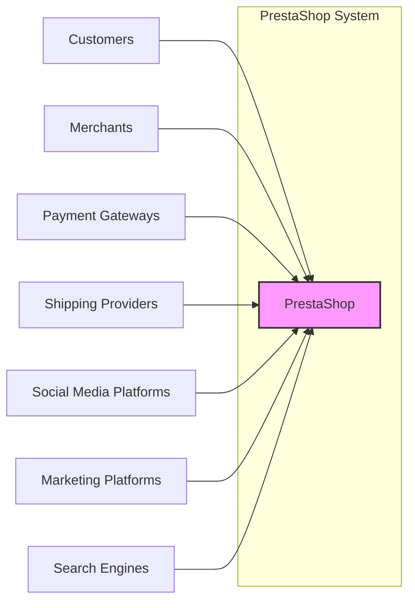
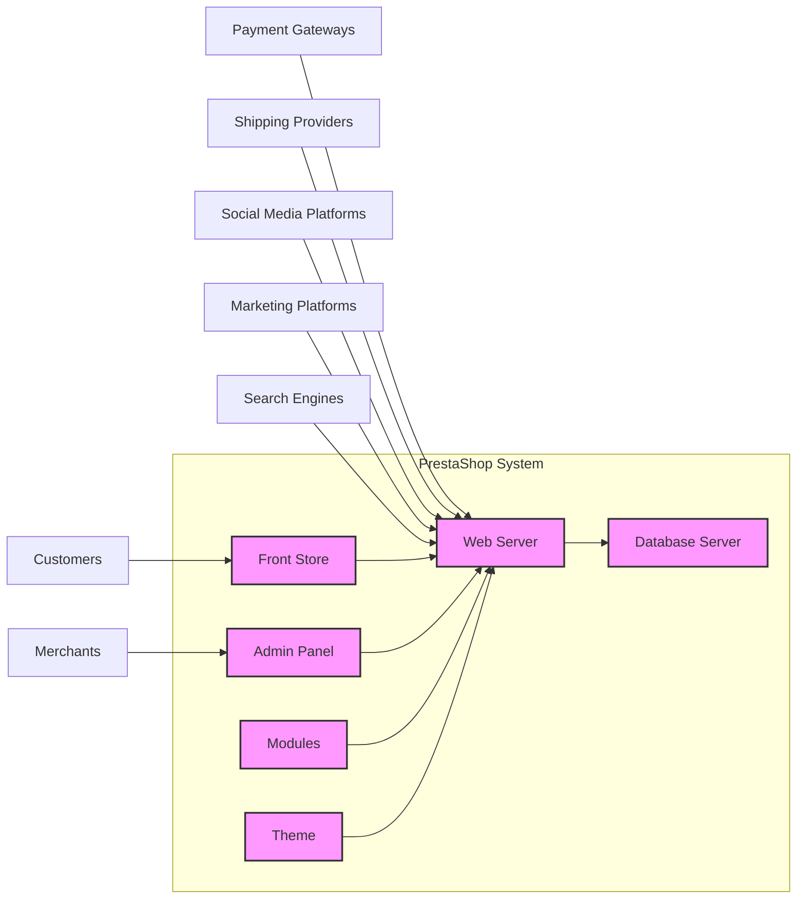

# BUSINESS POSTURE

PrestaShop is an open-source e-commerce platform that enables businesses to create and manage online stores. The primary business goal is to provide a feature-rich, customizable, and scalable solution for merchants of all sizes to sell products and services online.

Business priorities for PrestaShop include:
- Functionality: Offering a wide range of e-commerce features to meet diverse merchant needs.
- Customization: Allowing merchants to tailor the platform to their brand and specific requirements through themes and modules.
- Scalability: Supporting growth for businesses from small startups to larger enterprises.
- Usability: Providing an intuitive and user-friendly interface for both merchants and customers.
- Community Support: Leveraging a large open-source community for support, contributions, and extensions.
- Security: Protecting sensitive data and ensuring the platform's integrity and availability.
- Performance: Delivering fast loading times and a smooth shopping experience.

Most important business risks that need to be addressed:
- Data breaches and leaks of customer and merchant sensitive information (PII, payment details, business data). This can lead to financial loss, reputational damage, and legal liabilities.
- Service disruption and downtime, impacting sales and customer trust. This can be caused by technical failures, cyberattacks (DDoS), or lack of scalability.
- Security vulnerabilities in the platform or its extensions that could be exploited by malicious actors, leading to data breaches, defacement, or malware distribution.
- Compliance violations with data privacy regulations (GDPR, CCPA, etc.) due to inadequate security measures or data handling practices.
- Supply chain risks associated with third-party modules and themes, which could introduce vulnerabilities or malicious code.
- Performance issues that negatively impact user experience and conversion rates, leading to lost sales and customer dissatisfaction.

# SECURITY POSTURE

Existing security controls:
- security control: Input validation and sanitization are likely implemented throughout the codebase to prevent common web vulnerabilities like XSS and SQL injection. (Implementation details would require code review).
- security control: Protection against common web attacks (CSRF, XSS, SQL Injection) is mentioned in PrestaShop documentation and community discussions, suggesting awareness and mitigation efforts. (Documentation and community forums).
- security control: Regular security updates and patches are released by the PrestaShop team to address reported vulnerabilities. (PrestaShop Security Blog, GitHub release notes).
- security control: Password hashing is used for storing user credentials. (Likely implementation in authentication modules, needs code verification).
- security control: HTTPS encryption is recommended and widely adopted for PrestaShop stores to protect data in transit. (PrestaShop documentation, best practices).

Accepted risks:
- accepted risk: Vulnerabilities in third-party modules and themes are a potential risk, as PrestaShop relies on an ecosystem of external extensions. Mitigation relies on module vetting and merchant awareness.
- accepted risk: Configuration errors by merchants can introduce security weaknesses, such as weak passwords, misconfigured permissions, or exposed admin panels. Mitigation relies on documentation and best practices guidance.
- accepted risk: Zero-day vulnerabilities in core PrestaShop or underlying technologies are an inherent risk for any software platform. Mitigation relies on proactive security monitoring and incident response capabilities.

Recommended security controls:
- security control: Implement a comprehensive Secure Software Development Lifecycle (SSDLC) that includes security requirements, threat modeling, secure coding practices, security testing (SAST, DAST), and security reviews throughout the development process.
- security control: Integrate automated security scanning tools (SAST, DAST, dependency scanning) into the CI/CD pipeline to detect vulnerabilities early in the development lifecycle.
- security control: Implement a Web Application Firewall (WAF) to protect against common web attacks and provide virtual patching capabilities.
- security control: Implement robust security logging and monitoring to detect and respond to security incidents in a timely manner.
- security control: Conduct regular penetration testing and vulnerability assessments to identify and address security weaknesses in the platform and its infrastructure.
- security control: Enhance supply chain security by implementing module vetting processes, dependency management, and code signing for official PrestaShop modules and themes.
- security control: Provide security hardening guidelines and best practices for merchants to secure their PrestaShop installations and configurations.
- security control: Implement rate limiting and bot detection mechanisms to mitigate brute-force attacks and malicious bot traffic.

Security requirements:
- Authentication:
    - security requirement: Secure authentication mechanisms for merchants and customers, including strong password policies, multi-factor authentication (MFA) as an option, and protection against brute-force attacks.
    - security requirement: Role-based access control (RBAC) to manage permissions for different user roles within the merchant admin panel.
    - security requirement: Secure session management to prevent session hijacking and unauthorized access.
- Authorization:
    - security requirement: Implement a robust authorization model to control access to resources and functionalities based on user roles and permissions.
    - security requirement: Principle of least privilege should be applied to all user accounts and system components.
    - security requirement: Secure API access control to protect APIs used by modules and integrations.
- Input Validation:
    - security requirement: Comprehensive input validation and sanitization for all user inputs to prevent injection attacks (SQL injection, XSS, etc.).
    - security requirement: Use of parameterized queries or ORM to prevent SQL injection vulnerabilities.
    - security requirement: Encoding of output data to prevent XSS vulnerabilities.
- Cryptography:
    - security requirement: Use strong encryption algorithms and protocols for protecting sensitive data at rest and in transit (HTTPS, TLS).
    - security requirement: Secure storage of cryptographic keys and secrets.
    - security requirement: Proper implementation of cryptographic functions for password hashing, data encryption, and digital signatures.
    - security requirement: Compliance with PCI DSS requirements for handling payment card data if applicable.

# DESIGN

## C4 CONTEXT



Context Diagram Elements:

- Element:
    - Name: PrestaShop
    - Type: Software System
    - Description: Open-source e-commerce platform for creating and managing online stores.
    - Responsibilities: Provides core e-commerce functionalities including product catalog management, order processing, payment processing, shipping management, customer management, marketing tools, and reporting.
    - Security controls: Input validation, authentication, authorization, session management, cryptography, security updates, access control lists, security logging.

- Element:
    - Name: Customers
    - Type: Person
    - Description: End-users who browse and purchase products from PrestaShop online stores.
    - Responsibilities: Browse product catalogs, place orders, manage accounts, make payments, track orders.
    - Security controls: Strong passwords, secure account management, privacy settings, secure payment processing through payment gateways.

- Element:
    - Name: Merchants
    - Type: Person
    - Description: Business owners and administrators who use PrestaShop to manage their online stores.
    - Responsibilities: Manage product catalogs, process orders, configure store settings, manage customer data, manage marketing campaigns, analyze sales data, install and manage modules and themes.
    - Security controls: Strong passwords, multi-factor authentication (optional), role-based access control, secure admin panel access, regular security training.

- Element:
    - Name: Payment Gateways
    - Type: External System
    - Description: Third-party services that process online payments for PrestaShop stores (e.g., PayPal, Stripe, Authorize.Net).
    - Responsibilities: Securely process customer payments, handle payment transactions, manage payment methods, provide transaction reports.
    - Security controls: PCI DSS compliance, encryption of payment data, secure APIs, fraud detection mechanisms.

- Element:
    - Name: Shipping Providers
    - Type: External System
    - Description: Third-party services that handle shipping and delivery of orders (e.g., UPS, FedEx, USPS).
    - Responsibilities: Calculate shipping rates, generate shipping labels, track shipments, provide delivery updates.
    - Security controls: Secure APIs, data encryption, access control for shipping data.

- Element:
    - Name: Social Media Platforms
    - Type: External System
    - Description: Social media platforms (e.g., Facebook, Instagram, Twitter) used for marketing and promoting PrestaShop stores.
    - Responsibilities: Social sharing of products, social login (optional), marketing campaigns, customer engagement.
    - Security controls: OAuth for social login, secure APIs, data privacy policies.

- Element:
    - Name: Marketing Platforms
    - Type: External System
    - Description: Third-party marketing platforms (e.g., Mailchimp, Google Ads) integrated with PrestaShop for marketing automation and advertising.
    - Responsibilities: Email marketing, advertising campaigns, marketing analytics, customer segmentation.
    - Security controls: Secure APIs, data encryption, access control for marketing data.

- Element:
    - Name: Search Engines
    - Type: External System
    - Description: Search engines (e.g., Google, Bing) that index PrestaShop stores and drive organic traffic.
    - Responsibilities: Crawl and index store content, provide search results to users, drive organic traffic to the store.
    - Security controls: SEO optimization, sitemap generation, robots.txt configuration.

## C4 CONTAINER



Container Diagram Elements:

- Element:
    - Name: Web Server
    - Type: Container - Web Server (PHP, Apache/Nginx)
    - Description: Handles HTTP requests, serves web pages, executes PHP code, and interacts with the database. Acts as the main entry point for both the front store and admin panel.
    - Responsibilities: Web request handling, application logic execution (PHP), session management, routing, security enforcement (WAF, rate limiting), API gateway for external integrations.
    - Security controls: HTTPS encryption, WAF, input validation, output encoding, session management, access control lists, security logging, rate limiting, DDoS protection.

- Element:
    - Name: Database Server
    - Type: Container - Database (MySQL/MariaDB)
    - Description: Stores application data including product catalogs, customer information, order details, configuration settings, and module data.
    - Responsibilities: Data persistence, data retrieval, data integrity, data backup and recovery, database access control.
    - Security controls: Database access control, encryption at rest (optional), regular backups, database hardening, monitoring and auditing.

- Element:
    - Name: Admin Panel
    - Type: Container - Web Application (PHP)
    - Description: Web-based interface for merchants to manage their online store, including product management, order processing, configuration, and reporting.
    - Responsibilities: Merchant authentication and authorization, store configuration, data management, reporting, module and theme management.
    - Security controls: Strong authentication, role-based access control, secure session management, input validation, output encoding, audit logging, protection against CSRF and XSS.

- Element:
    - Name: Front Store
    - Type: Container - Web Application (PHP)
    - Description: Public-facing web application that customers interact with to browse products, place orders, and manage their accounts.
    - Responsibilities: Product catalog display, shopping cart functionality, order placement, customer account management, search functionality, content management.
    - Security controls: Input validation, output encoding, secure session management, protection against XSS and CSRF, secure payment processing integration, HTTPS encryption.

- Element:
    - Name: Modules
    - Type: Container - Application Plugins (PHP)
    - Description: Extend the core functionality of PrestaShop, providing additional features and integrations (e.g., payment modules, shipping modules, marketing modules).
    - Responsibilities: Provide specific functionalities, integrate with external services, customize store behavior.
    - Security controls: Module vetting process (if any), code reviews, input validation, secure coding practices, dependency management.

- Element:
    - Name: Theme
    - Type: Container - Web Design Template (HTML, CSS, JavaScript)
    - Description: Controls the visual appearance and user interface of the front store.
    - Responsibilities: Storefront presentation, user experience, branding.
    - Security controls: Prevention of XSS vulnerabilities in theme code, secure handling of user inputs in JavaScript, regular theme updates.

## DEPLOYMENT

Deployment Solution: Cloud-based Infrastructure (Example: AWS)

```mermaid
graph LR
    subgraph "AWS Cloud"
        subgraph "Load Balancer"
            LB["Load Balancer"]
        end
        subgraph "Web Servers"
            WS1["Web Server Instance 1"]
            WS2["Web Server Instance 2"]
            WS3["Web Server Instance 3"]
        end
        subgraph "Database Servers"
            DBM["Database Master"]
            DBR["Database Replica"]
        end
        subgraph "CDN"
            CDN["Content Delivery Network"]
        end
    end

    Customers --> CDN --> LB --> WS1
    Customers --> CDN --> LB --> WS2
    Customers --> CDN --> LB --> WS3

    LB --> WS1
    LB --> WS2
    LB --> WS3

    WS1 --> DBM
    WS2 --> DBM
    WS3 --> DBM

    DBM --> DBR

    style LB fill:#f9f,stroke:#333,stroke-width:2px
    style WS1 fill:#f9f,stroke:#333,stroke-width:2px
    style WS2 fill:#f9f,stroke:#333,stroke-width:2px
    style WS3 fill:#f9f,stroke:#333,stroke-width:2px
    style DBM fill:#f9f,stroke:#333,stroke-width:2px
    style DBR fill:#f9f,stroke:#333,stroke-width:2px
    style CDN fill:#f9f,stroke:#333,stroke-width:2px
```

Deployment Diagram Elements:

- Element:
    - Name: Load Balancer
    - Type: Infrastructure - Load Balancer (e.g., AWS ELB)
    - Description: Distributes incoming traffic across multiple web server instances to ensure high availability and scalability.
    - Responsibilities: Traffic distribution, health checks, SSL termination, DDoS protection.
    - Security controls: SSL/TLS encryption, DDoS mitigation, access control lists, security logging.

- Element:
    - Name: Web Server Instances (x3)
    - Type: Infrastructure - Virtual Machines/Containers (e.g., AWS EC2, Docker)
    - Description: Instances running the Web Server container (PHP, Apache/Nginx) to handle web requests and application logic.
    - Responsibilities: Web request processing, application execution, interaction with the database.
    - Security controls: Operating system hardening, web server hardening, security patching, intrusion detection systems (IDS), security logging, access control lists, firewalls.

- Element:
    - Name: Database Master
    - Type: Infrastructure - Managed Database Service (e.g., AWS RDS)
    - Description: Primary database server responsible for write operations and data consistency.
    - Responsibilities: Data storage, data retrieval, write operations, data replication to replica.
    - Security controls: Database access control, encryption at rest, encryption in transit, regular backups, database hardening, monitoring and auditing, vulnerability scanning.

- Element:
    - Name: Database Replica
    - Type: Infrastructure - Managed Database Service (e.g., AWS RDS Read Replica)
    - Description: Read-only replica of the master database, used to offload read traffic and improve performance.
    - Responsibilities: Read operations, data replication from master, high availability for read operations.
    - Security controls: Database access control (read-only), encryption at rest, encryption in transit, regular backups (inherited from master), database hardening, monitoring and auditing.

- Element:
    - Name: Content Delivery Network (CDN)
    - Type: Infrastructure - CDN (e.g., AWS CloudFront)
    - Description: Caches static content (images, CSS, JavaScript) to improve website performance and reduce latency for users globally.
    - Responsibilities: Content caching, content delivery, DDoS protection, SSL termination.
    - Security controls: DDoS mitigation, SSL/TLS encryption, access control for CDN configuration, security logging.

## BUILD

```mermaid
graph LR
    subgraph "Developer Workstation"
        DEV["Developer"]
    end
    subgraph "Version Control System"
        VCS["GitHub Repository"]
    end
    subgraph "CI/CD Pipeline"
        BC["Build & Compile"]
        TEST["Automated Tests & Security Scans"]
        ARTIFACT["Artifact Repository"]
        DEPLOY["Deployment Automation"]
    end

    DEV --> VCS: Code Commit
    VCS --> BC: Trigger Build
    BC --> TEST: Run Tests & Scans
    TEST --> ARTIFACT: Store Artifact
    ARTIFACT --> DEPLOY: Trigger Deployment
    DEPLOY --> "Deployment Environment": Deploy Application

    style DEV fill:#f9f,stroke:#333,stroke-width:2px
    style VCS fill:#f9f,stroke:#333,stroke-width:2px
    style BC fill:#f9f,stroke:#333,stroke-width:2px
    style TEST fill:#f9f,stroke:#333,stroke-width:2px
    style ARTIFACT fill:#f9f,stroke:#333,stroke-width:2px
    style DEPLOY fill:#f9f,stroke:#333,stroke-width:2px
```

Build Process Description:

The build process for PrestaShop aims to automate the compilation, testing, security scanning, and packaging of the application for deployment. A typical secure build pipeline would include the following stages:

- Element:
    - Name: Developer
    - Type: Person
    - Description: Software developers who write and modify the PrestaShop codebase.
    - Responsibilities: Code development, bug fixing, feature implementation, code reviews, committing code to the version control system.
    - Security controls: Secure coding practices training, code review process, secure workstation configuration, access control to development environment.

- Element:
    - Name: Version Control System (GitHub Repository)
    - Type: Tool - Code Repository (Git)
    - Description: Stores the source code of PrestaShop and tracks changes over time. GitHub is used as the primary repository.
    - Responsibilities: Source code management, version control, collaboration, code history tracking.
    - Security controls: Access control (authentication and authorization), branch protection, commit signing, audit logging.

- Element:
    - Name: Build & Compile
    - Type: CI/CD Pipeline Stage (e.g., GitHub Actions, Jenkins)
    - Description: Automates the process of compiling the PHP code (though PHP is interpreted, build steps might include asset compilation, dependency management, etc.), and preparing the application for testing and packaging.
    - Responsibilities: Code compilation (if needed), dependency resolution, build artifact creation, static analysis (linters).
    - Security controls: Secure build environment, dependency vulnerability scanning, build process hardening, access control to build system.

- Element:
    - Name: Automated Tests & Security Scans
    - Type: CI/CD Pipeline Stage
    - Description: Executes automated tests (unit tests, integration tests) and security scans (SAST, DAST, dependency scanning) to identify bugs and vulnerabilities.
    - Responsibilities: Automated testing, static application security testing (SAST), dynamic application security testing (DAST), software composition analysis (SCA), vulnerability reporting.
    - Security controls: Integration of security scanning tools, secure configuration of scanning tools, vulnerability reporting and tracking, automated test execution.

- Element:
    - Name: Artifact Repository
    - Type: Tool - Artifact Storage (e.g., Nexus, Artifactory)
    - Description: Stores the build artifacts (e.g., packaged application files) in a secure and versioned manner.
    - Responsibilities: Artifact storage, artifact versioning, artifact access control, artifact integrity verification.
    - Security controls: Access control, encryption at rest, integrity checks, audit logging.

- Element:
    - Name: Deployment Automation
    - Type: CI/CD Pipeline Stage
    - Description: Automates the deployment of build artifacts to the target deployment environment (e.g., staging, production).
    - Responsibilities: Automated deployment, infrastructure provisioning (IaC), configuration management, deployment rollback capabilities.
    - Security controls: Secure deployment process, infrastructure as code (IaC) security, secrets management, access control to deployment system, deployment audit logging.

# RISK ASSESSMENT

Critical business processes we are trying to protect:
- Online product catalog browsing and search.
- Customer account creation and management.
- Shopping cart and checkout process.
- Order placement and processing.
- Payment processing.
- Merchant admin panel access and management.
- Product data management.
- Customer data management.
- Marketing and promotional activities.

Data we are trying to protect and their sensitivity:
- Customer Personally Identifiable Information (PII): Name, address, email, phone number, purchase history. Sensitivity: High (requires strong protection due to privacy regulations and potential for identity theft).
- Customer Payment Information: Credit card details, payment method information. Sensitivity: Critical (requires PCI DSS compliance and strong encryption to prevent financial fraud).
- Merchant Business Data: Product catalogs, pricing information, sales data, customer lists, business strategies. Sensitivity: Medium to High (competitively sensitive and business critical).
- Merchant Admin Credentials: Usernames and passwords for admin panel access. Sensitivity: Critical (compromise can lead to full system takeover).
- Application Code and Configuration: Source code, database credentials, API keys, server configurations. Sensitivity: High (compromise can lead to system vulnerabilities and data breaches).
- Session Data: User session identifiers and temporary authentication tokens. Sensitivity: Medium (compromise can lead to session hijacking).
- Logs and Audit Trails: Application and security logs. Sensitivity: Medium (important for security monitoring and incident response).

# QUESTIONS & ASSUMPTIONS

Questions:
- What is the target deployment environment for PrestaShop (cloud, on-premise, hybrid)?
- What are the specific compliance requirements for PrestaShop (PCI DSS, GDPR, CCPA, etc.)?
- What is the current level of security maturity and existing security controls implemented by the PrestaShop project (beyond the basics)?
- Are there any specific threat actors or attack vectors that are of particular concern for PrestaShop?
- What is the process for vetting and securing third-party modules and themes?
- What is the incident response plan in case of a security breach?
- What is the budget and resources allocated for security initiatives?

Assumptions:
- BUSINESS POSTURE: PrestaShop aims to be a secure and reliable e-commerce platform for businesses of all sizes. Security is a significant business priority, but functionality and usability are also crucial.
- SECURITY POSTURE: Basic security controls are in place, but there is room for improvement in implementing a more comprehensive SSDLC, automated security testing, and enhanced supply chain security. The project is aware of common web security threats and takes steps to mitigate them.
- DESIGN: PrestaShop follows a typical three-tier web application architecture with a web server, application code (PHP), and a database. Deployment is flexible and can be adapted to various environments, including cloud and on-premise. The build process involves standard software development practices, but security automation can be further integrated.