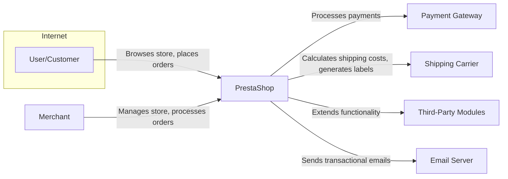
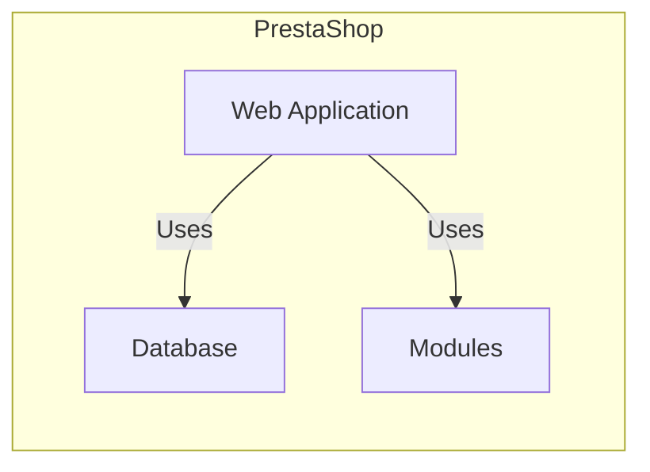
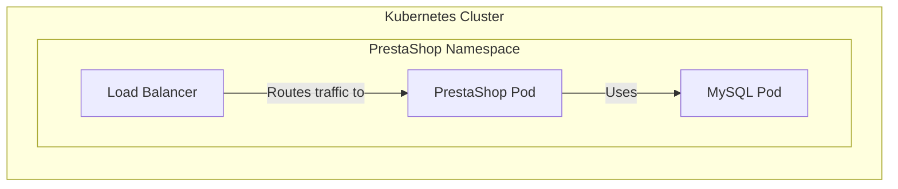
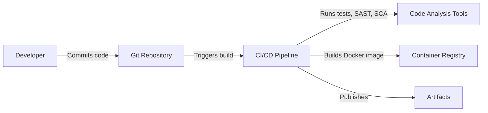

# BUSINESS POSTURE

PrestaShop is an open-source e-commerce platform. The business priorities revolve around providing a stable, secure, and feature-rich platform for merchants to build and manage their online stores. The project aims to be accessible to a wide range of users, from small businesses to larger enterprises.

Business Priorities:

*   Provide a user-friendly and customizable e-commerce platform.
*   Enable merchants to manage products, orders, customers, and payments efficiently.
*   Offer a wide range of features and modules to extend functionality.
*   Maintain a secure and reliable platform to protect merchant and customer data.
*   Foster a strong community of developers and users.
*   Ensure scalability to accommodate growing businesses.

Business Goals:

*   Increase the number of active PrestaShop stores.
*   Expand the PrestaShop ecosystem with new modules and themes.
*   Improve the platform's performance and security.
*   Enhance the user experience for both merchants and customers.
*   Maintain a high level of community engagement.

Most Important Business Risks:

*   Security breaches leading to data theft or financial loss.
*   Platform instability or downtime causing disruption to merchant operations.
*   Lack of features or customization options limiting merchant capabilities.
*   Poor performance impacting customer experience and sales.
*   Competition from other e-commerce platforms.
*   Negative community sentiment or lack of developer support.

# SECURITY POSTURE

Existing Security Controls:

*   security control: Input validation to prevent common web vulnerabilities like XSS and SQL injection. Implemented in core code and modules.
*   security control: Password hashing using strong algorithms (e.g., bcrypt). Implemented in the user authentication system.
*   security control: Protection against Cross-Site Request Forgery (CSRF) attacks. Implemented using tokens.
*   security control: Regular security updates and patches to address vulnerabilities. Provided through the PrestaShop update mechanism.
*   security control: Secure development guidelines and best practices. Documented and promoted to developers.
*   security control: Access control mechanisms to restrict access to sensitive data and functionality. Implemented in the back-office user roles and permissions system.
*   security control: Use of prepared statements to prevent SQL injection. Implemented in database interactions.
*   security control: Option to enable HTTPS (SSL/TLS) encryption. Configurable in the back-office settings.
*   security control: File upload restrictions to prevent malicious file uploads. Implemented in file upload handling.

Accepted Risks:

*   accepted risk: Reliance on third-party modules and themes, which may introduce security vulnerabilities if not properly vetted.
*   accepted risk: Potential for misconfiguration by users, leading to security weaknesses.
*   accepted risk: Dependence on the security of the underlying server environment (e.g., PHP, MySQL).

Recommended Security Controls:

*   Implement a robust Content Security Policy (CSP) to mitigate XSS attacks.
*   Introduce a Web Application Firewall (WAF) to protect against common web attacks.
*   Implement regular security audits and penetration testing.
*   Provide two-factor authentication (2FA) for back-office users.
*   Implement a strong session management system with secure cookies.
*   Introduce a file integrity monitoring system to detect unauthorized changes.
*   Implement rate limiting to prevent brute-force attacks.
*   Provide security hardening guides for server configuration.

Security Requirements:

*   Authentication:
    *   Strong password policies (length, complexity, expiration).
    *   Secure password storage using strong hashing algorithms.
    *   Protection against brute-force attacks.
    *   Two-factor authentication (recommended).
    *   Secure session management.

*   Authorization:
    *   Role-based access control (RBAC) for back-office users.
    *   Fine-grained permissions to control access to specific resources and actions.
    *   Secure handling of API keys and access tokens.

*   Input Validation:
    *   Strict validation of all user inputs to prevent XSS, SQL injection, and other injection attacks.
    *   Validation of data types, lengths, and formats.
    *   Encoding of output data to prevent XSS.

*   Cryptography:
    *   Use of strong encryption algorithms for sensitive data (e.g., passwords, credit card numbers).
    *   Secure key management practices.
    *   HTTPS (SSL/TLS) encryption for all communication.
    *   Secure generation of random numbers.

# DESIGN

## C4 CONTEXT

Element List:

*   Element:
    *   Name: User/Customer
    *   Type: Person
    *   Description: A person who browses the online store and places orders.
    *   Responsibilities: Browsing products, adding items to cart, placing orders, providing payment and shipping information.
    *   Security controls: Account creation with password, secure checkout process (HTTPS), data privacy protection.

*   Element:
    *   Name: Merchant
    *   Type: Person
    *   Description: A person who manages the online store using the PrestaShop back-office.
    *   Responsibilities: Managing products, orders, customers, payments, shipping, and other store settings.
    *   Security controls: Strong authentication, role-based access control, secure session management, two-factor authentication (recommended).

*   Element:
    *   Name: PrestaShop
    *   Type: Software System
    *   Description: The core e-commerce platform.
    *   Responsibilities: Providing the online store functionality, managing products, orders, customers, payments, and shipping.
    *   Security controls: Input validation, output encoding, CSRF protection, secure password storage, regular security updates.

*   Element:
    *   Name: Payment Gateway
    *   Type: Software System
    *   Description: A third-party service that processes online payments.
    *   Responsibilities: Securely processing credit card payments, handling refunds, and providing fraud detection.
    *   Security controls: PCI DSS compliance, encryption of sensitive data, secure communication protocols.

*   Element:
    *   Name: Shipping Carrier
    *   Type: Software System
    *   Description: A third-party service that handles shipping and delivery of orders.
    *   Responsibilities: Calculating shipping costs, generating shipping labels, tracking shipments, and delivering packages.
    *   Security controls: Secure API integration, data encryption, access control.

*   Element:
    *   Name: Third-Party Modules
    *   Type: Software System
    *   Description: Extensions that add functionality to the PrestaShop platform.
    *   Responsibilities: Providing additional features such as marketing tools, payment gateways, shipping integrations, and more.
    *   Security controls: Secure coding practices, regular security updates, code review (recommended).

*   Element:
    *   Name: Email Server
    *   Type: Software System
    *   Description: A server that handles sending and receiving emails.
    *   Responsibilities: Sending transactional emails to customers (e.g., order confirmations, shipping updates).
    *   Security controls: Secure SMTP configuration, SPF, DKIM, and DMARC records to prevent email spoofing.

## C4 CONTAINER

Element List:

*   Element:
    *   Name: Web Application
    *   Type: Web Application
    *   Description: The main PrestaShop application that handles user requests and interacts with the database and modules.
    *   Responsibilities: Rendering web pages, processing user input, managing business logic, interacting with the database and modules.
    *   Security controls: Input validation, output encoding, CSRF protection, secure session management, access control.

*   Element:
    *   Name: Database
    *   Type: Database
    *   Description: The database that stores all of the PrestaShop data, including products, orders, customers, and settings.
    *   Responsibilities: Storing and retrieving data, ensuring data integrity and consistency.
    *   Security controls: Secure database configuration, access control, encryption of sensitive data, regular backups.

*   Element:
    *   Name: Modules
    *   Type: Software Components
    *   Description: Extensions that add functionality to the PrestaShop platform.
    *   Responsibilities: Providing additional features such as marketing tools, payment gateways, shipping integrations, and more.
    *   Security controls: Secure coding practices, regular security updates, code review (recommended).

## DEPLOYMENT

Possible deployment solutions:

1.  Traditional hosting (shared, VPS, dedicated server).
2.  Cloud hosting (AWS, Google Cloud, Azure, etc.).
3.  Containerized deployment (Docker, Kubernetes).

Chosen solution: Containerized deployment using Docker and Kubernetes.

Element List:

*   Element:
    *   Name: Kubernetes Cluster
    *   Type: Container Orchestration Platform
    *   Description: A cluster of nodes that run containerized applications.
    *   Responsibilities: Managing the deployment, scaling, and networking of containers.
    *   Security controls: Network policies, role-based access control, pod security policies, regular security updates.

*   Element:
    *   Name: PrestaShop Namespace
    *   Type: Logical Isolation
    *   Description: A logical grouping of resources within the Kubernetes cluster.
    *   Responsibilities: Providing isolation and organization for the PrestaShop application.
    *   Security controls: Network policies, resource quotas.

*   Element:
    *   Name: PrestaShop Pod
    *   Type: Pod
    *   Description: A group of one or more containers that run the PrestaShop application.
    *   Responsibilities: Running the PrestaShop web application and its dependencies.
    *   Security controls: Container security best practices, image scanning, resource limits.

*   Element:
    *   Name: MySQL Pod
    *   Type: Pod
    *   Description: A group of one or more containers that run the MySQL database.
    *   Responsibilities: Running the MySQL database server.
    *   Security controls: Secure database configuration, access control, encryption of sensitive data, regular backups.

*   Element:
    *   Name: Load Balancer
    *   Type: Service
    *   Description: A service that distributes incoming traffic across multiple PrestaShop pods.
    *   Responsibilities: Providing high availability and scalability for the PrestaShop application.
    *   Security controls: SSL/TLS termination, DDoS protection.

## BUILD

Build Process:

1.  Developers commit code changes to the Git repository (GitHub).
2.  The CI/CD pipeline (e.g., GitHub Actions, Jenkins) is triggered by the commit.
3.  The pipeline runs automated tests, including unit tests, integration tests, and end-to-end tests.
4.  Static Application Security Testing (SAST) tools (e.g., SonarQube) are used to analyze the code for security vulnerabilities.
5.  Software Composition Analysis (SCA) tools are used to identify and manage open-source dependencies and their vulnerabilities.
6.  A Docker image is built containing the PrestaShop application and its dependencies.
7.  The Docker image is pushed to a container registry (e.g., Docker Hub, Google Container Registry).
8.  Build artifacts, such as installation packages, are published.

Security Controls:

*   security control: Automated testing to identify bugs and vulnerabilities early in the development process.
*   security control: SAST to detect security vulnerabilities in the code.
*   security control: SCA to manage open-source dependencies and their vulnerabilities.
*   security control: Secure build environment to prevent tampering with the build process.
*   security control: Image scanning to identify vulnerabilities in the Docker image.
*   security control: Code signing to ensure the integrity of the build artifacts.

# RISK ASSESSMENT

Critical Business Processes:

*   Order processing: Ensuring that customers can place orders and that merchants can fulfill them.
*   Payment processing: Securely handling customer payments and preventing fraud.
*   Product management: Allowing merchants to easily add, update, and manage their products.
*   Customer management: Providing tools for merchants to manage customer accounts and interactions.
*   Store management: Enabling merchants to configure and customize their online store.

Data Sensitivity:

*   Customer data:
    *   Personally Identifiable Information (PII): Names, addresses, email addresses, phone numbers (High sensitivity).
    *   Order history: Purchase details (Medium sensitivity).
    *   Payment information: Credit card numbers, billing addresses (High sensitivity - handled by payment gateway).

*   Merchant data:
    *   Business information: Company name, address, contact details (Medium sensitivity).
    *   Sales data: Revenue, order statistics (Medium sensitivity).
    *   Configuration settings: Store settings, module configurations (Low sensitivity).

*   Product data:
    *   Product descriptions, images, prices (Low sensitivity).
    *   Inventory levels (Medium sensitivity).

# QUESTIONS & ASSUMPTIONS

Questions:

*   What is the specific threat model used by PrestaShop (if any)?
*   What are the current security testing procedures (e.g., penetration testing, code reviews)?
*   What is the process for handling security vulnerabilities reported by external researchers?
*   Are there any specific compliance requirements (e.g., GDPR, PCI DSS)?
*   What is the current infrastructure setup (hosting provider, server configuration)?
*   What is the level of security awareness among PrestaShop developers and users?
*   What is budget for security improvements?

Assumptions:

*   BUSINESS POSTURE: The primary business goal is to provide a stable and secure e-commerce platform for a wide range of users.
*   SECURITY POSTURE: The project has some basic security controls in place, but there is room for improvement.
*   DESIGN: The deployment will be containerized using Docker and Kubernetes. The build process will be automated using a CI/CD pipeline.