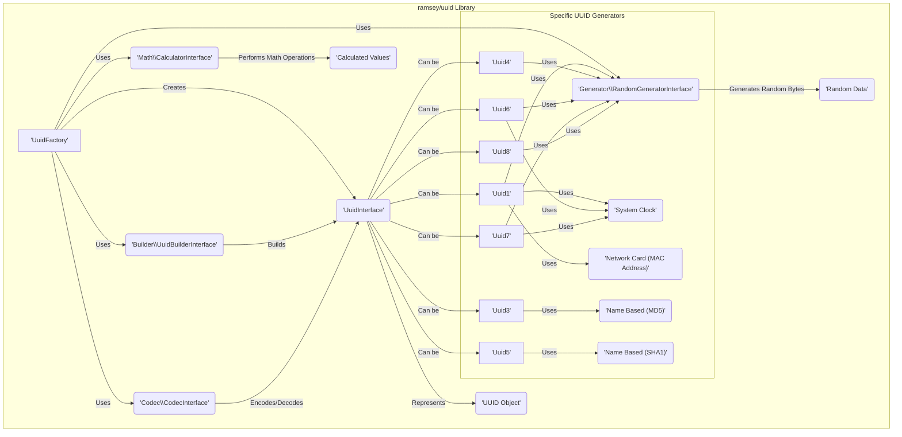
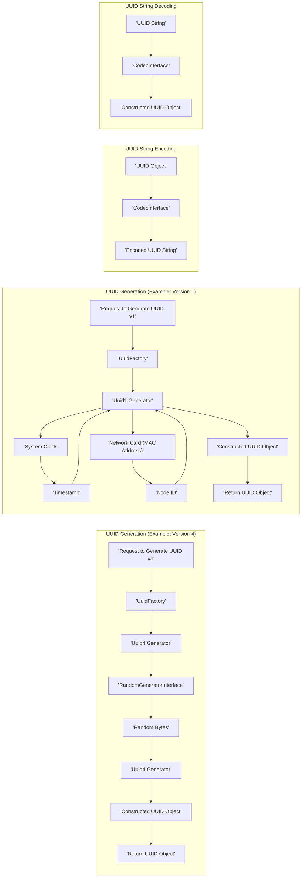

# Project Design Document: ramsey/uuid Library

**Version:** 1.1
**Date:** October 26, 2023
**Author:** Gemini (AI Language Model)

## 1. Introduction

This document provides a detailed design overview of the `ramsey/uuid` library, a widely used PHP library for generating and manipulating Universally Unique Identifiers (UUIDs). This document is specifically created to serve as a foundation for threat modeling activities, outlining the library's architecture, data flow, and key components with a focus on potential security implications.

## 2. Goals and Objectives

The primary goal of the `ramsey/uuid` library is to offer a robust, standards-compliant, and performant mechanism for generating and working with UUIDs in PHP applications. Key objectives include:

*   Generating UUIDs conforming to various RFC 4122 versions (e.g., version 1, 3, 4, 5, 6, 7, 8).
*   Providing comprehensive methods for validating, comparing, and inspecting UUIDs.
*   Offering flexible name-based UUID generation strategies using different hashing algorithms.
*   Supporting diverse encoding and string representations of UUIDs for interoperability.
*   Maintaining a focus on performance and reliability for production environments.

The objective of this design document is to:

*   Clearly and concisely describe the internal architecture of the library, highlighting security-relevant aspects.
*   Illustrate the data flow during critical operations like UUID generation and manipulation, identifying potential points of interest for security analysis.
*   Identify key components and their interactions, emphasizing those with security implications.
*   Provide the necessary context for security engineers and architects to effectively perform threat modeling on systems utilizing this library.

## 3. Scope

This document focuses specifically on the design and architecture of the `ramsey/uuid` library itself. It explicitly excludes:

*   Specific applications or systems that integrate and utilize the `ramsey/uuid` library.
*   The underlying operating system, hardware, or PHP runtime environment on which the library executes (except where directly relevant to the library's functionality, such as reliance on system time or random number generators).
*   Network interactions, unless directly initiated by the library for specific purposes (which is minimal).
*   The security posture of the PHP runtime environment itself, beyond acknowledging its role as a dependency.

## 4. System Architecture

The `ramsey/uuid` library employs a modular and extensible design, with distinct classes responsible for specific aspects of UUID generation and manipulation. This separation of concerns aids in maintainability and allows for customization.

Key components and their security relevance:

*   **`UuidFactory`:** The central entry point for creating UUID objects. It orchestrates the selection of appropriate builders and generators based on the desired UUID version. *Security Relevance:*  Incorrect configuration or vulnerabilities in the factory could lead to the generation of insecure or predictable UUIDs if the wrong generator is selected.
*   **`UuidInterface`:** Defines the common interface for all UUID objects, ensuring consistent methods for accessing and manipulating UUID data. *Security Relevance:*  A well-defined interface helps ensure consistent handling of UUIDs, reducing the risk of interpretation errors that could lead to security issues in consuming applications.
*   **UUID Objects (e.g., `Uuid1`, `Uuid4`):** Concrete implementations of `UuidInterface` representing specific UUID versions. Each class encapsulates the unique logic for generating and representing its respective version. *Security Relevance:* The security of each UUID version depends on the implementation within these classes, particularly regarding the randomness of data sources and the adherence to the RFC 4122 specification.
*   **`Builder\UuidBuilderInterface`:** Responsible for constructing `UuidInterface` instances from various input formats (e.g., byte strings, integer representations). *Security Relevance:*  Improper input validation within builders could lead to the creation of invalid or malformed UUID objects, potentially causing issues in downstream systems.
*   **`Codec\CodecInterface`:** Handles the encoding and decoding of UUIDs to and from different string representations (e.g., canonical, URN, hexadecimal). *Security Relevance:*  Vulnerabilities in codecs could allow for the injection of malicious data or the misinterpretation of UUID strings, leading to security bypasses or data corruption.
*   **`Generator\RandomGeneratorInterface`:** An abstraction for generating random bytes, a critical component for version 4, 6, 7, and 8 UUIDs. Different implementations can be used, allowing for flexibility. *Security Relevance:* The quality and security of the random number generator are paramount for the unpredictability of these UUID versions. A weak or compromised generator directly undermines the security guarantees of these UUIDs.
*   **`Math\CalculatorInterface`:** Provides an interface for performing mathematical operations on large integers, necessary for certain UUID calculations, particularly in name-based versions. *Security Relevance:* While less direct, vulnerabilities in the underlying math operations could potentially lead to incorrect UUID generation in specific scenarios.
*   **Specific UUID Generators (e.g., `Uuid1`, `Uuid3`, `Uuid4`, `Uuid5`, `Uuid6`, `Uuid7`, `Uuid8`):** Implement the distinct logic for generating each UUID version according to RFC 4122.
    *   **Version 1:** Relies on the system clock and a network card's MAC address (or a randomly generated node ID if a MAC address is unavailable). *Security Relevance:* The inclusion of the MAC address can be a privacy concern. The reliance on system time makes it susceptible to clock manipulation.
    *   **Version 3 & 5:** Generate UUIDs based on a namespace UUID and a name, using MD5 (version 3) or SHA1 (version 5) hashing algorithms. *Security Relevance:*  MD5 is cryptographically broken and SHA1 is considered weak, making these versions unsuitable for security-sensitive applications where collision resistance is critical.
    *   **Version 4:** Generates UUIDs using purely random numbers. *Security Relevance:*  Entirely dependent on the quality of the `RandomGeneratorInterface` implementation.
    *   **Version 6, 7, & 8:** Time-based UUIDs with different time representations and field layouts, aiming to improve upon version 1's shortcomings. Version 8 allows for custom field layouts. *Security Relevance:* Still reliant on a secure source of time and a strong random number generator. The customizability of version 8 introduces potential risks if not used carefully.
*   **External Dependencies:**
    *   **System Clock:** Used by time-based UUID versions (1, 6, 7). *Security Relevance:*  A compromised system clock can lead to predictable or non-unique UUIDs.
    *   **Network Card (MAC Address):** Used by version 1 UUIDs (potentially a source of privacy concerns). *Security Relevance:* Exposure of MAC addresses can be a privacy violation.
    *   **Random Number Generator (System Provided):** The underlying source of randomness for the `RandomGeneratorInterface`. *Security Relevance:* The security of the generated UUIDs is directly tied to the quality of this source.

## 5. Data Flow

The primary data flow within the library centers around the generation, encoding, and decoding of UUIDs. Understanding these flows is crucial for identifying potential points of manipulation or vulnerability.

**UUID Generation:**

*   A request is initiated, specifying the desired UUID version.
*   The `UuidFactory` receives the request and delegates it to the appropriate version-specific generator.
*   The generator gathers necessary data based on the UUID version:
    *   **Version 4:** Requests random bytes from the configured `RandomGeneratorInterface`.
    *   **Version 1:** Retrieves the current timestamp from the system clock and the MAC address of a network interface (or a generated node ID).
    *   **Version 3 & 5:** Receives a namespace UUID and a name as input, which are then processed by the respective hashing algorithm (MD5 or SHA1).
    *   **Version 6, 7, & 8:** Combines time components (from the system clock) and random data in specific layouts.
*   The generator constructs a `UuidInterface` object containing the generated UUID data.
*   The `UuidInterface` object is returned to the requester. *Threat Relevance:*  The integrity of the generated UUID depends on the security of the data sources used in this process.

**UUID Encoding:**

*   A `UuidInterface` object is passed to an implementation of the `CodecInterface`.
*   The codec transforms the internal representation of the UUID into the requested string format.
*   The encoded UUID string is returned. *Threat Relevance:*  Vulnerabilities in the encoding process could lead to information leakage or the generation of invalid UUID strings.

**UUID Decoding:**

*   A UUID string is provided to an implementation of the `CodecInterface`.
*   The codec parses the string and attempts to reconstruct a corresponding `UuidInterface` object.
*   The `UuidInterface` object is returned, or an exception is thrown if the string is invalid. *Threat Relevance:*  Improper validation during decoding can lead to vulnerabilities if malformed or malicious strings are not handled correctly.

## 6. Security Considerations

Based on the architecture and data flow, several security considerations are paramount:

*   **Random Number Generation Security:** The security of version 4, 6, 7, and 8 UUIDs is critically dependent on the strength and unpredictability of the random number generator provided by the `RandomGeneratorInterface`.
    *   *Threat:* A weak or predictable random number generator can lead to UUID collisions or the ability to predict future UUIDs, potentially enabling unauthorized access, data breaches, or other security compromises.
    *   *Mitigation:* Ensure the use of cryptographically secure random number generators (CSPRNGs) for security-sensitive applications. The library relies on PHP's built-in functions, so the underlying OS implementation is crucial.
*   **Privacy Implications of Version 1 UUIDs:** The inclusion of the MAC address in version 1 UUIDs can expose the identity of the generating host.
    *   *Threat:*  Exposure of MAC addresses can be a privacy violation and could potentially be used for tracking or profiling.
    *   *Mitigation:*  Consider using version 4, 6, 7, or 8 UUIDs when privacy is a concern. The library allows for random node ID generation as a fallback for version 1, which should be preferred in privacy-sensitive contexts.
*   **Weak Hashing Algorithms in Name-Based UUIDs (Versions 3 & 5):** Versions 3 and 5 rely on MD5 and SHA1, respectively, which are considered cryptographically weak.
    *   *Threat:*  The use of weak hashing algorithms increases the risk of collisions, where different names within the same namespace could generate the same UUID. This can lead to data integrity issues or security vulnerabilities if UUIDs are used for authorization or identification.
    *   *Mitigation:* Avoid using version 3 and 5 UUIDs for security-critical applications. Consider alternative approaches or stronger hashing algorithms if name-based UUIDs are required.
*   **System Clock Security:** Time-based UUID versions (1, 6, 7) rely on the system clock.
    *   *Threat:*  Manipulation of the system clock can lead to the generation of predictable or non-unique UUIDs. Clock skew can also impact uniqueness guarantees.
    *   *Mitigation:* Ensure the system clock is synchronized and protected from unauthorized modification.
*   **Dependency Chain Security:** The library depends on other components (e.g., `ramsey/collection`, `ramsey/string`, `psr/simple-cache`).
    *   *Threat:*  Vulnerabilities in these dependencies could indirectly affect the security of the `ramsey/uuid` library.
    *   *Mitigation:*  Regularly update dependencies to their latest secure versions. Employ dependency scanning tools to identify potential vulnerabilities.
*   **Input Validation during Decoding:**  The library must perform robust validation when decoding UUID strings.
    *   *Threat:*  Insufficient input validation could allow for the injection of malicious data or the misinterpretation of invalid UUID strings, potentially leading to unexpected behavior or security vulnerabilities in consuming applications.
    *   *Mitigation:*  Ensure thorough validation of UUID strings during decoding to prevent processing of malformed or malicious input.

## 7. Dependencies

The `ramsey/uuid` library relies on the following dependencies, managed via Composer:

*   `php`:  Specifies the required PHP version. *Security Relevance:*  Using an outdated PHP version can expose the application to known vulnerabilities in the PHP runtime.
*   `ramsey/collection`: Provides collection interfaces and implementations. *Security Relevance:*  Vulnerabilities in this dependency could impact the library's internal data handling.
*   `ramsey/string`: Offers string manipulation utilities. *Security Relevance:*  Security issues in this dependency related to string processing could potentially affect UUID encoding or decoding.
*   `psr/simple-cache`: An interface for simple caching. *Security Relevance:* If caching is used by the library internally (though less likely), vulnerabilities in the cache implementation could be a concern.

Maintaining up-to-date and secure versions of these dependencies is crucial for the overall security of applications using `ramsey/uuid`.

## 8. Deployment

The `ramsey/uuid` library is typically deployed as a dependency within a PHP application using Composer. No specific deployment steps are required beyond including it in the project's `composer.json` file and running `composer install`. *Security Relevance:*  Ensure that the deployment process itself is secure and that dependencies are fetched from trusted sources.

## 9. Future Considerations

Potential future enhancements and areas for security improvement include:

*   **Exploring Pluggable Random Number Generators:**  Providing more explicit options and guidance for using specific CSPRNG implementations beyond the default PHP functions.
*   **Deprecation of Version 3 and 5 UUIDs:**  Considering deprecation or stronger warnings against the use of version 3 and 5 UUIDs in security-sensitive contexts due to the weak hashing algorithms.
*   **Enhanced Input Validation:**  Continuously reviewing and improving input validation routines for UUID decoding to prevent potential vulnerabilities.
*   **Security Audits:**  Regularly conducting third-party security audits to identify and address potential vulnerabilities in the library.
*   **Consideration of Newer Hashing Algorithms:**  Exploring the possibility of supporting newer and stronger hashing algorithms for name-based UUID generation as alternatives to MD5 and SHA1.

This document provides a detailed design overview of the `ramsey/uuid` library, specifically tailored for threat modeling purposes. The identified components, data flows, and security considerations offer a solid foundation for security professionals to analyze and assess the potential risks associated with using this library in their applications.