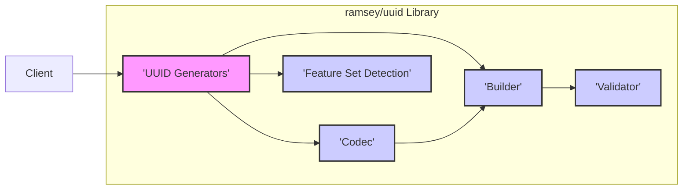
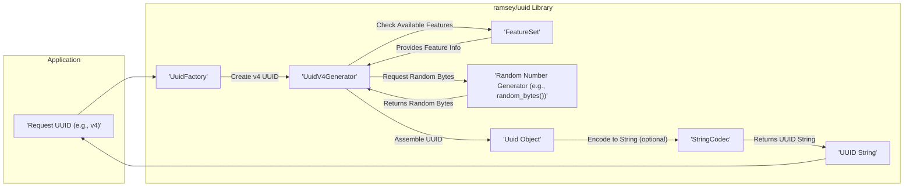

# Project Design Document: ramsey/uuid Library

**Version:** 1.1
**Date:** October 26, 2023
**Author:** AI Software Architecture Expert

## 1. Introduction

This document provides a detailed design overview of the `ramsey/uuid` library, a widely adopted PHP library for generating and working with Universally Unique Identifiers (UUIDs). This document is intended to serve as a foundation for subsequent threat modeling activities. It outlines the library's architecture, key components, data flow, and dependencies, with a focus on aspects relevant to security analysis.

## 2. Project Overview

The `ramsey/uuid` library is a mature and standards-compliant PHP package that offers a comprehensive suite of functionalities for generating and manipulating UUIDs. UUIDs are 128-bit identifiers designed to ensure uniqueness across space and time. The library adheres to RFC 4122 and supports various UUID versions and formats, making it a versatile choice for developers requiring unique identifiers in their applications.

**Key Features:**

*   Generation of UUIDs conforming to different versions:
    *   Version 1 (timestamp and MAC address based).
    *   Version 3 (name-based using MD5 hashing).
    *   Version 4 (random number based).
    *   Version 5 (name-based using SHA-1 hashing).
    *   Nil UUID (a special UUID with all bits set to zero).
*   Parsing and validation of UUID strings from various formats.
*   Comparison of UUIDs for equality.
*   Extraction of individual components from UUIDs (e.g., timestamp, clock sequence, node ID).
*   Support for different encoding formats:
    *   String representations (canonical, URN).
    *   Binary (bytes).
    *   Integer.
*   Extensibility through well-defined interfaces and factory patterns, allowing for customization and alternative implementations.

## 3. High-Level Architecture

The library is designed with a modular architecture, where distinct components are responsible for specific aspects of UUID generation and manipulation. This separation of concerns enhances maintainability and testability.

**Components:**

*   **'UUID Generators':** This core component is responsible for the actual generation of UUIDs. It contains specific implementations for each UUID version, encapsulating the unique logic and algorithms required by RFC 4122.
    *   Handles the acquisition of necessary data like timestamps, MAC addresses (or random node IDs), and random numbers.
    *   Implements the name-based generation using provided namespaces and names with MD5 (v3) or SHA-1 (v5) hashing.
*   **'Codec':** This component handles the serialization and deserialization of UUIDs. It provides functionality to convert `UuidInterface` objects into various representations (string, bytes, integer) and vice versa.
    *   Ensures adherence to standard UUID formats during encoding and decoding.
    *   Handles different string representations like the canonical format with hyphens and the URN format.
*   **'Builder':** The builder component offers a programmatic way to construct `UuidInterface` objects from their constituent parts (e.g., the 16 individual bytes or the most and least significant bits).
    *   Provides a lower-level interface for creating UUIDs when the raw data is already available.
    *   Used internally by the Codec during the decoding process.
*   **'Validator':** This component is responsible for verifying if a given input (typically a string) represents a valid UUID according to the defined formats.
    *   Uses regular expressions and other validation logic to check for correct length, character set, and hyphen placement.
    *   Helps ensure data integrity when working with UUIDs from external sources.
*   **'Feature Set Detection':** This component plays a crucial role in determining the availability of certain system-level features and PHP extensions that can be leveraged for enhanced security and performance, particularly in random UUID generation.
    *   Detects the presence of functions like `random_bytes()` and extensions like `openssl`.
    *   Influences the choice of random number generation methods used by the UUID Generators.

## 4. Detailed Component Design

### 4.1. 'UUID Generators'

*   **Responsibilities:**
    *   Generate `UuidInterface` objects based on the specified version.
    *   Implement the algorithms defined in RFC 4122 for each UUID version.
    *   Securely acquire entropy for random UUID generation (v4).
    *   Manage the generation of node IDs for version 1 UUIDs (using MAC address if available, otherwise a random number).
    *   Perform hashing operations for name-based UUIDs (v3 and v5).
*   **Key Classes/Interfaces:**
    *   `UuidFactoryInterface`: Defines the contract for creating UUID objects. Implementations like `UuidFactory` provide concrete methods for generating different UUID versions.
    *   `UuidV1Generator`: Implements the logic for generating version 1 UUIDs, including timestamp and node ID handling.
    *   `UuidV3Generator`: Implements version 3 UUID generation using MD5 hashing.
    *   `UuidV4Generator`: Implements version 4 UUID generation, relying on secure random number generation.
    *   `UuidV5Generator`: Implements version 5 UUID generation using SHA-1 hashing.
    *   `NilUuid`: Represents the special nil UUID.
*   **Data Flow (Example: Version 4 Generation):**
    *   Receives a request for a version 4 UUID from the `UuidFactory`.
    *   Consults the 'Feature Set Detection' component to determine the most secure available random number generation method.
    *   Requests 16 random bytes from the selected random number generator (e.g., `random_bytes()`).
    *   Arranges the random bytes into the specific format required for a version 4 UUID, setting the version and variant bits.
    *   Creates and returns a `UuidInterface` object representing the generated UUID.

### 4.2. 'Codec'

*   **Responsibilities:**
    *   Encode `UuidInterface` objects into various string representations (canonical, URN).
    *   Decode UUID strings from different formats into `UuidInterface` objects.
    *   Encode `UuidInterface` objects into binary (bytes) representations.
    *   Decode UUIDs from binary representations into `UuidInterface` objects.
    *   Optionally, encode and decode to integer representations.
*   **Key Classes/Interfaces:**
    *   `CodecInterface`: Defines the interface for encoding and decoding UUIDs.
    *   `StringCodec`: Implements encoding and decoding to and from string representations, handling different formats.
    *   `BytesCodec`: Implements encoding and decoding to and from raw byte arrays.
    *   `IntegerCodec`: Implements encoding and decoding to and from integer representations (less commonly used).
*   **Data Flow (Example: String Encoding):**
    *   Receives a `UuidInterface` object.
    *   Extracts the individual components (time_low, time_mid, time_hi_and_version, clock_seq_hi_and_reserved, clock_seq_low, node) from the `UuidInterface`.
    *   Formats these components into the desired string representation (e.g., canonical format with hyphens).
    *   Returns the encoded UUID string.

### 4.3. 'Builder'

*   **Responsibilities:**
    *   Construct `UuidInterface` objects from provided raw data (e.g., most significant and least significant bits, or the 16 individual bytes).
    *   Provide a mechanism for creating UUIDs when the constituent parts are already known or derived from other sources.
*   **Key Classes/Interfaces:**
    *   `UuidBuilderInterface`: Defines the interface for building UUID objects.
    *   `GenericUuidBuilder`: A common implementation of the `UuidBuilderInterface`.
*   **Data Flow (Example: Building from Bytes):**
    *   Receives an array of 16 bytes as input.
    *   Arranges these bytes according to the UUID structure.
    *   Creates and returns a `UuidInterface` object representing the UUID built from the provided bytes.

### 4.4. 'Validator'

*   **Responsibilities:**
    *   Validate if a given string conforms to the expected UUID format (e.g., 8-4-4-4-12 hexadecimal characters separated by hyphens).
    *   Ensure the string contains only valid hexadecimal characters.
    *   Check the correct placement of hyphens.
*   **Key Classes/Interfaces:**
    *   `ValidatorInterface`: Defines the interface for validating UUIDs.
    *   `GenericValidator`: A typical implementation of the `ValidatorInterface`, often using regular expressions for validation.
*   **Data Flow:**
    *   Receives a string as input.
    *   Applies validation rules, often using a regular expression to match the expected UUID string pattern.
    *   Returns a boolean value indicating whether the input string is a valid UUID.

### 4.5. 'Feature Set Detection'

*   **Responsibilities:**
    *   Detect the presence of key PHP functions relevant to secure random number generation (e.g., `random_bytes()`).
    *   Detect the availability of security-related PHP extensions (e.g., `openssl`).
    *   Store the detected feature set information for use by other components, particularly the 'UUID Generators'.
*   **Key Classes/Interfaces:**
    *   `FeatureSet`: A class that holds boolean flags indicating the availability of specific features.
*   **Data Flow:**
    *   Executed during the library's initialization phase.
    *   Uses functions like `function_exists()` and `extension_loaded()` to check for the presence of features.
    *   Populates the `FeatureSet` object with the detection results.
    *   The 'UUID Generators' component queries the `FeatureSet` to determine the appropriate method for generating random numbers.

## 5. Data Flow Diagram

**Data Flow Description (Example: Generating a Version 4 UUID):**

1. The application initiates a request for a version 4 UUID, typically through the `UuidFactory`.
2. The `UuidFactory` delegates the generation to the appropriate generator, in this case, the `'UuidV4Generator'`.
3. The `'UuidV4Generator'` consults the `'FeatureSet'` component to determine the most secure method for generating random numbers.
4. The `'FeatureSet'` provides information about available functions like `random_bytes()`.
5. The `'UuidV4Generator'` requests cryptographically secure random bytes from the selected `'Random Number Generator'` (e.g., the PHP `random_bytes()` function).
6. The `'Random Number Generator'` provides the requested random bytes.
7. The `'UuidV4Generator'` assembles the UUID by arranging the random bytes according to the version 4 specification.
8. A `'Uuid Object'` (implementing `UuidInterface`) is created, representing the generated UUID.
9. Optionally, the `'StringCodec'` can be used to encode the `'Uuid Object'` into its string representation.
10. The generated UUID (as an object or string) is returned to the application.

## 6. Dependencies

The `ramsey/uuid` library has several dependencies, some of which are optional but recommended for enhanced functionality and security:

*   **PHP:** The library is written in PHP and requires a minimum compatible PHP version.
*   **Composer:** Used for managing the installation and dependencies of the library.
*   **ext-mbstring:**  Recommended for proper handling of multibyte strings, particularly when generating name-based UUIDs (versions 3 and 5) with non-ASCII names.
*   **ext-random:**  While not a direct dependency, the library relies on a source of good quality randomness. The `random_bytes()` function (part of the core PHP `random` extension in PHP 7 and later, or the `paragonie/random_compat` library for older versions) is strongly recommended for secure UUID generation.
*   **ext-uuid (PECL):**  An optional PECL extension that provides native UUID generation capabilities. If installed, `ramsey/uuid` can optionally leverage it for potentially faster UUID generation in certain scenarios.
*   **paragonie/random_compat:**  A polyfill for `random_bytes()` for PHP versions older than 7. This is a recommended dependency for ensuring secure random number generation on older PHP versions.

## 7. Security Considerations (Preliminary)

This section outlines potential security considerations relevant to the `ramsey/uuid` library, which will be further analyzed during the threat modeling process.

*   **Predictability of Generated UUIDs:**
    *   **Version 1:** If the system clock is predictable or the MAC address is known or easily guessable, version 1 UUIDs can become predictable, potentially leading to security vulnerabilities if used in security-sensitive contexts. The library attempts to mitigate this by using a randomly generated node ID if a physical MAC address is not available or cannot be reliably obtained.
    *   **Version 3 and 5:** The security of these name-based UUIDs depends entirely on the secrecy and unpredictability of the namespace UUID and the input name. If either of these is predictable, the generated UUID will also be predictable.
    *   **Version 4:** The security of version 4 UUIDs relies heavily on the quality of the underlying random number generator. If a weak or predictable RNG is used, version 4 UUIDs can be compromised, potentially leading to security breaches if used for security-sensitive purposes. The library prioritizes the use of `random_bytes()` for secure random number generation.
*   **Collision Resistance:** While statistically improbable, collisions (generating the same UUID twice) are theoretically possible, especially with predictable generation methods or flawed random number generators. The probability of collision is significantly higher with poorly implemented or predictable random number generation.
*   **Information Disclosure via Version 1 UUIDs:** Version 1 UUIDs embed the timestamp of their creation and potentially the MAC address of the generating host. This information could be used to infer the time of an event or potentially identify the server that generated the UUID.
*   **Denial of Service (DoS):** While unlikely to be a primary attack vector against the library itself, excessive requests for UUID generation, particularly version 4 requiring strong randomness, could potentially strain system resources, especially if the entropy source is slow or limited.
*   **Misuse of UUIDs in Security Contexts:** It's crucial to understand that UUIDs, even version 4, are not cryptographically secure secrets. They should not be used as primary authentication tokens, session identifiers, or for purposes requiring strong cryptographic guarantees without additional security measures (e.g., encryption, signing). Relying solely on the uniqueness of a UUID for security can lead to vulnerabilities.

## 8. Threat Modeling Scope

The primary focus of the threat model for the `ramsey/uuid` library will be on the following aspects:

*   **UUID Generation Mechanisms:**  A detailed analysis of the security of the algorithms and processes used for generating UUIDs of different versions, with a particular emphasis on the sources of entropy for version 4 UUIDs and the handling of input parameters for versions 3 and 5.
*   **Input Validation and Parsing:** Examination of how the library handles and validates input when parsing UUID strings from external sources or when building UUIDs from provided components. This includes identifying potential vulnerabilities related to malformed or malicious input.
*   **Dependency Analysis:** Assessing the security implications of the library's dependencies, particularly those related to random number generation and cryptographic functions.
*   **Configuration and Usage Patterns:**  Considering potential misconfigurations or insecure usage patterns by developers that could introduce vulnerabilities in applications using the library.

**Out of Scope for this Threat Model:**

*   The security of the applications that consume the `ramsey/uuid` library. The threat model will focus on the library's internal workings.
*   Network security aspects related to the transmission or storage of UUIDs.
*   Vulnerabilities in the underlying PHP runtime environment or operating system, except where directly relevant to the library's functionality (e.g., the availability and security of `random_bytes()`).

This detailed design document provides a comprehensive understanding of the `ramsey/uuid` library's architecture, components, and functionalities. It serves as a vital resource for the subsequent threat modeling process, facilitating a thorough evaluation of potential security risks and vulnerabilities associated with the library.