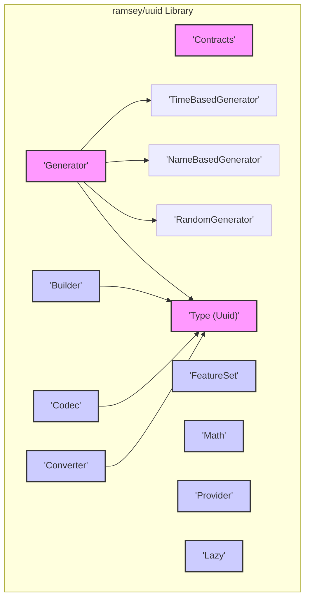
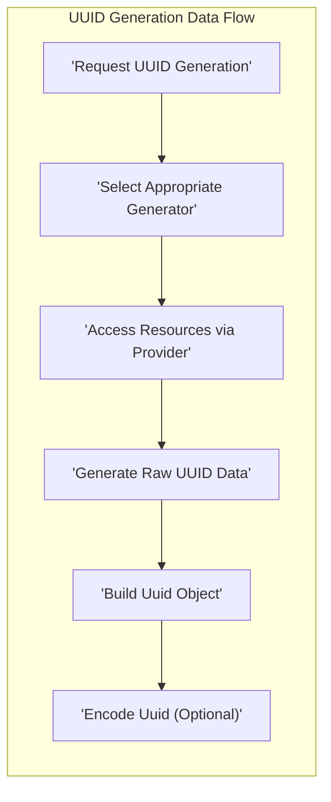

# Project Design Document: ramsey/uuid Library

**Version:** 1.1
**Date:** October 26, 2023
**Author:** AI Software Architect

## 1. Introduction

This document provides an enhanced design overview of the `ramsey/uuid` library, a widely adopted PHP library for generating and manipulating Universally Unique Identifiers (UUIDs). This revised document aims to provide a more detailed and security-focused perspective, specifically tailored for subsequent threat modeling activities. It elaborates on the library's architecture, components, data flow, and dependencies, with a stronger emphasis on potential security implications.

## 2. Goals and Objectives

The core objective of the `ramsey/uuid` library remains the provision of a robust and standards-compliant mechanism for generating and manipulating UUIDs within PHP applications. Key objectives include:

*   Adhering to RFC 4122 specifications for generating UUIDs of versions 1, 3, 4, 5, 6, 7, and 8.
*   Maintaining a clear and consistent Application Programming Interface (API) for UUID generation and manipulation.
*   Offering diverse generation strategies to accommodate various application needs, such as time-based, name-based, and random generation.
*   Supporting multiple encoding and representation formats for UUIDs, including string, binary, and integer representations.
*   Ensuring performance and efficiency in UUID generation and manipulation.
*   Upholding high code quality standards and comprehensive test coverage.

## 3. Architecture and Components

The `ramsey/uuid` library is designed with a modular architecture, where distinct components handle specific aspects of UUID generation and management. The primary components are:

*   **Contracts:** Defines interfaces for core functionalities, including UUID generation, encoding, decoding, and building. These contracts ensure loose coupling and allow for different implementations.
*   **Codec:** Responsible for the encoding and decoding of UUIDs into various formats. This includes converting between binary, string (canonical representation), and integer representations.
*   **Converter:** Facilitates the conversion of UUIDs between different internal representations or formats.
*   **Builder:** Provides a factory pattern for constructing `Uuid` objects from diverse input sources, such as strings, bytes, or integer representations.
*   **Generator:** The central component responsible for the actual generation of UUIDs based on specified algorithms and versions. This encompasses:
    *   **TimeBasedGenerator (Versions 1, 6, 7, 8):** Generates UUIDs incorporating a timestamp and a node identifier (typically a MAC address or a randomly generated value). Version 1 relies on system time and MAC address. Versions 6, 7, and 8 introduce lexicographically sortable time-based UUIDs with improved timestamp precision and reduced reliance on MAC addresses.
    *   **NameBasedGenerator (Versions 3, 5):** Generates UUIDs by hashing a namespace UUID and a name using either MD5 (for version 3) or SHA-1 (for version 5).
    *   **RandomGenerator (Version 4):** Generates UUIDs using cryptographically secure pseudo-random number generators (CSPRNGs).
*   **FeatureSet:** Encapsulates the configuration and available features of the library, allowing for customization and extension.
*   **Math:** Provides utility functions for mathematical operations, particularly for handling large integers involved in UUID manipulation.
*   **Provider:** Offers an abstraction layer for accessing system-level resources, such as random number generators, system time, and network interface information. This allows for platform independence and the potential to inject custom providers.
*   **Type:** Defines the `Uuid` object, which represents a UUID and provides methods for accessing its components, comparing it to other UUIDs, and formatting it.
*   **Lazy:** Implements a lazy loading mechanism for `Uuid` instances, potentially improving performance by delaying object creation until it's needed.

## 4. Data Flow

The typical data flow for generating a UUID within the library proceeds as follows:

1. An application initiates a request to generate a UUID, specifying the desired version or relying on the default configuration.
2. The appropriate `Generator` implementation (e.g., `RandomGenerator` for version 4, `TimeBasedGenerator` for version 1) is selected based on the requested version.
3. The `Generator` interacts with the `Provider` to obtain necessary resources. For example, `RandomGenerator` requests random bytes from a CSPRNG, and `TimeBasedGenerator` retrieves the current timestamp and potentially the MAC address.
4. The `Generator` executes the specific algorithm defined for the selected UUID version to produce the raw UUID data (a 16-byte array).
5. A `Builder` is employed to construct a `Uuid` object from the generated raw data. This involves setting the appropriate fields within the `Uuid` object.
6. If a specific encoding is required (e.g., converting the UUID to its canonical string representation), the `Codec` is used to transform the `Uuid` object into the desired format.

## 5. Dependencies

The `ramsey/uuid` library relies on several external libraries managed through Composer. These dependencies introduce potential security considerations related to supply chain vulnerabilities and the security of the dependent code itself. Key dependencies include:

*   `php`: The fundamental PHP runtime environment. The security of the PHP installation is paramount.
*   `ramsey/collection`: Provides collection interfaces and implementations used internally by `ramsey/uuid`. Vulnerabilities in this dependency could affect `ramsey/uuid`.
*   `ramsey/portable-binary`: Facilitates handling binary data in a platform-independent manner. Security issues in this library could impact how `ramsey/uuid` processes binary UUID data.
*   `psr/clock`: Defines an interface for retrieving the current time. While seemingly innocuous, incorrect or manipulated time sources could affect the generation of time-based UUIDs.
*   `symfony/polyfill-ctype`: Provides a polyfill for the `ctype` PHP extension, which is used for character type checking. Vulnerabilities here are less likely to directly impact UUID generation but could affect other parts of the library.
*   `phpseclib/phpseclib` (optional, for enhanced random number generation): A pure-PHP implementation of cryptographic functions. When used, it provides a fallback for generating cryptographically secure random numbers if system-provided sources are deemed insufficient or unavailable. The security of `phpseclib` is crucial when this dependency is included.

## 6. Security Considerations

Several aspects of the `ramsey/uuid` library warrant careful security consideration:

*   **Random Number Generation (Version 4):** The security of version 4 UUIDs hinges entirely on the quality of the random number generator. If a weak or predictable random number generator is used, it could lead to predictable UUIDs, enabling information disclosure, unauthorized access, or other security breaches. The library attempts to use cryptographically secure pseudo-random number generators (CSPRNGs) provided by the operating system. The optional dependency on `phpseclib/phpseclib` offers a more robust alternative in environments with potentially weak system generators.
    *   **Threat Example:** An attacker could predict future UUIDs, allowing them to bypass authorization checks or access resources they shouldn't.
*   **Time-Based UUID Generation (Versions 1, 6, 7, 8):** These versions embed a timestamp and potentially the MAC address of the generating machine. This can reveal sensitive information about when and where the UUID was generated. While versions 6, 7, and 8 aim to mitigate some of these privacy concerns, the inherent inclusion of time information remains a consideration.
    *   **Threat Example:**  Knowing the approximate time of creation of a resource based on its UUID could aid in timing attacks or provide insights into system activity. Exposure of MAC addresses could potentially be used for tracking or profiling.
*   **Name-Based UUID Generation (Versions 3, 5):** The security of these UUIDs depends on the security of the hashing algorithm (MD5 for v3, SHA-1 for v5) and the secrecy and randomness of the namespace and name used as input. MD5 is known to have collision vulnerabilities, making version 3 less secure. While SHA-1 is stronger, it's also considered cryptographically broken for collision resistance in some contexts.
    *   **Threat Example:** An attacker could craft inputs that result in the same UUID, leading to potential data corruption or unauthorized access if UUIDs are used as identifiers.
*   **Dependency Vulnerabilities:**  Vulnerabilities in any of the library's dependencies could potentially compromise the security of applications using `ramsey/uuid`. This highlights the importance of regularly updating dependencies and being aware of any reported security issues. Supply chain attacks targeting dependencies are also a concern.
    *   **Threat Example:** A vulnerability in `ramsey/collection` could be exploited to manipulate internal data structures within `ramsey/uuid`.
*   **Collision Resistance:** While the probability of UUID collisions is statistically very low, it's not zero. Applications relying on absolute uniqueness for critical security functions should be aware of this theoretical possibility and consider additional safeguards if necessary.
*   **Input Validation:** Although the primary function of the library is UUID generation, it also provides functionality for parsing and validating UUID strings. Improper input validation could lead to vulnerabilities if malformed or malicious UUID strings are processed.
    *   **Threat Example:**  A poorly validated UUID string could cause a parsing error leading to a denial-of-service or other unexpected behavior.

## 7. Deployment Considerations

Secure deployment practices are crucial when using the `ramsey/uuid` library:

*   **Secure Dependency Management:** Utilize a dependency management tool like Composer and verify the integrity of downloaded packages to prevent supply chain attacks. Use checksum verification and potentially a private repository for dependencies.
*   **PHP Environment Security:** Ensure the underlying PHP environment is secure, including using the latest stable version, applying security patches, and configuring PHP settings appropriately (e.g., disabling dangerous functions).
*   **Context-Aware Usage:** Understand the security implications of using different UUID versions in specific contexts. Avoid using predictable UUIDs (or UUIDs with predictable components) for security-sensitive purposes like session identifiers or API keys.
*   **Regular Updates:** Keep the `ramsey/uuid` library and its dependencies updated to patch any known security vulnerabilities.
*   **Secure Storage:** If UUIDs are used to identify sensitive resources, ensure they are stored securely to prevent unauthorized access or enumeration.

## 8. Future Considerations

Potential future developments or changes to the library that could impact security include:

*   **Adoption of Newer UUID Versions or Standards:**  As new UUID versions or related standards emerge, their implementation in the library could introduce new security considerations that need to be evaluated.
*   **Changes in Dependency Security Landscape:**  The security posture of the library's dependencies can change over time. Continuous monitoring and assessment of dependency security are necessary.
*   **Performance vs. Security Trade-offs:**  Any future performance optimizations should carefully consider potential security implications. For example, switching to a faster but less secure random number generation method would be a significant security regression.
*   **Cryptographic Algorithm Updates:** As cryptographic best practices evolve, the library might need to update the algorithms used for name-based UUID generation or other security-sensitive operations.

This enhanced design document provides a more detailed and security-focused overview of the `ramsey/uuid` library. It serves as a valuable resource for conducting thorough threat modeling and identifying potential security vulnerabilities. Understanding the nuances of UUID generation, the library's dependencies, and potential attack vectors is crucial for building secure applications that utilize this library.