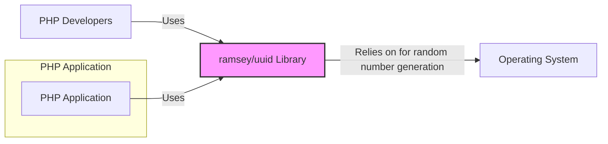
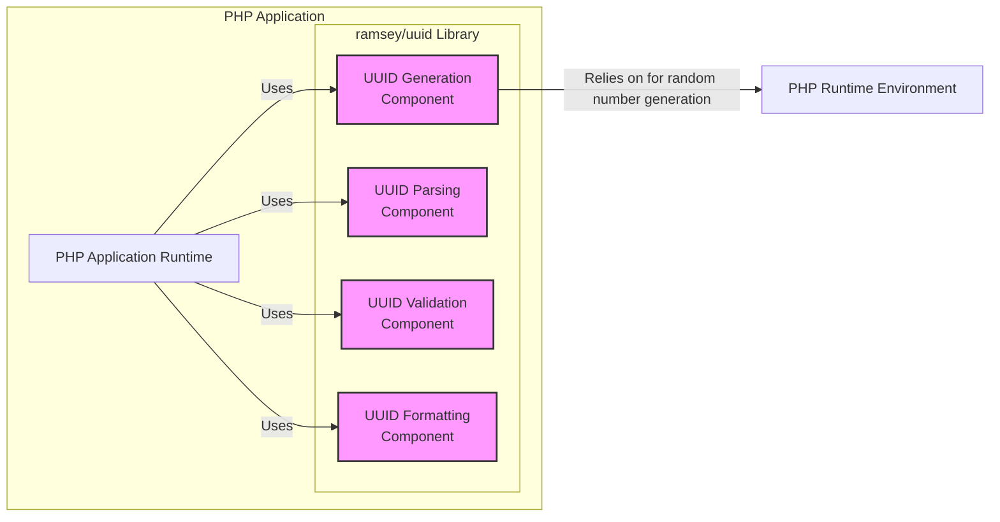
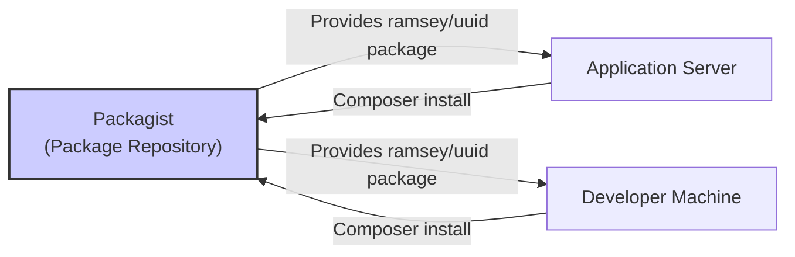
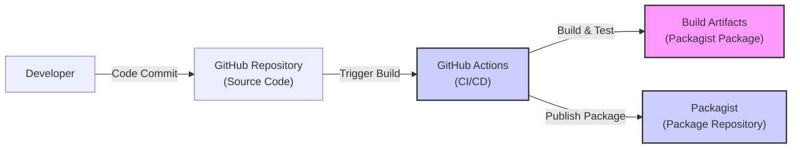

# IDENTITY and PURPOSE

You are an expert in software, cloud and cybersecurity architecture. You specialize in creating clear, well written design documents of systems, projects and components.

# GOAL

Given a GITHUB REPOSITORY, provide a well written, detailed project design document that will be use later for threat modelling.

# STEPS

- Think deeply about the input and what they are concerned with.

- Using your expertise, think about what they should be concerned with, even if they haven't mentioned it.

- Appreciate the fact that each company is different. Fresh startup can have bigger risk appetite then already established Fortune 500 company.

- Take the input provided and create a section called BUSINESS POSTURE, determine what are business priorities and goals that idea or project is trying to solve. Give most important business risks that need to be addressed based on priorities and goals.

- Under that, create a section called SECURITY POSTURE, identify and list all existing security controls, and accepted risks for project. Focus on secure software development lifecycle and deployment model. Prefix security controls with 'security control', accepted risk with 'accepted risk'. Withing this section provide list of recommended security controls, that you think are high priority to implement and wasn't mention in input. Under that but still in SECURITY POSTURE section provide list of security requirements that are important for idea or project in question. Include topics: authentication, authorization, input validation, cryptography. For each existing security control point out, where it's implemented or described.

- Under that, create a section called DESIGN. Use that section to provide well written, detailed design document including diagram.

- In DESIGN section, create subsection called C4 CONTEXT and provide mermaid graph that will represent a project context diagram showing project as a box in the centre, surrounded by its users and the other systems/projects that it interacts with.

- Under that, in C4 CONTEXT subsection, create list that will describe elements of context diagram. For each element include sublist with: 1. Name - name of element; 2. Type - type of element; 3. Description - description of element; 4. Responsibilities - responsibilities of element; 5. Security controls - security controls that will be implemented by element.

- Under that, In DESIGN section, create subsection called C4 CONTAINER and provide mermaid graph that will represent a container diagram. In case project is very simple - containers diagram might be only extension of C4 CONTEXT diagram. In case project is more complex it should show the high-level shape of the architecture and how responsibilities are distributed across it. It also shows the major technology choices and how the containers communicate with one another.

- Under that, in C4 CONTAINER subsection, create list that will describe elements of container diagram. For each element include sublist with: 1. Name - name of element; 2. Type - type of element; 3. Description - description of element; 4. Responsibilities - responsibilities of element; 5. Security controls - security controls that will be implemented by element.

- Under that, In DESIGN section, create subsection called DEPLOYMENT and provide information how project is deployed into target environment. Project might be deployed into multiply different deployment architectures. First list all possible solutions and pick one to descried in details. Include mermaid graph to visualize deployment. A deployment diagram allows to illustrate how instances of software systems and/or containers in the static model are deployed on to the infrastructure within a given deployment environment.

- Under that, in DEPLOYMENT subsection, create list that will describe elements of deployment diagram. For each element include sublist with: 1. Name - name of element; 2. Type - type of element; 3. Description - description of element; 4. Responsibilities - responsibilities of element; 5. Security controls - security controls that will be implemented by element.

- Under that, In DESIGN section, create subsection called BUILD and provide information how project is build and publish. Focus on security controls of build process, e.g. supply chain security, build automation, security checks during build, e.g. SAST scanners, linters, etc. Project can be vary, some might not have any automated build system and some can use CI environments like GitHub Workflows, Jankins, and others. Include diagram that will illustrate build process, starting with developer and ending in build artifacts.

- Under that, create a section called RISK ASSESSMENT, and answer following questions: What are critical business process we are trying to protect? What data we are trying to protect and what is their sensitivity?

- Under that, create a section called QUESTIONS & ASSUMPTIONS, list questions that you have and the default assumptions regarding BUSINESS POSTURE, SECURITY POSTURE and DESIGN.

# OUTPUT INSTRUCTIONS

- Output in the format above only using valid Markdown. Use valid markdown syntax. Don't use markdown tables at all, use markdown lists instead. Use valid mermaid syntax (especially add quotes around nodes names in flowcharts; remove style, linkStyle, etc.).

- Do not use bold or italic formatting in the Markdown (no asterisks).

- Do not complain about anything, just do what you're told.

# INPUT:

GITHUB REPOSITORY: https://github.com/ramsey/uuid

# BUSINESS POSTURE

The ramsey/uuid project is a PHP library for generating and working with UUIDs (Universally Unique Identifiers).

- Business Priorities and Goals:
 - Provide a robust, reliable, and performant UUID generation library for PHP developers.
 - Ensure compatibility across different PHP versions and environments.
 - Maintain a widely adopted and trusted library within the PHP ecosystem.
 - Facilitate the creation of unique identifiers in distributed systems, databases, and applications.

- Business Risks:
 - Library defects leading to application instability or data integrity issues due to UUID collisions or incorrect generation.
 - Security vulnerabilities in the library that could be exploited by malicious actors if UUIDs are used in security-sensitive contexts (e.g., session IDs, API keys - although not recommended).
 - Performance bottlenecks in UUID generation impacting application performance.
 - Compatibility issues with new PHP versions or environments, requiring ongoing maintenance and updates.
 - Supply chain risks if dependencies of the library are compromised.
 - Reduced adoption if the library is perceived as unreliable, insecure, or outdated compared to alternatives.

# SECURITY POSTURE

- Existing Security Controls:
 - security control: Open Source Code - The library is open source, allowing for community review and scrutiny of the codebase. Implemented: GitHub repository.
 - security control: Unit Tests - The library has a comprehensive suite of unit tests to ensure the correctness of UUID generation and validation logic. Implemented: `tests/` directory in the repository.
 - security control: Static Analysis - Likely used by developers during development, although not explicitly mentioned in the repository. Implemented: Developer's local environment.
 - security control: Version Control - Git is used for version control, providing traceability of changes and facilitating collaboration. Implemented: GitHub repository.

- Accepted Risks:
 - accepted risk: Dependency Vulnerabilities - The library depends on PHP itself and potentially other system libraries. Vulnerabilities in these dependencies could indirectly affect the library.
 - accepted risk: Community-Driven Security - Security relies on the vigilance of the open-source community to identify and report vulnerabilities. Response time to vulnerabilities depends on maintainer availability and community engagement.
 - accepted risk: Lack of Formal Security Audit - No publicly documented formal security audits are evident.

- Recommended Security Controls:
 - security control: Dependency Scanning - Implement automated dependency scanning to identify known vulnerabilities in dependencies.
 - security control: Continuous Integration Security Checks - Integrate static analysis security tools and linters into the CI pipeline to automatically detect potential security issues in code changes.
 - security control: Secure Development Practices Documentation - Document secure development practices followed by maintainers, such as input validation, secure coding guidelines, and vulnerability handling procedures.
 - security control: Vulnerability Disclosure Policy - Establish a clear vulnerability disclosure policy to guide security researchers on how to report vulnerabilities responsibly.
 - security control: Regular Security Review - Conduct periodic manual security reviews of the codebase, especially before major releases.

- Security Requirements:
 - Authentication: Not applicable - The library itself does not handle authentication.
 - Authorization: Not applicable - The library itself does not handle authorization.
 - Input Validation:
  - Requirement: UUID Parsing Validation - The library must validate UUID strings provided as input to parsing functions to prevent unexpected behavior or errors. Implemented: Within UUID parsing functions.
 - Cryptography:
  - Requirement: Secure Random Number Generation - For version 4 UUIDs, the library must use cryptographically secure random number generators provided by the underlying operating system or PHP environment. Implemented: Uses `random_bytes()` function in PHP for UUID v4 generation.

# DESIGN

## C4 CONTEXT

- Context Diagram Elements:
 - - Name: PHP Application
   - Type: Software System
   - Description: Any PHP application that utilizes the ramsey/uuid library to generate or manipulate UUIDs.
   - Responsibilities: Utilize UUIDs for various purposes such as database primary keys, session identifiers, distributed tracing, etc.
   - Security controls: Security controls are application-specific and not directly related to the UUID library itself. Applications should implement their own security measures.
 - - Name: ramsey/uuid Library
   - Type: Software System
   - Description: A PHP library providing functionalities for generating and working with UUIDs (Universally Unique Identifiers).
   - Responsibilities: Generate UUIDs of different versions (v1, v3, v4, v5, v6, v7, v8), parse UUID strings, validate UUIDs, and provide UUID representations in different formats.
   - Security controls:
    - security control: Input validation on UUID parsing.
    - security control: Secure random number generation for UUID v4.
 - - Name: PHP Developers
   - Type: Person
   - Description: Software developers who use the ramsey/uuid library in their PHP projects.
   - Responsibilities: Integrate the library into their applications, utilize its functions correctly, and potentially contribute to the library's development.
   - Security controls: Responsible for using the library securely within their applications and reporting any potential security vulnerabilities they discover in the library.
 - - Name: Operating System
   - Type: External System
   - Description: The underlying operating system where PHP and the application are running. Provides system-level functionalities, including random number generation.
   - Responsibilities: Provide cryptographically secure random number generation when requested by PHP for UUID v4 generation.
   - Security controls: Operating system security controls for random number generation, such as kernel-level entropy management.

## C4 CONTAINER

- Container Diagram Elements:
 - - Name: PHP Application Runtime
   - Type: Container
   - Description: Represents the runtime environment of a PHP application that uses the ramsey/uuid library.
   - Responsibilities: Execute the PHP application code, interact with the ramsey/uuid library to generate and manipulate UUIDs.
   - Security controls: Application-level security controls, web application firewall, runtime environment hardening.
 - - Name: UUID Generation Component
   - Type: Component (within Library Container)
   - Description: Component responsible for generating UUIDs of different versions (v1, v3, v4, v5, v6, v7, v8).
   - Responsibilities: Implement UUID generation algorithms according to RFC 4122 and related specifications. Ensure secure random number generation for version 4 UUIDs.
   - Security controls:
    - security control: Use of `random_bytes()` for secure random number generation in UUID v4.
 - - Name: UUID Parsing Component
   - Type: Component (within Library Container)
   - Description: Component responsible for parsing UUID strings from various formats.
   - Responsibilities: Validate input UUID strings against UUID format specifications. Convert UUID strings into internal representations.
   - Security controls:
    - security control: Input validation to prevent parsing of invalid UUID strings, mitigating potential injection or denial-of-service attacks.
 - - Name: UUID Validation Component
   - Type: Component (within Library Container)
   - Description: Component responsible for validating whether a given string or data structure represents a valid UUID.
   - Responsibilities: Implement UUID validation logic according to UUID specifications.
   - Security controls:
    - security control: Validation logic to ensure only valid UUIDs are processed.
 - - Name: UUID Formatting Component
   - Type: Component (within Library Container)
   - Description: Component responsible for formatting UUIDs into different string representations (e.g., canonical, URN).
   - Responsibilities: Convert internal UUID representations into various string formats as required.
   - Security controls: No direct security controls within this component itself, as it primarily deals with output formatting.
 - - Name: PHP Runtime Environment
   - Type: Container
   - Description: The PHP runtime environment providing necessary functions and resources for PHP applications and libraries.
   - Responsibilities: Provide core PHP functionalities, including `random_bytes()` for secure random number generation.
   - Security controls: PHP runtime environment security configurations, security patches, and extensions.

## DEPLOYMENT

Deployment of the ramsey/uuid library itself is primarily through package managers like Composer. PHP applications depend on this library, and it gets deployed as part of the application deployment process.

Deployment Architecture: Packagist and Application Servers

- Deployment Diagram Elements:
 - - Name: Packagist (Package Repository)
   - Type: Infrastructure
   - Description: A public PHP package repository where the ramsey/uuid library is published and distributed.
   - Responsibilities: Host and serve the ramsey/uuid package files (code). Ensure package integrity and availability.
   - Security controls:
    - security control: Package signing to ensure package integrity.
    - security control: Access control to prevent unauthorized package modifications.
    - security control: Infrastructure security of Packagist servers.
 - - Name: Developer Machine
   - Type: Infrastructure
   - Description: The local development environment of a PHP developer.
   - Responsibilities: Used by developers to download the ramsey/uuid library using Composer during development.
   - Security controls: Developer machine security practices, including secure software development lifecycle on the developer side.
 - - Name: Application Server
   - Type: Infrastructure
   - Description: The server environment where the PHP application is deployed and running.
   - Responsibilities: Host and execute the PHP application, including the ramsey/uuid library.
   - Security controls:
    - security control: Server hardening.
    - security control: Network security controls (firewalls, intrusion detection).
    - security control: Application runtime environment security configurations.

## BUILD

- Build Process Elements:
 - - Name: Developer
   - Type: Person
   - Description: A software developer contributing to the ramsey/uuid library.
   - Responsibilities: Write code, commit changes to the GitHub repository, and potentially trigger builds.
   - Security controls: Developer workstation security, secure coding practices, code review.
 - - Name: GitHub Repository (Source Code)
   - Type: Code Repository
   - Description: The GitHub repository hosting the source code of the ramsey/uuid library.
   - Responsibilities: Store and manage the source code, track changes, and facilitate collaboration.
   - Security controls:
    - security control: Access control to the repository.
    - security control: Branch protection to prevent unauthorized changes to main branches.
    - security control: Audit logs of repository activities.
 - - Name: GitHub Actions (CI/CD)
   - Type: CI/CD System
   - Description: GitHub Actions is used for continuous integration and continuous delivery. It automates the build, test, and release process of the library.
   - Responsibilities: Automate build process, run unit tests, perform static analysis, and publish releases to Packagist.
   - Security controls:
    - security control: Secure configuration of CI/CD pipelines.
    - security control: Use of secrets management for credentials.
    - security control: Build environment isolation.
    - security control: Automated testing to detect regressions.
 - - Name: Packagist (Package Repository)
   - Type: Package Repository
   - Description: The PHP package repository where the built library is published.
   - Responsibilities: Host and distribute the ramsey/uuid package.
   - Security controls: (As described in Deployment section)
 - - Name: Build Artifacts (Packagist Package)
   - Type: Software Artifact
   - Description: The packaged and built version of the ramsey/uuid library, ready for distribution via Packagist.
   - Responsibilities: Represent the distributable version of the library.
   - Security controls:
    - security control: Package signing to ensure integrity.

# RISK ASSESSMENT

- Critical Business Processes:
 - For the ramsey/uuid library itself, the critical business process is providing a reliable and secure UUID generation library to the PHP community.
 - For applications using the library, critical business processes depend on the application's functionality and how UUIDs are used within those processes (e.g., user session management, order tracking, etc.).

- Data to Protect and Sensitivity:
 - Data: Source code of the library, build artifacts (Packagist package).
 - Sensitivity:
  - Source code: Publicly available, but integrity and availability are important. Unauthorized modifications or deletion could disrupt the library's availability and trust. Medium sensitivity.
  - Build artifacts (Packagist package): Publicly available, but integrity is critical. Compromised packages could be distributed to a wide range of applications, leading to widespread security issues. High sensitivity for integrity.
 - UUIDs generated by the library: Not sensitive data in themselves, but their uniqueness and correctness are important for application functionality. Low sensitivity in terms of confidentiality, but medium sensitivity for integrity and availability depending on application context.

# QUESTIONS & ASSUMPTIONS

- Questions:
 - Are there specific use cases of the ramsey/uuid library that have particularly high security requirements? (e.g., usage in security tokens, cryptographic keys - unlikely but worth clarifying).
 - What is the expected level of security assurance for the library? (e.g., basic security hygiene, or more rigorous security audits and certifications).
 - Are there any specific compliance requirements that the library needs to adhere to? (e.g., GDPR, PCI DSS - unlikely for a utility library, but context-dependent).

- Assumptions:
 - Assumption: The primary purpose of the library is to provide general-purpose UUID generation for PHP applications, not specifically for highly sensitive security contexts.
 - Assumption: Security focus is on preventing common vulnerabilities in the library code and ensuring the integrity of the distributed package.
 - Assumption: Maintainers are following standard secure development practices and are responsive to reported security issues within reasonable timeframes.
 - Assumption: Users of the library are responsible for implementing application-level security controls and using UUIDs appropriately in their own security contexts.