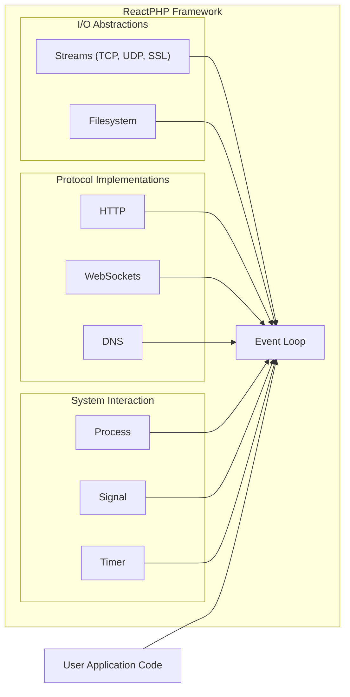
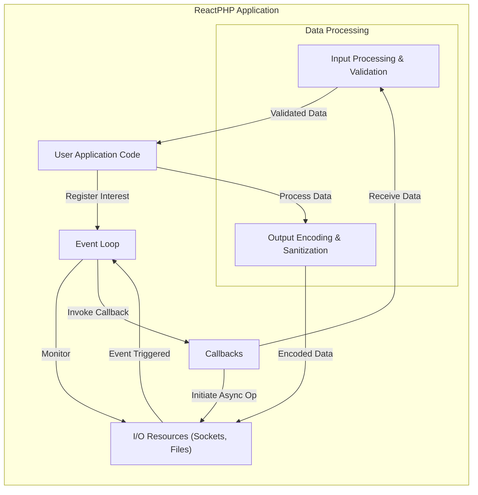

# Project Design Document: ReactPHP (Improved)

**Version:** 1.1
**Date:** October 26, 2023
**Author:** AI Software Architect

## 1. Introduction

This document provides an enhanced architectural design of the ReactPHP project, an event-driven, non-blocking I/O framework for PHP. This improved version offers greater detail and explicitly considers security aspects relevant for threat modeling. It serves as a comprehensive foundation for understanding the system's structure, components, and interactions, specifically tailored for security analysis.

## 2. Goals

The primary goals of this improved design document are to:

*   Provide a more detailed and nuanced articulation of the ReactPHP framework's architecture.
*   Clearly identify the key components and their specific responsibilities, including potential security implications.
*   Describe the flow of data and control within the framework with a focus on potential attack vectors.
*   Offer a robust and comprehensive overview specifically for security analysis and threat modeling.
*   Serve as an enhanced reference for developers, security analysts, and stakeholders.

## 3. Architectural Overview

ReactPHP's architecture is centered around an event-driven, non-blocking I/O model, enabling high concurrency within a single-threaded environment. The **Event Loop** remains the core, orchestrating the framework's operations by monitoring registered resources and dispatching events.

**Key Architectural Principles (with Security Considerations):**

*   **Event-Driven:** The framework's reactive nature means security measures must be in place to handle potentially malicious events or event sequences.
*   **Non-Blocking I/O:** While efficient, improper handling of asynchronous operations can lead to race conditions or resource leaks, posing security risks.
*   **Single-Threaded:**  While simplifying concurrency, a single point of failure in the event loop can impact the entire application's availability.
*   **Component-Based:**  Security vulnerabilities in one component could potentially affect other parts of the framework. Clear boundaries and secure inter-component communication are essential.

## 4. Component Description (with Security Focus)

This section details the major components of the ReactPHP framework, highlighting potential security considerations for each.

### 4.1. Core

*   **Event Loop (`React\EventLoop\LoopInterface`):**  The central point of control. Security considerations include preventing event loop starvation (DoS) and ensuring the integrity of event dispatching. Different implementations (e.g., `StreamSelectLoop`, `ExtEventLoop`, `LibEvLoop`) might have varying security characteristics.
*   **Promise (`React\Promise\PromiseInterface`):**  Improper handling of promise rejections or unhandled promises could lead to unexpected application states or information leaks.
*   **Deferred (`React\Promise\Deferred`):**  Care must be taken to prevent unauthorized resolution or rejection of deferred promises.
*   **Stream (`React\Stream\ReadableStreamInterface`, `React\Stream\WritableStreamInterface`, `React\Stream\DuplexStreamInterface`):**  Crucial for handling data. Security concerns include preventing buffer overflows, ensuring proper encoding/decoding, and validating data received from streams.

### 4.2. Networking

*   **TCP (`React\Socket\TcpServer`, `React\Socket\ConnectionInterface`):**  Vulnerable to typical TCP attacks (e.g., SYN floods). Applications must implement appropriate connection handling and resource limits.
*   **UDP (`React\Datagram\Socket`):**  Susceptible to spoofing and amplification attacks. Input validation is paramount.
*   **Secure Sockets Layer/Transport Layer Security (SSL/TLS) (`React\Socket\SecureServer`, `React\Socket\SecureConnector`):**  Essential for secure communication. Proper certificate management, cipher suite selection, and handling of TLS handshake errors are critical. Misconfiguration can lead to vulnerabilities.
*   **HTTP (`React\Http\Server`, `React\Http\Client`):**  Subject to standard HTTP vulnerabilities:
    *   **Server Request/Response Handling:**  Risk of injection attacks (e.g., header injection, CRLF injection), cross-site scripting (XSS) through reflected input in responses.
    *   **Client Request/Response Handling:**  Vulnerable to man-in-the-middle attacks if not using HTTPS, and potential issues with handling untrusted server responses.
    *   **Headers and Body Handling:**  Improper parsing or sanitization can lead to vulnerabilities.
*   **WebSockets (`React\Socket\ConnectionInterface` with specific protocols):**  Requires careful handling of the WebSocket handshake and message framing to prevent attacks. Vulnerable to similar issues as HTTP if not implemented securely.

### 4.3. Process Management

*   **Process (`React\ChildProcess\Process`):**  High risk of command injection if user-provided data is used to construct commands. Input sanitization and using parameterized commands are crucial. Consider the principle of least privilege for spawned processes.
*   **Signals (`React\EventLoop\LoopInterface::addSignal()`):**  While useful, improper signal handling could be exploited to terminate or disrupt the application.

### 4.4. Asynchronous DNS

*   **Resolver (`React\Dns\Resolver\ResolverInterface`):**  Susceptible to DNS spoofing attacks. Validating DNS responses and potentially using DNSSEC can mitigate risks.

### 4.5. Timers

*   **Timer (`React\EventLoop\LoopInterface::addTimer()`, `React\EventLoop\LoopInterface::addPeriodicTimer()`):**  While seemingly benign, improper use or manipulation of timers could lead to unexpected application behavior or denial of service.

### 4.6. Filesystem

*   **Async Filesystem Operations (`React\Filesystem\Filesystem`):**  Vulnerable to path traversal attacks if user input is used to construct file paths. Ensure proper path sanitization and access controls.

## 5. Data Flow (with Security Implications)

This section details the typical data flow, highlighting potential points where security vulnerabilities could be introduced or exploited.

**Detailed Data Flow with Security Focus (HTTP Request Example):**

1. **Client Request:** An external client sends an HTTP request. This is the initial point of untrusted input.
2. **TCP Connection:** The `TcpServer` accepts the connection. Potential for SYN flood attacks at this stage.
3. **Event Loop Notification:** The Event Loop is notified of the new connection.
4. **Connection Handling:** A `ConnectionInterface` is created. Ensure proper resource allocation to prevent connection exhaustion.
5. **Data Arrival:** Data arrives on the connection. This raw data is untrusted and needs validation.
6. **HTTP Parsing:** The `Http\Server` parses the incoming data. Vulnerabilities in the parser could be exploited.
7. **Input Processing & Validation:**  Crucial step. The application must validate all parts of the request (headers, body, parameters) to prevent injection attacks.
8. **Application Logic:** The validated data is processed by the user application code.
9. **Output Encoding & Sanitization:** Before sending a response, data must be properly encoded (e.g., HTML escaping) to prevent XSS.
10. **Response Transmission:** The `ConnectionInterface` sends the response. Ensure secure headers are set (e.g., Content-Security-Policy).

## 6. Security Considerations (Detailed)

This section expands on the high-level security considerations, providing more specific guidance.

*   **Input Validation:** Implement strict input validation at all boundaries. Use whitelisting where possible. Sanitize data before use. Be wary of canonicalization issues.
*   **Resource Management:**  Set appropriate timeouts for connections and operations. Implement rate limiting to prevent abuse. Limit resource consumption (memory, file handles).
*   **Error Handling:**  Avoid exposing sensitive information in error messages. Log errors securely. Implement proper error recovery mechanisms.
*   **Secure Communication:** Enforce HTTPS. Use strong TLS configurations. Regularly update SSL certificates. Be mindful of mixed content issues.
*   **Dependency Management:**  Use a dependency management tool (e.g., Composer) and regularly update dependencies to patch vulnerabilities. Be aware of supply chain attacks.
*   **Process Isolation:** When using `React\ChildProcess\Process`, sanitize all input passed to the command. Use parameterized commands or avoid shell execution where possible. Consider using containers for better isolation.
*   **Denial of Service (DoS) Prevention:** Implement rate limiting, connection limits, and input validation. Protect against resource exhaustion attacks. Consider using a reverse proxy with DoS protection.
*   **Code Injection:**  Avoid `eval()` and similar dynamic code execution. Be cautious with unserialize() if handling external data.
*   **Cross-Site Scripting (XSS):**  Properly encode output based on the context (HTML escaping, JavaScript escaping, URL encoding). Use Content-Security-Policy (CSP) headers.
*   **Cross-Site Request Forgery (CSRF):** Implement anti-CSRF tokens for state-changing operations. Use proper session management.
*   **Session Management:**  Use secure session IDs. Implement proper session timeouts and invalidation. Protect session cookies (HttpOnly, Secure flags).
*   **Authentication and Authorization:** Implement robust authentication mechanisms. Enforce the principle of least privilege for authorization.

## 7. Deployment Considerations (with Security Implications)

The deployment environment significantly impacts the security posture of a ReactPHP application.

*   **Standalone Process:** Requires careful configuration of the operating system and firewall. Exposing the ReactPHP process directly to the internet increases the attack surface. Process managers should be configured securely.
*   **Containerization (Docker):** Provides isolation but requires secure container image management and configuration. Be mindful of container vulnerabilities and network configurations. Use minimal base images.
*   **Integration with Web Servers (using reverse proxies like Nginx or Apache):**  Recommended for internet-facing applications. The reverse proxy can handle TLS termination, request filtering, and DoS protection, reducing the attack surface of the ReactPHP application. Secure configuration of the reverse proxy is crucial. Ensure proper communication between the proxy and the ReactPHP application (e.g., using a private network).

## 8. Future Considerations (Security Focused)

*   **Formal Security Audits:**  Regular professional security audits and penetration testing are essential to identify vulnerabilities.
*   **Security Best Practices Documentation:**  Develop comprehensive and readily accessible documentation on secure coding practices for ReactPHP.
*   **Integration with Security Tools:**  Explore and integrate with static analysis security testing (SAST) and dynamic analysis security testing (DAST) tools.
*   **Security-Focused Components/Middleware:**  Consider developing or integrating middleware components specifically designed for security features (e.g., rate limiting, input validation).
*   **Community Security Engagement:**  Foster a community that actively contributes to identifying and addressing security vulnerabilities. Implement a clear vulnerability disclosure process.

This improved design document provides a more detailed and security-focused understanding of the ReactPHP project. It serves as a crucial input for thorough threat modeling, enabling the identification and mitigation of potential security risks.