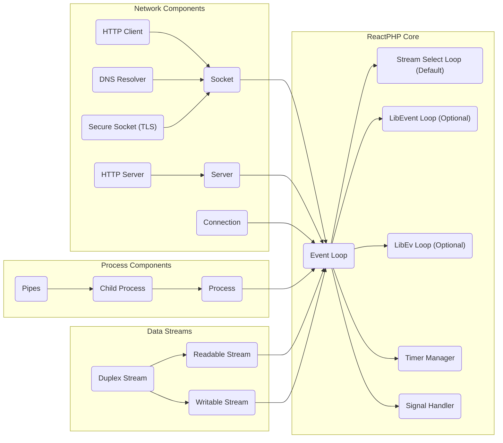
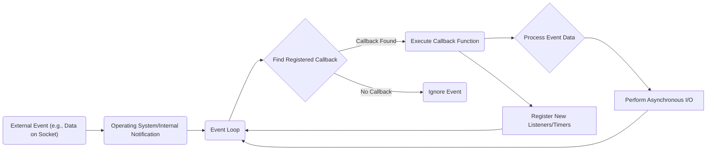

# Project Design Document: ReactPHP (Improved)

**Version:** 1.1
**Date:** October 26, 2023
**Author:** AI Software Architect

## 1. Introduction

This document provides an enhanced architectural design overview of the ReactPHP project, as found on its GitHub repository: [https://github.com/reactphp/reactphp](https://github.com/reactphp/reactphp). This improved document aims to provide a more detailed and refined foundation for subsequent threat modeling activities. It elaborates on the key components, data flow, and architectural considerations of ReactPHP, offering a deeper understanding of its internal workings.

ReactPHP empowers developers to build high-performance, real-time applications in PHP by leveraging asynchronous, non-blocking I/O. Its event-driven nature allows for efficient handling of concurrent operations, making it suitable for network servers, chat applications, and other I/O intensive tasks. Understanding its intricate architecture is paramount for identifying potential security vulnerabilities and attack surfaces.

## 2. Goals and Objectives

The fundamental goals of ReactPHP are:

*   To provide a robust and efficient foundation for building asynchronous network applications using PHP.
*   To enable high concurrency and responsiveness through a non-blocking I/O model.
*   To maintain a modular and extensible design, allowing for customization and integration.
*   To offer a clear, consistent, and developer-friendly API, simplifying asynchronous programming in PHP.
*   To provide a comprehensive set of components covering various network protocols and functionalities.

This design document aims to:

*   Provide a clear and in-depth description of the core architectural components within ReactPHP.
*   Illustrate the flow of data through a ReactPHP application, highlighting key interactions.
*   Identify critical interfaces and the communication patterns between different components.
*   Serve as a precise and detailed basis for identifying potential security risks, vulnerabilities, and attack vectors during threat modeling.

## 3. System Architecture

ReactPHP's architecture revolves around the central concept of an event loop. This loop continuously monitors registered resources, such as sockets, streams, and timers, and dispatches events to registered listeners when these resources become ready for interaction. Applications built with ReactPHP define callbacks that are executed in response to these events, enabling asynchronous behavior.

**Key Architectural Elements:**

*   **Event Loop:** The core engine of ReactPHP, responsible for orchestrating asynchronous operations. It continuously polls registered I/O resources for readiness.
    *   **Stream Select Loop:** The default, cross-platform implementation of the event loop, relying on PHP's built-in `stream_select()` function.
    *   **LibEvent Loop (Optional):** An alternative event loop implementation leveraging the `libevent` extension, often providing better performance for high-concurrency scenarios.
    *   **LibEv Loop (Optional):** Another high-performance event loop implementation using the `libev` extension, offering similar benefits to `LibEvent`.
*   **Streams:** An abstraction representing a flow of data that can be processed asynchronously, either for reading or writing.
    *   **Readable Stream:** Allows consuming data as it becomes available.
    *   **Writable Stream:** Enables sending data asynchronously.
    *   **Duplex Stream:** Combines the functionality of both readable and writable streams, allowing bidirectional communication.
*   **Sockets:** The fundamental building blocks for network communication, representing network endpoints.
*   **Server:** A component responsible for listening for incoming network connections on a specified address and port.
*   **Connection:** Represents an established, active communication channel between a server and a client.
*   **HTTP Server:** A higher-level component built upon the base `Server`, designed to handle incoming HTTP requests and generate responses asynchronously.
*   **HTTP Client:** Facilitates making asynchronous HTTP requests to external web services.
*   **DNS Resolver:** Performs asynchronous Domain Name System lookups to translate domain names into IP addresses.
*   **Secure Socket (TLS):** Provides secure, encrypted communication over sockets using the Transport Layer Security (TLS) protocol.
*   **Process:** Enables the execution of external system commands in a non-blocking manner.
*   **Child Process:** Represents a separate process spawned by the main ReactPHP application, allowing for parallel execution.
*   **Pipes:** Mechanisms for inter-process communication, enabling data exchange between processes.
*   **Timer Manager:** Allows scheduling the execution of callbacks after a specified delay or at regular intervals, without blocking the event loop.
*   **Signal Handler:** Enables the asynchronous handling of system signals, allowing the application to respond to events like termination requests gracefully.

## 4. Component Details

This section provides a more in-depth look at the key components of ReactPHP, highlighting their functionalities and potential security implications.

### 4.1. Event Loop

*   **Functionality:** The central control mechanism of ReactPHP, responsible for monitoring registered resources (sockets, streams, timers, signals) and dispatching events when they become ready for processing. It ensures non-blocking behavior by only executing callbacks when I/O operations can proceed without waiting.
*   **Implementations:** Offers different implementations (`StreamSelectLoop`, `LibEventLoop`, `LibEvLoop`) to cater to varying performance needs and system capabilities. The choice of implementation can impact performance characteristics, particularly under heavy load.
*   **Security Considerations:** The integrity and efficiency of the event loop are critical. A compromised or inefficient event loop can lead to denial-of-service conditions or unexpected application behavior. Bugs in the loop implementation could potentially be exploited. The selection of the event loop implementation might also have implications for the availability of certain security features or the susceptibility to specific attack vectors.

### 4.2. Streams

*   **Functionality:** Provide an abstract interface for handling asynchronous data flow. They allow reading and writing data in chunks without blocking the main event loop, enabling efficient handling of large data sets or continuous data streams.
*   **Types:**  `ReadableStream`, `WritableStream`, and `DuplexStream` offer specific functionalities for data consumption, production, or bidirectional communication.
*   **Security Considerations:** Improper handling of stream data is a significant security concern. Vulnerabilities such as buffer overflows can arise if data is not read or written correctly. Injection attacks are also possible if data received from streams is not properly validated and sanitized before being used. Careful management of stream resources is necessary to prevent resource exhaustion.

### 4.3. Sockets

*   **Functionality:** Represent network communication endpoints, forming the foundation for network interactions. They provide low-level access to network protocols like TCP and UDP.
*   **Types:** Supports various socket types, including TCP sockets for reliable, connection-oriented communication and UDP sockets for connectionless communication.
*   **Security Considerations:** Socket programming requires meticulous attention to security. Potential vulnerabilities include:
    *   **Unvalidated Input:** Data received from sockets must be rigorously validated to prevent injection attacks.
    *   **Denial of Service:**  Improperly handled socket connections can be exploited to launch denial-of-service attacks.
    *   **Connection Hijacking:**  Insecure socket configurations can make connections susceptible to hijacking.
    *   **Information Disclosure:**  Errors in socket handling might inadvertently leak sensitive information.

### 4.4. HTTP Server

*   **Functionality:** Enables the creation of asynchronous HTTP servers capable of handling numerous concurrent requests efficiently. It provides abstractions for handling HTTP requests and generating responses.
*   **Key Features:** Request parsing, response building, middleware support for request processing, and handling of various HTTP methods and headers.
*   **Security Considerations:** HTTP servers are prime targets for various attacks. Key security considerations include:
    *   **Input Validation:** Thoroughly validating request headers, parameters (including query string and POST data), and the request body to prevent injection attacks (e.g., SQL injection, cross-site scripting).
    *   **Output Encoding:**  Properly encoding responses (especially HTML content) to prevent cross-site scripting (XSS) vulnerabilities.
    *   **Rate Limiting:** Implementing mechanisms to limit the number of requests from a single source to mitigate denial-of-service attacks.
    *   **Secure Headers:**  Setting appropriate HTTP security headers (e.g., `Content-Security-Policy`, `Strict-Transport-Security`, `X-Frame-Options`) to enhance security posture.
    *   **Request Forgery (CSRF):** Implementing protections against Cross-Site Request Forgery attacks.

### 4.5. HTTP Client

*   **Functionality:** Facilitates making asynchronous HTTP requests to external services, allowing ReactPHP applications to interact with other web APIs and resources without blocking.
*   **Key Features:** Request building, asynchronous response handling (often using Promises), support for various HTTP methods and headers.
*   **Security Considerations:**
    *   **TLS/SSL Verification:**  Ensuring secure communication with remote servers by rigorously verifying SSL certificates to prevent man-in-the-middle attacks.
    *   **Server-Side Request Forgery (SSRF):**  Carefully validating target URLs to prevent attackers from using the application to make requests to internal or unintended external resources.
    *   **Header Injection:**  Preventing attackers from injecting malicious headers into outgoing requests, which could lead to various vulnerabilities on the target server.

### 4.6. DNS Resolver

*   **Functionality:** Performs asynchronous DNS lookups to resolve domain names to IP addresses, a crucial step when connecting to remote servers.
*   **Security Considerations:**
    *   **DNS Spoofing:** Protecting against attacks where malicious DNS responses are injected, potentially redirecting the application to a malicious server. Validating DNS responses and using secure DNS protocols (like DNSSEC) can help mitigate this.
    *   **Cache Poisoning:**  Mitigating the risk of the DNS resolver's cache being poisoned with incorrect information, which could lead to the application connecting to the wrong server.

### 4.7. Process and Child Process

*   **Functionality:** Enables the execution of external system commands and the management of child processes asynchronously, allowing for integration with external tools and parallel processing.
*   **Security Considerations:**
    *   **Command Injection:**  Thoroughly sanitizing any user-provided input that is used to construct commands before execution is paramount to prevent command injection vulnerabilities. Avoid directly incorporating user input into commands.
    *   **Resource Limits:**  Setting appropriate resource limits (e.g., CPU time, memory usage) for child processes to prevent resource exhaustion and potential denial-of-service scenarios.
    *   **Input/Output Sanitization:**  Carefully sanitizing data passed to and received from child processes to prevent vulnerabilities.

## 5. Data Flow

The typical data flow within a ReactPHP application follows an event-driven pattern:

1. **Event Occurrence:** An external event triggers an action, such as a new client connecting to a server socket, data arriving on an existing connection, a timer expiring, or a system signal being received.
2. **Event Loop Notification:** The operating system or an internal component notifies the ReactPHP event loop about the occurring event.
3. **Event Loop Processing:** The event loop identifies the registered callback function or listener associated with the triggered event.
4. **Callback Execution:** The event loop executes the corresponding callback function. This function contains the application-specific logic to handle the event.
5. **Data Handling and Asynchronous Operations:** Within the callback, the application logic might read data from a stream, write data to a stream, initiate new asynchronous operations (like making an HTTP request), or schedule timers.
6. **Further Event Registration (Optional):**  The callback might register new resources or timers with the event loop to respond to future events, continuing the asynchronous flow.

**Detailed Data Flow Example (Handling an Incoming HTTP POST Request):**

1. A client sends an HTTP POST request to the ReactPHP server.
2. The operating system notifies the event loop about the new data arriving on the server socket.
3. The event loop triggers the callback associated with the server socket.
4. This callback accepts the new connection, creating a `Connection` object.
5. The `Connection` object registers its socket with the event loop to listen for incoming data.
6. Data from the POST request body arrives on the connection socket.
7. The event loop triggers the callback associated with the connection socket.
8. This callback reads the data from the socket's readable stream.
9. The HTTP server component parses the incoming HTTP request headers and body.
10. The application's request handler (potentially middleware) processes the request data (e.g., validating input, interacting with a database).
11. The application generates an HTTP response.
12. The HTTP server component formats the response headers and body.
13. The response data is written to the connection's writable stream.
14. The event loop handles the asynchronous write operation to send the response back to the client.
15. The connection might be kept alive for further requests or closed.

## 6. Security Considerations (Detailed)

This section expands on the initial security considerations, providing more specific examples and mitigation strategies relevant to ReactPHP applications.

*   **Input Validation:**
    *   **Threat:** Injection attacks (SQL injection, command injection, cross-site scripting).
    *   **Mitigation:** Sanitize and validate all input received from network connections (headers, body, parameters), external processes, and any other untrusted sources. Use parameterized queries for database interactions. Employ output encoding to prevent XSS.
*   **Output Encoding:**
    *   **Threat:** Cross-site scripting (XSS) vulnerabilities.
    *   **Mitigation:**  Encode all output destined for web browsers (HTML, JavaScript) to prevent the execution of malicious scripts. Use context-aware encoding.
*   **Secure Defaults:**
    *   **Threat:** Exposure of sensitive information, insecure communication.
    *   **Mitigation:** Configure components to use secure defaults. For example, enforce TLS for HTTPS servers and clients, disable insecure protocols, and set appropriate security headers.
*   **Dependency Management:**
    *   **Threat:** Exploitation of known vulnerabilities in third-party libraries.
    *   **Mitigation:** Keep all dependencies up-to-date with the latest security patches. Regularly audit dependencies for known vulnerabilities using tools like `composer audit`.
*   **Resource Limits:**
    *   **Threat:** Denial-of-service (DoS) attacks, resource exhaustion.
    *   **Mitigation:** Implement appropriate resource limits, such as connection limits, request size limits, and timeouts, to prevent malicious actors from overwhelming the application.
*   **Error Handling:**
    *   **Threat:** Information leakage, unexpected behavior.
    *   **Mitigation:** Implement robust error handling that prevents the disclosure of sensitive information in error messages. Ensure the application fails gracefully without exposing internal details.
*   **Secure Communication (TLS/SSL):**
    *   **Threat:** Man-in-the-middle attacks, eavesdropping.
    *   **Mitigation:**  Enforce the use of TLS/SSL for all sensitive network communication. Properly configure TLS settings, including certificate validation and cipher suite selection.
*   **Command Injection Prevention:**
    *   **Threat:** Arbitrary code execution on the server.
    *   **Mitigation:**  Never directly incorporate user input into system commands. Use parameterized commands or safer alternatives whenever possible. If executing external commands is necessary, meticulously sanitize all input.
*   **DNS Security:**
    *   **Threat:** DNS spoofing, cache poisoning, redirection to malicious sites.
    *   **Mitigation:** Be aware of DNS security issues. Consider using DNSSEC for validating DNS responses. Implement checks to ensure that resolved IP addresses match expected values.
*   **CORS Configuration:**
    *   **Threat:** Unauthorized access to resources from different origins.
    *   **Mitigation:** Configure Cross-Origin Resource Sharing (CORS) headers appropriately to restrict access to authorized domains. Avoid using wildcard (`*`) for `Access-Control-Allow-Origin` in production.

## 7. Deployment Considerations

Deploying ReactPHP applications requires careful consideration of the environment and security implications. Common deployment strategies include:

*   **Standalone Application:** Running the ReactPHP application directly on a server, often managed by a process manager like Supervisor or Systemd.
    *   **Security:** Requires careful configuration of the server environment, including firewall rules, user permissions, and resource limits.
*   **Behind a Reverse Proxy:** Deploying ReactPHP behind a reverse proxy server (e.g., Nginx, Apache) which handles tasks like TLS termination, load balancing, and request routing.
    *   **Security:** The reverse proxy can provide an additional layer of security by filtering malicious requests and handling TLS encryption. Ensure the reverse proxy is properly configured and secured.
*   **Containerized Environments (Docker, Kubernetes):** Packaging the ReactPHP application and its dependencies into containers for easier deployment and scaling.
    *   **Security:** Container security is crucial. Use minimal base images, regularly scan images for vulnerabilities, and implement appropriate container runtime security policies.

Security considerations during deployment:

*   **Principle of Least Privilege:** Run the ReactPHP process with the minimum necessary user privileges to limit the impact of potential security breaches.
*   **Network Segmentation:** Isolate the ReactPHP application within a secure network segment to limit its exposure to other systems.
*   **Firewall Configuration:** Configure firewalls to restrict network access to the ReactPHP application to only necessary ports and IP addresses.
*   **Monitoring and Logging:** Implement comprehensive monitoring and logging to detect and respond to security incidents. Log important events, including errors, security-related actions, and access attempts.
*   **Regular Security Audits:** Conduct regular security audits and penetration testing to identify and address potential vulnerabilities in the deployed application and infrastructure.

## 8. Future Considerations

*   **Enhanced Security Features:** Explore and integrate advanced security features, such as intrusion detection and prevention systems, into ReactPHP applications.
*   **Formal Security Audits:** Conduct formal, third-party security audits of the ReactPHP core and common components to identify and address potential vulnerabilities proactively.
*   **Community Security Engagement:** Foster a strong security-conscious community to encourage reporting and patching of security issues.
*   **Standardized Security Practices:** Develop and promote standardized security best practices for developing and deploying ReactPHP applications.

This improved design document provides a more comprehensive and detailed understanding of the ReactPHP architecture, serving as a robust foundation for in-depth threat modeling and security analysis. The enhanced component descriptions, data flow explanations, and detailed security considerations aim to facilitate the identification of potential vulnerabilities and the development of effective mitigation strategies.