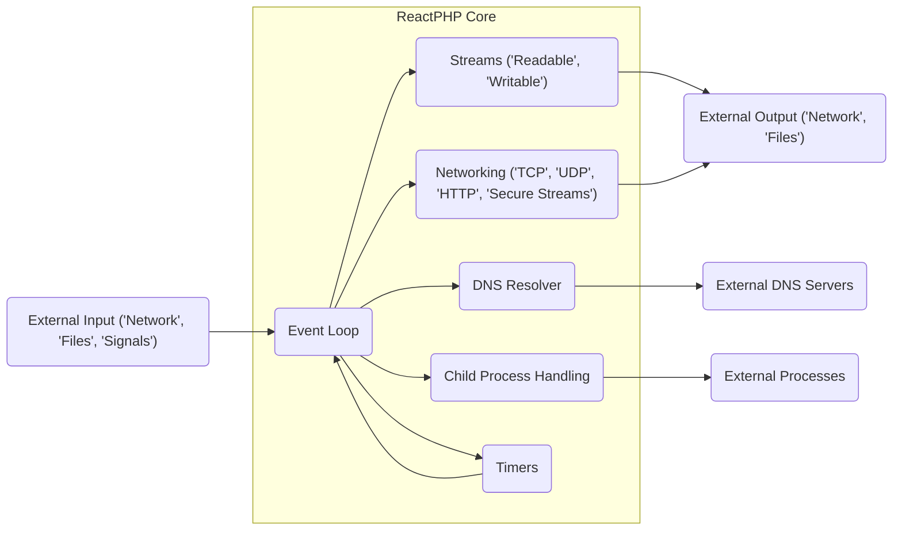
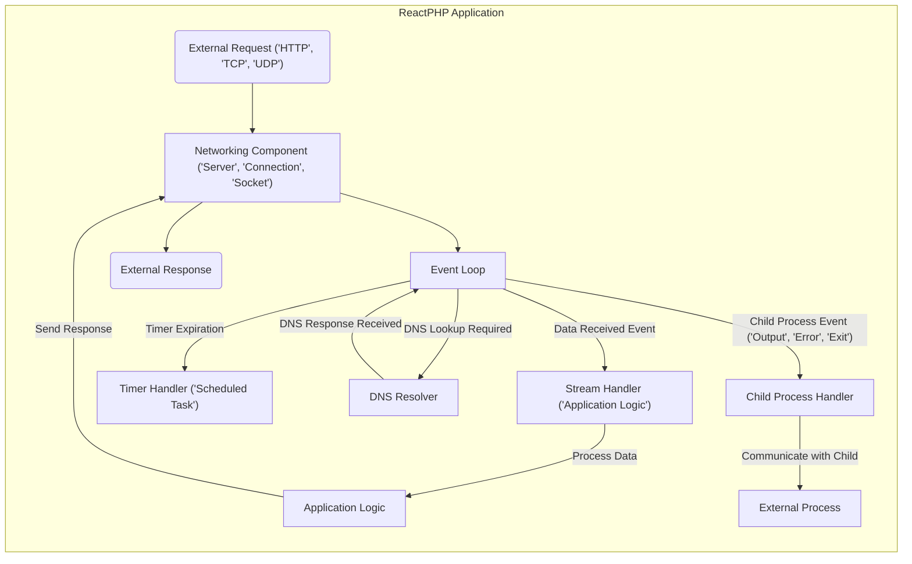

# Project Design Document: ReactPHP

**Version:** 1.1
**Date:** October 26, 2023
**Author:** AI Software Architect

## 1. Introduction

ReactPHP is a foundational, event-driven, non-blocking I/O library for PHP. It empowers developers to build high-performance network applications, real-time services, and efficient asynchronous systems. This document provides a comprehensive architectural blueprint of ReactPHP, detailing its core components, interactions, and data flow. This detailed design serves as a crucial artifact for subsequent threat modeling exercises, enabling a thorough security assessment.

## 2. Goals and Objectives

The core objectives of ReactPHP are to:

*   **Enable High-Performance Networking:** Facilitate the creation of applications capable of handling a large number of concurrent connections efficiently.
*   **Provide Asynchronous I/O:** Offer a non-blocking programming model, maximizing resource utilization and responsiveness by avoiding thread-based concurrency.
*   **Offer Modular Components:** Provide a set of well-defined, reusable components for common networking tasks, promoting code clarity and maintainability.
*   **Maintain a Simple and Consistent API:** Ensure a user-friendly and predictable API for developers.
*   **Cultivate a Thriving Community:** Encourage collaboration and contribution to the project's growth and evolution.

## 3. System Architecture

ReactPHP's architecture is centered around an event loop, which acts as the central orchestrator for managing and dispatching events. This event-driven, non-blocking approach is fundamental to its performance and efficiency.

**Key Architectural Components:**

*   **Event Loop (`React\EventLoop\LoopInterface`):** The heart of ReactPHP, responsible for monitoring registered resources and dispatching events when activity occurs. It continuously polls for I/O events, timer expirations, and signals.
*   **Streams (`React\Stream\ReadableStreamInterface`, `React\Stream\WritableStreamInterface`):** An abstraction for handling continuous flows of data. Streams are non-blocking and emit events to notify consumers of data availability, completion, or errors.
*   **Networking (`React\Socket\*`, `React\Http\*`, `React\Datagram\*`):** Provides a suite of components for building network applications, supporting various protocols and security measures.
*   **DNS Resolver (`React\Dns\Resolver\ResolverInterface`):** Enables asynchronous resolution of domain names to IP addresses, preventing blocking operations during network lookups.
*   **Child Process Handling (`React\ChildProcess\Process`):** Facilitates the management and interaction with external processes in a non-blocking manner, allowing for concurrent execution and communication.
*   **Timers (`React\EventLoop\TimerInterface`):** Allows scheduling the execution of functions after a specified delay or at recurring intervals, enabling time-based logic within the application.

## 4. Component Breakdown

This section provides a more granular view of ReactPHP's key components and their functionalities.

*   **Event Loop (`React\EventLoop\LoopInterface`):**
    *   Manages event listeners for file descriptors (sockets, pipes), timers, and signals.
    *   Provides methods to `addReadStream()`, `addWriteStream()`, `removeReadStream()`, `removeWriteStream()` for managing stream activity.
    *   Handles timer registration and execution via `addTimer()` and `addPeriodicTimer()`.
    *   Dispatches signal handlers using `addSignal()` and `removeSignal()`.
    *   Implementations like `StreamSelectLoop` rely on PHP's `stream_select()` function, while `ExtEventLoop` leverages the `ext-event` extension for better performance.

*   **Streams (`React\Stream\ReadableStreamInterface`, `React\Stream\WritableStreamInterface`):**
    *   **Readable Streams:** Emit `data` events when new data is available, an `end` event when the stream is closed for reading, and an `error` event for errors. Implement `pause()` and `resume()` for flow control.
    *   **Writable Streams:** Provide `write()` for sending data, `end()` to signal the end of the data, and `close()` to close the stream. Emit `drain` when the internal buffer is below a certain threshold.
    *   **Pipes:**  The `pipe()` method allows connecting a readable stream to a writable stream, automatically forwarding data.

*   **Networking:**
    *   **TCP Server (`React\Socket\Server`):** Listens for incoming TCP connections on a specified address. Emits a `connection` event with a `ConnectionInterface` instance for each new client.
    *   **TCP Connection (`React\Socket\ConnectionInterface`):** Represents an individual TCP connection. Implements both `ReadableStreamInterface` and `WritableStreamInterface`. Provides methods like `getRemoteAddress()` and `getLocalAddress()`. Emits `close` when the connection is closed.
    *   **UDP Socket (`React\Datagram\Socket`):**  Allows sending and receiving UDP packets. Emits a `message` event with the received data and sender address. Provides `send()` for sending data.
    *   **HTTP Server (`React\Http\Server`):** Builds upon TCP server to handle HTTP requests. Emits a `request` event with `Request` and `Response` objects. Supports middleware for request processing.
    *   **HTTP Client (`React\Http\Client\Client`):**  Facilitates making asynchronous HTTP requests. Returns a `Promise` that resolves with the `Response`.
    *   **Secure Server (`React\Socket\SecureServer`):** Wraps a TCP server, adding TLS/SSL encryption. Requires an SSL context. Emits `connection` with a `SecureConnection` instance.
    *   **Secure Connection (`React\Socket\SecureConnection`):** Represents a secure TCP connection. Provides methods for renegotiating encryption.

*   **DNS Resolver (`React\Dns\Resolver\ResolverInterface`):**
    *   Provides a `resolve()` method that returns a `Promise` resolving with the IP address.
    *   Supports resolving multiple hostnames at once with `resolveAll()`.
    *   Allows configuring custom DNS servers.

*   **Child Process (`React\ChildProcess\Process`):**
    *   Starts a new process with specified command, arguments, and environment variables.
    *   Provides access to the child process's standard input (`stdin`), standard output (`stdout`), and standard error (`stderr`) as streams.
    *   Emits `exit` event with the exit code and termination signal.
    *   Provides methods to `terminate()` and `signal()` the child process.

*   **Timers (`React\EventLoop\TimerInterface`):**
    *   `addTimer()` executes a callback once after a specified delay.
    *   `addPeriodicTimer()` executes a callback repeatedly at a fixed interval.
    *   `cancelTimer()` removes a registered timer.

## 5. Data Flow

Data flow in a ReactPHP application is event-driven. The event loop monitors resources, and when an event occurs (e.g., data arrives on a socket, a timer expires), the associated callback is executed.

**Illustrative Data Flow (Incoming TCP Connection):**

1. An external client initiates a TCP connection to the server.
2. The operating system notifies the ReactPHP event loop about the new connection request on the listening socket.
3. The event loop triggers the callback associated with the listening socket.
4. The `React\Socket\Server` accepts the connection and creates a new `React\Socket\ConnectionInterface` instance.
5. The `connection` event is emitted by the server, providing the new connection object to the application.
6. The application can then register listeners on the connection object's readable stream to receive data.
7. When data arrives from the client, the event loop triggers the `data` event on the connection's readable stream.
8. The application's data handler processes the received data.
9. To send a response, the application writes data to the connection object's writable stream.
10. The event loop manages the asynchronous writing of data to the socket.

## 6. External Interfaces

ReactPHP interacts with the external environment through the following interfaces:

*   **Network Interfaces:**  Utilizes network sockets for TCP and UDP communication.
*   **File System Interface:**  Interacts with the file system for reading and writing files as streams.
*   **Operating System Signals:**  Registers handlers for OS signals like `SIGINT`, `SIGTERM`, etc.
*   **External DNS Servers:**  Communicates with external DNS servers to resolve hostnames.
*   **External Processes:**  Spawns and communicates with external processes via standard input, output, and error streams.
*   **PHP Extensions:**  Relies on PHP extensions like `ext-sockets`, `ext-stream`, and optionally `ext-event` for underlying I/O operations.

## 7. Security Considerations (Focus on Threat Modeling)

This section highlights potential security vulnerabilities and attack vectors, serving as a starting point for threat modeling.

*   **Input Validation Vulnerabilities:**
    *   **Attack Surface:** Data received from network connections (HTTP requests, TCP payloads), file streams, and child process outputs.
    *   **Threats:** Injection attacks (SQL, command, code), cross-site scripting (XSS).
*   **Denial of Service (DoS) Vulnerabilities:**
    *   **Attack Surface:** Network connections, resource consumption (memory, file descriptors).
    *   **Threats:** SYN floods, slowloris attacks, resource exhaustion through excessive connection attempts or large data streams.
*   **Man-in-the-Middle (MITM) Attacks:**
    *   **Attack Surface:** Network communication, especially when using non-secure protocols.
    *   **Threats:** Eavesdropping, data manipulation. Mitigation involves proper TLS/SSL implementation and certificate validation.
*   **Resource Exhaustion:**
    *   **Attack Surface:**  Unbounded resource allocation (e.g., memory for buffering data, number of open connections).
    *   **Threats:**  Application crashes, service unavailability. Implement resource limits and proper backpressure mechanisms.
*   **Code Injection:**
    *   **Attack Surface:**  Use of dynamic code execution functions (e.g., `eval()`) with untrusted input.
    *   **Threats:**  Arbitrary code execution on the server. Avoid dynamic code execution with external input.
*   **Dependency Vulnerabilities:**
    *   **Attack Surface:**  Third-party libraries used by ReactPHP or applications built on it.
    *   **Threats:**  Exploitation of known vulnerabilities in dependencies. Regularly update dependencies.
*   **Insecure Child Process Handling:**
    *   **Attack Surface:**  Interaction with external processes.
    *   **Threats:**  Command injection if constructing commands with untrusted input, privilege escalation if running child processes with elevated privileges. Sanitize input and follow the principle of least privilege.
*   **DNS Spoofing:**
    *   **Attack Surface:**  DNS resolution process.
    *   **Threats:**  Redirection to malicious servers. Consider DNSSEC for enhanced security.
*   **Error Handling and Information Disclosure:**
    *   **Attack Surface:**  Error messages and logging.
    *   **Threats:**  Exposure of sensitive information (e.g., file paths, internal configurations). Implement proper error handling and avoid verbose error messages in production.

## 8. Deployment Considerations

Deploying ReactPHP applications requires careful consideration of their long-running nature and asynchronous behavior.

*   **Process Management:** Utilize process managers like Supervisor, systemd, or Docker to ensure the application runs reliably and restarts automatically upon failure.
*   **Load Balancing:** Employ load balancers (e.g., Nginx, HAProxy) to distribute traffic across multiple instances of the application for scalability and high availability.
*   **Reverse Proxies:**  Use reverse proxies to handle SSL termination, static content serving, and act as a single point of entry for the application.
*   **Resource Limits:** Configure appropriate resource limits (memory, CPU time, open files) at the operating system or container level to prevent resource exhaustion.
*   **Logging and Monitoring:** Implement robust logging and monitoring solutions to track application health, performance, and potential security incidents.
*   **Security Hardening:** Follow security best practices for the deployment environment, including firewall configuration and access control.

## 9. Future Considerations

Ongoing development and potential future enhancements for ReactPHP include:

*   Exploring support for more network protocols and standards (e.g., WebSockets improvements, QUIC).
*   Enhancing debugging and profiling capabilities for asynchronous code.
*   Optimizing performance and resource utilization of core components.
*   Improving documentation and providing more comprehensive examples.
*   Investigating integration with other asynchronous libraries and frameworks.

This revised design document provides a more detailed and security-focused overview of the ReactPHP project, serving as a valuable resource for development, maintenance, and, crucially, threat modeling activities.