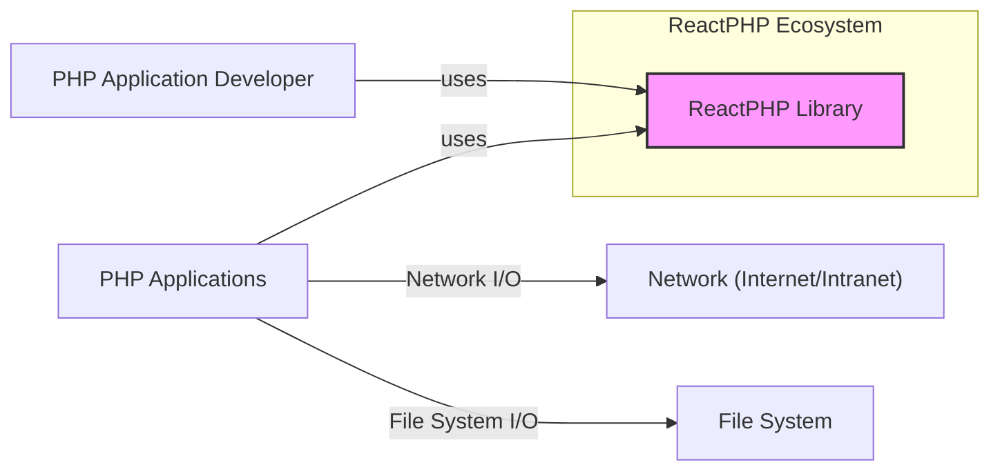
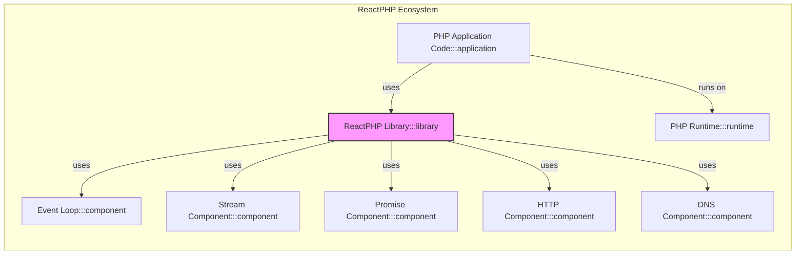
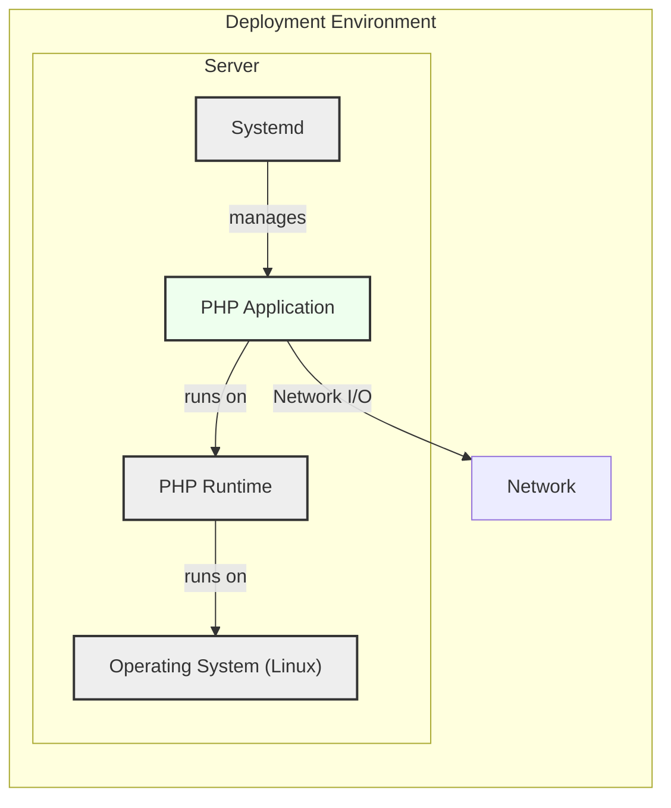

# BUSINESS POSTURE

ReactPHP is an event-driven, non-blocking I/O framework for PHP. It allows developers to build high-performance network applications and services in PHP, overcoming the traditional synchronous nature of the language for I/O operations.

- Business priorities:
  - High performance and scalability for PHP applications.
  - Enablement of real-time applications and services in PHP.
  - Efficient handling of concurrent network connections.
  - Asynchronous processing to improve application responsiveness.

- Business risks:
  - Performance bottlenecks due to inefficient use of asynchronous patterns.
  - Instability and unexpected behavior in complex asynchronous code.
  - Security vulnerabilities arising from improper handling of asynchronous operations and external inputs.
  - Dependency on the stability and security of the ReactPHP library itself.
  - Potential for denial-of-service attacks if not properly configured and secured.

# SECURITY POSTURE

- Security controls:
  - security control: Open-source project with community review (GitHub repository).
  - security control: Reliance on PHP's built-in security features and extensions.
  - security control: Use of Composer for dependency management, allowing for dependency updates and security patching.
  - security control: Documentation and examples provided to guide developers in using the library securely (project documentation).

- Accepted risks:
  - accepted risk: Potential vulnerabilities in the ReactPHP library itself, requiring timely updates.
  - accepted risk: Security vulnerabilities introduced by developers using ReactPHP incorrectly.
  - accepted risk: Risks associated with open-source dependencies used by ReactPHP.

- Recommended security controls:
  - security control: Implement automated security scanning of ReactPHP library and dependent components.
  - security control: Conduct regular security audits of applications built using ReactPHP.
  - security control: Provide secure coding guidelines and best practices for developers using ReactPHP.
  - security control: Implement rate limiting and input validation in applications using ReactPHP to mitigate denial-of-service and injection attacks.

- Security requirements:
  - Authentication: Applications built with ReactPHP may require authentication mechanisms to verify user or system identities. This should be implemented at the application level, utilizing appropriate authentication protocols and libraries.
  - Authorization: Applications must implement authorization controls to manage access to resources and functionalities based on authenticated identities. This should be designed and implemented within the application logic.
  - Input validation: All external inputs, especially network inputs, must be rigorously validated to prevent injection attacks (e.g., command injection, header injection). ReactPHP applications should employ input sanitization and validation techniques.
  - Cryptography: If applications handle sensitive data, cryptography must be used to protect data in transit and at rest. ReactPHP can be used to build applications that utilize encryption libraries and protocols provided by PHP or external services.

# DESIGN

## C4 CONTEXT

- Elements of Context Diagram:
  - - Name: ReactPHP Library
    - Type: Software System
    - Description: An event-driven, non-blocking I/O framework for PHP. Provides components for network communication, process management, and asynchronous programming.
    - Responsibilities: Provides asynchronous I/O capabilities for PHP. Manages event loop and non-blocking operations.
    - Security controls: Relies on community review and open-source security practices.

  - - Name: PHP Application Developer
    - Type: Person
    - Description: Software developers who use ReactPHP to build network applications and services in PHP.
    - Responsibilities: Develops and maintains applications using ReactPHP. Responsible for secure application design and implementation.
    - Security controls: Responsible for implementing security controls in applications built with ReactPHP.

  - - Name: PHP Applications
    - Type: Software System
    - Description: Applications built using the ReactPHP library. These applications leverage ReactPHP's asynchronous capabilities for network communication, real-time features, and improved performance.
    - Responsibilities: Provides specific functionalities to end-users or other systems. Handles business logic and data processing.
    - Security controls: Application-level security controls, including authentication, authorization, input validation, and data protection.

  - - Name: Network (Internet/Intranet)
    - Type: External System
    - Description: The network environment where PHP applications built with ReactPHP operate. This can be the public internet or a private intranet.
    - Responsibilities: Provides network connectivity for applications.
    - Security controls: Network security controls such as firewalls, intrusion detection systems, and network segmentation.

  - - Name: File System
    - Type: External System
    - Description: The file system where PHP applications built with ReactPHP store and retrieve data.
    - Responsibilities: Provides persistent storage for applications.
    - Security controls: File system permissions, access controls, and encryption.

## C4 CONTAINER

- Elements of Container Diagram:
  - - Name: ReactPHP Library
    - Type: Library
    - Description:  A PHP library providing event-driven, non-blocking I/O functionalities. It includes components for streams, promises, HTTP, DNS, and more.
    - Responsibilities: Provides core asynchronous I/O functionalities. Manages event loop, stream handling, promise resolution, and protocol implementations.
    - Security controls: Open-source code review, community contributions, and reliance on PHP runtime security.

  - - Name: PHP Runtime
    - Type: Runtime Environment
    - Description: The PHP interpreter (e.g., PHP-FPM, PHP CLI) that executes PHP applications and the ReactPHP library.
    - Responsibilities: Executes PHP code. Provides underlying system calls and resources for PHP applications and ReactPHP.
    - Security controls: PHP runtime security features, security configurations, and regular updates.

  - - Name: PHP Application Code
    - Type: Application
    - Description: The custom PHP code developed by developers that utilizes the ReactPHP library to build specific applications.
    - Responsibilities: Implements application-specific logic, handles user requests, processes data, and interacts with external systems using ReactPHP.
    - Security controls: Application-level security controls, secure coding practices, input validation, authentication, authorization, and data protection.

  - - Name: Event Loop
    - Type: Component
    - Description: The core component of ReactPHP that manages asynchronous operations and event notifications.
    - Responsibilities: Monitors events, dispatches callbacks, and manages the execution flow of asynchronous operations.
    - Security controls: Internal logic of the event loop, potential for resource exhaustion if not handled properly in applications.

  - - Name: Stream Component
    - Type: Component
    - Description: Provides abstractions for non-blocking streams, allowing for asynchronous reading and writing of data.
    - Responsibilities: Manages non-blocking data streams, handles stream events (readable, writable, close, error).
    - Security controls: Secure handling of stream data, prevention of buffer overflows, and proper stream closure.

  - - Name: Promise Component
    - Type: Component
    - Description: Implements the Promise pattern for asynchronous operations, simplifying asynchronous code and error handling.
    - Responsibilities: Manages promises, resolves or rejects promises based on asynchronous operation outcomes.
    - Security controls: Proper handling of promise rejections to prevent unhandled exceptions and potential security issues.

  - - Name: HTTP Component
    - Type: Component
    - Description: Provides HTTP client and server implementations for building HTTP-based applications.
    - Responsibilities: Handles HTTP requests and responses, implements HTTP protocol logic.
    - Security controls: HTTP protocol security, handling of HTTP headers, request and response validation, and protection against HTTP-specific attacks.

  - - Name: DNS Component
    - Type: Component
    - Description: Provides asynchronous DNS resolution capabilities.
    - Responsibilities: Performs DNS lookups in a non-blocking manner.
    - Security controls: DNS security, protection against DNS spoofing and poisoning, and secure DNS resolution practices.

## DEPLOYMENT

Deployment architecture can vary greatly depending on the application built with ReactPHP. Common deployment scenarios include:

- **Standalone PHP application:** Deployed as a long-running PHP process using PHP CLI, often managed by a process manager like Supervisor or Systemd.
- **Web application behind a web server:** Deployed behind a web server like Nginx or Apache, using PHP-FPM or similar PHP process managers.
- **Containerized application:** Deployed within Docker or other container environments, orchestrated by Kubernetes or similar platforms.

Let's consider a standalone PHP application deployment using Systemd for detailed description.

- Elements of Deployment Diagram:
  - - Name: Operating System (Linux)
    - Type: Infrastructure
    - Description: The underlying Linux operating system on which the PHP runtime and application are deployed.
    - Responsibilities: Provides core system services, resource management, and security features.
    - Security controls: OS-level security hardening, regular patching, access controls, and security monitoring.

  - - Name: PHP Runtime
    - Type: Runtime Environment
    - Description: The PHP interpreter (PHP CLI) that executes the ReactPHP application.
    - Responsibilities: Executes PHP code, manages resources, and provides access to system functionalities.
    - Security controls: PHP runtime security configurations, disabled functions, and regular updates.

  - - Name: PHP Application
    - Type: Software System
    - Description: The standalone PHP application built with ReactPHP, running as a long-running process.
    - Responsibilities: Implements application logic, handles network requests, and performs background tasks.
    - Security controls: Application-level security controls, input validation, authentication, authorization, and secure coding practices.

  - - Name: Systemd
    - Type: Infrastructure Component
    - Description: A system and service manager used to manage the PHP application process, ensuring it runs reliably and restarts on failures.
    - Responsibilities: Manages the lifecycle of the PHP application process, including starting, stopping, and restarting.
    - Security controls: Systemd service configuration, resource limits, and process isolation.

  - - Name: Network
    - Type: Infrastructure
    - Description: The network infrastructure that allows external clients to connect to the PHP application.
    - Responsibilities: Provides network connectivity and routing.
    - Security controls: Network firewalls, intrusion detection systems, and network segmentation.

## BUILD

```mermaid
flowchart LR
    A["Developer"] -- "writes code" --> B["Code Repository (GitHub)"]
    B -- "commits, pushes" --> C["CI/CD System (GitHub Actions)"]
    C -- "builds, tests" --> D["Build Artifacts"]
    D -- "stores" --> E["Artifact Repository"]
    E -- "deploys" --> F["Deployment Environment"]
    style B fill:#ccf,stroke:#333,stroke-width:2px
    style C fill:#ccf,stroke:#333,stroke-width:2px
    style D fill:#efe,stroke:#333,stroke-width:2px
    style E fill:#ccf,stroke:#333,stroke-width:2px
```

- Elements of Build Diagram:
  - - Name: Developer
    - Type: Person
    - Description: Software developer who writes and modifies the PHP application code.
    - Responsibilities: Develops and maintains the application code, writes unit tests, and commits code changes.
    - Security controls: Secure development practices, code reviews, and access control to code repositories.

  - - Name: Code Repository (GitHub)
    - Type: Tool
    - Description: A version control system (Git) hosted on GitHub, used to store and manage the application's source code.
    - Responsibilities: Stores source code, tracks changes, manages branches, and facilitates collaboration.
    - Security controls: Access control, branch protection, audit logs, and vulnerability scanning of dependencies.

  - - Name: CI/CD System (GitHub Actions)
    - Type: Tool
    - Description: A Continuous Integration and Continuous Delivery system (GitHub Actions) used to automate the build, test, and deployment process.
    - Responsibilities: Automates build process, runs unit tests, performs security checks (e.g., SAST, dependency scanning), and packages build artifacts.
    - Security controls: Secure CI/CD pipeline configuration, secret management, vulnerability scanning, and build artifact integrity checks.

  - - Name: Build Artifacts
    - Type: Data
    - Description: The packaged output of the build process, typically including PHP code, dependencies, and configuration files.
    - Responsibilities: Contains the deployable application code and necessary resources.
    - Security controls: Integrity checks (e.g., checksums), secure storage, and access control.

  - - Name: Artifact Repository
    - Type: Tool
    - Description: A repository (e.g., GitHub Releases, dedicated artifact storage) used to store and manage build artifacts.
    - Responsibilities: Stores and versions build artifacts, provides access for deployment.
    - Security controls: Access control, secure storage, and audit logs.

  - - Name: Deployment Environment
    - Type: Environment
    - Description: The target environment where the application is deployed and run (as described in the Deployment section).
    - Responsibilities: Hosts and executes the application.
    - Security controls: Environment security controls, infrastructure security, and application runtime security.

# RISK ASSESSMENT

- Critical business processes:
  - Applications built using ReactPHP that provide real-time services, handle network communication, or require high performance. The criticality depends on the specific application and its business impact.

- Data we are trying to protect and their sensitivity:
  - The data sensitivity depends entirely on the applications built using ReactPHP. ReactPHP itself is a library and does not inherently handle or store specific business data. Applications might handle various types of data, including:
    - User credentials (highly sensitive)
    - Personal identifiable information (PII) (sensitive)
    - Financial transactions (sensitive)
    - Application-specific data (sensitivity varies)
  - The sensitivity of data must be assessed in the context of each application built with ReactPHP.

# QUESTIONS & ASSUMPTIONS

- BUSINESS POSTURE:
  - Assumption: The primary business goal for using ReactPHP is to improve the performance and scalability of PHP applications, especially for network-intensive tasks.
  - Question: What are the specific types of applications being built with ReactPHP? Are they customer-facing, internal tools, or APIs? What are the expected performance and scalability requirements?

- SECURITY POSTURE:
  - Assumption: Security is a shared responsibility between the ReactPHP library and the developers using it. Applications built with ReactPHP need to implement their own security controls.
  - Question: What are the existing security policies and procedures within the organization using ReactPHP? Are there specific security requirements or compliance standards that need to be met?

- DESIGN:
  - Assumption: ReactPHP is used as a library within PHP applications. The design focuses on the library's components and how applications integrate with it.
  - Question: Are there any specific architectural patterns or frameworks being used in conjunction with ReactPHP? Are there any specific deployment constraints or requirements? What are the expected traffic patterns and load on the applications?