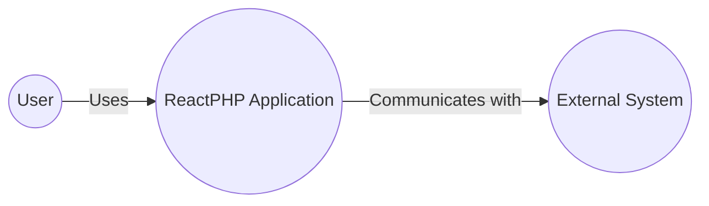
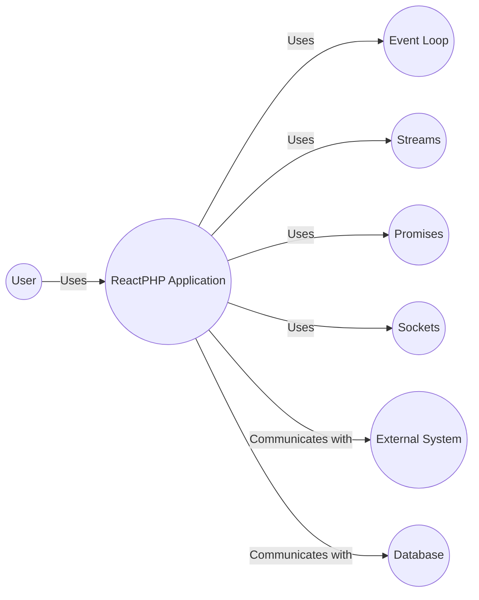
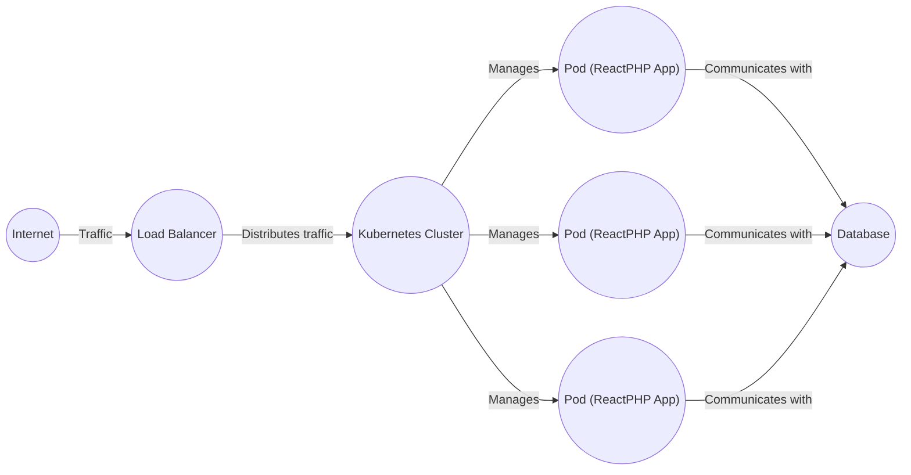
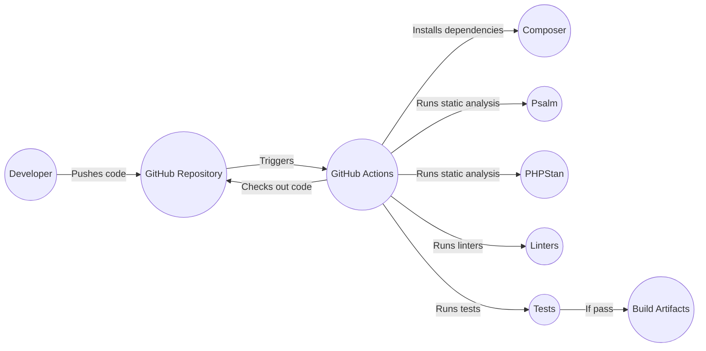

# BUSINESS POSTURE

ReactPHP is a low-level library for event-driven programming in PHP. It's designed for building high-performance, scalable, and concurrent network applications. The business priorities and goals that ReactPHP addresses are:

*   Performance: Enable PHP applications to handle a large number of concurrent connections and operations efficiently.
*   Scalability: Facilitate the creation of applications that can scale to meet increasing demand.
*   Concurrency: Allow developers to write non-blocking code that can handle multiple tasks simultaneously.
*   Maintainability: Provide a clean and well-structured codebase that is easy to understand and maintain.
*   Community: Foster a strong and active community of users and contributors.

Based on these priorities, the most important business risks that need to be addressed are:

*   Security vulnerabilities: Vulnerabilities in ReactPHP could be exploited to compromise applications built on top of it, leading to data breaches, denial-of-service attacks, or other security incidents.
*   Performance bottlenecks: Inefficient code or design flaws in ReactPHP could limit the performance and scalability of applications that use it.
*   Lack of adoption: If ReactPHP fails to gain widespread adoption, it may become difficult to maintain and support the project in the long term.
*   Competition: Other event-driven programming libraries and frameworks could emerge and challenge ReactPHP's position in the market.
*   Compatibility issues: Changes in PHP or other dependencies could lead to compatibility issues with ReactPHP, requiring significant effort to resolve.

# SECURITY POSTURE

*   security control: The project uses static analysis tools like Psalm and PHPStan to identify potential security vulnerabilities and code quality issues. Implemented in GitHub Actions workflows.
*   security control: The project has a security policy that outlines how to report vulnerabilities. Described in SECURITY.md file.
*   security control: The project uses linters to enforce coding standards and prevent common errors. Implemented in GitHub Actions workflows.
*   security control: The project has a comprehensive test suite that helps to ensure the stability and reliability of the code. Implemented in GitHub Actions workflows.
*   accepted risk: ReactPHP is a low-level library, and it is the responsibility of the application developer to implement appropriate security measures, such as input validation, output encoding, and access control.
*   accepted risk: ReactPHP relies on external dependencies, and vulnerabilities in these dependencies could affect the security of ReactPHP applications.

Recommended security controls:

*   security control: Implement regular security audits and penetration testing to identify and address potential vulnerabilities.
*   security control: Integrate dependency scanning tools to automatically detect and report vulnerabilities in external dependencies.
*   security control: Provide security training and guidelines for developers who use ReactPHP to build applications.
*   security control: Implement fuzzing tests.

Security Requirements:

*   Authentication: ReactPHP itself does not provide authentication mechanisms. It is the responsibility of the application developer to implement appropriate authentication mechanisms.
*   Authorization: ReactPHP itself does not provide authorization mechanisms. It is the responsibility of the application developer to implement appropriate authorization mechanisms.
*   Input Validation: All input received from external sources (e.g., network connections, user input) must be validated to ensure that it conforms to the expected format and does not contain malicious data.
*   Cryptography: ReactPHP provides some cryptographic primitives, but it is the responsibility of the application developer to use them correctly and securely. Secure protocols (e.g., TLS/SSL) should be used for all network communication.

# DESIGN

ReactPHP is a collection of libraries that provide low-level abstractions for event-driven programming. The core component is the EventLoop, which provides a mechanism for handling asynchronous events. Other components provide abstractions for streams, promises, sockets, and other common networking tasks.

## C4 CONTEXT

*   User:
    *   Name: User
    *   Type: Person
    *   Description: A user interacting with a ReactPHP application.
    *   Responsibilities: Initiates requests and receives responses from the ReactPHP application.
    *   Security controls: None (security controls are implemented within the ReactPHP application).
*   ReactPHP Application:
    *   Name: ReactPHP Application
    *   Type: Software System
    *   Description: An application built using the ReactPHP library.
    *   Responsibilities: Handles asynchronous events, processes requests, and interacts with external systems.
    *   Security controls: Input validation, output encoding, secure communication protocols (e.g., TLS/SSL), and other application-specific security measures.
*   External System:
    *   Name: External System
    *   Type: Software System
    *   Description: Any external system that the ReactPHP application interacts with, such as a database, message queue, or another web service.
    *   Responsibilities: Varies depending on the specific system.
    *   Security controls: Depends on the specific system and its security requirements.

## C4 CONTAINER

*   User:
    *   Name: User
    *   Type: Person
    *   Description: A user interacting with a ReactPHP application.
    *   Responsibilities: Initiates requests and receives responses from the ReactPHP application.
    *   Security controls: None (security controls are implemented within the ReactPHP application).
*   ReactPHP Application:
    *   Name: ReactPHP Application
    *   Type: Software System
    *   Description: An application built using the ReactPHP library.
    *   Responsibilities: Handles asynchronous events, processes requests, and interacts with external systems.
    *   Security controls: Input validation, output encoding, secure communication protocols (e.g., TLS/SSL), and other application-specific security measures.
*   Event Loop:
    *   Name: Event Loop
    *   Type: Container
    *   Description: The core component of ReactPHP, providing a mechanism for handling asynchronous events.
    *   Responsibilities: Manages timers, handles I/O events, and executes callbacks.
    *   Security controls: None (the Event Loop itself does not handle security).
*   Streams:
    *   Name: Streams
    *   Type: Container
    *   Description: Provides abstractions for working with streams of data.
    *   Responsibilities: Reading from and writing to streams, handling stream events.
    *   Security controls: Input validation, output encoding.
*   Promises:
    *   Name: Promises
    *   Type: Container
    *   Description: Provides a way to work with asynchronous operations in a more structured way.
    *   Responsibilities: Representing the eventual result of an asynchronous operation.
    *   Security controls: None (Promises themselves do not handle security).
*   Sockets:
    *   Name: Sockets
    *   Type: Container
    *   Description: Provides abstractions for working with network sockets.
    *   Responsibilities: Creating and managing socket connections, sending and receiving data.
    *   Security controls: Secure communication protocols (e.g., TLS/SSL).
*   External System:
    *   Name: External System
    *   Type: Software System
    *   Description: Any external system that the ReactPHP application interacts with.
    *   Responsibilities: Varies depending on the specific system.
    *   Security controls: Depends on the specific system and its security requirements.
*   Database:
    *   Name: Database
    *   Type: Software System
    *   Description: Database that the ReactPHP application interacts with.
    *   Responsibilities: Store and retrieve data.
    *   Security controls: Access control, encryption, auditing.

## DEPLOYMENT

ReactPHP applications can be deployed in various ways, depending on the specific requirements and infrastructure. Common deployment options include:

1.  Traditional LAMP/LEMP stack: ReactPHP applications can be deployed on a traditional web server like Apache or Nginx, using PHP-FPM to execute the PHP code.
2.  Containerized deployment: ReactPHP applications can be packaged into Docker containers and deployed using container orchestration platforms like Kubernetes or Docker Swarm.
3.  Serverless deployment: ReactPHP applications can be adapted to run in serverless environments like AWS Lambda or Google Cloud Functions, although this may require some modifications to the application code.

Chosen deployment solution: Containerized deployment using Docker and Kubernetes.

*   Internet:
    *   Name: Internet
    *   Type: External
    *   Description: The public internet.
    *   Responsibilities: Routes traffic to the load balancer.
    *   Security controls: Firewall, DDoS protection.
*   Load Balancer:
    *   Name: Load Balancer
    *   Type: Infrastructure
    *   Description: Distributes incoming traffic across multiple instances of the ReactPHP application.
    *   Responsibilities: Health checks, traffic routing.
    *   Security controls: SSL termination, Web Application Firewall (WAF).
*   Kubernetes Cluster:
    *   Name: Kubernetes Cluster
    *   Type: Infrastructure
    *   Description: A container orchestration platform that manages the deployment and scaling of the ReactPHP application.
    *   Responsibilities: Resource management, scheduling, service discovery.
    *   Security controls: Network policies, role-based access control (RBAC), pod security policies.
*   Pod (ReactPHP App):
    *   Name: Pod (ReactPHP App)
    *   Type: Container Instance
    *   Description: A running instance of the ReactPHP application container.
    *   Responsibilities: Handles requests, processes data, interacts with other services.
    *   Security controls: Application-level security measures, container security context.
*   Database:
    *   Name: Database
    *   Type: Software System
    *   Description: Database that the ReactPHP application interacts with.
    *   Responsibilities: Store and retrieve data.
    *   Security controls: Access control, encryption, auditing.

## BUILD

ReactPHP uses GitHub Actions for its continuous integration and build process. The build process includes the following steps:

1.  Developer pushes code changes to the GitHub repository.
2.  GitHub Actions triggers a workflow based on the defined events (e.g., push, pull request).
3.  The workflow checks out the code from the repository.
4.  The workflow sets up the PHP environment with the required extensions.
5.  The workflow installs project dependencies using Composer.
6.  The workflow runs static analysis tools (Psalm, PHPStan) to check for code quality and potential security issues.
7.  The workflow runs linters to enforce coding standards.
8.  The workflow runs the test suite to ensure that the code is functioning correctly.
9.  If all checks and tests pass, the workflow may create build artifacts (e.g., Phar archives) or trigger deployments.

# RISK ASSESSMENT

*   Critical business processes we are trying to protect:
    *   The ability to handle a large number of concurrent connections and operations efficiently.
    *   The ability to scale applications to meet increasing demand.
    *   The ability to write non-blocking code that can handle multiple tasks simultaneously.
    *   The ability to maintain a clean and well-structured codebase.
    *   The ability to foster a strong and active community of users and contributors.

*   Data we are trying to protect and their sensitivity:
    *   ReactPHP itself does not handle sensitive data directly. However, applications built on top of ReactPHP may handle various types of sensitive data, including:
        *   Personally identifiable information (PII): High sensitivity
        *   Financial data: High sensitivity
        *   Authentication credentials: High sensitivity
        *   Application-specific data: Sensitivity varies depending on the application.

# QUESTIONS & ASSUMPTIONS

*   Questions:
    *   Are there any specific compliance requirements (e.g., PCI DSS, HIPAA) that need to be considered for applications built with ReactPHP?
    *   What are the expected traffic patterns and load requirements for applications built with ReactPHP?
    *   What are the existing security controls and policies in place for the development and deployment environments?

*   Assumptions:
    *   Business Posture: It's assumed that the primary goal is to provide a robust and performant foundation for building network applications, prioritizing performance and scalability.
    *   Security Posture: It's assumed that developers using ReactPHP are aware of basic security principles and will implement application-specific security measures. The existing security controls are focused on code quality and vulnerability detection during development.
    *   Design: It's assumed that the deployment environment will be a containerized platform like Kubernetes, providing scalability and manageability. The build process is assumed to be automated using GitHub Actions.