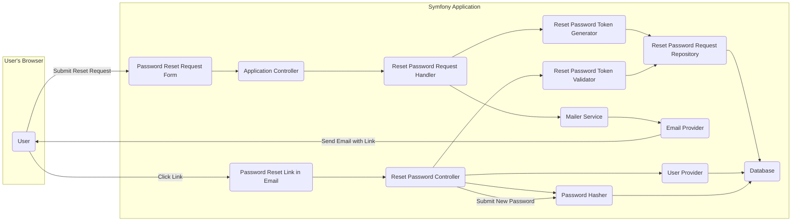
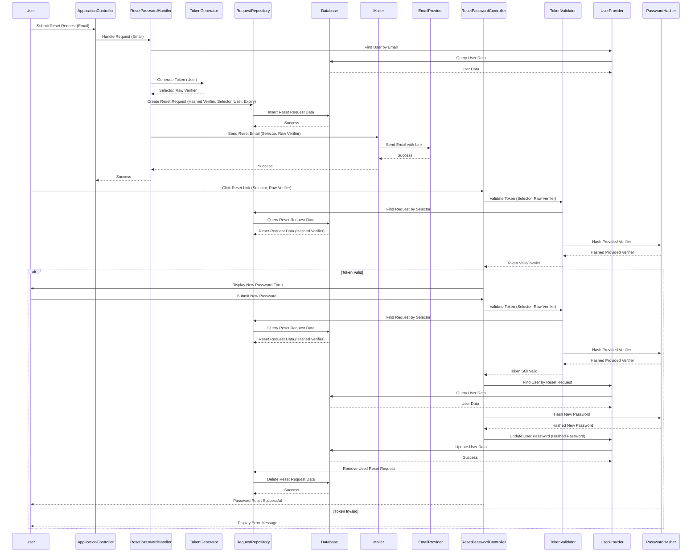

# Project Design Document: Symfony Reset Password Bundle

**Version:** 1.1
**Date:** October 26, 2023
**Author:** AI Software Architect

## 1. Introduction

This document provides an enhanced and more detailed design overview of the Symfony Reset Password Bundle (hereafter referred to as "the Bundle"), based on the project available at [https://github.com/SymfonyCasts/reset-password-bundle](https://github.com/SymfonyCasts/reset-password-bundle). This revised document aims to provide an even clearer and more comprehensive articulation of the architecture, components, and data flow of the Bundle, making it highly suitable for subsequent threat modeling activities.

### 1.1. Purpose

The primary purpose of this document is to provide a robust and detailed design description of the Bundle. This will serve as a strengthened foundation for understanding the system's functionality, identifying potential security vulnerabilities, and facilitating more effective threat modeling.

### 1.2. Scope

This document comprehensively covers the core functionality of the Bundle, including:

*   Initiating a password reset request by a user.
*   The process of generating and securely storing password reset request tokens.
*   Validating the authenticity and validity of password reset request tokens.
*   The complete workflow for handling the password reset process, from request to password update.
*   Seamless integration with Symfony's security component and user management.

This document explicitly excludes:

*   Specific details of UI/UX implementations for password reset forms and related user interfaces.
*   In-depth exploration of all possible configuration options beyond those directly impacting core functionality and security.
*   Specifics related to the deployment environment and infrastructure.

### 1.3. Goals

*   To clearly and precisely define all key components within the Bundle and their interactions with each other and the broader Symfony application.
*   To meticulously illustrate the complete data flow during the entire password reset process, highlighting all data transformations and storage points.
*   To provide a solid and detailed basis for identifying a wide range of potential security threats and vulnerabilities associated with the Bundle.
*   To serve as a definitive reference for developers, security analysts, and other stakeholders involved in the development and maintenance of applications utilizing the Bundle.

## 2. High-Level Design

The Bundle orchestrates the password reset process through a well-defined sequence of interactions involving the user and various components within the Symfony application.

**Key Actors:**

*   **User:** The individual who needs to reset their password.
*   **Application Controller:** The specific Symfony controller responsible for initially receiving and processing the password reset request.
*   **Reset Password Controller:** The Symfony controller dedicated to handling the user's interaction with the password reset link, including token validation and new password submission.

**Key Components:**

*   **Password Reset Request Form:** The user interface element through which the user initiates the password reset process (typically by providing their email address).
*   **Reset Password Request Handler:** The core component responsible for orchestrating the initial password reset request, including user lookup, token generation, and persistence.
*   **Reset Password Token Generator:**  Generates cryptographically secure, unique, and time-limited tokens specifically for password reset requests.
*   **Reset Password Request Repository:**  Manages the persistence and retrieval of password reset request tokens, interacting directly with the database.
*   **Mailer Service:**  An abstraction layer for sending emails, used to dispatch the password reset link to the user.
*   **Email Provider:**  The underlying service or transport mechanism used by the Mailer Service to deliver emails (e.g., Symfony Mailer, SendGrid).
*   **Password Reset Link in Email:** The hyperlink embedded in the email sent to the user, containing the necessary information to initiate the password reset process via the Reset Password Controller.
*   **Reset Password Token Validator:**  Responsible for verifying the authenticity, integrity, and validity (including expiry) of the password reset token provided by the user.
*   **User Provider:**  Symfony's security component responsible for loading user information based on identifiers (e.g., email address).
*   **Password Hasher:**  Symfony's service for securely hashing and verifying user passwords.
*   **Database:** The persistent storage mechanism for user data and password reset request tokens.

## 3. Detailed Design

This section provides a more granular view of each component and the intricate interactions between them during the password reset lifecycle.

### 3.1. Initiating a Password Reset Request

1. The **User** interacts with the **Password Reset Request Form**, typically entering their email address, and submits the request.
2. The **Application Controller** receives the submission, extracting the user's email address.
3. The **Application Controller** invokes the **Reset Password Request Handler**, passing the provided email address.
4. The **Reset Password Request Handler** utilizes the **User Provider** to locate the user associated with the given email address.
5. The **Reset Password Token Generator** is invoked to create a secure password reset token. This process typically involves:
    *   Generating a cryptographically random selector.
    *   Generating a cryptographically random raw verifier.
    *   Hashing the raw verifier using a secure hashing algorithm.
6. A new **Reset Password Request** entity is instantiated, containing:
    *   The hashed verifier.
    *   The unhashed selector.
    *   A reference to the associated **User** entity.
    *   A timestamp indicating the token's expiration time.
7. The **Reset Password Request Repository** persists the newly created **Reset Password Request** entity in the **Database**.
8. The **Mailer Service** is used to compose and send an email to the **User**. This email includes:
    *   A link pointing to the **Reset Password Controller**.
    *   The unhashed selector and the raw verifier as parameters in the URL.

### 3.2. Completing the Password Reset

1. The **User** clicks on the **Password Reset Link in Email**, directing their browser to the **Reset Password Controller** with the selector and verifier.
2. The **Reset Password Controller** receives the selector and verifier from the URL parameters.
3. The **Reset Password Token Validator** is invoked to validate the provided token:
    *   It queries the **Reset Password Request Repository** to retrieve the **Reset Password Request** entity matching the provided selector.
    *   If a matching request is found, it compares the hash of the provided verifier with the stored hashed verifier.
    *   It checks if the current time is before the token's expiration timestamp.
4. If the token is valid:
    *   The **Reset Password Controller** renders a form allowing the user to enter their new password.
5. Upon submission of the new password form:
    *   The **Reset Password Controller** again validates the token using the **Reset Password Token Validator** to ensure it hasn't been used or expired in the interim.
    *   The **User Provider** is used to load the **User** entity associated with the validated token.
    *   The new password provided by the user is hashed using the **Password Hasher**.
    *   The **User** entity's password field is updated with the newly hashed password.
    *   The updated **User** entity is persisted in the **Database**.
    *   The corresponding **Reset Password Request** entity is deleted from the **Database** to prevent token reuse.
    *   The user is typically either logged into the application or redirected to the login page with a success message.
6. If the token is invalid or expired at any point, the **Reset Password Controller** displays an appropriate error message to the **User**.

## 4. Data Flow Diagram

This diagram provides a visual representation of the data flow throughout the password reset process, highlighting the movement and transformation of key data elements.

## 5. Security Considerations

This section provides a more detailed examination of potential security considerations and vulnerabilities inherent in the design.

*   **Token Predictability and Strength:** The **Reset Password Token Generator** must employ cryptographically secure random number generators to produce selectors and raw verifiers that are computationally infeasible to predict or brute-force. The length and entropy of these values are critical.
*   **Secure Token Storage:**  Storing the raw verifier is avoided; instead, only the securely hashed verifier is persisted in the **Database**. The hashing algorithm used should be a strong, well-vetted algorithm like Argon2id. Salting the hash is implicitly handled by Symfony's PasswordHasher.
*   **Token Expiration:**  Implementing a reasonable and configurable expiration time for password reset tokens is crucial. This limits the window of opportunity for attackers to exploit a compromised token. The expiration time should be carefully considered based on usability and security trade-offs.
*   **Rate Limiting on Reset Requests:**  Implementing robust rate limiting on the password reset request endpoint is essential to prevent attackers from launching brute-force attacks to discover valid email addresses or exhaust system resources by sending numerous reset emails.
*   **Secure Email Transmission:**  Ensuring that the email sending process utilizes TLS (or a similar secure protocol) is vital to prevent the interception of the password reset link and the sensitive information it contains (selector and raw verifier) during transit.
*   **Protection Against Clickjacking:**  Implementing appropriate HTTP headers (e.g., `X-Frame-Options`, `Content-Security-Policy`) on the password reset form page can mitigate the risk of clickjacking attacks.
*   **Information Disclosure Prevention:**  Error messages displayed during the password reset process should be generic to avoid revealing whether a given email address is associated with an existing account.
*   **Prevention of Token Reuse:**  Upon successful password reset, the corresponding **Reset Password Request** entity must be immediately and reliably deleted from the **Database** to prevent the token from being used again.
*   **Mitigation of Man-in-the-Middle Attacks:**  Enforcing HTTPS for all communication related to the password reset process is paramount to protect against man-in-the-middle attacks that could intercept the reset link or the new password.
*   **Cross-Site Scripting (XSS) Prevention:**  Care must be taken to sanitize any user-provided input (though minimal in this flow) and to properly escape output in the password reset forms and email content to prevent XSS vulnerabilities.
*   **Cross-Site Request Forgery (CSRF) Protection:**  Implementing CSRF protection on the password reset form is crucial to prevent attackers from forging password reset requests on behalf of legitimate users.

## 6. Deployment Considerations

Successful and secure deployment of applications utilizing the Bundle requires careful consideration of the following aspects:

*   **Secure Database Configuration:**  The database used to store user data and reset password requests must be securely configured, with appropriate access controls and encryption at rest.
*   **Secure Mailer Configuration:**  The mailer service should be configured with secure credentials and utilize a secure transport protocol. Consider using an authenticated SMTP server or a dedicated email service provider.
*   **Mandatory HTTPS:**  The entire application, especially the password reset flow, must be served exclusively over HTTPS. HSTS (HTTP Strict Transport Security) should be enabled to enforce HTTPS.
*   **Robust Rate Limiting:**  Implement rate limiting at the infrastructure level (e.g., using a web application firewall or load balancer) or within the application itself to protect the password reset endpoint from abuse.
*   **Regular Security Audits:**  Conduct regular security audits and penetration testing to identify and address potential vulnerabilities in the application and its dependencies, including the Bundle.

## 7. Future Considerations

This section outlines potential enhancements and future development directions for the Bundle.

*   **Customizable Token Generation Logic:**  Provide developers with the flexibility to customize the token generation process, allowing for the integration of organization-specific security requirements.
*   **Support for Multiple Password Reset Flows:**  Explore the possibility of supporting alternative password reset mechanisms, such as using security questions or one-time codes, as configurable options.
*   **Enhanced Integration with Two-Factor Authentication:**  Investigate tighter integration with two-factor authentication (2FA) mechanisms, potentially allowing password resets to be initiated or completed only after successful 2FA verification.
*   **Admin Interface for Managing Reset Requests:**  Consider adding an administrative interface for viewing and managing active password reset requests.
*   **Pluggable Token Storage Mechanisms:**  Allow developers to choose different storage mechanisms for reset password tokens beyond the default database storage.

This improved document provides a more comprehensive and detailed design overview of the Symfony Reset Password Bundle, making it an even more valuable resource for threat modeling and security analysis. The enhanced clarity and detail in the component descriptions, data flow, and security considerations contribute to a stronger understanding of the system's architecture and potential vulnerabilities.