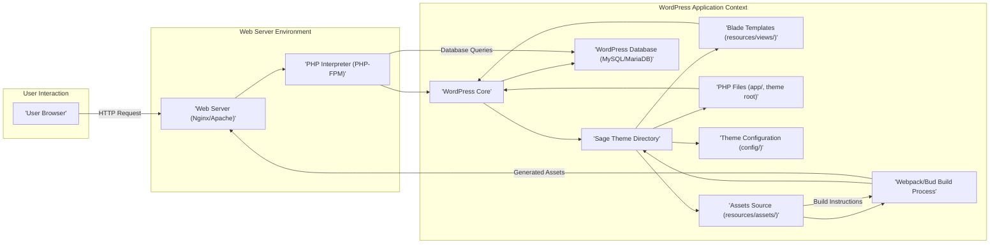
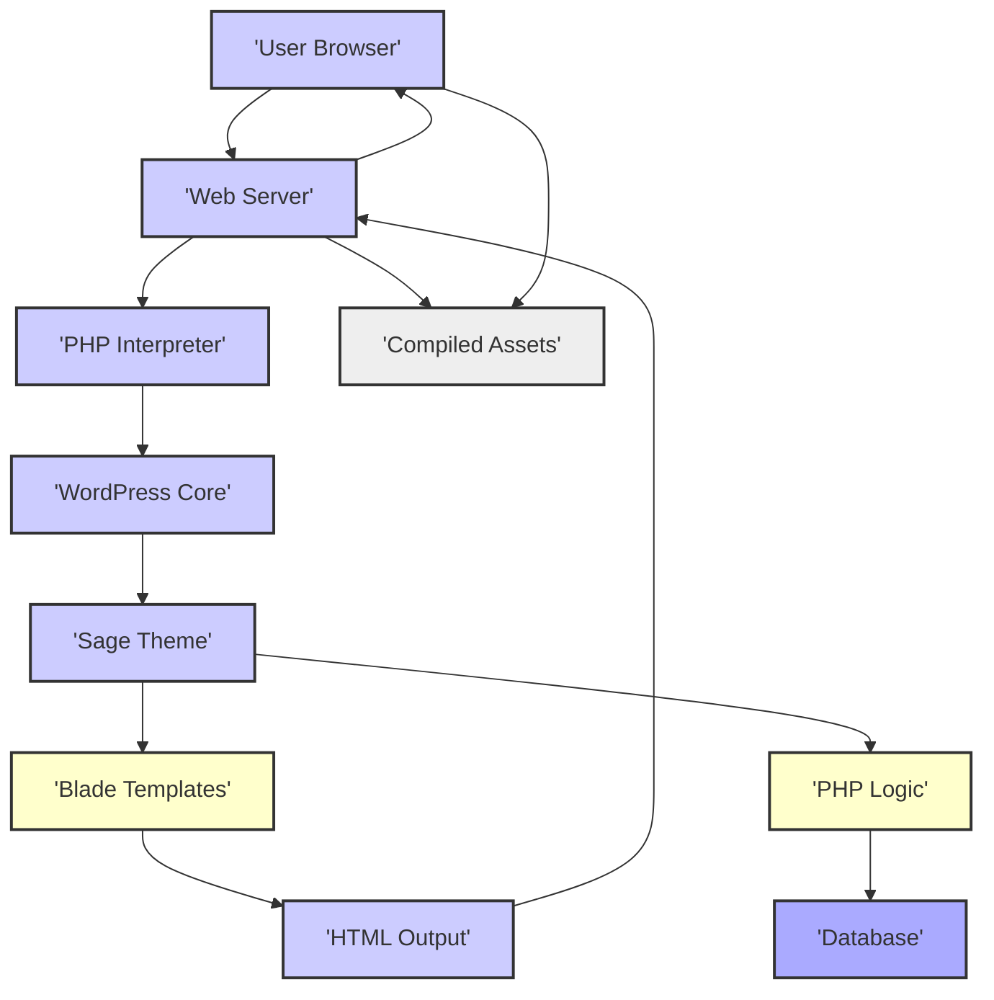

## Project Design Document: Sage WordPress Starter Theme

**Version:** 1.1
**Date:** October 26, 2023
**Author:** AI Cloud & Security Architect

### 1. Introduction

This document outlines the design of the Sage WordPress starter theme (referenced from [https://github.com/roots/sage](https://github.com/roots/sage)). This revised document builds upon the initial design by providing more granular details and clarifying key aspects relevant to security analysis and threat modeling. The focus remains on providing a comprehensive overview of the system's architecture, components, and data flow from a security perspective.

### 2. Project Overview

Sage is a WordPress starter theme designed to enhance the development experience by incorporating modern web development practices. It aims to provide a cleaner, more organized, and maintainable codebase compared to traditional WordPress themes. Key features and technologies include:

*   **Blade Templating Engine:**  Utilizes Laravel's Blade templating engine for creating dynamic views with features like template inheritance and component management.
*   **Webpack for Asset Management:** Employs Webpack to bundle, optimize, and manage front-end assets (JavaScript, CSS, images).
*   **Yarn or npm:**  Leverages these package managers for managing JavaScript dependencies.
*   **Sass/SCSS Preprocessing:** Supports Sass/SCSS for writing maintainable and scalable CSS.
*   **Optional Bud Integration:**  Offers optional integration with Bud, a more opinionated and modern build tool for front-end assets.
*   **Modern PHP Practices:** Encourages the use of modern PHP features and coding standards.

The primary objective of Sage is to improve developer productivity, enhance theme performance, and promote better code organization within the WordPress theme development process.

### 3. Architectural Overview

The Sage theme functions within the established WordPress framework. Its architecture is composed of the following interconnected components:

*   **WordPress Core:** The fundamental CMS providing core functionalities like content management, user management, and plugin integration.
*   **Sage Theme Directory:** The directory containing all the files specific to the Sage theme, typically located at `wp-content/themes/sage/`. This directory houses:
    *   **Blade Templates (`resources/views/`):** Files with the `.blade.php` extension responsible for rendering the HTML structure of the theme's front-end and potentially parts of the admin interface.
    *   **PHP Files (`app/`, theme root):** PHP files containing theme logic, custom functions, integration with WordPress hooks and filters, and potentially custom controllers or models.
    *   **Theme Configuration (`config/`):** Configuration files (e.g., for Blade, asset settings) that define the behavior of the theme.
    *   **Assets Source (`resources/assets/`):** Contains source files for JavaScript, CSS (Sass/SCSS), images, and other front-end assets.
    *   **Webpack/Bud Configuration (`webpack.config.js`, `bud.config.js`):** Configuration files that instruct Webpack or Bud on how to process and bundle the assets.
    *   **Dependency Management (`composer.json`, `package.json`, `yarn.lock` or `package-lock.json`):** Files that define and manage PHP and JavaScript dependencies.
    *   **Compiled Assets (`public/` or theme root):** The output directory where Webpack or Bud places the processed and optimized front-end assets.
*   **Webpack/Bud Build Process:** The process that takes the source assets from `resources/assets/`, applies transformations and optimizations defined in the configuration files, and outputs the production-ready assets.
*   **WordPress Database (MySQL/MariaDB):** Stores all WordPress data, including posts, pages, user information, and theme settings.
*   **Web Server (Apache or Nginx):**  Serves the WordPress application and associated assets to client browsers.
*   **User Browser:** The web browser used by visitors to access the WordPress website, rendering the HTML, CSS, and executing JavaScript.

#### 3.1. Architecture Diagram

### 4. Component Details

*   **WordPress Core:**  Provides the foundational CMS functionalities. Security vulnerabilities in WordPress Core can be exploited if not kept up-to-date.
*   **Sage Theme Directory:**
    *   **Blade Templates (`resources/views/`):** Responsible for rendering dynamic content. Improperly sanitized data passed to Blade templates can lead to Cross-Site Scripting (XSS) vulnerabilities. Directly embedding user-supplied data without escaping is a major risk.
    *   **PHP Files (`app/`, theme root):**  Handle custom theme logic. Potential vulnerabilities include:
        *   **Insecure Data Handling:**  Not properly validating or sanitizing user input can lead to various attacks.
        *   **SQL Injection:** While WordPress provides APIs to prevent this, direct database queries without proper sanitization are vulnerable.
        *   **Insecure File Operations:**  Functions that handle file uploads or manipulations can be exploited if not implemented securely.
        *   **Authentication and Authorization Flaws:** If the theme implements custom user roles or access controls, vulnerabilities in this logic can lead to unauthorized access.
    *   **Theme Configuration (`config/`):** May contain sensitive information like API keys for external services. These files should have appropriate access restrictions.
    *   **Assets Source (`resources/assets/`):**
        *   **JavaScript:**  Vulnerable JavaScript code can lead to XSS, Cross-Site Request Forgery (CSRF), and other client-side attacks. Dependencies should be regularly audited for known vulnerabilities.
        *   **CSS (Sass/SCSS):** While less directly exploitable, CSS can be used for UI redressing attacks or information disclosure through carefully crafted selectors.
        *   **Images and Other Assets:**  Maliciously crafted images could potentially exploit vulnerabilities in browser rendering engines (though less common).
    *   **Webpack/Bud Configuration (`webpack.config.js`, `bud.config.js`):** Misconfigurations can introduce vulnerabilities, such as exposing sensitive files or allowing arbitrary code execution during the build process. Ensure loaders and plugins are from trusted sources.
    *   **Dependency Management (`composer.json`, `package.json`, `yarn.lock` or `package-lock.json`):**  Declares dependencies. Using outdated or vulnerable dependencies is a significant security risk. Regular updates and security audits are crucial.
    *   **Compiled Assets (`public/` or theme root):**  The output of the build process. If the build process is compromised, these assets could contain malicious code.
*   **Webpack/Bud Build Process:**  Executes code from dependencies and potentially custom scripts. Vulnerabilities in the build tools themselves or their dependencies can compromise the entire build pipeline, leading to supply chain attacks.
*   **WordPress Database (MySQL/MariaDB):** Stores sensitive data. Proper database security practices, including strong passwords, access controls, and regular backups, are essential.
*   **Web Server (Apache or Nginx):**  Handles incoming requests. Misconfigurations can expose vulnerabilities, such as information disclosure or allowing access to sensitive files. Regular security audits and updates are necessary.
*   **User Browser:** The client-side environment where the web application runs. Susceptible to attacks like XSS if the application doesn't properly sanitize output.

### 5. Data Flow

The typical data flow for a user accessing a page on a WordPress site using the Sage theme involves these key steps:

1. **User Initiates Request:** A user interacts with the website (e.g., clicks a link, submits a form) in their browser, generating an HTTP request.
2. **Web Server Receives Request:** The web server (Nginx/Apache) receives the incoming HTTP request.
3. **PHP Processing:** The web server forwards the request to the PHP interpreter (PHP-FPM) to handle the dynamic parts of the request.
4. **WordPress Core Bootstrapping:** WordPress Core is loaded and initialized, handling routing and core functionalities.
5. **Theme Selection and Loading:** WordPress identifies the active Sage theme and loads its relevant files.
6. **Template Resolution:** Based on the requested URL and the WordPress template hierarchy, WordPress determines which template file within the Sage theme should handle the request.
7. **Data Retrieval (if needed):** The PHP code within the selected template or included files may interact with the WordPress database to retrieve necessary data (e.g., post content, user information, custom field values). WordPress provides secure APIs for database interaction.
8. **Blade Templating Engine Processing:** If the template is a Blade template (`.blade.php`), the PHP code passes data to the Blade engine. Blade renders the final HTML output by combining the template structure with the provided data. It's crucial that data is properly escaped within Blade templates to prevent XSS.
9. **Asset Delivery:** The browser requests static assets (CSS, JavaScript, images) from the web server. These assets are typically served directly by the web server from the compiled assets directory.
10. **Response Transmission:** The web server sends the generated HTML and the requested assets back to the user's browser.
11. **Browser Rendering and Execution:** The user's browser renders the HTML, applies the CSS styles, and executes any included JavaScript code.

#### 5.1. Data Flow Diagram

### 6. Technology Stack

*   **Primary Languages:** PHP, JavaScript, HTML, CSS (Sass/SCSS)
*   **Templating:** Blade (from Laravel)
*   **Build Tools:** Webpack (or optionally Bud)
*   **JavaScript Package Management:** Yarn or npm
*   **PHP Package Management:** Composer
*   **Web Server (Common):** Nginx, Apache
*   **Database (Common):** MySQL, MariaDB
*   **Operating System:** Platform independent (Linux, macOS, Windows for development)

### 7. Deployment Model

Sage themes are deployed as part of a WordPress installation. Typical deployment approaches include:

*   **Traditional Web Hosting:** Deploying WordPress and the Sage theme files to a shared or dedicated hosting server.
*   **Managed WordPress Hosting:** Utilizing hosting providers that specialize in WordPress, often providing optimized environments and security features.
*   **Containerization (Docker):** Packaging the WordPress application, including the Sage theme, into Docker containers for consistent and scalable deployments.
*   **Cloud Platforms:** Deploying on cloud infrastructure (e.g., AWS, Google Cloud, Azure) using services like EC2, Google Compute Engine, or Azure VMs, potentially leveraging container orchestration (Kubernetes).
*   **Version Control Deployment:** Using Git and deployment pipelines to automate the deployment process from a version control repository.

### 8. Security Considerations (Detailed)

Threat modeling for Sage should consider the following potential security vulnerabilities:

*   **Cross-Site Scripting (XSS):**
    *   **Cause:** Improperly sanitized or escaped user-supplied data being rendered in Blade templates or manipulated by JavaScript.
    *   **Mitigation:** Always escape output in Blade templates using appropriate Blade directives (e.g., `{{ $variable }}`). Sanitize user input on the server-side before displaying it. Implement Content Security Policy (CSP).
*   **SQL Injection:**
    *   **Cause:** Directly constructing SQL queries with unsanitized user input.
    *   **Mitigation:**  Primarily rely on WordPress's built-in database abstraction layer (WPDB) and prepared statements to prevent SQL injection. Avoid direct database queries where possible. Sanitize and validate user input if direct queries are absolutely necessary.
*   **Dependency Vulnerabilities:**
    *   **Cause:** Using outdated or vulnerable PHP or JavaScript libraries managed by Composer and npm/Yarn.
    *   **Mitigation:** Regularly update dependencies to their latest stable versions. Utilize tools like `composer audit` and `npm audit` (or `yarn audit`) to identify known vulnerabilities. Implement a process for reviewing and addressing reported vulnerabilities.
*   **Insecure Configuration:**
    *   **Cause:** Misconfigurations in the web server, database, build process, or theme files that expose sensitive information or create attack vectors.
    *   **Mitigation:** Follow security best practices for web server and database configuration. Securely manage API keys and other sensitive credentials (e.g., using environment variables or dedicated secrets management tools). Review Webpack/Bud configurations to prevent information leaks or arbitrary code execution.
*   **Sensitive Data Exposure:**
    *   **Cause:** Unintentionally exposing sensitive information in configuration files, error messages, logs, or publicly accessible files.
    *   **Mitigation:**  Avoid storing sensitive information directly in code or configuration files. Use environment variables or secure secrets management. Configure error reporting to avoid displaying sensitive details to users. Implement proper logging practices and secure log files.
*   **Supply Chain Attacks:**
    *   **Cause:** Compromise of dependencies or build tools used in the development process.
    *   **Mitigation:**  Use reputable and well-maintained dependencies. Implement Software Composition Analysis (SCA) tools to monitor dependencies for vulnerabilities. Secure the development environment and build pipeline. Use dependency pinning to ensure consistent builds.
*   **Authentication and Authorization Flaws:**
    *   **Cause:** Vulnerabilities in custom theme logic that handles user authentication or authorization.
    *   **Mitigation:**  Leverage WordPress's built-in authentication and authorization mechanisms where possible. If custom logic is necessary, follow secure coding practices and thoroughly test the implementation.
*   **File Inclusion Vulnerabilities:**
    *   **Cause:** Improper handling of file paths that allows attackers to include arbitrary files, potentially leading to code execution.
    *   **Mitigation:** Avoid dynamic file inclusion based on user input. If absolutely necessary, implement strict validation and sanitization of file paths.
*   **Cross-Site Request Forgery (CSRF):**
    *   **Cause:**  Lack of proper anti-CSRF tokens on forms, allowing attackers to trick users into performing unintended actions.
    *   **Mitigation:** Utilize WordPress's built-in nonce functionality to protect against CSRF attacks.
*   **Denial of Service (DoS):**
    *   **Cause:** Inefficient code or resource-intensive operations within the theme that can be exploited to overload the server.
    *   **Mitigation:** Optimize code for performance. Implement rate limiting where appropriate. Be mindful of resource usage in custom theme logic.

### 9. Out of Scope

This design document focuses specifically on the Sage WordPress starter theme. The following are outside the scope of this document:

*   Security of the underlying operating system hosting the WordPress installation.
*   Detailed security configuration of the web server (Nginx/Apache) beyond its interaction with the theme.
*   Security of the database server itself, although data interaction is considered.
*   Vulnerabilities within WordPress Core itself (though the theme's interaction with Core is a key consideration).
*   Security of WordPress plugins, unless their functionality is directly integrated into the Sage theme's core features.
*   Network security aspects surrounding the server environment.

### 10. Future Considerations

*   Adoption of more advanced front-end frameworks or libraries within the Sage ecosystem.
*   Further modularization and component-based architecture for enhanced maintainability.
*   Enhanced support and best practices for headless WordPress implementations using Sage.
*   Integration of more sophisticated security analysis tools and processes into the development workflow.

This revised design document provides a more detailed and nuanced understanding of the Sage WordPress starter theme's architecture, components, and potential security considerations. This information is crucial for conducting thorough threat modeling and implementing appropriate security measures.