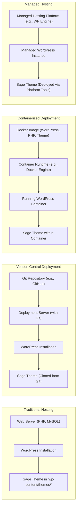

# Project Design Document: Sage WordPress Starter Theme

**Version:** 1.1
**Date:** October 26, 2023
**Author:** AI Software Architect

## 1. Introduction

This document provides a detailed design overview of the Sage WordPress starter theme project, as found on GitHub at [https://github.com/roots/sage](https://github.com/roots/sage). This document aims to clearly articulate the architecture, components, and data flow of the project to facilitate subsequent threat modeling activities. This version includes more detailed explanations and expands on potential security considerations.

## 2. Project Overview

Sage is a modern WordPress starter theme designed to streamline theme development by incorporating best practices and modern tooling. It promotes a cleaner, more maintainable codebase by leveraging the Blade templating engine, a component-based architecture, and a robust asset build pipeline powered by Node.js and a bundler (typically Bud.js). Sage aims to improve developer experience and theme performance compared to traditional WordPress theme development approaches.

## 3. System Architecture

Sage's architecture is structured around distinct layers and processes:

*   **Presentation Layer (Theme Files):**  Responsible for rendering the user interface and handling user interactions. This includes Blade templates, CSS, and JavaScript.
*   **Application Logic Layer (Theme Logic):** Contains the PHP code that drives the theme's functionality, interacts with WordPress, and prepares data for the presentation layer.
*   **Asset Build Pipeline:** A Node.js based system that compiles, optimizes, and manages front-end assets.
*   **Configuration Management:** Files that define the project's dependencies, build process, and various settings.
*   **WordPress Integration Layer:** The interface through which Sage interacts with the WordPress core functionalities and data.

## 4. Components

### 4.1. Theme Files

*   **`app/`:**  Houses the core theme's application logic, promoting a more organized and modular structure:
    *   **`View/Composers/`:**  PHP classes (View Composers) that encapsulate the logic for passing data to specific Blade templates or groups of templates. This promotes reusability and separation of concerns.
    *   **`filters.php`:**  Defines custom WordPress filters that allow modification of WordPress's default behavior or data at specific points in its execution.
    *   **`setup.php`:**  Contains crucial theme setup functions that run during theme initialization, such as registering custom navigation menus, sidebars, and enabling theme support for various WordPress features (e.g., featured images).
    *   **`helpers.php`:**  Provides a collection of custom, reusable PHP helper functions that can be used throughout the theme's codebase to perform common tasks.
*   **`config/`:**  Contains configuration files that control various aspects of the theme's behavior:
    *   **`app.php`:**  General application-level configuration settings for the theme.
    *   **`view.php`:**  Configuration specific to the Blade templating engine, such as specifying template paths and cache settings.
*   **`resources/`:**  Contains the source files for front-end assets and the Blade templates:
    *   **`views/`:**  Blade template files (`.blade.php`) that define the structure and content of the theme's pages and components. These templates use Blade's syntax for dynamic content and control structures.
    *   **`assets/`:**  Contains the raw assets that are processed by the build pipeline:
        *   **`scripts/`:**  JavaScript source files (often using ES modules).
        *   **`styles/`:**  SCSS or CSS source files for styling the theme.
        *   **`images/`:**  Image assets used in the theme.
        *   **`fonts/`:**  Font files used by the theme.
*   **`public/`:**  The destination directory where the compiled and optimized assets are placed after the build process completes. This directory is directly served by the web server and accessed by the browser.
*   **`functions.php`:**  The primary theme functions file, which is required by WordPress. It's responsible for bootstrapping the theme, including autoloader setup, and including other necessary files from the `app/` directory.
*   **`index.php`:**  The fallback template file used by WordPress if no more specific template is found for a given request.
*   **`style.css`:**  The main stylesheet for the theme. While often minimal in Sage due to the build process, it's required by WordPress and contains the theme's metadata (name, author, version, etc.).

### 4.2. Build Process

*   **Node.js:**  The JavaScript runtime environment essential for executing the build tools and managing dependencies.
*   **Yarn or npm:**  Package managers used to install and manage both development and production dependencies defined in `package.json`.
*   **Bud.js (or Webpack):**  A powerful module bundler that orchestrates the processing of front-end assets. Key functionalities include:
    *   **Compilation:**  Transforms SCSS files into CSS, transpiles modern JavaScript (ES6+) into browser-compatible JavaScript, and potentially processes other asset types.
    *   **Bundling:**  Combines multiple JavaScript and CSS files into fewer, optimized bundles to reduce HTTP requests and improve page load times.
    *   **Optimization:**  Minifies CSS and JavaScript files, optimizes images, and performs other optimizations to reduce file sizes.
    *   **Asset Management:**  Handles the copying and versioning of static assets like images and fonts to the `public/` directory.
    *   **Development Server:** Often includes a development server with features like hot module replacement (HMR) for a faster development workflow.
*   **Configuration Files (e.g., `bud.config.js` or `webpack.config.js`):**  JavaScript files that define the entire build process, including:
    *   **Entry Points:** Specifies the main source files for JavaScript and CSS.
    *   **Output Paths:** Defines where the compiled assets should be placed.
    *   **Loaders:**  Specifies how different file types should be processed (e.g., using `sass-loader` for SCSS).
    *   **Plugins:**  Extends the functionality of the bundler (e.g., plugins for minification or code splitting).

### 4.3. Configuration

*   **`package.json`:**  A JSON file that defines the project's Node.js dependencies (both for development and production), scripts for running build tasks (e.g., `build`, `dev`, `watch`), and other project metadata like name, version, and license.
*   **`composer.json`:**  A JSON file that defines the project's PHP dependencies, allowing for the inclusion of external PHP libraries and packages.
*   **Build Tool Configuration (e.g., `bud.config.js`):**  As detailed above, this file is crucial for configuring the asset build pipeline.

### 4.4. WordPress Integration

*   **Theme Hierarchy Adherence:** Sage follows WordPress's template hierarchy rules for determining which template file to use for rendering a specific page or post.
*   **WordPress Template Tags:**  Sage templates utilize WordPress template tags (PHP functions provided by WordPress) to fetch and display dynamic content from the WordPress database (e.g., post titles, content, author information).
*   **Actions and Filters:**  Sage extensively uses WordPress actions and filters to hook into WordPress's core functionality, allowing the theme to modify behavior, add custom functionality, and integrate with plugins.
*   **Blade Templating Engine:**  Provides a more modern and expressive syntax for creating theme templates compared to traditional PHP templates, offering features like template inheritance, components, and directives.

## 5. Data Flow

The data flow within Sage involves several distinct stages:

*   **Development Phase:**
    *   Developers write and modify source code in the `app/`, `resources/assets/`, and `resources/views/` directories using code editors.
    *   Dependencies are managed by adding or updating entries in `composer.json` and `package.json`, followed by running `composer install` and `yarn install` (or `npm install`).
*   **Asset Build Process:**
    *   Developers initiate the build process by running commands defined in `package.json` (e.g., `yarn build` for production builds, `yarn dev` for development with hot reloading).
    *   The build tool (Bud.js/Webpack) reads its configuration from `bud.config.js` (or `webpack.config.js`) and the dependency information from `package.json`.
    *   Source assets (SCSS, JavaScript, images) are processed according to the defined rules (compiled, transpiled, optimized).
    *   The processed and optimized assets are outputted to the `public/` directory.
*   **Deployment Phase:**
    *   The entire theme directory, including the compiled assets in the `public/` directory, is transferred to the `wp-content/themes/` directory of a WordPress installation on a web server. This can be done via FTP, SSH, version control systems, or deployment tools.
*   **Runtime (Frontend - User Request):**
    *   A user's browser sends an HTTP request to the WordPress website.
    *   WordPress processes the request and determines the appropriate template to use based on the WordPress template hierarchy.
    *   PHP code within the selected template fetches data from the WordPress database using WordPress functions and potentially custom logic within the theme.
    *   View Composers prepare data specifically for the Blade templates.
    *   Blade templates are rendered by combining the fetched data with the HTML structure defined in the `.blade.php` files.
    *   The web server sends the generated HTML, along with links to the compiled CSS and JavaScript files in the `public/` directory, back to the user's browser.
    *   The browser renders the HTML and executes the JavaScript, which can further interact with the DOM or make asynchronous requests.
*   **Runtime (Backend - WordPress Interaction):**
    *   WordPress interacts with the theme through actions and filters defined in `functions.php` and files within the `app/` directory. This allows the theme to customize WordPress behavior at various points.
    *   Theme options or settings might be stored in the WordPress database, and the theme can retrieve and utilize this data.

```mermaid
graph LR
    subgraph Development Environment
        A["Developer Edits Source Files"]
        B["Manage Dependencies (Composer, Yarn/npm)"]
    end
    subgraph Build Process
        C["Run Build Command (yarn build, yarn dev)"]
        D["Read Build Configuration (bud.config.js)"]
        E["Process & Optimize Assets (SCSS, JS, Images)"]
        F["Output Compiled Assets to 'public/'"]
    end
    subgraph Deployment
        G["Deploy Theme to WordPress ('wp-content/themes/')"]
    end
    subgraph Runtime (Frontend)
        H["User Browser Requests Page"]
        I["WordPress Determines Template"]
        J["PHP Fetches Data from Database"]
        K["View Composers Prepare Data"]
        L["Blade Templates Rendered"]
        M["Browser Receives HTML, CSS, JS (from 'public/')"]
        N["JavaScript Executes in Browser"]
    end
    subgraph Runtime (Backend)
        O["WordPress Executes Theme Code (functions.php, app/)"]
        P["Theme Interacts via Actions & Filters"]
        Q["Theme Retrieves Options from Database"]
    end

    A --> C
    B --> C
    C --> D
    D --> E
    E --> F
    F --> G
    G --> I
    I --> J
    J --> K
    K --> L
    L --> M
    M --> N
    G --> O
    O --> P
    O --> Q
```

## 6. Deployment Architecture

Sage themes are deployed as part of a WordPress installation. Common deployment architectures include:

*   **Traditional Hosting Environment:**  The theme files are directly uploaded to the `wp-content/themes/` directory on a web server running PHP and a database (typically MySQL). This can be done via FTP, SFTP, or direct file management tools provided by the hosting provider.
*   **Version Control System (e.g., Git) Based Deployment:** The theme codebase is managed in a Git repository (e.g., GitHub, GitLab). Deployment involves pushing updates to a remote repository and then pulling those changes onto the web server. This often involves using SSH access and command-line Git operations or CI/CD pipelines.
*   **Containerized Deployment (e.g., Docker):** The Sage theme is included within a Docker image that encapsulates the WordPress installation, PHP environment, and other dependencies. Deployment involves running this Docker image on a container orchestration platform or a single server with Docker installed.
*   **Managed WordPress Hosting Platforms:** Specialized hosting providers like WP Engine, Kinsta, or Pantheon offer streamlined deployment workflows, often involving Git integration or their own deployment tools. These platforms typically handle server management and optimization.



## 7. Security Considerations (Detailed)

Considering the architecture and data flow, potential security vulnerabilities and threats include:

*   **Dependency Vulnerabilities:**
    *   **Node.js Packages:** Outdated or vulnerable JavaScript packages listed in `package.json` can introduce security flaws exploitable on the client-side or during the build process.
    *   **PHP Packages:** Vulnerabilities in PHP libraries managed by Composer (in `composer.json`) can expose the server-side application to attacks.
    *   **Mitigation:** Regularly audit and update dependencies using tools like `npm audit` or `composer audit`. Implement dependency scanning in CI/CD pipelines.
*   **Build Process Security:**
    *   **Compromised Build Tools:** If the Node.js environment or build tools are compromised, malicious code could be injected into the compiled assets.
    *   **Supply Chain Attacks:** Malicious dependencies could be introduced through compromised package repositories.
    *   **Mitigation:** Use trusted package sources, implement integrity checks (e.g., using lock files), and consider using isolated build environments.
*   **Theme Vulnerabilities (Code Level):**
    *   **Cross-Site Scripting (XSS):** Improperly escaped data in Blade templates can allow attackers to inject malicious scripts into web pages.
    *   **Cross-Site Request Forgery (CSRF):** Lack of CSRF protection can allow attackers to perform unauthorized actions on behalf of logged-in users.
    *   **SQL Injection:** While less common in the theme itself, if the theme directly interacts with the database without using WordPress's secure APIs, it could be vulnerable.
    *   **Insecure File Handling:**  Improper handling of file uploads or file paths could lead to vulnerabilities.
    *   **Mitigation:** Follow secure coding practices, use WordPress's escaping functions, implement nonce verification for forms, and avoid direct database queries where possible.
*   **Data Sanitization and Escaping:**
    *   Failure to sanitize user-supplied data before processing or storing it can lead to various injection attacks.
    *   Not escaping data properly before displaying it in Blade templates can lead to XSS vulnerabilities.
    *   **Mitigation:** Use WordPress's built-in sanitization and escaping functions consistently.
*   **WordPress Security Best Practices:**
    *   **Outdated WordPress Core:** Running an outdated WordPress version exposes the site to known vulnerabilities.
    *   **Vulnerable Plugins:** Using insecure or outdated plugins can introduce security risks.
    *   **Weak Credentials:**  Using weak passwords for WordPress admin accounts.
    *   **Mitigation:** Keep WordPress core and plugins updated, enforce strong password policies, and implement security hardening measures.
*   **Configuration Management:**
    *   Storing sensitive information (API keys, database credentials) directly in configuration files within the theme repository is a security risk.
    *   **Mitigation:** Use environment variables or secure vault solutions for managing sensitive configuration data.
*   **Deployment Security:**
    *   Insecure deployment methods (e.g., using FTP with plain text passwords) can expose the theme files and potentially the entire WordPress installation.
    *   **Mitigation:** Use secure protocols like SFTP or SSH for file transfers. Implement secure CI/CD pipelines.

## 8. Glossary

*   **Blade Templates:** A powerful templating engine for PHP, offering a clean and expressive syntax for creating dynamic HTML views.
*   **Bud.js (or Webpack):** A module bundler used to compile, optimize, and manage front-end assets.
*   **Composer:** A dependency manager for PHP, used to manage project-level libraries and packages.
*   **Node.js:** A JavaScript runtime environment that allows JavaScript code to be executed on the server-side, essential for the build process.
*   **Yarn/npm:** Package managers for Node.js, used to install and manage project dependencies.
*   **SCSS:** A CSS preprocessor that extends the functionality of CSS with features like variables, nesting, and mixins.
*   **View Composers:** PHP classes in Sage that encapsulate the logic for passing data to Blade templates, promoting code reusability and separation of concerns.

## 9. Future Considerations

Future iterations of this design document could include:

*   **More detailed diagrams:**  Including component diagrams with more specific modules and interactions, and more granular data flow diagrams.
*   **Specific security controls:**  Documenting the specific security measures implemented within the Sage project (e.g., specific escaping functions used, CSRF protection mechanisms).
*   **Scalability and performance considerations:**  Analyzing the theme's architecture for potential performance bottlenecks and scalability limitations.
*   **Accessibility considerations:**  Detailing how the theme adheres to accessibility standards.
*   **Integration with other systems:**  If the theme interacts with external APIs or services, documenting those integrations.
*   **Threat Model Diagram:**  A visual representation of the identified threats and vulnerabilities based on this design document.