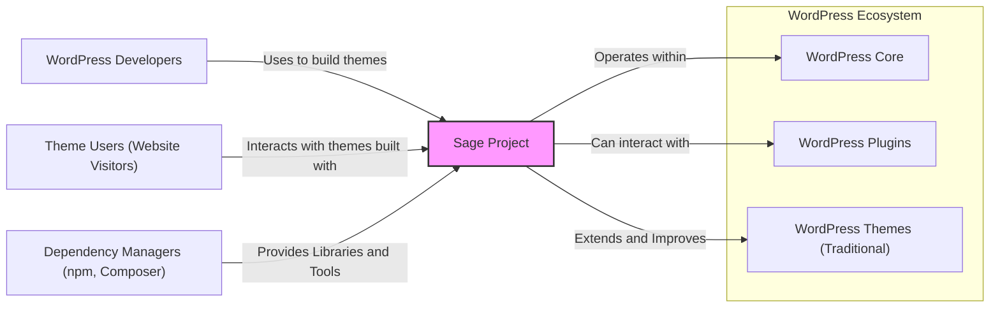
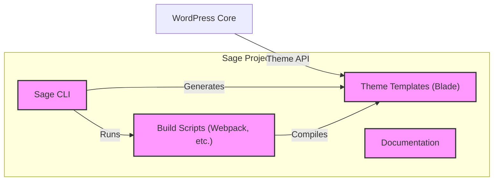
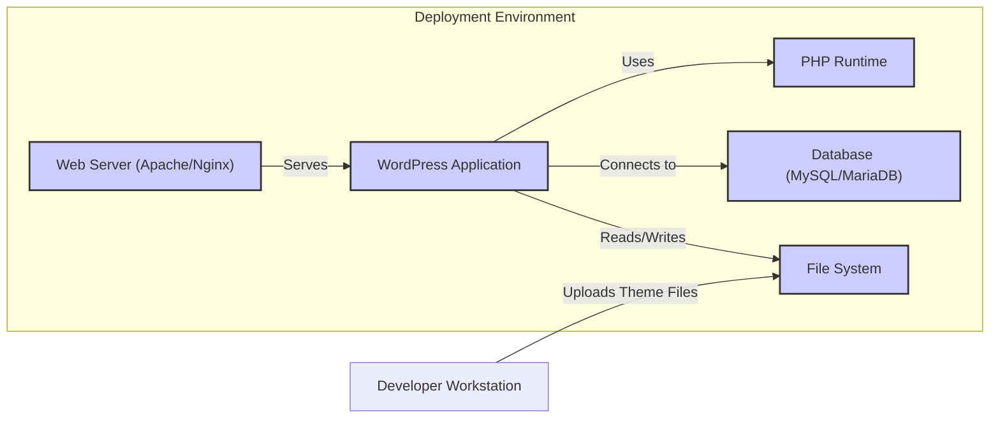

# BUSINESS POSTURE

This project, represented by the Github repository roots/sage, is a WordPress starter theme aimed at providing a more streamlined and modern development experience for building WordPress themes.

- Business Priorities and Goals:
  - Enhance WordPress theme development efficiency and developer experience.
  - Promote modern web development practices within the WordPress ecosystem.
  - Provide a robust and well-structured foundation for building high-quality WordPress themes.
  - Foster a community around modern WordPress theme development.
  - Enable developers to create performant and maintainable WordPress themes.

- Business Risks:
  - Security vulnerabilities in themes built using Sage, potentially stemming from the framework itself or developer misuse.
  - Compatibility issues with future WordPress core updates, requiring ongoing maintenance and updates to Sage.
  - Developer adoption rate might be lower than expected if the learning curve is too steep or if it doesn't adequately address developer needs.
  - Community support might be insufficient, leading to slower issue resolution and less overall project robustness.
  - Performance bottlenecks introduced by the framework itself, negating the goal of performant themes.

# SECURITY POSTURE

- Existing Security Controls:
  - security control: Dependency management using `composer` and `npm` to manage third-party libraries (described in `composer.json` and `package.json`).
  - security control: Use of a templating engine (Blade) which can help mitigate some output encoding vulnerabilities (implicitly implemented in the framework).
  - security control: WordPress coding standards and best practices are generally encouraged (implicitly through the framework structure and community guidelines).
  - accepted risk: Reliance on WordPress core security. Sage themes operate within the WordPress environment and inherit the security posture of WordPress itself.
  - accepted risk: Security of third-party dependencies. Sage relies on external libraries managed by `composer` and `npm`, and vulnerabilities in these dependencies are a potential risk.

- Recommended Security Controls:
  - security control: Implement automated security scanning of dependencies using tools like `npm audit` and `composer audit` in the build process.
  - security control: Introduce static application security testing (SAST) tools to scan the Sage codebase and example themes for potential vulnerabilities.
  - security control: Establish a clear process for reporting and handling security vulnerabilities within the Sage project.
  - security control: Provide security guidelines and best practices documentation for developers building themes with Sage, focusing on common WordPress security pitfalls.

- Security Requirements:
  - Authentication:
    - Themes built with Sage operate within the WordPress authentication context. Theme code should not implement its own authentication mechanisms but rely on WordPress's built-in authentication.
  - Authorization:
    - Themes should respect WordPress's role-based authorization system. Theme functionality should be designed to align with WordPress user roles and capabilities.
  - Input Validation:
    - All user inputs handled by themes built with Sage must be properly validated and sanitized to prevent common vulnerabilities like Cross-Site Scripting (XSS) and SQL Injection (if themes directly interact with the database, which is generally discouraged in WordPress theme development). This should be implemented within theme code built using Sage.
  - Cryptography:
    - Themes should leverage HTTPS for all communication. Sensitive data handling within themes should adhere to cryptographic best practices, although themes typically should not handle highly sensitive data directly. If themes need to store or transmit sensitive data, proper encryption methods should be employed, ideally leveraging WordPress APIs where available.

# DESIGN

## C4 CONTEXT

- Context Diagram Elements:
  - - Name: Sage Project
    - Type: Software System
    - Description: A WordPress starter theme providing a modern development workflow and improved structure for building WordPress themes.
    - Responsibilities:
      - Provide a base framework for WordPress theme development.
      - Offer a modern development environment using tools like Blade templating, webpack, and Yarn/npm.
      - Improve theme organization and maintainability.
    - Security controls:
      - Security controls are primarily focused on secure coding practices and dependency management.

  - - Name: WordPress Developers
    - Type: Person
    - Description: Developers who use Sage to build custom WordPress themes.
    - Responsibilities:
      - Develop WordPress themes using the Sage framework.
      - Customize and extend Sage to meet specific project requirements.
      - Deploy and maintain WordPress themes built with Sage.
    - Security controls:
      - Responsible for secure coding practices when developing themes using Sage.
      - Should follow security guidelines and best practices for WordPress theme development.

  - - Name: Theme Users (Website Visitors)
    - Type: Person
    - Description: End-users who visit websites using WordPress themes built with Sage.
    - Responsibilities:
      - Interact with the website frontend.
      - Generate requests to the WordPress application.
    - Security controls:
      - Security is indirectly impacted by the security of the theme and the WordPress installation.

  - - Name: WordPress Core
    - Type: Software System
    - Description: The core WordPress content management system that Sage themes operate within.
    - Responsibilities:
      - Provide the underlying platform for WordPress websites.
      - Handle content management, user management, and core functionalities.
      - Enforce core WordPress security measures.
    - Security controls:
      - Implements core WordPress security features, including authentication, authorization, and security updates.

  - - Name: WordPress Plugins
    - Type: Software System
    - Description: Extend the functionality of WordPress websites. Themes built with Sage may interact with plugins.
    - Responsibilities:
      - Provide additional features and functionalities to WordPress websites.
      - Interact with themes and WordPress core.
    - Security controls:
      - Security depends on the plugin's development and security practices.

  - - Name: WordPress Themes (Traditional)
    - Type: Software System
    - Description: Standard WordPress themes built without Sage, representing the conventional approach to WordPress theme development that Sage aims to improve upon.
    - Responsibilities:
      - Provide website presentation and frontend functionality.
      - Represent the traditional way of building WordPress themes.
    - Security controls:
      - Security depends on the theme's development and security practices.

  - - Name: Dependency Managers (npm, Composer)
    - Type: Software System
    - Description: Package managers used to manage JavaScript and PHP dependencies for Sage and themes built with it.
    - Responsibilities:
      - Manage and install project dependencies.
      - Provide access to a vast ecosystem of libraries and tools.
    - Security controls:
      - Security relies on the security of the package registries and the integrity of downloaded packages.

## C4 CONTAINER

- Container Diagram Elements:
  - - Name: Sage CLI
    - Type: Application
    - Description: Command-line interface tool for creating and managing Sage-based WordPress themes.
    - Responsibilities:
      - Theme scaffolding and project setup.
      - Running build processes.
      - Development utilities.
    - Security controls:
      - Input validation for CLI commands and parameters.
      - Secure handling of project configuration files.

  - - Name: Theme Templates (Blade)
    - Type: Application
    - Description: Blade template files that define the structure and presentation of the WordPress theme.
    - Responsibilities:
      - Rendering dynamic content from WordPress.
      - Defining the frontend structure and layout.
      - Implementing theme functionality.
    - Security controls:
      - Output encoding to prevent XSS vulnerabilities.
      - Adherence to secure coding practices in template logic.

  - - Name: Build Scripts (Webpack, etc.)
    - Type: Application
    - Description: Scripts and configuration files used to build and compile theme assets (CSS, JavaScript, etc.).
    - Responsibilities:
      - Asset compilation and optimization.
      - Dependency management during build.
      - Code linting and potentially security scanning.
    - Security controls:
      - Dependency scanning for vulnerabilities during build.
      - Secure configuration of build tools to prevent supply chain attacks.

  - - Name: Documentation
    - Type: Documentation
    - Description: Documentation for Sage, including usage guides, best practices, and security considerations.
    - Responsibilities:
      - Provide guidance for developers using Sage.
      - Document security best practices for theme development.
      - Explain the framework's features and functionalities.
    - Security controls:
      - Documentation itself is not a direct security control but informs developers about security best practices.

## DEPLOYMENT

Deployment of themes built with Sage typically follows standard WordPress theme deployment practices.  A common approach is described below, focusing on a typical shared hosting or VPS environment.

- Deployment Diagram Elements:
  - - Name: Web Server (Apache/Nginx)
    - Type: Infrastructure
    - Description: Web server software responsible for handling HTTP requests and serving the WordPress application.
    - Responsibilities:
      - Serving static and dynamic content.
      - Handling HTTP requests and responses.
      - SSL/TLS termination for HTTPS.
    - Security controls:
      - Web server hardening (e.g., disabling unnecessary modules, configuring security headers).
      - Regular security updates and patching.
      - Firewall configuration.

  - - Name: PHP Runtime
    - Type: Infrastructure
    - Description: PHP interpreter that executes the WordPress application code.
    - Responsibilities:
      - Executing PHP scripts.
      - Processing WordPress code and theme logic.
    - Security controls:
      - Keeping PHP runtime updated with security patches.
      - Disabling insecure PHP functions.
      - Configuring PHP settings for security (e.g., `open_basedir`).

  - - Name: WordPress Application
    - Type: Software System
    - Description: The WordPress CMS application, including core files, plugins, and the Sage-based theme.
    - Responsibilities:
      - Content management and website functionality.
      - Handling user requests and interactions.
      - Database interaction.
    - Security controls:
      - WordPress core security features and updates.
      - Security plugins (if used).
      - Theme security (including Sage-based theme security).

  - - Name: Database (MySQL/MariaDB)
    - Type: Infrastructure
    - Description: Database server used by WordPress to store website data.
    - Responsibilities:
      - Storing website content, user data, and settings.
      - Providing data persistence.
    - Security controls:
      - Database server hardening.
      - Access control and user permissions.
      - Regular backups.
      - Database security updates and patching.

  - - Name: File System
    - Type: Infrastructure
    - Description: Server file system where WordPress files, themes, and uploads are stored.
    - Responsibilities:
      - Storing application files and user uploads.
      - Providing file access to the web server and PHP runtime.
    - Security controls:
      - File system permissions and access control.
      - Regular backups.
      - Monitoring for unauthorized file changes.

  - - Name: Developer Workstation
    - Type: Infrastructure
    - Description: Developer's local machine used to develop and build the Sage-based theme.
    - Responsibilities:
      - Theme development and code editing.
      - Building theme assets.
      - Uploading theme files to the deployment environment.
    - Security controls:
      - Secure development practices on the workstation.
      - Secure transfer of theme files (e.g., using SFTP/SCP).

## BUILD

```mermaid
graph LR
    A["Developer"] -- "Code Changes, Commits" --> B["Version Control (Git/GitHub)"]
    B -- "Triggers" --> C["CI/CD System (GitHub Actions)"]
    C -- "Pulls Code, Dependencies" --> D["Build Environment"]
    D -- "Runs Build Scripts, Linters, SAST" --> E["Build Artifacts (Theme Files)"]
    E -- "Stores" --> F["Artifact Repository"]
    F -- "Deploys to" --> G["Deployment Environment"]
    style C fill:#ccf,stroke:#333,stroke-width:2px
    style D fill:#ccf,stroke:#333,stroke-width:2px
    style E fill:#ccf,stroke:#333,stroke-width:2px
    style F fill:#ccf,stroke:#333,stroke-width:2px
```

- Build Process Elements:
  - - Name: Developer
    - Type: Person
    - Description: Software developer working on the Sage project or themes built with Sage.
    - Responsibilities:
      - Writing and modifying code.
      - Committing code changes to version control.
      - Testing and debugging code.
    - Security controls:
      - Secure coding practices.
      - Code reviews.
      - Local development environment security.

  - - Name: Version Control (Git/GitHub)
    - Type: Software System
    - Description: Version control system used to manage the Sage codebase and theme code.
    - Responsibilities:
      - Tracking code changes and history.
      - Collaboration and code sharing.
      - Branching and merging.
    - Security controls:
      - Access control and permissions for repository access.
      - Branch protection and code review requirements.
      - Audit logging of repository activities.

  - - Name: CI/CD System (GitHub Actions)
    - Type: Software System
    - Description: Continuous Integration and Continuous Delivery system used to automate the build, test, and deployment processes. Example: GitHub Actions.
    - Responsibilities:
      - Automated build execution.
      - Running tests and security checks.
      - Artifact creation and publishing.
      - Deployment automation.
    - Security controls:
      - Secure configuration of CI/CD pipelines.
      - Secret management for credentials and API keys.
      - Build environment isolation.
      - Security scanning integration (SAST, dependency checks).

  - - Name: Build Environment
    - Type: Infrastructure
    - Description: Isolated environment where the build process is executed.
    - Responsibilities:
      - Providing a consistent and reproducible build environment.
      - Executing build scripts and tools.
      - Isolating the build process from other systems.
    - Security controls:
      - Hardened build environment.
      - Minimal software installed in the build environment.
      - Secure access to build environment.

  - - Name: Build Artifacts (Theme Files)
    - Type: Data
    - Description: Output of the build process, typically theme files ready for deployment.
    - Responsibilities:
      - Representing the compiled and packaged theme.
      - Being deployed to the target environment.
    - Security controls:
      - Integrity checks of build artifacts.
      - Secure storage of build artifacts.

  - - Name: Artifact Repository
    - Type: Software System
    - Description: Repository for storing and managing build artifacts.
    - Responsibilities:
      - Securely storing build artifacts.
      - Versioning and managing artifacts.
      - Providing access to artifacts for deployment.
    - Security controls:
      - Access control and authentication for artifact repository.
      - Encryption of artifacts at rest and in transit.
      - Audit logging of artifact access.

  - - Name: Deployment Environment
    - Type: Infrastructure
    - Description: Target environment where the WordPress theme is deployed and runs (as described in DEPLOYMENT section).
    - Responsibilities:
      - Hosting and running the WordPress application and theme.
      - Serving the website to users.
    - Security controls:
      - Security controls as described in the DEPLOYMENT section.

# RISK ASSESSMENT

- Critical Business Processes:
  - Development and release of secure and functional WordPress themes using Sage.
  - Maintaining the Sage framework to be compatible with WordPress and modern web standards.
  - Community adoption and trust in Sage as a reliable theme development framework.

- Data to Protect and Sensitivity:
  - Sage codebase itself (intellectual property, project integrity). Sensitivity: High (integrity, availability).
  - Themes built with Sage (customer projects, potential vulnerabilities). Sensitivity: Medium to High (depending on the theme's purpose and data handling).
  - User data within WordPress instances using Sage-based themes (if themes handle user data). Sensitivity: High (confidentiality, integrity, availability, depending on data type).
  - Build artifacts (theme files). Sensitivity: Medium (integrity, availability).

# QUESTIONS & ASSUMPTIONS

- Questions:
  - What is the intended target audience for Sage in terms of company size and risk appetite? (Startup, Fortune 500, individual developers?)
  - Are there specific compliance requirements that themes built with Sage need to adhere to (e.g., GDPR, PCI DSS)?
  - What is the process for reporting and handling security vulnerabilities in Sage and themes built with it?
  - Are there any existing security scanning or testing practices in place for Sage development?
  - What are the typical deployment environments for themes built with Sage? (Shared hosting, VPS, cloud platforms?)

- Assumptions:
  - Sage is primarily used by WordPress developers to build custom themes for various clients or projects.
  - Security is a concern for projects built with Sage, but the level of security required may vary depending on the project and client.
  - Deployment environments are diverse, ranging from shared hosting to more managed environments.
  - The focus is on providing a secure foundation for theme development, but developers are ultimately responsible for the security of the themes they build using Sage.
  - The project aims for a balance between developer experience and security.