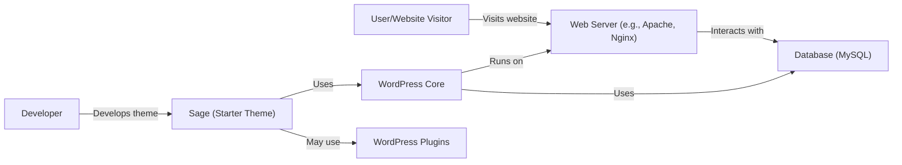
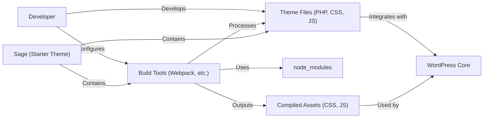
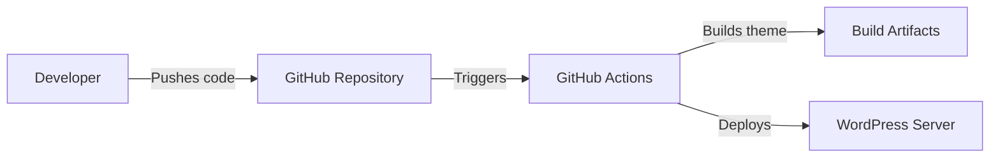
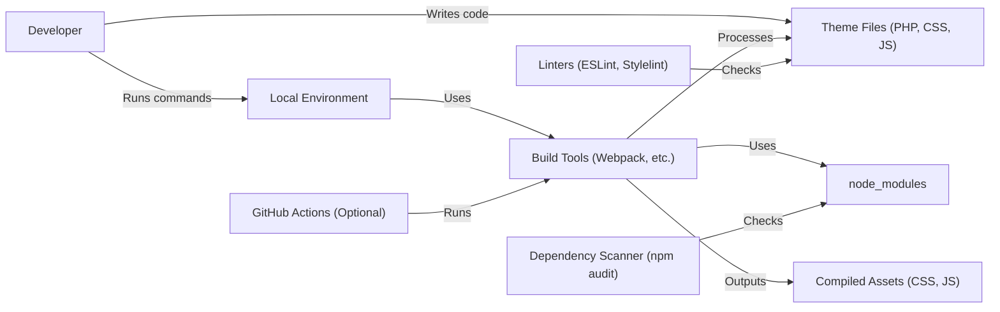

Okay, let's create a design document for the Sage project from the Roots organization on GitHub.

# BUSINESS POSTURE

Sage is a WordPress starter theme.  It aims to provide a modern development workflow for WordPress theme creation, improving developer productivity and potentially the quality and maintainability of the resulting themes.  It's not a final product used directly by end-users, but a tool for developers.  The business priorities are likely:

*   Developer productivity:  Reduce the time and effort required to build high-quality WordPress themes.
*   Theme quality:  Promote best practices in theme development, leading to more maintainable, performant, and secure themes.
*   Community adoption:  Encourage widespread use of Sage within the WordPress developer community.
*   Reputation: Enhance Roots' reputation as a provider of high-quality WordPress development tools.

Business risks that need to be addressed:

*   Security vulnerabilities in the starter theme could be propagated to many production websites.
*   Poorly designed or documented features could hinder developer productivity rather than improve it.
*   Lack of compatibility with popular WordPress plugins or hosting environments could limit adoption.
*   Failure to keep up with WordPress core updates could render Sage obsolete.

# SECURITY POSTURE

Sage, as a starter theme, provides a foundation upon which developers build.  Therefore, its security posture is crucial.  It's also important to distinguish between the security of Sage itself (the build tools, dependencies, etc.) and the security of the themes *created* with Sage (which depends heavily on the developer using it).

Existing security controls (in Sage itself):

*   security control: Modern build tools (Webpack, etc.) that can help manage dependencies and minimize JavaScript code, reducing the attack surface. (Described in Sage documentation and package.json)
*   security control: Linting (ESLint, Stylelint) to enforce coding standards and potentially catch some security-related issues. (Described in Sage documentation and configuration files)
*   security control: Focus on using up to date dependencies. (Described in package.json)

Accepted risks:

*   accepted risk: Sage, by its nature, cannot guarantee the security of the final theme.  Developers using Sage are ultimately responsible for the security of their code.
*   accepted risk: Vulnerabilities in third-party dependencies (npm packages) could impact Sage or themes built with it.
*   accepted risk: The default Sage theme may not include all possible security hardening measures for WordPress.

Recommended security controls (high priority):

*   security control: Integrate a dependency vulnerability scanner (e.g., `npm audit`, Dependabot) into the build process.
*   security control: Provide clear documentation and examples of secure coding practices for WordPress theme development within the Sage context.
*   security control: Consider adding basic security headers (e.g., X-Content-Type-Options, X-Frame-Options, Content-Security-Policy) to the default theme configuration, with clear instructions on how to customize them.
*   security control: Implement a process for regularly reviewing and updating dependencies.

Security Requirements:

*   Authentication: Sage itself doesn't handle authentication directly. It relies on WordPress's built-in authentication mechanisms. Developers using Sage should follow WordPress best practices for secure user authentication and password management.
*   Authorization: Similar to authentication, Sage relies on WordPress's role and capability system. Developers should use these features appropriately to control access to theme functionality.
*   Input Validation: Sage should encourage (through documentation and examples) thorough input validation and sanitization in all theme code. This is crucial to prevent cross-site scripting (XSS), SQL injection, and other vulnerabilities. Developers should utilize WordPress's built-in functions for escaping and sanitizing data.
*   Cryptography: Sage should leverage WordPress's built-in cryptographic functions (e.g., for password hashing) rather than implementing custom cryptography.

# DESIGN

## C4 CONTEXT

C4 CONTEXT Elements Description:

*   Element:
    *   Name: User/Website Visitor
    *   Type: Person
    *   Description: The end-user who interacts with the website built using a Sage-based theme.
    *   Responsibilities: Browses the website, interacts with its features.
    *   Security controls: N/A (client-side)

*   Element:
    *   Name: Developer
    *   Type: Person
    *   Description: The WordPress theme developer who uses Sage to build a custom theme.
    *   Responsibilities: Writes theme code, configures Sage, manages dependencies, deploys the theme.
    *   Security controls: Secure coding practices, use of secure development tools.

*   Element:
    *   Name: WordPress Core
    *   Type: Software System
    *   Description: The core WordPress content management system.
    *   Responsibilities: Provides the underlying platform for the website, including content management, user management, plugin integration, etc.
    *   Security controls: WordPress core security features, regular updates, security plugins.

*   Element:
    *   Name: WordPress Plugins
    *   Type: Software System
    *   Description: Third-party plugins that extend the functionality of WordPress.
    *   Responsibilities: Provide additional features and functionality.
    *   Security controls: Plugin-specific security measures, regular updates.

*   Element:
    *   Name: Sage (Starter Theme)
    *   Type: Software System
    *   Description: The Sage starter theme, providing a modern development workflow and build tools.
    *   Responsibilities: Provides a foundation for theme development, manages assets, compiles code.
    *   Security controls: Dependency management, linting, secure coding practices (encouraged).

*   Element:
    *   Name: Web Server (e.g., Apache, Nginx)
    *   Type: Software System
    *   Description: The web server that hosts the WordPress website.
    *   Responsibilities: Serves web pages, handles HTTP requests, interacts with WordPress.
    *   Security controls: Web server security configuration, firewall, HTTPS.

*   Element:
    *   Name: Database (MySQL)
    *   Type: Software System
    *   Description: The database that stores WordPress content, user data, and settings.
    *   Responsibilities: Stores and retrieves data.
    *   Security controls: Database security configuration, access controls, regular backups.

## C4 CONTAINER

C4 CONTAINER Elements Description:

*   Element:
    *   Name: Developer
    *   Type: Person
    *   Description: The WordPress theme developer.
    *   Responsibilities: Writes theme code, configures build tools, manages dependencies.
    *   Security controls: Secure coding practices, use of secure development tools.

*   Element:
    *   Name: Sage (Starter Theme)
    *   Type: Container
    *   Description: The Sage starter theme project directory.
    *   Responsibilities: Contains all source code and configuration for the theme.
    *   Security controls: Directory permissions, secure configuration.

*   Element:
    *   Name: Build Tools (Webpack, etc.)
    *   Type: Container (Application)
    *   Description: Tools used to process and compile theme assets.
    *   Responsibilities: Manages dependencies, compiles CSS and JS, optimizes assets.
    *   Security controls: Dependency vulnerability scanning, secure configuration of build tools.

*   Element:
    *   Name: Theme Files (PHP, CSS, JS)
    *   Type: Container (Code)
    *   Description: The source code for the WordPress theme.
    *   Responsibilities: Defines the theme's structure, appearance, and functionality.
    *   Security controls: Secure coding practices, input validation, output escaping, adherence to WordPress coding standards.

*   Element:
    *   Name: node_modules
    *   Type: Container (Directory)
    *   Description: Directory containing project dependencies installed via npm.
    *   Responsibilities: Provides libraries and tools used by the build process and potentially by the theme itself.
    *   Security controls: Regular dependency updates, vulnerability scanning.

*   Element:
    *   Name: Compiled Assets (CSS, JS)
    *   Type: Container (Files)
    *   Description: The compiled and optimized CSS and JavaScript files ready for deployment.
    *   Responsibilities: Provide styling and functionality for the website.
    *   Security controls: Minification, secure configuration of asset delivery (e.g., subresource integrity).

*   Element:
    *   Name: WordPress Core
    *   Type: Software System
    *   Description: The core WordPress content management system.
    *   Responsibilities: Provides the underlying platform for the website.
    *   Security controls: WordPress core security features, regular updates.

## DEPLOYMENT

Possible deployment solutions:

1.  Manual upload (FTP/SFTP):  The developer manually uploads the compiled theme files to the WordPress server.
2.  Version control deployment (Git):  The developer pushes the theme code to a Git repository, and a deployment script on the server pulls the latest changes.
3.  Continuous integration/continuous deployment (CI/CD):  A CI/CD pipeline automatically builds and deploys the theme to the server whenever changes are pushed to the repository.
4.  WordPress-specific deployment tools: Tools like WP Pusher or DeployHQ can be used to streamline the deployment process.

Chosen solution (for detailed description):  CI/CD with GitHub Actions.

DEPLOYMENT Elements Description:

*   Element:
    *   Name: Developer
    *   Type: Person
    *   Description: The WordPress theme developer.
    *   Responsibilities: Writes code, commits changes, pushes to the repository.
    *   Security controls: Secure coding practices, use of strong passwords, two-factor authentication for Git access.

*   Element:
    *   Name: GitHub Repository
    *   Type: Code Repository
    *   Description: The Git repository hosting the Sage theme code.
    *   Responsibilities: Stores the code, tracks changes, triggers CI/CD workflows.
    *   Security controls: Repository access controls, branch protection rules, code review policies.

*   Element:
    *   Name: GitHub Actions
    *   Type: CI/CD Platform
    *   Description: The CI/CD service provided by GitHub.
    *   Responsibilities: Automates the build, test, and deployment process.
    *   Security controls: Secure configuration of workflows, use of secrets management, limited permissions for workflow actions.

*   Element:
    *   Name: WordPress Server
    *   Type: Server
    *   Description: The server hosting the WordPress website.
    *   Responsibilities: Runs the WordPress application, serves web pages.
    *   Security controls: Server hardening, firewall, intrusion detection system, regular security updates.

*   Element:
    *   Name: Build Artifacts
    *   Type: Files
    *   Description: The compiled theme files produced by the build process.
    *   Responsibilities: Represent the deployable version of the theme.
    *   Security controls: Integrity checks, secure transfer to the server.

## BUILD

Build Process Description:

1.  The developer writes theme code (PHP, CSS, JavaScript) in their local development environment.
2.  Build tools (primarily Webpack, configured within Sage) are used to process the code.
3.  These tools utilize dependencies installed via npm (stored in `node_modules`).
4.  Linters (ESLint, Stylelint) are run to enforce code style and identify potential errors.
5.  A dependency scanner (`npm audit` or similar) checks for known vulnerabilities in the project's dependencies.
6.  The build tools compile and optimize the assets (CSS, JavaScript) into a deployable format.
7.  Optionally, a CI environment (like GitHub Actions) can automate this entire build process on every code push.

Security Controls in Build Process:

*   security control: Linting (ESLint, Stylelint): Enforces coding standards and can help prevent some security-related issues.
*   security control: Dependency vulnerability scanning (`npm audit`, Dependabot): Identifies known vulnerabilities in project dependencies.
*   security control: Automated builds (CI/CD): Ensures consistent and repeatable builds, reducing the risk of manual errors.
*   security control: Code review (if using a CI/CD system with pull requests): Allows for peer review of code changes before they are merged.
*   security control: Supply chain security: Using a package-lock.json or yarn.lock file to ensure consistent dependency versions.

# RISK ASSESSMENT

*   Critical business process we are trying to protect: The development and deployment of WordPress themes.  The integrity and availability of websites built using Sage-derived themes are indirectly protected.
*   Data we are trying to protect:
    *   Source code of the Sage starter theme and the themes created with it (low sensitivity, but important for intellectual property and preventing malicious modifications).
    *   Website content and user data (stored in the WordPress database - sensitivity varies greatly depending on the website). Sage itself doesn't directly handle this data, but vulnerabilities in a Sage-derived theme could expose it.
    *   Developer credentials (e.g., for Git repositories, deployment servers) - high sensitivity.

# QUESTIONS & ASSUMPTIONS

*   Questions:
    *   What is the expected level of WordPress security expertise of developers using Sage?  This will influence the level of detail needed in security documentation.
    *   Are there any specific compliance requirements (e.g., PCI DSS, GDPR) that need to be considered for websites built using Sage?
    *   What is the preferred method of deploying Sage-based themes? (This will affect the recommendations for deployment security.)
    *   What level of support will be provided for Sage users, particularly regarding security issues?

*   Assumptions:
    *   BUSINESS POSTURE: The primary goal is to improve developer productivity and theme quality, with security being a significant concern.
    *   SECURITY POSTURE: Developers using Sage have a basic understanding of web security principles but may not be WordPress security experts.
    *   DESIGN: Sage is used in a typical WordPress development workflow, with a local development environment, a build process, and deployment to a web server. The deployment environment is assumed to be a standard LAMP/LEMP stack.