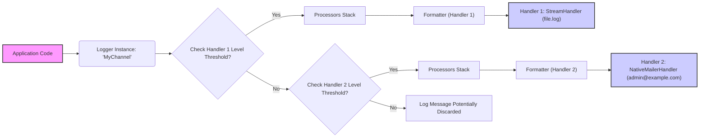

# Project Design Document: Monolog Logging Library

**Version:** 1.1
**Date:** October 26, 2023
**Author:** AI Software Architect

## 1. Introduction

This document provides an enhanced and detailed design overview of the Monolog PHP logging library, specifically tailored for threat modeling purposes. It elaborates on the architecture, key components, data flow, and security considerations to facilitate a comprehensive understanding of the system's inner workings and potential security vulnerabilities.

## 2. Project Overview

Monolog is a widely adopted and highly flexible logging library for PHP applications. Its core function is to decouple the process of recording log events from the specific destinations where those logs are stored. This allows developers to send logs to a variety of handlers, including files, databases, email services, and external monitoring platforms.

## 3. Goals

*   To offer a consistent and extensible interface for logging within PHP applications.
*   To support a diverse range of log destinations through its handler system.
*   To enable the modification and formatting of log records before they reach their final destination.
*   To provide a clear hierarchy of logging levels (e.g., DEBUG, INFO, NOTICE, WARNING, ERROR, CRITICAL, ALERT, EMERGENCY) for categorizing log messages by severity.
*   To ensure seamless integration into existing and new PHP projects.

## 4. Non-Goals

*   To provide built-in capabilities for log analysis, searching, or visualization. These are typically handled by separate tools or services.
*   To offer native log rotation mechanisms. Log rotation is generally managed by the operating system, specific handler configurations, or external utilities.
*   To manage general application configuration beyond the settings directly related to logging.

## 5. Architecture and Components

Monolog's architecture is modular and centers around the interaction between loggers, handlers, processors, and formatters.

*   **Logger:**
    *   The primary interface for recording log messages within the application.
    *   Accepts log messages with a specified level and routes them to the appropriate handlers based on their configured minimum log level.
    *   Maintains an ordered stack of processors and handlers that will be applied to each log record.
    *   Each Logger instance is typically associated with a specific "channel" to categorize log messages.
*   **Handlers:**
    *   The components responsible for writing log records to a specific destination. Each handler is configured to handle messages at or above a certain log level.
    *   Examples of common handlers and their security implications:
        *   `StreamHandler`: Writes log messages to a file or any PHP stream.
            *   **Security Implication:** Requires careful management of file permissions to prevent unauthorized access or modification of log files. Potential for log injection if not handled properly.
        *   `RotatingFileHandler`: Extends `StreamHandler` by rotating log files based on size or date.
            *   **Security Implication:** Inherits the security concerns of `StreamHandler`. Proper configuration of rotation policies is crucial to prevent disk exhaustion.
        *   `SyslogHandler`: Sends log messages to the system's syslog daemon.
            *   **Security Implication:** Relies on the security configuration of the syslog daemon. Log messages might be visible to other processes on the system.
        *   `ErrorLogHandler`: Uses PHP's built-in `error_log()` function.
            *   **Security Implication:**  Log destination is configured in `php.ini`, which needs to be secured.
        *   `NativeMailerHandler`: Sends log messages via email using PHP's `mail()` function.
            *   **Security Implication:** Email headers can be manipulated. Ensure secure SMTP configurations are used to prevent spoofing or unauthorized relaying. Sensitive information in logs could be exposed if email is not encrypted.
        *   `SocketHandler`: Sends log messages over a network socket (TCP or UDP).
            *   **Security Implication:** Requires secure communication protocols (e.g., TLS) to protect log data in transit. Authentication and authorization might be needed at the receiving end.
        *   `PushoverHandler`, `SlackHandler`, `TelegramBotHandler`, etc.: Send logs to third-party services via their APIs.
            *   **Security Implication:** API keys or tokens must be stored securely and not exposed in logs or configuration. The security of the third-party service is also a factor.
        *   Database Handlers (e.g., `DoctrineCouchDBHandler`, `MongoDBHandler`, `PdoHandler`): Store logs in databases.
            *   **Security Implication:** Requires secure database credentials and proper access controls to prevent unauthorized access or modification of log data. Potential for SQL injection if log messages are not properly sanitized before being inserted into the database.
*   **Processors:**
    *   Callable objects or functions that are executed sequentially on a log record after it's created but before it's passed to the handlers.
    *   Processors can add extra information to the log record's `extra` or `context` data.
    *   Examples of common processors:
        *   `IntrospectionProcessor`: Adds information about the file, line number, class, and method where the log message originated.
            *   **Security Implication:** While generally safe, excessive detail might inadvertently expose internal application structure.
        *   `WebProcessor`: Adds information about the current web request, such as the URL, HTTP method, client IP address, and user agent.
            *   **Security Implication:** Can expose potentially sensitive user information. Ensure compliance with privacy regulations.
        *   `MemoryUsageProcessor`: Adds information about the current memory usage.
            *   **Security Implication:**  Generally safe.
        *   `UidProcessor`: Adds a unique identifier to each log record.
            *   **Security Implication:** Generally safe.
        *   Custom Processors: Developers can create their own processors to add specific information or modify log records.
            *   **Security Implication:**  Security depends entirely on the implementation of the custom processor. Ensure proper input validation and avoid introducing vulnerabilities.
*   **Formatters:**
    *   Responsible for converting the log record into a specific string format before it's written by a handler. Each handler typically has an associated formatter.
    *   Examples of common formatters:
        *   `LineFormatter`: A simple formatter that outputs log messages as plain text.
            *   **Security Implication:**  Potential for log injection if not used with proper escaping.
        *   `HtmlFormatter`: Formats log messages as HTML.
            *   **Security Implication:**  Primarily for display purposes, but ensure proper escaping to prevent HTML injection if logs are viewed in a web browser.
        *   `JsonFormatter`: Formats log messages as JSON.
            *   **Security Implication:**  Generally safe for machine-readable logs.
        *   `LogstashFormatter`: Formats logs in a structure suitable for Logstash.
            *   **Security Implication:**  Depends on the security of the Logstash pipeline.
        *   `GelfMessageFormatter`: Formats logs according to the Graylog Extended Log Format (GELF).
            *   **Security Implication:** Depends on the security of the Graylog setup.
        *   Custom Formatters: Developers can create their own formatters.
            *   **Security Implication:** Security depends on the implementation. Ensure proper escaping and avoid introducing vulnerabilities.
*   **Log Record:**
    *   A structured data object representing a single log event.
    *   Contains the following key attributes:
        *   `message`: The actual log message string.
        *   `level`: The severity level of the log message (e.g., `Logger::ERROR`).
        *   `channel`: A string identifying the source or category of the log message.
        *   `datetime`: A `DateTimeImmutable` object representing the time the log event occurred.
        *   `context`: An array of arbitrary contextual information associated with the log message.
        *   `extra`: An array of additional information added by processors.

## 6. Data Flow

The flow of a log message through Monolog involves several stages:

Detailed steps:

1. The application code initiates a logging call on a specific `Logger` instance, specifying the log level and message (e.g., `$myLogger->warning('User login failed', ['username' => $username]);`).
2. The `Logger` iterates through its attached handlers. For each handler, it checks if the log level of the message meets or exceeds the handler's configured minimum level.
3. If a handler's level threshold is met, the log record is passed through the stack of registered **processors**. Each processor modifies the `context` or `extra` data of the log record. Processors are executed in the order they are registered.
4. After processing, the log record is passed to the handler's configured **formatter**. The formatter transforms the log record into a string representation suitable for the handler's destination.
5. The formatted log message is then written to the handler's designated output (e.g., a file, a database, an email server, a third-party API).
6. If none of the attached handlers meet the log level threshold, the log message might be discarded, depending on the application's configuration.

## 7. Security Considerations

This section provides a more detailed breakdown of potential security threats and considerations for Monolog:

*   **Log Injection Attacks:**
    *   **Threat:** Attackers can inject malicious content into log messages by manipulating input data that is subsequently logged without proper sanitization. This can lead to:
        *   **Log Forgery:** Injecting false or misleading log entries to cover up malicious activities.
        *   **Code Injection (less common but possible):** In specific scenarios, if log files are processed by other systems without proper sanitization, injected code could be executed.
        *   **Information Disclosure:** Injecting carefully crafted messages that, when processed by log analysis tools, reveal sensitive information.
    *   **Mitigation:**
        *   Sanitize or escape user-provided data before including it in log messages.
        *   Use parameterized logging where supported by handlers (e.g., database handlers).
        *   Implement strict input validation on data that will be logged.
*   **Exposure of Sensitive Information:**
    *   **Threat:** Accidental or intentional logging of sensitive data (e.g., passwords, API keys, personal identifiable information (PII), session tokens) can lead to data breaches if log destinations are compromised.
    *   **Mitigation:**
        *   Avoid logging sensitive data directly.
        *   Use processors to redact or mask sensitive information before logging.
        *   Implement strict access controls on log files and databases.
        *   Encrypt log data at rest and in transit.
        *   Regularly review log configurations and usage to identify and prevent the logging of sensitive data.
*   **Handler-Specific Vulnerabilities:**
    *   **Threat:** Each handler interacts with different systems and has its own set of potential vulnerabilities.
        *   **File Handlers:**  Insufficient file permissions, symlink attacks, disk space exhaustion.
        *   **Database Handlers:** SQL injection vulnerabilities if log messages are not properly escaped before database insertion, weak database credentials.
        *   **Email Handlers:** Email header injection, exposure of sensitive data in unencrypted emails, abuse of mail servers.
        *   **External Service Handlers:** Exposure of API keys or tokens, reliance on the security of the third-party service.
        *   **Socket Handlers:** Man-in-the-middle attacks if communication is not encrypted, unauthorized access to the socket.
    *   **Mitigation:**
        *   Follow security best practices for each specific handler type.
        *   Securely store and manage credentials for database and external service handlers.
        *   Use secure communication protocols (e.g., TLS) for network-based handlers.
        *   Regularly update handler dependencies to patch known vulnerabilities.
*   **Configuration Vulnerabilities:**
    *   **Threat:** Insecurely stored or managed Monolog configurations can be exploited by attackers to:
        *   Change log levels to suppress evidence of attacks.
        *   Redirect logs to attacker-controlled destinations.
        *   Expose sensitive credentials used by handlers.
    *   **Mitigation:**
        *   Store configuration files securely with appropriate access controls.
        *   Avoid hardcoding sensitive credentials in configuration files. Use environment variables or secure configuration management solutions.
        *   Implement mechanisms to detect and prevent unauthorized modification of configuration.
*   **Processor and Formatter Vulnerabilities:**
    *   **Threat:** Custom or poorly implemented processors and formatters can introduce vulnerabilities:
        *   **Code Injection:** If processors or formatters execute arbitrary code based on log data.
        *   **Denial of Service:** If processors or formatters consume excessive resources.
        *   **Information Disclosure:** If processors or formatters inadvertently expose sensitive information.
    *   **Mitigation:**
        *   Thoroughly review and test custom processors and formatters.
        *   Ensure that any external libraries used within processors or formatters are up-to-date and free from known vulnerabilities.
        *   Implement proper error handling within processors and formatters to prevent unexpected behavior.
*   **Denial of Service (DoS) through Logging:**
    *   **Threat:** Attackers might trigger excessive logging to overwhelm system resources (CPU, memory, disk space) or flood external logging services, leading to a denial of service.
    *   **Mitigation:**
        *   Carefully configure log levels to avoid logging excessively verbose information in production environments.
        *   Implement rate limiting or throttling on logging events.
        *   Monitor log destinations for unusual activity or excessive log volume.
        *   Consider using asynchronous logging to minimize the impact of logging on application performance.
*   **Information Disclosure in Error Messages:**
    *   **Threat:** Error messages generated by Monolog itself (e.g., during handler initialization or configuration) might reveal sensitive information about the system's internal state or configuration.
    *   **Mitigation:**
        *   Implement robust error handling within the application's logging setup.
        *   Avoid displaying detailed error messages in production environments. Log detailed errors to a secure location for debugging purposes.
*   **Dependency Vulnerabilities:**
    *   **Threat:** While Monolog's core is relatively lightweight, some handlers rely on external libraries. Vulnerabilities in these dependencies can indirectly affect Monolog's security.
    *   **Mitigation:**
        *   Regularly update Monolog and its handler dependencies to patch known vulnerabilities.
        *   Use dependency management tools (e.g., Composer) to track and manage dependencies.

## 8. Deployment Considerations

*   Monolog is typically integrated into PHP projects using Composer as a dependency.
*   Configuration of loggers, handlers, processors, and formatters is usually done within the application's bootstrap process or configuration files.
*   Consider the performance implications of different handlers, especially those involving network communication or database writes. Asynchronous logging mechanisms can be beneficial for high-traffic applications.
*   Ensure that log destinations have sufficient storage capacity and implement appropriate log rotation and retention policies.
*   Secure access to log storage locations based on the sensitivity of the logged data.
*   Implement monitoring and alerting for logging infrastructure to detect potential issues or security incidents.

## 9. Future Considerations

*   Exploring more advanced logging patterns such as structured logging and correlation IDs for improved analysis and traceability.
*   Potential integration with centralized logging systems and security information and event management (SIEM) platforms for enhanced security monitoring.
*   Further development of security-focused features, such as built-in sanitization options for common log injection vectors and more robust credential management for handlers.

This enhanced design document provides a more in-depth understanding of the Monolog logging library, specifically focusing on aspects relevant for threat modeling. By carefully considering the architecture, data flow, and potential security vulnerabilities outlined here, developers and security professionals can build more secure and resilient PHP applications.