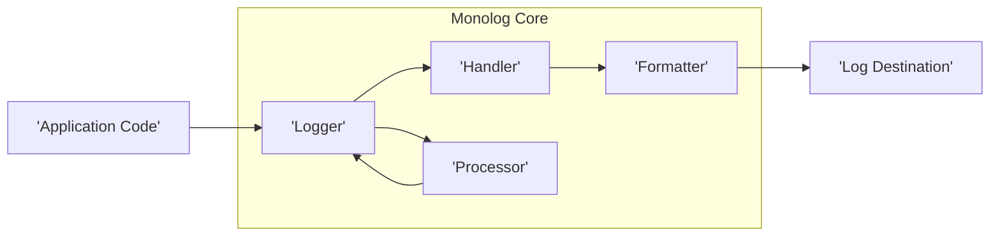
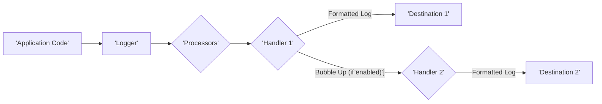

# Project Design Document: Monolog Logging Library

**Version:** 1.1
**Date:** October 26, 2023
**Author:** Gemini (AI Language Model)

## 1. Introduction

This document provides an enhanced design overview of the Monolog logging library for PHP. It aims to offer a clear and comprehensive understanding of Monolog's architecture, core components, and the flow of log data. This detailed design serves as a critical foundation for subsequent threat modeling exercises.

Monolog is a widely adopted logging library for PHP, known for its flexibility in routing log messages to various destinations through configurable handlers. This document focuses on the fundamental building blocks and their interactions within Monolog.

## 2. Goals and Objectives

*   Clearly articulate the architecture and constituent components of the Monolog library.
*   Illustrate the journey of a log message through the system.
*   Define the primary interfaces and extension points available within Monolog.
*   Provide sufficient technical depth to facilitate effective threat modeling and security analysis.

## 3. Target Audience

This document is primarily intended for:

*   Security architects and engineers tasked with performing threat modeling and security assessments.
*   Software developers seeking a deeper understanding of Monolog's internal workings.
*   System administrators responsible for managing applications that utilize Monolog for logging.

## 4. Scope

This document encompasses the essential architectural elements and functionalities of the Monolog library, including:

*   The central `Logger` class and its core responsibilities.
*   The role and purpose of `Handler` components.
*   The function of `Formatter` components in structuring log output.
*   The use of `Processor` components to enrich log context.
*   A detailed depiction of the data flow for a log message.

This document does not delve into:

*   In-depth implementation specifics of individual handlers (e.g., the intricacies of the ElasticsearchHandler).
*   Detailed configuration options for specific handlers, formatters, or processors.
*   The internal implementation logic of specific formatting or processing operations.
*   The historical development or versioning aspects of the Monolog library.

## 5. High-Level Architecture

Monolog employs a modular architecture with the `Logger` class acting as the central hub. When a log message is initiated, it's passed to the `Logger`. The `Logger` then dispatches this message to the configured `Handler` instances. `Handlers` are responsible for directing the log message to its final destination (e.g., files, databases, or external services). Before reaching the destination, `Formatters` transform the log record into a defined output structure, and `Processors` augment the log record with contextual information.

## 6. Detailed Design

### 6.1. Logger

*   **Role:** The core component responsible for initiating, processing, and dispatching log records.
*   **Functionality:**
    *   Provides a set of methods corresponding to different log severity levels (e.g., `debug()`, `info()`, `warning()`, `error()`, `critical()`).
    *   Maintains an ordered collection (stack) of registered handlers.
    *   Processes a log record by first passing it through all registered processors and then dispatching it to the relevant handlers.
    *   Implements a bubbling mechanism, allowing log messages to be processed by multiple handlers if a handler doesn't explicitly stop propagation.
*   **Key Attributes:**
    *   `Name`: A string identifier for the specific logger instance, useful for categorization.
    *   `Handlers`: An array or collection of `Handler` instances associated with this logger.
    *   `Processors`: An array or collection of `Processor` instances associated with this logger.

### 6.2. Handler

*   **Role:**  The component responsible for the actual writing or transmission of log records to a specific output.
*   **Functionality:**
    *   Receives a formatted log record string.
    *   Writes the record to its designated target, which could be a local file, a remote server, an email address, or another service.
    *   Can implement filtering logic to only process log records that meet a certain severity threshold.
    *   May have an associated `Formatter` to customize the output format specifically for that handler.
    *   Includes a mechanism to determine if a log record is considered "handled," which can prevent further processing by subsequent handlers (stopping the bubbling).
*   **Types of Handlers (Illustrative Examples):**
    *   `StreamHandler`: Writes log messages to a PHP stream resource (commonly used for files).
    *   `SyslogHandler`: Sends log messages to the system's syslog facility.
    *   `NativeMailerHandler`: Sends log messages via email using PHP's `mail()` function.
    *   `RotatingFileHandler`: Writes to files, rotating them based on size or date.
    *   `ErrorLogHandler`: Writes log messages to PHP's error log.
    *   `SlackHandler`: Sends log messages to a Slack channel.
    *   Custom Handlers: Developers can implement custom handlers to integrate with specific systems or services.
*   **Key Attributes:**
    *   `Level`: The minimum severity level this handler will process.
    *   `Bubble`: A boolean flag indicating whether to allow the log record to propagate to other handlers.
    *   `Formatter`: An instance of a `Formatter` used by this handler.

### 6.3. Formatter

*   **Role:** Responsible for transforming the structured log record (an array of data) into a specific string representation suitable for output.
*   **Functionality:**
    *   Accepts a log record array containing information such as the message, severity level, channel name, context data, and extra data.
    *   Applies formatting rules to structure this information into a readable or machine-parsable string.
    *   Supports various output formats, including plain text, JSON, XML, and more.
*   **Types of Formatters (Illustrative Examples):**
    *   `LineFormatter`: Formats log messages into a single line, allowing customization of the output pattern.
    *   `HtmlFormatter`: Formats log messages into an HTML structure for web-based viewing.
    *   `JsonFormatter`: Encodes the log record into a JSON string.
    *   `LogstashFormatter`: Formats log messages in a structure suitable for ingestion by Logstash.
    *   `NormalizerFormatter`: Provides a basic normalization of data types within the log record.
*   **Key Attributes:**
    *   `Format`: A string defining the output pattern (e.g., for `LineFormatter`).
    *   `DateFormat`: The format used for timestamps within the log message.
    *   `AllowInlineLineBreaks`: A flag to control whether line breaks are allowed within log message components.

### 6.4. Processor

*   **Role:**  Components that modify or enrich the log record with additional contextual information before it is passed to the handlers.
*   **Functionality:**
    *   Receives the log record array as input.
    *   Adds, removes, or modifies elements within the log record's data (e.g., adding user information, request details, server environment variables).
    *   Processors are executed in the order they are added to the `Logger`.
*   **Types of Processors (Illustrative Examples):**
    *   `PsrLogMessageProcessor`:  Replaces placeholders within the log message string with data from the context array, adhering to PSR-3 standards.
    *   `IntrospectionProcessor`: Adds information about the code location where the log message originated (file, class, function, line number).
    *   `WebProcessor`: Adds details about the current web request (e.g., IP address, user agent, request URI).
    *   `MemoryUsageProcessor`:  Adds information about the current memory usage of the PHP process.
    *   `GitProcessor`: Adds information about the current Git commit hash.
    *   Custom Processors: Developers can create custom processors to add application-specific context.
*   **Key Attributes:**
    *   Specific logic for manipulating the log record array.

## 7. Data Flow

The typical lifecycle of a log message within Monolog involves the following steps:

1. The application code initiates a log event by calling a logging method on a `Logger` instance (e.g., `$logger->error('Failed to process order', ['order_id' => 123])`).
2. The `Logger` creates a structured log record array. This array contains the log message, the associated severity level, the channel name of the logger, any provided contextual data, and any extra data.
3. The `Logger` iterates through its registered `Processor` instances in the order they were added. Each processor has the opportunity to modify the log record array, adding or altering information.
4. After processing, the `Logger` begins iterating through its registered `Handler` instances.
5. For each `Handler`, the `Logger` checks if the log record's severity level meets or exceeds the handler's configured minimum logging level.
6. If the severity level is sufficient, the `Handler` retrieves its associated `Formatter`.
7. The `Formatter` takes the log record array and transforms it into a formatted string representation according to its defined rules.
8. The `Handler` then proceeds to write or transmit the formatted log string to its designated output destination.
9. The `Handler` determines if the log record is considered "handled." If the `bubble` flag is set to `true` (which is the default), the log record will be passed on to the next handler in the stack. If `bubble` is `false`, processing for that specific log record stops at this handler.

## 8. Key Security Considerations

When evaluating the security posture of systems utilizing Monolog, several critical aspects warrant careful consideration:

*   **Accidental Logging of Sensitive Data:**  A primary concern is the unintentional inclusion of sensitive information (e.g., passwords, API keys, personal identifiable information, financial data) in log messages. Implement robust mechanisms for filtering, scrubbing, or masking sensitive data before logging occurs, potentially within custom processors.
*   **Log Injection Vulnerabilities:** If user-supplied data is directly incorporated into log messages without proper sanitization or encoding, attackers could inject malicious content. This could lead to log poisoning, where injected data can manipulate log analysis tools or even be interpreted as commands by vulnerable systems consuming the logs.
*   **Log Tampering and Integrity:**  For audit logs or logs used for security monitoring, the integrity of the log data is paramount. Consider the potential for unauthorized modification or deletion of log files. Implement secure storage mechanisms, access controls, and potentially digital signatures or hashing to ensure log integrity.
*   **Denial of Service (DoS) Attacks via Excessive Logging:** Malicious actors might attempt to flood the system with spurious log messages, potentially overwhelming logging infrastructure, filling up disk space, or consuming excessive resources on remote logging services. Implement rate limiting, input validation, and monitoring to mitigate this risk.
*   **Information Disclosure through Log File Exposure:** Ensure that log files are stored securely and access is strictly controlled. Misconfigured permissions or insecure storage locations could lead to the unauthorized disclosure of sensitive information contained within the logs.
*   **Security of External Handler Destinations:** The security of the external systems or services to which Monolog sends logs is crucial. For example, when using `SyslogHandler`, `SocketHandler`, or cloud-based logging services, ensure secure communication protocols (e.g., TLS), proper authentication, and authorization are in place. Vulnerabilities in these external systems could be exploited.
*   **Vulnerabilities in Custom Handlers or Processors:** If custom handlers or processors are developed, they represent potential attack surfaces if not implemented securely. Thoroughly review and test custom code to prevent the introduction of new vulnerabilities (e.g., code injection, authentication bypass).

## 9. Deployment Considerations

Deploying applications that utilize Monolog involves several considerations:

*   **Configuration Management:**  Managing Monolog's configuration (including handlers, formatters, and processors) consistently across different environments (development, staging, production) is essential. Utilize environment variables or configuration files for flexibility.
*   **Log Rotation and Archival:** Implement a robust strategy for rotating and archiving log files to prevent disk space exhaustion. Consider using tools like `logrotate` or built-in features of cloud logging services.
*   **Performance Impact of Logging:** Logging operations can introduce overhead. Choose appropriate handlers and formatting options based on the application's performance requirements. Asynchronous logging mechanisms can be considered for performance-critical applications.
*   **Error Handling within Logging:** Implement error handling around the logging process itself. Ensure that failures in writing logs do not disrupt the core functionality of the application. Consider fallback mechanisms or alerting for logging failures.

## 10. Future Considerations

*   Further detailed documentation on specific handler implementations and their configuration options.
*   Exploration of advanced logging patterns, such as structured logging and correlation IDs.
*   Guidance on integrating Monolog with centralized logging systems and monitoring tools (e.g., ELK stack, Splunk, cloud logging services).

## 11. Glossary

*   **Log Record:** A structured array of data representing a single logging event. It typically includes the log message, severity level, channel, context data, and extra information.
*   **Channel:** A named category or source identifier for log messages. Channels allow for filtering and routing of logs based on their origin.
*   **Severity Level:**  Indicates the importance or urgency of a log message. Common levels include DEBUG, INFO, NOTICE, WARNING, ERROR, CRITICAL, and ALERT. These levels are often defined according to the PSR-3 standard.
*   **Bubbling:** The mechanism by which a log record is passed from one handler to the next in the stack if the current handler does not explicitly mark the record as handled.
