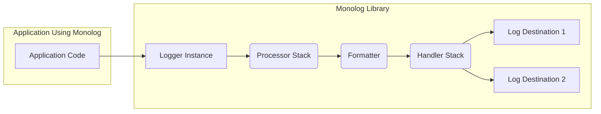
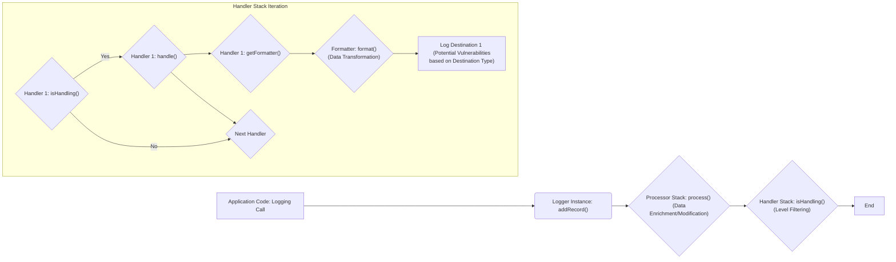

# Project Design Document: Monolog Logging Library

**Version:** 1.1
**Date:** October 26, 2023
**Author:** AI Software Architect

## 1. Introduction

This document provides an enhanced architectural overview of the Monolog logging library for PHP. Its primary purpose is to serve as a detailed foundation for subsequent threat modeling activities. It meticulously outlines the key components, data flow, and architectural considerations of Monolog to facilitate the identification of potential security vulnerabilities.

## 2. Goals and Non-Goals

**Goals:**

*   Provide a comprehensive and clear architectural overview of the Monolog library, specifically tailored for threat modeling.
*   Clearly identify key components and their interactions, emphasizing potential security implications.
*   Describe the data flow within the library in detail, highlighting transformation points and potential attack vectors.
*   Highlight important configuration aspects relevant to security, providing concrete examples.
*   Serve as a robust and detailed basis for identifying potential security threats and vulnerabilities within the Monolog library itself.

**Non-Goals:**

*   Provide a detailed, line-by-line code-level analysis of Monolog.
*   Document every single feature or configuration option available in Monolog.
*   Include performance benchmarks or optimization strategies for Monolog.
*   Cover the specifics of the applications that *use* Monolog. The focus remains solely on the Monolog library's internal workings and interfaces.

## 3. System Architecture

Monolog's architecture is built around a pipeline processing model for log records. The core elements are *Loggers*, *Processors*, *Formatters*, and *Handlers*, working together to capture, enrich, format, and deliver log messages.

**Key Components and their Roles in Security:**

*   **Logger:** The initial entry point for log messages. It's crucial for threat modeling as it dictates *what* information is potentially being logged. Improper use can lead to the logging of sensitive data.
*   **Processor:** Modifies log records before they reach handlers. While beneficial for adding context, malicious or poorly implemented processors could inject false information or consume excessive resources.
*   **Formatter:** Transforms the log record's structure. The chosen format can impact the security of the log destination (e.g., escaping in HTML logs).
*   **Handler:** The exit point, responsible for sending logs to various destinations. Handlers are critical from a security perspective as they interact with external systems, introducing potential vulnerabilities related to authentication, authorization, and data transmission.

## 4. Component Details

This section provides a more granular description of the core components, emphasizing security-relevant aspects.

### 4.1. Logger

*   **Functionality:**
    *   Accepts log messages at various severity levels (DEBUG, INFO, NOTICE, WARNING, ERROR, CRITICAL, ALERT, EMERGENCY). The choice of log level can impact the volume of logs and potentially expose more sensitive information in lower levels.
    *   Manages an ordered stack of processors that are executed sequentially, allowing for modification of the log record. The order of processors is significant.
    *   Manages an ordered stack of handlers, determining where the log record will be sent. The order of handlers can influence which destinations receive which logs.
    *   Supports the creation of child loggers, inheriting configurations. This inheritance can unintentionally propagate insecure configurations.
*   **Configuration:**
    *   **Name:**  Primarily for organizational purposes.
    *   **Processors:**  The specific processors attached. Using untrusted or poorly vetted custom processors introduces risk.
    *   **Handlers:** The specific handlers attached. The choice of handler directly impacts the security of log delivery.
    *   **Bubble:** Determines if a log record propagates to parent handlers. Incorrectly configured bubbling can lead to logs being sent to unintended destinations.

### 4.2. Handler

*   **Functionality:**
    *   Receives a formatted log record.
    *   Writes the record to a specific destination, involving network communication, file system operations, or interaction with external APIs.
    *   Implements connection logic and authentication mechanisms for the destination. Vulnerabilities here can lead to unauthorized access or data breaches.
    *   May implement buffering or batching. Temporary storage of logs in buffers could be a point of vulnerability if not handled securely.
*   **Types (Examples with Security Considerations):**
    *   `StreamHandler`: Writes to a file or stream. **Security:** File permissions are critical. Logs might contain sensitive data.
    *   `RotatingFileHandler`:  Similar to `StreamHandler`, but with rotation. **Security:**  Rotation policies and cleanup mechanisms need to be secure to prevent information leakage.
    *   `SyslogHandler`: Sends logs to syslog. **Security:** Relies on the security of the syslog infrastructure.
    *   `ErrorLogHandler`: Writes to PHP's error log. **Security:**  Error logs can be publicly accessible if web server is misconfigured.
    *   `SwiftMailerHandler`: Sends logs via email. **Security:** Email transmission is often unencrypted. Credentials for the mail server need to be securely managed. Potential for email header injection if log content is not sanitized.
    *   `PushoverHandler`, `SlackHandler`, etc.: Send logs to third-party services. **Security:** Relies on the security of the third-party API and the secure storage of API keys.
    *   Custom Handlers: **Security:**  Introduce significant risk if not developed with security in mind. Vulnerabilities could be introduced in connection handling, authentication, or data transmission.
*   **Configuration (Handler Specific - Examples with Security Implications):**
    *   **File Path:**  Incorrect permissions can expose log data.
    *   **Syslog Facility:**  Misconfiguration can lead to logs being sent to the wrong place or not being processed correctly.
    *   **Email Recipients, Subject, Sender:**  Potential for information disclosure if recipients are not carefully managed.
    *   **API Keys, Channel Information:**  Sensitive credentials that must be stored and handled securely.
    *   **Log Level Threshold:**  Setting too low a threshold can log excessive information, potentially including sensitive data.
    *   **Bubble:** Similar to the logger's bubble setting, impacting where logs are sent.

### 4.3. Processor

*   **Functionality:**
    *   Modifies the log record array before formatting.
    *   Can add contextual information (e.g., user ID, request details).
    *   Executed in a defined order.
*   **Types (Examples with Security Considerations):**
    *   `IntrospectionProcessor`: Adds file, line, and class/method information. **Security:**  Could inadvertently expose internal code structure.
    *   `WebProcessor`: Adds web request information (URL, IP, headers). **Security:**  Headers might contain sensitive information (cookies, authorization tokens). IP addresses can be used for tracking.
    *   `MemoryUsageProcessor`: Adds memory usage. Generally low security risk.
    *   `GitProcessor`: Adds Git commit information. Generally low security risk.
    *   Custom Processors: **Security:**  Pose a risk if they introduce vulnerabilities, leak information, or consume excessive resources. They have access to the raw log record data.
*   **Configuration:**
    *   Typically minimal configuration, often just instantiation. However, the *choice* of processors is a configuration decision with security implications.

### 4.4. Formatter

*   **Functionality:**
    *   Transforms the log record array into a string representation.
    *   Ensures the log message is in a format suitable for the target handler.
*   **Types (Examples with Security Considerations):**
    *   `LineFormatter`: Simple text formatting. **Security:** Requires careful handling of special characters to prevent log injection.
    *   `HtmlFormatter`: Formats as HTML. **Security:**  Vulnerable to cross-site scripting (XSS) if log content is not properly escaped.
    *   `JsonFormatter`: Formats as JSON. **Security:** Generally safer, but ensure proper encoding of data.
    *   `LogstashFormatter`, `ElasticaFormatter`: Format for specific log management systems. **Security:**  Relies on the security of those systems.
    *   Custom Formatters: **Security:**  Potential for vulnerabilities if they perform unsafe string manipulation or encoding.
*   **Configuration (Formatter Specific - Examples with Security Implications):**
    *   **Format String (for `LineFormatter`):**  Incorrectly handled format specifiers could lead to unexpected output or even crashes in log processing tools.
    *   **Date Format:**  Primarily for presentation.
    *   **Include Context and Extra Data:**  Determines what information is included in the formatted log, impacting potential information disclosure.

## 5. Data Flow

Understanding the data flow is crucial for identifying where security controls need to be applied.

**Detailed Steps and Security Implications:**

1. **Application Code: Logging Call:** The application initiates logging. **Security:**  Vulnerabilities can be introduced here if user input is logged without sanitization.
2. **Logger Instance: `addRecord()`:** The log record is created. **Security:** The initial content of the log record is determined here.
3. **Processor Stack: `process()`:** Processors modify the log record. **Security:** Malicious processors could inject false data or sensitive information.
4. **Handler Stack: `isHandling()`:** Handlers determine if they should process the record based on the log level. **Security:** Incorrectly configured log levels can lead to over-logging or under-logging.
5. **Handler Stack Iteration:**
    *   **Handler `isHandling()`:**  Checks if the handler's level threshold is met.
    *   **Handler `handle()`:**  The core logic for sending the log. **Security:** This is where vulnerabilities related to network communication, authentication, and file system operations can occur.
    *   **Handler `getFormatter()`:** Retrieves the associated formatter.
    *   **Formatter `format()`:** Transforms the log record. **Security:**  Formatters can introduce vulnerabilities like XSS if not implemented carefully.
    *   **Log Destination:** The final destination of the log. **Security:** The security of the destination itself is paramount (e.g., file permissions, database security, API security).

## 6. Security Considerations (Detailed for Threat Modeling)

This section expands on the security considerations, providing more specific examples relevant for threat modeling.

*   **Sensitive Data Exposure:**
    *   **Threat:** Applications logging passwords, API keys, credit card numbers, or personal identifiable information (PII).
    *   **Mitigation Considerations:** Implement mechanisms to prevent logging of sensitive data (e.g., scrubbing, masking). Educate developers on secure logging practices.
*   **Handler-Specific Vulnerabilities:**
    *   **Threat (StreamHandler):**  Unauthorized access to log files due to incorrect file permissions.
    *   **Threat (SwiftMailerHandler):**  Exposure of email credentials, potential for email spoofing or unauthorized email sending. Log injection leading to email header injection.
    *   **Threat (Database Handlers):** SQL injection vulnerabilities if log messages are directly inserted into database queries without proper sanitization.
    *   **Threat (Third-Party API Handlers):** Exposure of API keys, vulnerabilities in the third-party API itself.
    *   **Mitigation Considerations:** Securely configure handler credentials, use appropriate authentication mechanisms, sanitize log input before sending to external systems.
*   **Configuration Vulnerabilities:**
    *   **Threat:** Storing sensitive credentials in plain text configuration files.
    *   **Threat:**  Overly permissive file permissions on log configuration files.
    *   **Threat:**  Exposing log endpoints or dashboards without proper authentication.
    *   **Mitigation Considerations:** Use environment variables or secure configuration management tools for sensitive credentials. Implement proper access controls for configuration files and log destinations.
*   **Malicious Processors:**
    *   **Threat:** A compromised or malicious processor could inject false or misleading information into logs, hindering incident response or forensic analysis.
    *   **Threat:** A processor could consume excessive resources, leading to a denial-of-service condition.
    *   **Mitigation Considerations:**  Thoroughly vet any custom processors. Implement input validation within processors.
*   **Formatter Exploits:**
    *   **Threat (HtmlFormatter):**  Cross-site scripting (XSS) vulnerabilities if log content is displayed in a web browser without proper escaping.
    *   **Threat (Custom Formatters):**  Bugs in custom formatters could lead to unexpected behavior or security vulnerabilities.
    *   **Mitigation Considerations:**  Use well-vetted and secure formatters. Ensure proper escaping of output, especially for HTML.
*   **Log Destination Security:**
    *   **Threat:** Unauthorized access to log storage, leading to information disclosure.
    *   **Threat:**  Tampering with log data, compromising the integrity of audit trails.
    *   **Mitigation Considerations:** Implement strong access controls on log storage. Use secure storage mechanisms. Consider log aggregation and centralized security monitoring.
*   **Denial of Service through Logging:**
    *   **Threat:** An attacker could trigger excessive logging, overwhelming log storage or external logging services, leading to service disruption or increased costs.
    *   **Mitigation Considerations:** Implement rate limiting or throttling on logging. Monitor log volume.
*   **Log Injection Attacks:**
    *   **Threat:** Attackers injecting malicious content into log messages to manipulate log analysis tools or gain unauthorized access to systems that process logs.
    *   **Mitigation Considerations:** Sanitize log messages before logging. Implement robust input validation in log processing tools.

## 7. Future Considerations

*   Detailed threat modeling of individual handlers, focusing on their specific interactions with external systems and potential vulnerabilities.
*   Security analysis of common custom processors and formatters to identify potential risks.
*   Development of secure configuration guidelines and best practices for Monolog.
*   Exploration of mechanisms for automated sensitive data detection and scrubbing within Monolog.
*   Investigation of integrating security scanning tools into the development workflow for Monolog usage.

This enhanced design document provides a more detailed and security-focused understanding of the Monolog logging library's architecture. It serves as a more robust foundation for conducting thorough threat modeling and identifying potential security weaknesses. The detailed component descriptions, data flow analysis, and expanded security considerations aim to facilitate a comprehensive assessment of Monolog's security posture.