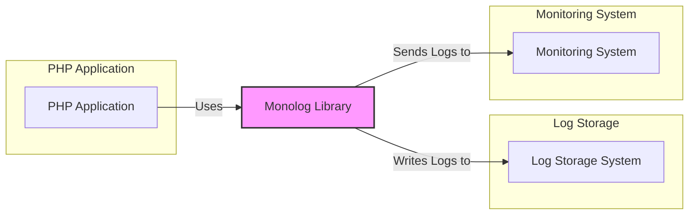
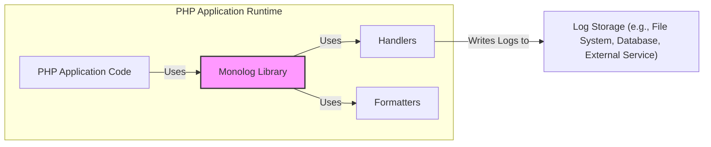
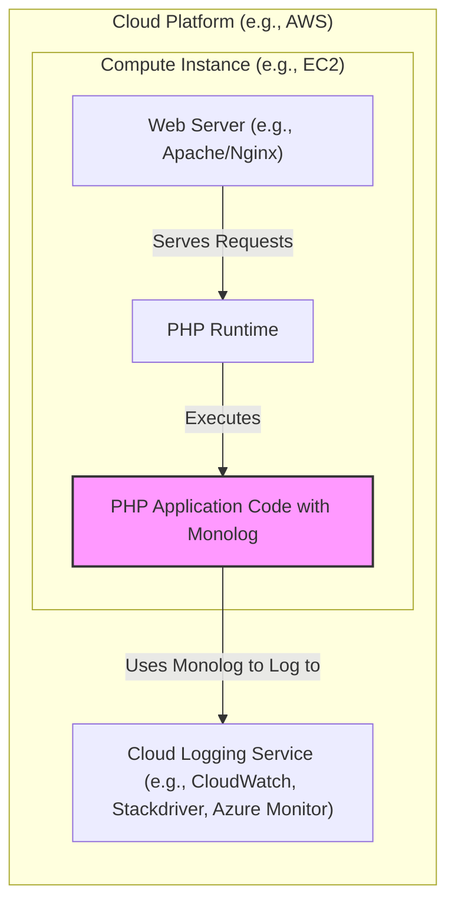
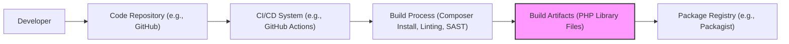

# BUSINESS POSTURE

This project, Monolog, is a logging library for PHP. Its primary business goal is to provide a robust, flexible, and easy-to-use logging solution for PHP applications.

Business priorities for Monolog are:
- Reliability: Ensuring logs are reliably captured and delivered.
- Flexibility: Supporting various logging destinations and formats.
- Performance: Minimizing the performance impact of logging on the application.
- Ease of Use: Providing a simple and intuitive API for developers.
- Maintainability: Keeping the codebase clean, well-documented, and easy to maintain.
- Compatibility: Supporting a wide range of PHP versions and environments.

Key business risks associated with Monolog include:
- Data Loss: Logs might be lost due to errors in the library or misconfiguration, hindering debugging and auditing.
- Performance Bottlenecks: Inefficient logging could degrade application performance, impacting user experience.
- Compatibility Issues: Incompatibility with certain PHP versions or environments could limit adoption and cause errors.
- Incorrect Logging: Misconfiguration or bugs could lead to inaccurate or incomplete logs, reducing their value.
- Security Vulnerabilities: Security flaws in Monolog could be exploited if log data contains sensitive information or if logging destinations are insecure.

# SECURITY POSTURE

Existing security controls for Monolog are primarily inherited from the PHP environment and the systems it interacts with.

- security control: Code hosted on GitHub, benefiting from GitHub's security measures for repository hosting and access control. (Implemented: GitHub)
- security control: Relies on Composer for dependency management, leveraging Composer's security features for package integrity. (Implemented: Composer)
- security control: Open source project, allowing for community review and scrutiny of the codebase. (Implemented: Open Source Nature)

Accepted risks for Monolog:
- accepted risk: Handling of sensitive data within log messages is the responsibility of the application developer using Monolog. Monolog itself does not provide specific mechanisms for sanitizing or masking sensitive data.
- accepted risk: Security of logging destinations (files, databases, external services) is assumed to be managed by the user deploying Monolog.
- accepted risk: Configuration of Monolog and its handlers is assumed to be done securely by the user.

Recommended security controls to implement:
- recommended security control: Input validation and sanitization for log messages to prevent log injection attacks.
- recommended security control: Documentation and examples emphasizing secure configuration practices, especially for sensitive logging destinations.
- recommended security control: Security audits and static analysis of the codebase to identify potential vulnerabilities.
- recommended security control: Implement mechanisms for secure handling of credentials when logging to external services.

Security requirements for Monolog:

- Authentication:
    - Requirement: Monolog itself does not handle authentication. However, when logging to external services, handlers should support secure authentication mechanisms provided by those services (e.g., API keys, OAuth).
    - Existing Control: Handlers rely on underlying libraries or configurations to handle authentication to external services.
    - Recommended Control: Improve documentation and examples to clearly demonstrate secure authentication practices for various handlers.

- Authorization:
    - Requirement: Monolog does not enforce authorization. Access to logs is controlled by the permissions of the logging destination (file system permissions, database access controls, etc.).
    - Existing Control: Relies on the authorization mechanisms of the operating system and logging destinations.
    - Recommended Control:  No specific control needed within Monolog itself, but documentation should emphasize the importance of securing access to log files and destinations.

- Input Validation:
    - Requirement: Log messages should be validated and sanitized to prevent log injection attacks, where malicious data in log messages could be interpreted as commands or code by log analysis tools or systems.
    - Existing Control: Currently, minimal input validation is performed by Monolog on log messages.
    - Recommended Control: Implement input validation and sanitization within Monolog, especially for user-provided data included in log messages. Consider offering configurable sanitization options.

- Cryptography:
    - Requirement:  If sensitive data is logged, it should be encrypted at rest or in transit, depending on the logging destination and security requirements.
    - Existing Control: Monolog itself does not provide encryption. Encryption would need to be implemented at the logging destination level or by the application before logging.
    - Recommended Control: Provide documentation and examples on how to integrate encryption with Monolog, either by encrypting log files at rest or by using handlers that support encrypted transport to external services (e.g., HTTPS for web services). Consider adding handlers that natively support encryption if feasible and widely applicable.

# DESIGN

## C4 CONTEXT

Context Diagram Elements:

- Element:
    - Name: PHP Application
    - Type: Software System
    - Description: The PHP application that utilizes the Monolog library for logging events and errors. This is the primary user of Monolog.
    - Responsibilities: Generates log messages, configures Monolog handlers and formatters, and uses Monolog to record events.
    - Security controls: Application-level security controls, input validation, secure coding practices.

- Element:
    - Name: Monolog Library
    - Type: Software System / Library
    - Description: The Monolog logging library itself. It receives log messages from PHP applications, processes them according to configured handlers and formatters, and sends them to various logging destinations.
    - Responsibilities: Receives log messages, processes log levels, formats log messages, dispatches logs to configured handlers.
    - Security controls: Input validation (recommended), secure handling of credentials in handlers (recommended), code security audits (recommended).

- Element:
    - Name: Log Storage System
    - Type: External System
    - Description:  A system used to store and persist log data. This could be file systems, databases, cloud storage, or specialized log management systems.
    - Responsibilities:  Receives and stores log data from Monolog, provides mechanisms for log retrieval and analysis.
    - Security controls: Access control to log data, encryption at rest (if required), log retention policies, audit logging of access to logs.

- Element:
    - Name: Monitoring System
    - Type: External System
    - Description: A system that monitors application and system health using logs and other metrics. Monolog can send logs to monitoring systems for real-time analysis and alerting.
    - Responsibilities: Receives log data from Monolog, analyzes logs for anomalies and alerts, provides dashboards and visualizations of log data.
    - Security controls: Secure ingestion of logs, access control to monitoring dashboards and alerts, secure communication channels.

## C4 CONTAINER

Container Diagram Elements:

- Element:
    - Name: PHP Application Code
    - Type: Software Container / Application Component
    - Description: The application code written in PHP that utilizes the Monolog library. This code defines the business logic and generates log messages using Monolog.
    - Responsibilities: Application logic, generating log messages, configuring Monolog.
    - Security controls: Application-level security controls, input validation, secure coding practices.

- Element:
    - Name: Monolog Library
    - Type: Software Container / PHP Library
    - Description: The core Monolog library, providing the main logging API and orchestration of handlers and formatters.
    - Responsibilities: API for logging, managing handlers and formatters, processing log records.
    - Security controls: Input validation (recommended), secure handling of credentials in handlers (recommended), code security audits (recommended).

- Element:
    - Name: Handlers
    - Type: Software Container / PHP Components
    - Description:  Handlers are responsible for writing log records to specific destinations. Examples include file handlers, database handlers, stream handlers, and handlers for external services (e.g., Slack, email).
    - Responsibilities: Writing log records to destinations, managing connections to logging destinations, handling authentication and authorization for destinations.
    - Security controls: Secure handling of credentials, secure communication with destinations (e.g., HTTPS), input validation specific to destination requirements.

- Element:
    - Name: Formatters
    - Type: Software Container / PHP Components
    - Description: Formatters transform log records into specific formats (e.g., JSON, Line, HTML) before they are written by handlers.
    - Responsibilities: Formatting log records, structuring log data for specific destinations or analysis tools.
    - Security controls:  Formatters themselves generally do not introduce security risks, but they should be designed to avoid exposing sensitive data unintentionally if custom formatters are created.

- Element:
    - Name: Log Storage (e.g., File System, Database, External Service)
    - Type: Infrastructure Container / External System
    - Description: The actual storage system where logs are persisted. This could be a local file system, a database server, or an external logging service.
    - Responsibilities: Persistent storage of log data, providing access to logs, ensuring data integrity and availability.
    - Security controls: Access control, encryption at rest, audit logging, secure network configuration.

## DEPLOYMENT

Monolog is deployed as a PHP library within PHP applications. There isn't a separate deployment architecture for Monolog itself. The deployment context is determined by how the PHP application is deployed.

Deployment Architecture Option: Web Application on Cloud Platform (e.g., AWS, GCP, Azure)

Deployment Diagram Elements (Cloud Platform Example):

- Element:
    - Name: Compute Instance (e.g., EC2)
    - Type: Infrastructure Node / Virtual Machine
    - Description: A virtual machine instance in the cloud environment where the web application and PHP runtime are deployed.
    - Responsibilities: Hosting the web server and PHP runtime, providing compute resources for the application.
    - Security controls: Instance-level security groups, operating system hardening, regular patching, access control via IAM roles.

- Element:
    - Name: Web Server (e.g., Apache/Nginx)
    - Type: Software Node / Web Server
    - Description: The web server software that handles incoming HTTP requests and serves the PHP application.
    - Responsibilities: Handling HTTP requests, serving static content, routing requests to the PHP runtime.
    - Security controls: Web server configuration hardening, TLS/SSL configuration, access control, web application firewall (WAF).

- Element:
    - Name: PHP Runtime
    - Type: Software Node / Runtime Environment
    - Description: The PHP runtime environment that executes the PHP application code and the Monolog library.
    - Responsibilities: Executing PHP code, providing necessary libraries and extensions, managing application resources.
    - Security controls: PHP runtime configuration hardening, keeping PHP version up-to-date with security patches.

- Element:
    - Name: PHP Application Code with Monolog
    - Type: Software Node / Application Deployment
    - Description: The deployed PHP application code, including the Monolog library integrated within it.
    - Responsibilities: Application logic, using Monolog for logging, interacting with other services.
    - Security controls: Application-level security controls, secure coding practices, input validation, dependency management.

- Element:
    - Name: Cloud Logging Service (e.g., CloudWatch, Stackdriver, Azure Monitor)
    - Type: Infrastructure Node / Cloud Service
    - Description: A cloud-based logging service used to collect, store, and analyze logs generated by the application.
    - Responsibilities: Centralized log aggregation, storage, search, and analysis, providing monitoring and alerting capabilities.
    - Security controls: Access control via IAM, encryption at rest and in transit, audit logging, data retention policies.

## BUILD

Build Process Description:

1. Developer: Developers write code for Monolog and commit changes to a code repository.
    - Security controls: Developer workstations security, code review process, access control to code repository.

2. Code Repository (e.g., GitHub):  The source code for Monolog is hosted in a Git repository.
    - Security controls: Access control (authentication and authorization), branch protection, audit logging of code changes, vulnerability scanning of dependencies (GitHub Dependabot).

3. CI/CD System (e.g., GitHub Actions): A CI/CD system automates the build, test, and release process when changes are pushed to the repository.
    - Security controls: Secure CI/CD pipeline configuration, access control to CI/CD system, secrets management for credentials used in the build process.

4. Build Process (Composer Install, Linting, SAST): The build process includes:
    - Composer Install: Installing PHP dependencies using Composer.
        - Security controls: Composer's package integrity checks, dependency vulnerability scanning (e.g., using `composer audit`).
    - Linting: Static code analysis to check for code style and potential errors.
        - Security controls:  Using linters to enforce code quality and identify potential security issues.
    - SAST (Static Application Security Testing): Static analysis security tools to scan the codebase for potential vulnerabilities.
        - Security controls: SAST tools to identify potential security flaws in the code before deployment.
    - Unit Tests: Automated unit tests are executed to verify the functionality of the library.
        - Security controls: Unit tests to ensure code correctness and prevent regressions.

5. Build Artifacts (PHP Library Files): The output of the build process is the Monolog PHP library files, ready to be packaged and distributed.
    - Security controls: Secure storage of build artifacts, integrity checks (e.g., checksums).

6. Package Registry (e.g., Packagist): Build artifacts are published to a package registry like Packagist, making Monolog available for users to install via Composer.
    - Security controls: Secure publishing process, package signing, vulnerability scanning of published packages by Packagist.

# RISK ASSESSMENT

Critical business processes protected by Monolog:
- Application Logging: Monolog is essential for application logging, which is critical for monitoring application health, debugging issues, and auditing events.
- Security Monitoring: Logs generated by Monolog can be used for security monitoring and incident response, detecting and analyzing security threats.
- Auditing and Compliance: Logs are often required for auditing and compliance purposes, providing a record of application activity.

Data being protected and its sensitivity:
- Log Data: The primary data protected by Monolog is log data. The sensitivity of log data varies greatly depending on what is logged by the application. Logs can contain:
    - Application Errors and Exceptions: Generally low sensitivity, but can reveal application logic and potential vulnerabilities.
    - User Activity: Can contain personally identifiable information (PII) if user actions are logged, requiring careful handling and anonymization/pseudonymization where necessary. Sensitivity can be high.
    - System Information: Can include server names, IP addresses, and other system details. Sensitivity depends on the context and exposure of this information.
    - Business Transactions: Logs might record details of business transactions, which could be sensitive depending on the nature of the business. Sensitivity can be medium to high.
    - Security Events: Logs related to security events (authentication attempts, authorization failures, etc.) are highly sensitive and crucial for security monitoring. Sensitivity is high.

The sensitivity of log data needs to be assessed in the context of each application using Monolog.  It's crucial for application developers to be aware of what data they are logging and to implement appropriate security measures to protect sensitive information in logs.

# QUESTIONS & ASSUMPTIONS

Questions:
- What types of applications are primarily using Monolog? (Web applications, CLI tools, etc.)
- What are the most common logging destinations used with Monolog? (Files, databases, cloud logging services, specific third-party services?)
- Are there specific regulatory compliance requirements that Monolog users often need to meet regarding logging? (e.g., GDPR, HIPAA, PCI DSS)
- What is the expected volume of logs generated by typical Monolog users? (To understand performance and scalability considerations)
- Are there specific performance benchmarks or SLAs for logging that Monolog aims to meet?

Assumptions:
- BUSINESS POSTURE:
    - Monolog is primarily used in production environments for critical applications.
    - Reliability and performance are key business drivers for Monolog adoption.
    - The open-source nature of Monolog is a significant factor in its adoption.

- SECURITY POSTURE:
    - Users of Monolog are responsible for securing their logging destinations and handling sensitive data in logs appropriately.
    - Security is a secondary concern compared to functionality and ease of use, but still important.
    - Security best practices are generally followed in the development and maintenance of Monolog, but no dedicated security team or formal security program is explicitly in place for the project itself.

- DESIGN:
    - Monolog is designed to be lightweight and modular, allowing users to customize logging behavior through handlers and formatters.
    - The architecture is primarily focused on flexibility and extensibility to support a wide range of logging scenarios.
    - Deployment is always as a library integrated into a PHP application, not as a standalone service.
    - Build process relies on standard PHP development tools and practices (Composer, Git, CI/CD).