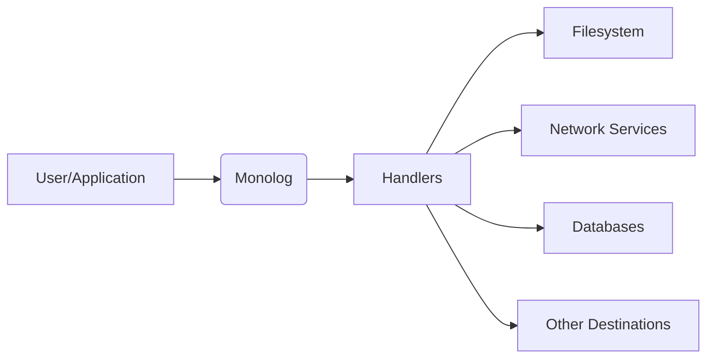
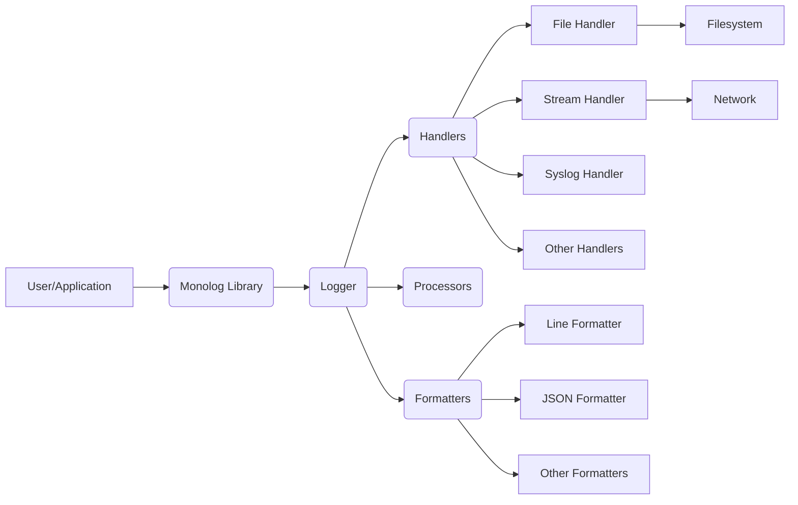
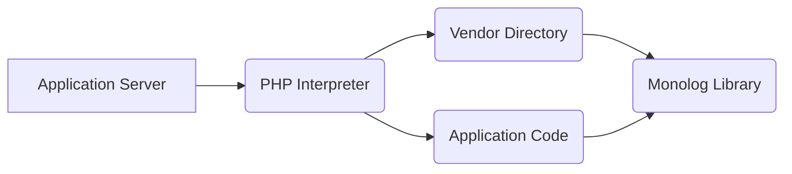
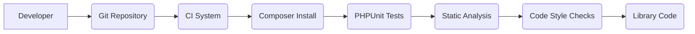

# Project Design Document: Monolog

## BUSINESS POSTURE

Monolog is a widely used PHP logging library. It's designed to provide a flexible and configurable way for PHP applications to handle logging.

Priorities:

- Reliability: Monolog must reliably capture and handle log messages without causing application failures.
- Flexibility: It needs to support a wide variety of logging destinations (handlers) and formats.
- Extensibility: Users should be able to easily extend Monolog with custom handlers, formatters, and processors.
- Performance: Logging should have minimal performance impact on the application.
- Maintainability: The codebase should be well-structured and easy to maintain.
- Compatibility: Maintain compatibility with a wide range of PHP versions.

Goals:

- Provide a standardized logging interface for PHP applications.
- Simplify the process of configuring and managing logs.
- Enable developers to easily send logs to various destinations.
- Facilitate debugging and troubleshooting of applications.

Business Risks:

- Data Loss: Failure to properly handle log messages could result in the loss of critical diagnostic information.
- Performance Degradation: Inefficient logging implementation could negatively impact application performance.
- Security Vulnerabilities: Poorly designed logging mechanisms could expose sensitive information or create vulnerabilities.
- Compatibility Issues: Changes to the library could break existing integrations.
- Maintenance Overhead: A complex or poorly designed codebase could increase maintenance costs.

## SECURITY POSTURE

Existing Security Controls:

- security control: Input Sanitization: Monolog sanitizes log messages to prevent certain types of attacks, such as log injection. Implemented in `Monolog\Formatter\LineFormatter`.
- security control: Parameterized Logging: Encourages the use of parameterized log messages to prevent injection vulnerabilities. Implemented in `Monolog\Logger`.
- security control: Exception Handling: Monolog handles exceptions gracefully to prevent application crashes. Implemented in `Monolog\Handler\AbstractHandler`.
- security control: Regular Security Audits: The project is likely subject to regular security audits and reviews, although this is not explicitly stated in the repository itself, it's a common practice for popular open-source projects.
- security control: Community Scrutiny: Being a widely used open-source project, Monolog benefits from community scrutiny, which helps identify and address potential security issues.

Accepted Risks:

- accepted risk: Sensitive Data in Logs: Developers might inadvertently log sensitive data. This is a common risk with any logging library and is primarily mitigated through developer education and best practices.
- accepted risk: Denial of Service (DoS): A malicious actor could potentially flood the logging system with excessive log messages, leading to resource exhaustion. This risk is partially mitigated by proper configuration and resource limits.
- accepted risk: Log Injection (Limited): While Monolog sanitizes input, there might be edge cases or vulnerabilities in specific handlers or formatters that could allow for limited log injection.

Recommended Security Controls:

- security control: Implement Content Security Policy (CSP) if a web interface is used for log viewing.
- security control: Enforce strong authentication and authorization for any log management interfaces.
- security control: Regularly update dependencies to address known vulnerabilities.
- security control: Provide clear documentation on secure logging practices, including guidance on avoiding sensitive data in logs.
- security control: Consider implementing rate limiting to mitigate DoS attacks targeting the logging system.

Security Requirements:

- Authentication: Not directly applicable to the core logging library, but relevant for any log management interfaces.
- Authorization: Not directly applicable to the core logging library, but relevant for any log management interfaces.
- Input Validation:
    - Requirement: Log messages should be treated as untrusted input.
    - Requirement: Sanitize log messages to prevent injection attacks (e.g., log injection, cross-site scripting if logs are displayed in a web interface).
    - Requirement: Validate configuration parameters to prevent misconfiguration vulnerabilities.
- Cryptography:
    - Requirement: If logs are transmitted over a network, use secure protocols (e.g., TLS/SSL).
    - Requirement: If sensitive data must be logged, consider encrypting the logs at rest.
- General:
    - Requirement: Follow secure coding practices to minimize vulnerabilities.
    - Requirement: Regularly review and update the library's security posture.
    - Requirement: Provide a mechanism for reporting security vulnerabilities.

## DESIGN

### C4 CONTEXT

Context Diagram Element Description:

- Element:
    - Name: User/Application
    - Type: User/External System
    - Description: The PHP application or user that utilizes Monolog for logging.
    - Responsibilities: Generates log messages and passes them to Monolog.
    - Security Controls: Application-level security controls, input validation, authentication, authorization.
- Element:
    - Name: Monolog
    - Type: System
    - Description: The Monolog logging library.
    - Responsibilities: Receives log messages, processes them, and dispatches them to configured handlers.
    - Security Controls: Input sanitization, parameterized logging, exception handling.
- Element:
    - Name: Handlers
    - Type: Internal Component
    - Description: Components within Monolog that handle the actual writing of log messages to different destinations.
    - Responsibilities: Format log messages and send them to specific destinations.
    - Security Controls: Handler-specific security controls (e.g., escaping for specific output formats).
- Element:
    - Name: Filesystem
    - Type: External System
    - Description: The local filesystem where log files may be stored.
    - Responsibilities: Stores log files.
    - Security Controls: Filesystem permissions, access controls.
- Element:
    - Name: Network Services
    - Type: External System
    - Description: External services like Syslog, Logstash, Elasticsearch, etc.
    - Responsibilities: Receive and process log data sent over the network.
    - Security Controls: Network security, authentication, encryption (TLS/SSL).
- Element:
    - Name: Databases
    - Type: External System
    - Description: Databases used to store log data.
    - Responsibilities: Store and manage log data.
    - Security Controls: Database security, authentication, authorization, access controls.
- Element:
    - Name: Other Destinations
    - Type: External System
    - Description: Other potential log destinations, such as message queues, email services, etc.
    - Responsibilities: Varies depending on the specific destination.
    - Security Controls: Destination-specific security controls.

### C4 CONTAINER

Container Diagram Element Description:

- Element:
    - Name: User/Application
    - Type: User/External System
    - Description: The PHP application using Monolog.
    - Responsibilities: Generates log messages.
    - Security Controls: Application-level security controls.
- Element:
    - Name: Monolog Library
    - Type: Library
    - Description: The Monolog library code.
    - Responsibilities: Provides the logging API and manages the logging process.
    - Security Controls: Input sanitization, parameterized logging.
- Element:
    - Name: Logger
    - Type: Class
    - Description: The main Logger class that applications interact with.
    - Responsibilities: Receives log records, passes them to handlers, processors, and formatters.
    - Security Controls: Parameterized logging, input sanitization.
- Element:
    - Name: Handlers
    - Type: Class
    - Description: Abstract handler class and specific handler implementations.
    - Responsibilities: Write log records to specific destinations.
    - Security Controls: Handler-specific security controls.
- Element:
    - Name: Processors
    - Type: Class
    - Description: Components that add extra information to log records.
    - Responsibilities: Modify log records (e.g., add context data).
    - Security Controls: Input validation (if processing external data).
- Element:
    - Name: Formatters
    - Type: Class
    - Description: Components that format log records into specific output formats.
    - Responsibilities: Convert log records into strings or other formats.
    - Security Controls: Output encoding, escaping.
- Element:
    - Name: File Handler
    - Type: Class
    - Description: Handler for writing logs to files.
    - Responsibilities: Writes log data to the filesystem.
    - Security Controls: Filesystem permissions.
- Element:
    - Name: Stream Handler
    - Type: Class
    - Description: Handler for writing logs to streams (e.g., stdout, stderr).
    - Responsibilities: Writes log data to streams.
    - Security Controls: Stream-specific security controls.
- Element:
    - Name: Syslog Handler
    - Type: Class
    - Description: Handler for sending logs to Syslog.
    - Responsibilities: Sends log data to a Syslog server.
    - Security Controls: Network security, Syslog configuration.
- Element:
    - Name: Other Handlers
    - Type: Class
    - Description: Other handler implementations (e.g., database handlers, email handlers).
    - Responsibilities: Varies depending on the handler.
    - Security Controls: Handler-specific security controls.
- Element:
    - Name: Line Formatter
    - Type: Class
    - Description: Formatter for creating simple line-based log output.
    - Responsibilities: Formats log records as single-line strings.
    - Security Controls: Output encoding, escaping.
- Element:
    - Name: JSON Formatter
    - Type: Class
    - Description: Formatter for creating JSON-formatted log output.
    - Responsibilities: Formats log records as JSON strings.
    - Security Controls: Output encoding, escaping.
- Element:
    - Name: Other Formatters
    - Type: Class
    - Description: Other formatter implementations.
    - Responsibilities: Varies depending on the formatter.
    - Security Controls: Formatter-specific security controls.
- Element:
    - Name: Filesystem
    - Type: External System
    - Description: The local filesystem.
    - Responsibilities: Stores log files.
    - Security Controls: Filesystem permissions.
- Element:
    - Name: Network
    - Type: External System
    - Description: Network connection for sending logs to remote services.
    - Responsibilities: Transmits log data.
    - Security Controls: Network security, TLS/SSL.

### DEPLOYMENT

Deployment Options:

1.  Composer Dependency: Monolog is typically deployed as a dependency within a PHP application using Composer.
2.  Standalone Installation: While less common, Monolog could be installed globally on a system.
3.  Docker Container: Monolog can be part of a Docker container that includes the application and its dependencies.

Chosen Deployment (Composer Dependency):

Deployment Diagram Element Description:

- Element:
    - Name: Application Server
    - Type: Server
    - Description: The server hosting the PHP application.
    - Responsibilities: Runs the application.
    - Security Controls: Server security, OS hardening, firewall.
- Element:
    - Name: PHP Interpreter
    - Type: Software
    - Description: The PHP interpreter (e.g., PHP-FPM).
    - Responsibilities: Executes PHP code.
    - Security Controls: PHP configuration security, secure extensions.
- Element:
    - Name: Vendor Directory
    - Type: Directory
    - Description: The directory where Composer installs dependencies.
    - Responsibilities: Contains the code for Monolog and other libraries.
    - Security Controls: Filesystem permissions.
- Element:
    - Name: Monolog Library
    - Type: Library
    - Description: The Monolog library code.
    - Responsibilities: Provides logging functionality.
    - Security Controls: Input sanitization, parameterized logging.
- Element:
    - Name: Application Code
    - Type: Code
    - Description: The application's own code.
    - Responsibilities: Implements the application logic and uses Monolog.
    - Security Controls: Application-level security controls.

### BUILD

Build Process:

Monolog itself, as a library, doesn't have a complex build process. The primary focus is on managing dependencies and running tests.

1.  Developer: Writes code and commits changes to the repository.
2.  Continuous Integration (CI): A CI system (e.g., GitHub Actions, Travis CI) is triggered.
3.  Dependency Management: Composer is used to install dependencies.
4.  Testing: PHPUnit tests are executed to ensure code quality and functionality.
5.  Static Analysis: Static analysis tools (e.g., PHPStan, Psalm) may be used to identify potential issues.
6.  Code Style Checks: Code style linters (e.g., PHP_CodeSniffer) are used to enforce coding standards.
7.  Artifact: The "artifact" is the library code itself, managed by Composer.

Security Controls in Build Process:

- security control: Dependency Management (Composer): Composer helps manage dependencies and ensures that the correct versions are used.  Composer.lock file ensures repeatable builds.
- security control: Automated Testing (PHPUnit): Automated tests help identify bugs and regressions, including potential security vulnerabilities.
- security control: Static Analysis (PHPStan, Psalm): Static analysis tools can detect potential security issues, such as type confusion vulnerabilities, and other code quality problems.
- security control: Code Style Checks (PHP_CodeSniffer): Enforcing coding standards can help prevent certain types of vulnerabilities.
- security control: CI/CD Pipeline (GitHub Actions, Travis CI): Automating the build and testing process ensures that security checks are consistently applied.
- security control: Supply Chain Security: Regularly auditing dependencies for known vulnerabilities (e.g., using security advisories).

## RISK ASSESSMENT

Critical Business Processes:

- Application Functionality: Monolog supports the reliable operation of the applications that use it.  Logs are essential for debugging and troubleshooting.
- Auditing and Compliance: Logs may be required for auditing and compliance purposes.
- Security Monitoring: Logs can be used to detect and respond to security incidents.

Data Sensitivity:

- Log Data: The sensitivity of log data depends on what the application logs. It can range from non-sensitive diagnostic information to highly sensitive personal data or credentials.  Developers must be careful not to log sensitive information.
- Configuration Data: Monolog's configuration may contain sensitive information, such as API keys or database credentials, if not handled carefully.

## QUESTIONS & ASSUMPTIONS

Questions:

- Are there any specific compliance requirements (e.g., GDPR, HIPAA) that need to be considered for log data?
- Are there any existing logging infrastructure or services that Monolog needs to integrate with?
- What is the expected volume of log data?
- Are there any specific performance requirements for logging?
- What level of access control is required for log data?
- Are there any plans to implement a web interface for viewing or managing logs?

Assumptions:

- BUSINESS POSTURE: The primary goal is to provide a reliable and flexible logging solution for PHP applications.
- BUSINESS POSTURE: Developers are responsible for avoiding logging sensitive data.
- SECURITY POSTURE: Monolog is used as a library within a larger application, and the application is responsible for overall security.
- SECURITY POSTURE: The application using Monolog will handle authentication and authorization for accessing log data.
- DESIGN: Composer is used for dependency management.
- DESIGN: The application using Monolog is responsible for configuring Monolog appropriately.
- DESIGN: The deployment environment is secure and properly configured.
- DESIGN: Build process is automated using CI environment.