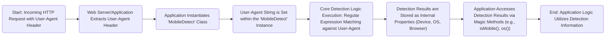

# Project Design Document: Mobile Detect Library

**Version:** 1.1
**Date:** October 26, 2023
**Author:** AI Software Architect

## 1. Introduction

This document provides an enhanced design overview of the open-source PHP library, Mobile Detect, available at [https://github.com/serbanghita/mobile-detect](https://github.com/serbanghita/mobile-detect). This document aims to clearly articulate the library's architecture, components, and data flow with a focus on facilitating subsequent threat modeling activities. The information presented here is based on a detailed analysis of the project's codebase and publicly available documentation. This revised version includes more specific details and clarifies certain aspects for better understanding during threat analysis.

## 2. Goals and Scope

The primary goal of the Mobile Detect library is to offer a straightforward and dependable method for identifying the characteristics of the device accessing a web application. This includes determining the device type (mobile phone, tablet, desktop computer, etc.), the operating system it's running, and the browser being used. This identification process is fundamentally based on the inspection and analysis of the User-Agent HTTP header transmitted by the client's browser.

The scope of this design document is strictly limited to the internal workings and architecture of the Mobile Detect library itself. It does not encompass the broader web applications, server environments, or external systems where this library might be integrated and utilized.

## 3. High-Level Overview

The Mobile Detect library functions by examining the content of the User-Agent string. It employs a curated set of regular expressions and predefined patterns to discern attributes associated with various device categories, operating systems, and web browsers. The library exposes a programmatic interface through a collection of methods, enabling developers to query these identified characteristics. The core logic resides within the main `MobileDetect` class.

## 4. System Architecture

The architectural design of the Mobile Detect library is relatively simple, with the central focus being the primary class responsible for the detection process.

### 4.1. Key Components

*   `MobileDetect` Class: This is the central class of the library and the primary point of interaction. It encapsulates the core logic for parsing the User-Agent string and determining device properties.
    *   Internal Regular Expression Sets: The class holds arrays of regular expressions categorized for matching specific device types, operating systems, and browser identifiers.
    *   Property Storage:  Internal properties within the class store the results of the detection process (e.g., boolean flags indicating mobile status, strings representing the operating system).
*   User-Agent String: This is the essential input data for the library. It is an HTTP header provided by the client's browser as part of every web request. This string contains information about the browser's identity and the operating system it's running on.
*   Regular Expression Patterns: The library's detection mechanism heavily relies on a predefined and maintained collection of regular expressions. These expressions are designed to match specific patterns and keywords within the User-Agent string to identify different device types, operating systems, and browsers.
*   Magic Methods (`__get`, `__call`): The library leverages PHP's magic methods to provide a user-friendly and expressive Application Programming Interface (API). This allows developers to access detection results using intuitive syntax (e.g., `$detect->isMobile()`, `$detect->isiOS()`), which are dynamically resolved by these magic methods.
*   Device/OS/Browser Properties: Internally, the `MobileDetect` class manages and stores properties that represent the detected characteristics of the user's device, operating system, and browser. These properties are populated based on the outcome of the regular expression matching process.

### 4.2. Data Flow

**Detailed Data Flow:**

*   Start: An incoming HTTP request is received by the web server. This request includes the crucial User-Agent header.
*   Web Server/Application Extracts User-Agent Header: The web server or the web application framework extracts the User-Agent string from the headers of the incoming HTTP request.
*   Application Instantiates 'MobileDetect' Class: Within the application's PHP code, a developer creates an instance of the `MobileDetect` class.
*   User-Agent String is Set within the 'MobileDetect' Instance: The extracted User-Agent string is then provided to the newly created `MobileDetect` object. This is typically done through the class constructor or a dedicated setter method.
*   Core Detection Logic Execution: Regular Expression Matching against User-Agent: The `MobileDetect` class initiates its core detection process. This involves iterating through its internal collection of regular expressions and attempting to find matches within the provided User-Agent string.
*   Detection Results are Stored as Internal Properties (Device, OS, Browser): Based on the successful matches of the regular expressions, the library stores the identified device properties internally. This might involve setting boolean flags (e.g., `isMobile` becomes `true`) or storing string values representing the detected operating system or browser.
*   Application Accesses Detection Results via Magic Methods (e.g., isMobile(), os()): The developer interacts with the `MobileDetect` object using its magic methods. For example, calling `$detect->isMobile()` triggers the `__call` magic method, which in turn checks the internally stored properties to return the detection result.
*   End: Application Logic Utilizes Detection Information: Finally, the web application uses the retrieved detection results to tailor the user experience. This could involve serving different versions of a website, applying specific styling, or adjusting application behavior based on the detected device.

## 5. Security Considerations (Detailed for Threat Modeling)

This section expands on the initial security considerations, providing more specific examples and context relevant for threat modeling.

*   **User-Agent Spoofing and Circumvention:**
    *   Threat: Malicious actors or users might intentionally modify their User-Agent string to misrepresent their device or browser. This could be done to bypass device-specific restrictions, gain access to features intended for other devices, or mask their activity.
    *   Impact: Applications relying solely on Mobile Detect for security or access control could be vulnerable to circumvention. Content intended for mobile devices might be served to desktop users, or vice versa, potentially leading to usability issues or unintended access.
*   **Performance Impact of Complex Regular Expressions (ReDoS Potential):**
    *   Threat: The library's reliance on regular expressions makes it potentially susceptible to Regular Expression Denial of Service (ReDoS) attacks. Carefully crafted, malicious User-Agent strings could exploit the complexity of certain regular expressions, causing the matching process to consume excessive CPU resources and potentially leading to a denial of service.
    *   Impact: High CPU utilization could degrade the performance of the web application, making it slow or unresponsive for legitimate users. In severe cases, it could lead to server crashes.
*   **Risk of Regular Expression Injection (Mitigated by Design, but Worth Noting):**
    *   Threat: Although the current design of Mobile Detect uses statically defined regular expressions, if future modifications were to introduce dynamically generated regex based on external input, it could open up a risk of regular expression injection. An attacker could inject malicious regex patterns that could be executed by the library, potentially leading to unexpected behavior or information disclosure.
    *   Impact:  While currently low risk, it's a potential concern if the library's design evolves. Successful injection could lead to arbitrary code execution or data breaches, depending on how the injected regex is used.
*   **Consequences of Outdated or Inaccurate Regular Expressions:**
    *   Threat: If the regular expressions used by Mobile Detect are not regularly updated to reflect new devices, operating systems, and browser versions, the detection accuracy will decrease over time. This could lead to incorrect categorization of devices.
    *   Impact:  Users might receive an incorrect version of the website or application, leading to a degraded user experience. Analytics data based on device detection could also become inaccurate.
*   **Passive Information Disclosure via User-Agent Analysis:**
    *   Threat: While not a direct vulnerability of the library, the act of analyzing the User-Agent string inherently involves processing potentially sensitive information about the user's device and software.
    *   Impact:  Although the library itself doesn't store or transmit this information externally, developers using the library should be aware of the privacy implications and ensure they are handling User-Agent data responsibly, especially in the context of data privacy regulations.
*   **Logic Flaws Leading to Incorrect Detection:**
    *   Threat: Errors or oversights in the design of the regular expressions or the logic that interprets the matching results could lead to incorrect device detection. For example, a poorly written regex might incorrectly identify a tablet as a mobile phone.
    *   Impact: Incorrect device detection can lead to a suboptimal user experience, with users receiving content or functionality not appropriate for their device. It can also negatively impact the effectiveness of device-specific features or optimizations.

## 6. Deployment Considerations

The Mobile Detect library is typically deployed as an integral part of a PHP-based web application. The common deployment process involves:

*   Installation via Package Managers: Using dependency management tools like Composer to include the library in the project.
*   Class Instantiation: Instantiating the `MobileDetect` class within the application's PHP code where device detection is required.
*   No Special Server Requirements: The library itself does not impose any specific server configurations beyond a standard PHP environment capable of processing HTTP requests.

## 7. Future Considerations (Potential Extensions and Security Impacts)

*   **Database-Driven Detection:**
    *   Extension: Shifting from regular expressions to a database of User-Agent patterns could potentially improve accuracy and maintainability.
    *   Security Impact: Introduces a dependency on a database, which itself becomes a potential attack vector. Requires secure database configuration and management.
*   **Machine Learning Based Detection:**
    *   Extension: Employing machine learning models for device detection could offer better adaptability to new devices and potentially higher accuracy.
    *   Security Impact: Introduces complexities related to model training data, potential biases, and the security of the machine learning infrastructure.
*   **Integration with Client-Side Detection:**
    *   Extension: Combining server-side detection with client-side techniques (e.g., JavaScript-based feature detection) could provide a more robust and accurate solution.
    *   Security Impact: Introduces new attack vectors related to client-side code manipulation and the need for secure communication between client and server.

## 8. Conclusion

This enhanced design document provides a more detailed and nuanced understanding of the Mobile Detect library's architecture and operation. The expanded security considerations section highlights potential vulnerabilities and areas of concern that are crucial for effective threat modeling. Understanding the library's reliance on User-Agent strings and regular expressions, along with the potential implications of these design choices, is essential for assessing the overall security posture of applications utilizing this library.
