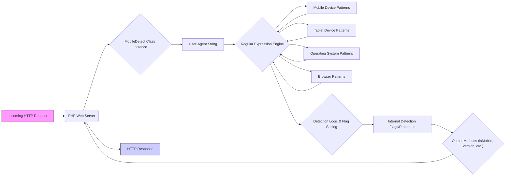

## Project Design Document: Mobile-Detect Library - Improved

**1. Introduction**

This document provides an enhanced design specification for the `mobile-detect` library, a PHP component designed to identify characteristics of browsing devices by analyzing their User-Agent strings. This detailed design serves as a crucial artifact for understanding the library's internal structure, data flow, and potential security considerations, thereby facilitating effective threat modeling.

**2. Goals and Objectives**

* **Primary Goal:** To provide accurate and reliable detection of mobile devices (including smartphones and feature phones), tablets, and their respective operating systems and browsers based on User-Agent string analysis.
* **Objectives:**
    * Offer a straightforward and efficient method for PHP applications to determine if a user is accessing the site via a mobile device or tablet.
    * Enable precise identification of specific mobile operating systems (e.g., iOS, Android, Windows Phone, Blackberry OS).
    * Facilitate the detection of common web browsers used on mobile devices.
    * Ensure seamless integration within standard PHP project structures.
    * Maintain an extensive and regularly updated repository of User-Agent patterns to ensure accuracy across a wide range of devices.
    * Minimize performance overhead during User-Agent string processing.

**3. Functional Overview**

The `mobile-detect` library operates by accepting a User-Agent string as input and comparing it against a curated set of regular expressions. The outcome of these comparisons allows the library to categorize the device and extract relevant information.

The core functional steps are:

* **Input Reception:** The library receives a User-Agent string. This is typically sourced from the `$_SERVER['HTTP_USER_AGENT']` variable within a PHP environment.
* **Pattern Matching:** The library employs a series of regular expressions, each specifically crafted to match patterns associated with different mobile devices, tablet devices, operating systems, and browsers. This matching process is iterative.
* **Categorization and Flagging:** Upon a successful match with a regular expression, the library sets internal flags or properties. These flags indicate the detected device type (mobile, tablet, desktop), operating system, and browser.
* **Information Extraction (Optional):**  Some regular expressions are designed to extract specific information, such as the version number of the operating system or browser.
* **Output Provision:** The library offers a suite of methods to query the results of the detection process:
    * `isMobile()`: Returns `true` if a mobile phone is detected, `false` otherwise.
    * `isTablet()`: Returns `true` if a tablet device is detected, `false` otherwise.
    * `isDesktop()`: Returns `true` if a desktop device is detected, `false` otherwise.
    * `isiOS()`: Returns `true` if the operating system is identified as iOS.
    * `isAndroidOS()`: Returns `true` if the operating system is identified as Android.
    * `version($propertyName)`: Returns the detected version string for a specified property (e.g., 'iOS', 'Android').
    * `getUserAgent()`: Returns the original User-Agent string that was provided as input.

**4. Architectural Design**

The `mobile-detect` library utilizes a procedural approach with a central class responsible for the detection logic. The core of its functionality revolves around the application of regular expressions.

**Detailed Component Description:**

* **Incoming HTTP Request:**  An HTTP request initiated by a user's device.
* **PHP Web Server:** The web server environment executing the PHP code that utilizes the `mobile-detect` library.
* **MobileDetect Class Instance:**  A specific instance of the `MobileDetect` class created to perform the User-Agent analysis.
* **User-Agent String:** The raw User-Agent string extracted from the HTTP request headers. This is the primary input for the detection process.
* **Regular Expression Engine:** The PHP engine's built-in functionality for processing regular expressions (PCRE). This is the core mechanism for pattern matching.
* **Mobile Device Patterns:** A collection of regular expressions specifically designed to identify User-Agent strings originating from mobile phones.
* **Tablet Device Patterns:** A collection of regular expressions tailored to identify User-Agent strings from tablet devices.
* **Operating System Patterns:** A set of regular expressions used to identify the operating system of the browsing device.
* **Browser Patterns:** A collection of regular expressions used to identify the web browser being used.
* **Detection Logic & Flag Setting:** The procedural code within the `MobileDetect` class. This code iterates through the regular expression sets and, upon a match, sets internal flags or properties to record the detected device characteristics.
* **Internal Detection Flags/Properties:** Internal variables within the `MobileDetect` object that store the results of the detection process (e.g., a boolean flag indicating if a mobile device was detected, a string storing the detected operating system).
* **Output Methods:** Public methods provided by the `MobileDetect` class that allow developers to access the detection results. These methods query the internal flags and properties.
* **HTTP Response:** The web server's response to the user's request, potentially modified based on the information provided by the `mobile-detect` library.

**5. Data Flow**

The flow of data within the `mobile-detect` library is sequential:

* The `MobileDetect` class instance receives the User-Agent string.
* This string is then passed to the regular expression engine.
* The engine iteratively compares the User-Agent string against the defined sets of regular expressions (first for mobile devices, then tablets, then operating systems, then browsers).
* When a regular expression matches, the corresponding detection flag or property within the `MobileDetect` instance is updated.
* When an output method is called (e.g., `isMobile()`), the method retrieves the value of the relevant internal flag and returns it to the calling code.

**6. Technology Stack**

* **Primary Language:** PHP
* **Core Dependency:**  PHP's built-in support for Perl Compatible Regular Expressions (PCRE).

**7. Deployment Model**

The `mobile-detect` library is typically deployed as an integral part of a PHP web application. It can be included directly within the project's codebase or managed as a dependency using a package manager like Composer. The library is instantiated and used within the application's request processing lifecycle.

**8. Security Considerations (Detailed)**

* **Regular Expression Denial of Service (ReDoS):**  A primary security concern is the potential for ReDoS attacks. Maliciously crafted User-Agent strings could exploit vulnerabilities in poorly designed regular expressions, causing excessive backtracking and consuming significant server resources, potentially leading to denial of service.
    * **Mitigation:** Careful review and testing of all regular expressions are crucial. Employing techniques to limit the complexity and potential for backtracking in the expressions can help mitigate this risk.
* **Accuracy and Evasion:** The library's accuracy is directly dependent on the comprehensiveness and correctness of its regular expression patterns. New devices and User-Agent patterns emerge frequently. Attackers could craft User-Agent strings specifically designed to evade detection or be misidentified.
    * **Mitigation:**  Regular updates to the regular expression patterns are essential. Consider incorporating community contributions or automated tools to identify and incorporate new patterns.
* **Information Disclosure (Indirect):** While the library doesn't directly handle sensitive user data, the logic based on its output (e.g., redirecting mobile users to a different subdomain) could potentially be used to infer information about a user's device type.
    * **Mitigation:**  Ensure that any actions taken based on the library's output do not inadvertently expose sensitive information.
* **Dependency Management Vulnerabilities:** If the library is included as a dependency via a package manager, vulnerabilities in the package manager itself or in other dependencies could indirectly impact the security of the application.
    * **Mitigation:**  Follow secure dependency management practices, regularly update dependencies, and be aware of known vulnerabilities in the dependency chain.
* **Input Validation:** While the primary input is the User-Agent string (which is generally considered non-sensitive), improper handling of this string within the library could potentially lead to unforeseen issues.
    * **Mitigation:**  Ensure that the library handles the User-Agent string safely and does not introduce any vulnerabilities through its processing.

**9. Assumptions and Constraints**

* **Assumption:** The primary mechanism for device detection relies on the accuracy and availability of the User-Agent string provided by the client's browser.
* **Assumption:** The regular expressions within the library are maintained and updated to reflect changes in device and browser User-Agent patterns.
* **Constraint:** The effectiveness of the library is inherently limited by the information contained within the User-Agent string, which can be manipulated or omitted by the user.
* **Constraint:** The library is designed for server-side detection within a PHP environment. It does not provide client-side detection capabilities.
* **Constraint:** Performance is a consideration. Complex regular expressions or a large number of patterns could impact the performance of the web application.

**10. Future Considerations**

* **Integration with User-Agent Client Hints API:** Explore the possibility of leveraging the User-Agent Client Hints API as a more structured and privacy-respecting alternative or supplement to traditional User-Agent string parsing.
* **Machine Learning Based Detection:** Investigate the potential of using machine learning models trained on User-Agent data for more robust and adaptable device detection.
* **Community-Driven Pattern Updates:** Implement a more formalized system for community contributions and validation of new User-Agent patterns to improve accuracy and coverage.
* **Performance Benchmarking and Optimization:** Regularly benchmark the library's performance and identify areas for optimization, particularly in the regular expression matching logic.
* **Modularization of Pattern Sets:** Consider modularizing the regular expression patterns to allow developers to include only the patterns relevant to their specific needs, potentially improving performance and reducing the risk of ReDoS from unused patterns.

This improved design document provides a more detailed and comprehensive understanding of the `mobile-detect` library. It highlights key architectural components, data flow, and crucial security considerations, making it a valuable asset for threat modeling and further development efforts.