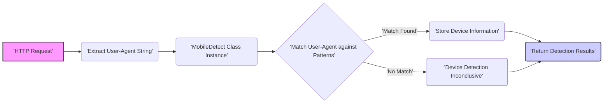
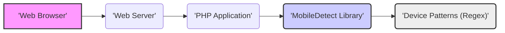

# Project Design Document: Mobile Detect Library

**Project Name:** Mobile Detect

**Project Repository:** https://github.com/serbanghita/mobile-detect

**Document Version:** 1.1

**Date:** October 26, 2023

**Author:** AI Software Architect

## 1. Introduction

This document provides an enhanced and detailed design overview of the `mobile-detect` PHP library. Its primary purpose is to serve as a robust foundation for subsequent threat modeling activities. It meticulously outlines the library's functionality, architecture, data flow, and key components. This comprehensive information will empower security professionals to effectively identify potential vulnerabilities and design targeted mitigation strategies.

## 2. Project Overview

The `mobile-detect` library is a server-side PHP utility meticulously engineered to detect mobile devices, tablets, and operating systems. It achieves this by rigorously analyzing the User-Agent HTTP header provided by the client. The library offers a streamlined and efficient mechanism for web developers to dynamically tailor content and application functionality based on the specific type of device accessing their web presence.

**Key Goals:**

*   To accurately and reliably identify a wide range of mobile devices, tablets, and their respective operating systems by scrutinizing the User-Agent string.
*   To provide a developer-friendly and intuitive API for seamless access to detailed device information.
*   To maintain a comprehensive, regularly updated, and highly accurate repository of device signatures and patterns.

## 3. System Architecture

The `mobile-detect` library operates exclusively within the server-side PHP execution environment. It receives the raw User-Agent string directly from the incoming HTTP request and subjects it to a rigorous analysis against a curated set of regular expressions and predefined device patterns.

### 3.1. Components

*   **`MobileDetect` Class:** This is the central and primary class of the library. It encapsulates the core logic responsible for parsing the User-Agent string and subsequently determining various device properties.
    *   **Internal Properties:** The class internally stores collections of regular expressions for matching mobile devices, operating systems, browsers, and specific device brands.
    *   **Detection Methods:**  It exposes public methods like `isMobile()`, `isTablet()`, `isiOS()`, `getOperatingSystem()`, `getBrowser()`, `version()`, and others to retrieve detection results.
    *   **Magic Methods:**  The library often utilizes magic methods (e.g., `__get`, `__isset`) to provide a more convenient and dynamic way to access detection results (e.g., `$detect->isIphone()`).
*   **User-Agent String:** This is the fundamental input to the library. It is typically extracted from the `$_SERVER['HTTP_USER_AGENT']` superglobal variable within the PHP environment. This string is provided by the client's browser or application.
*   **Device Patterns (Regular Expressions and Keywords):** The library employs a sophisticated collection of regular expressions and specific keywords to accurately match against the User-Agent string. These patterns are meticulously crafted to identify a diverse range of device types, operating systems, and browsers. These patterns are typically defined as internal static properties or constants within the `MobileDetect` class.
*   **Matching Logic:** The core algorithm within the `MobileDetect` class iterates through its defined device patterns. For each pattern, it attempts to find a match within the provided User-Agent string using PHP's regular expression functions (e.g., `preg_match`). The order of these patterns can be significant for accurate detection.
*   **Output Methods:** The library provides a rich set of methods designed to retrieve the results of the device detection process. These methods return boolean values (e.g., `isMobile()`), string values (e.g., `getOperatingSystem()`), or version information.

### 3.2. Data Flow

**Detailed Data Flow:**

*   **'HTTP Request':** A user's device initiates an HTTP request to the web server hosting the application. This request includes various headers, including the User-Agent string.
*   **'Extract User-Agent String':** The web server receives the HTTP request. The PHP application, upon being invoked, extracts the User-Agent string from the request headers, typically accessing the `$_SERVER['HTTP_USER_AGENT']` variable.
*   **'MobileDetect Class Instance':** The application code instantiates an object of the `MobileDetect` class. This instantiation initializes the library and makes its detection capabilities available.
*   **'Match User-Agent against Patterns':** The `MobileDetect` class receives the extracted User-Agent string. Internally, it iterates through its predefined collection of regular expressions and keywords, attempting to find a match within the provided User-Agent string. This matching process is the core of the detection logic.
*   **'Match Found':** If a pattern successfully matches a portion of the User-Agent string, the library identifies the corresponding device type, operating system, browser, or other relevant characteristics based on the matched pattern.
*   **'Store Device Information':** Upon a successful match, the detected information is stored internally within the `MobileDetect` object. This information is then accessible through the library's various getter methods.
*   **'Device Detection Inconclusive':** If, after iterating through all the defined patterns, no match is found within the User-Agent string, the library concludes that the device cannot be specifically identified based on its current patterns.
*   **'Return Detection Results':** The application code calls specific methods on the `MobileDetect` object (e.g., `$detect->isMobile()`, `$detect->getOperatingSystem()`) to retrieve the results of the detection process. These methods return the stored information or a default value if no match was found.

### 3.3. Key Interactions

*   **Web Server and PHP Application:** The web server acts as the intermediary, receiving the initial HTTP request and delegating the processing to the PHP application. The User-Agent string is passed from the web server environment to the PHP application.
*   **PHP Application and `MobileDetect` Library:** The PHP application explicitly interacts with the `MobileDetect` library by instantiating its class and invoking its methods to perform the device detection.
*   **`MobileDetect` Library Internals:** The core logic resides within the `MobileDetect` class. This includes the pattern matching algorithms, the storage of device patterns, and the methods for accessing detection results.

## 4. Security Considerations

This section provides a more detailed examination of potential security considerations relevant to the `mobile-detect` library. This analysis forms the basis for a comprehensive threat model.

*   **User-Agent String Manipulation and Spoofing:** The library's primary input, the User-Agent string, is entirely client-controlled. Malicious actors can easily manipulate or spoof this string to misrepresent their device. This could lead to:
    *   **Bypassing Detection Logic:** Attackers might craft User-Agent strings to appear as legitimate desktop browsers to bypass mobile-specific security checks or content restrictions.
    *   **Exploiting Logic Based on Incorrect Detection:** If application logic relies heavily on the accuracy of device detection for security decisions (e.g., redirecting to a less secure mobile site), spoofing can be exploited.
*   **Regular Expression Denial of Service (ReDoS):** The library's reliance on regular expressions for pattern matching introduces the risk of ReDoS attacks. Attackers can craft specific User-Agent strings that exploit the complexity of certain regular expressions, causing the matching process to consume excessive CPU resources and potentially leading to a denial of service.
    *   **Vulnerable Patterns:**  Identifying and mitigating overly complex or poorly written regular expressions within the library is crucial.
    *   **Input Validation (Limited Scope):** While the library itself doesn't perform input validation on the User-Agent string, the consuming application should be aware of this risk.
*   **Accuracy and Completeness of Detection Patterns:** While not a direct security vulnerability, inaccuracies or gaps in the device detection patterns can have security implications:
    *   **Unintended Access:**  A new or uncommon device might not be correctly identified, potentially granting it access intended only for specific device types.
    *   **Broken Functionality:** If the application logic adapts functionality based on device type, incorrect detection can lead to a broken user experience or expose unintended features.
*   **Information Disclosure (Low Risk):** The specific regular expressions used by the library, while publicly available in the source code, could theoretically be analyzed by attackers to understand the detection logic and craft bypasses. However, this is generally considered a low risk due to the open-source nature and wide use of similar patterns.
*   **Dependency Vulnerabilities (If Applicable):** While `mobile-detect` appears to be largely self-contained, if future versions introduce dependencies on other libraries, vulnerabilities in those dependencies could indirectly affect the security of applications using `mobile-detect`.
*   **Logic Flaws in Detection Logic:** Subtle errors or oversights in the matching logic itself could lead to incorrect classifications, potentially creating security vulnerabilities if application logic relies on these classifications.

## 5. Deployment Environment

The `mobile-detect` library is designed to be seamlessly integrated into server-side PHP applications. Its typical deployment involves the following components:

*   **Web Server (e.g., Apache, Nginx):** The web server receives incoming HTTP requests from clients, including the crucial User-Agent header. It then passes these requests to the PHP interpreter for processing.
*   **PHP Interpreter:** The PHP interpreter executes the application code, including the instantiation and utilization of the `mobile-detect` library. It receives the User-Agent string from the web server environment.
*   **PHP Application Code:** The developer integrates the `mobile-detect` library into their application code. This involves including the library's files and instantiating the `MobileDetect` class to perform device detection. The application then uses the detection results to tailor content, functionality, or apply specific security measures.
*   **Server Operating System:** The underlying operating system provides the environment for the web server and PHP interpreter to run. Security configurations at the OS level can impact the overall security posture.

## 6. Future Considerations

*   **Automated Pattern Updates:** Implement a mechanism for automatically updating the device detection patterns from a reliable source to ensure accuracy and coverage of new devices.
*   **Performance Benchmarking and Optimization:** Regularly benchmark the library's performance with large volumes of User-Agent strings and identify areas for optimization, particularly in the regular expression matching logic.
*   **Consideration of Client Hints API:** Explore the potential integration or supplementation of User-Agent string analysis with the emerging Client Hints API for more reliable and privacy-respecting device information.
*   **Enhanced Regular Expression Security Analysis:** Implement static analysis tools or manual reviews specifically focused on identifying potentially vulnerable regular expressions prone to ReDoS attacks.
*   **Modularization of Detection Logic:** Consider modularizing the detection logic to allow for easier updates and potentially the inclusion of alternative detection methods beyond regular expressions.

## 7. Diagrams

### 7.1. Component Diagram (Conceptual)

## 8. Terminology

*   **User-Agent String:** A string of text sent by a client's browser or application to a web server. It identifies the type of client, its operating system, and other relevant details.
*   **Regular Expression (Regex):** A sequence of characters that defines a search pattern. Used extensively in `mobile-detect` for matching device signatures.
*   **ReDoS (Regular Expression Denial of Service):** A type of denial-of-service attack that exploits vulnerabilities in regular expressions, causing excessive CPU consumption.
*   **Client Hints API:** A newer web API that allows the server to request specific information about the client's device and browser in a more structured and privacy-preserving way than the User-Agent string.

This enhanced design document provides a more in-depth understanding of the `mobile-detect` library's architecture and potential security considerations. This detailed information is crucial for conducting thorough threat modeling and implementing appropriate security measures to protect applications utilizing this library.