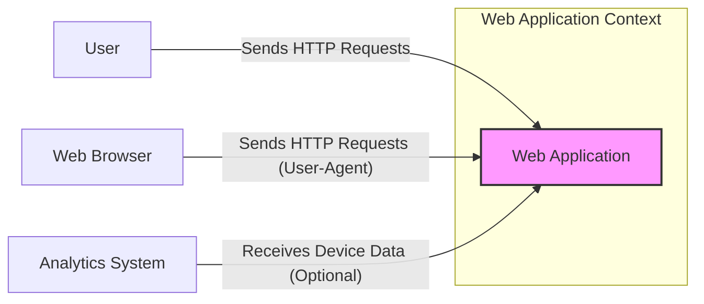
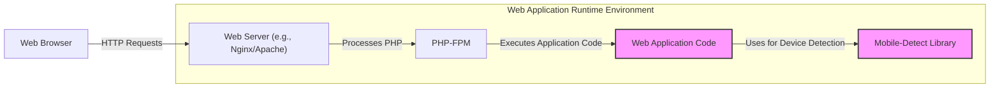
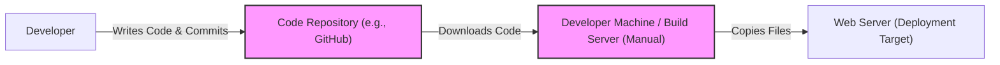

# BUSINESS POSTURE

This project, using the 'mobile-detect' library, aims to enhance user experience by tailoring website or application behavior based on the detected device type. This could involve optimizing content delivery for mobile devices, adjusting layouts for different screen sizes, or enabling device-specific features. For a fresh startup, this functionality is likely focused on improving user engagement and satisfaction, which are crucial for early growth and user retention.

Business Priorities and Goals:
- Enhance user experience across different devices.
- Optimize content delivery and application performance for mobile users.
- Improve user engagement and satisfaction.
- Potentially gather device-specific analytics for user behavior understanding.

Business Risks:
- Incorrect device detection leading to degraded user experience or broken functionality for some users.
- Dependency on an external library which might become unmaintained or contain undetected bugs.
- Potential for minor performance overhead due to device detection logic execution on each request.
- If device detection is used for critical functionality (e.g., security features based on device type - which is not recommended for User-Agent based detection), bypassing detection could lead to security vulnerabilities. However, for a startup focused on user experience, this is a lower priority risk compared to established companies with complex security requirements.

# SECURITY POSTURE

Existing Security Controls:
- security control: Reliance on the security of the underlying PHP environment and web server where the 'mobile-detect' library is deployed. This is inherent to any PHP application.
- security control: Potentially basic input validation within the 'mobile-detect' library to handle unexpected User-Agent string formats, although this is primarily for functionality and not explicitly a security control. (Implementation details would need to be checked in the library's source code).

Accepted Risks:
- accepted risk: User-Agent string spoofing. The 'mobile-detect' library relies on User-Agent strings, which can be easily modified by users. This is an inherent limitation of User-Agent based detection and is generally accepted as a trade-off for ease of implementation and broad compatibility.  The library is not intended for high-security contexts where device verification is critical.
- accepted risk: Dependency on a third-party library.  There is always a risk associated with using external libraries, including potential undiscovered vulnerabilities or lack of future maintenance.

Recommended Security Controls:
- security control: Regularly check for updates to the 'mobile-detect' library and update to the latest version to benefit from bug fixes and potential security improvements, although security vulnerabilities in this type of library are less common.
- security control: Implement robust server-side input validation and sanitization in the application that uses the 'mobile-detect' library, especially if device detection results are used to make decisions that impact application logic or data handling. This is a general best practice for web application security.
- security control:  For critical applications, consider performing basic static analysis or code review of the 'mobile-detect' library to gain a better understanding of its code and identify any potential unexpected behavior, although for this specific library, this is likely low priority.

Security Requirements:
- Authentication: Not directly applicable to the 'mobile-detect' library itself. Authentication is handled by the web application that uses this library.
- Authorization: Not directly applicable to the 'mobile-detect' library itself. Authorization is handled by the web application that uses this library.
- Input Validation: The 'mobile-detect' library processes User-Agent strings. While the library itself might have some basic input handling, the primary security concern related to input validation is within the web application that uses the library. The application should ensure that device detection results are used safely and do not introduce vulnerabilities.
- Cryptography: Not applicable to the 'mobile-detect' library. Cryptographic operations are not within the scope of this library's functionality.

# DESIGN

## C4 CONTEXT



Context Diagram Description:

- Elements:
    - - Name: User
      - Type: Person
      - Description: End-user accessing the web application.
      - Responsibilities: Interacting with the web application through a web browser.
      - Security controls: User authentication and authorization are handled by the Web Application (outside the scope of this library).
    - - Name: Web Browser
      - Type: Software System
      - Description: Web browser used by the user to access the web application. Sends HTTP requests including User-Agent string.
      - Responsibilities: Rendering the web application interface, sending user requests to the web application.
      - Security controls: Browser security is managed by the user and browser vendor. The Web Application relies on standard browser security features.
    - - Name: Web Application
      - Type: Software System
      - Description: The web application that utilizes the 'mobile-detect' library to detect the user's device type and adapt its behavior accordingly.
      - Responsibilities: Serving web content, processing user requests, using 'mobile-detect' library for device detection, potentially sending device data to analytics.
      - Security controls:  Input validation, session management, authorization, secure coding practices, protection against common web vulnerabilities (OWASP Top 10), integration of 'mobile-detect' library.
    - - Name: Analytics System
      - Type: Software System
      - Description: (Optional) An external analytics system that may receive device-related data from the Web Application for tracking and analysis purposes.
      - Responsibilities: Collecting and analyzing user and device data.
      - Security controls: Data encryption in transit and at rest, access control, data retention policies (security controls are dependent on the specific analytics system used).

## C4 CONTAINER



Container Diagram Description:

- Elements:
    - - Name: Web Browser
      - Type: Container (External)
      - Description: User's web browser, initiating HTTP requests to the web application.
      - Responsibilities: Rendering UI, sending requests.
      - Security controls: Browser security features.
    - - Name: Web Server (e.g., Nginx/Apache)
      - Type: Container
      - Description: Web server responsible for handling HTTP requests, serving static content, and proxying PHP requests to PHP-FPM.
      - Responsibilities: HTTP request handling, static content serving, reverse proxy.
      - Security controls: Web server configuration (e.g., TLS/SSL, security headers), access control, DDoS protection.
    - - Name: PHP-FPM
      - Type: Container
      - Description: FastCGI Process Manager for PHP, responsible for executing PHP code.
      - Responsibilities: PHP code execution, process management.
      - Security controls: PHP configuration hardening, process isolation, resource limits.
    - - Name: Web Application Code
      - Type: Container
      - Description: The custom application code written in PHP, which integrates and uses the 'mobile-detect' library.
      - Responsibilities: Application logic, handling user requests, utilizing 'mobile-detect' for device detection.
      - Security controls: Secure coding practices, input validation, output encoding, session management, authorization logic, integration of 'mobile-detect' library.
    - - Name: Mobile-Detect Library
      - Type: Container
      - Description: The 'mobile-detect' PHP library, included within the Web Application Code.
      - Responsibilities: Device detection based on User-Agent strings and HTTP headers.
      - Security controls:  Library updates, potential static analysis (low priority for this type of library).

## DEPLOYMENT

Deployment Architecture: Cloud Virtual Machine (VM)

```mermaid
graph LR
    subgraph "Cloud Provider (e.g., AWS, Azure, GCP)"
        subgraph "Virtual Machine Instance"
            os["Operating System (Linux)"]
            webserver["Web Server (Nginx)"]
            phpfpm["PHP-FPM"]
            webapp["Web Application Files"]
        end
        network["Virtual Network"] -- "Traffic" --> Virtual Machine Instance
        internet["Internet"] -- "HTTP/HTTPS Requests" --> Virtual Network
    end

    style Virtual Machine Instance fill:#f9f,stroke:#333,stroke-width:2px
```

Deployment Diagram Description:

- Elements:
    - - Name: Internet
      - Type: Environment (External)
      - Description: Public internet, source of user traffic.
      - Responsibilities: Routing user requests to the cloud network.
      - Security controls: General internet security considerations, DDoS protection at the cloud provider level.
    - - Name: Virtual Network
      - Type: Infrastructure
      - Description: Cloud provider's virtual network, providing network isolation and connectivity.
      - Responsibilities: Network routing, security group enforcement, network access control.
      - Security controls: Network Access Control Lists (NACLs), Security Groups, subnet isolation.
    - - Name: Virtual Machine Instance
      - Type: Infrastructure
      - Description: Cloud VM instance hosting the web application components.
      - Responsibilities: Running the operating system, web server, PHP-FPM, and web application.
      - Security controls: OS hardening, firewall configuration, access management (IAM), regular patching.
        - - Name: Operating System (Linux)
          - Type: Software
          - Description: Linux operating system running on the VM.
          - Responsibilities: Providing the base environment for other software.
          - Security controls: OS hardening, regular patching, access control.
        - - Name: Web Server (Nginx)
          - Type: Software
          - Description: Nginx web server running on the VM.
          - Responsibilities: Handling HTTP requests, serving static content, proxying PHP requests.
          - Security controls: Web server configuration (TLS/SSL, security headers, access control).
        - - Name: PHP-FPM
          - Type: Software
          - Description: PHP-FPM running on the VM.
          - Responsibilities: Executing PHP code.
          - Security controls: PHP configuration hardening, process isolation.
        - - Name: Web Application Files
          - Type: Data
          - Description: Deployed web application code and the 'mobile-detect' library files.
          - Responsibilities: Containing application logic and library code.
          - Security controls: File system permissions, access control, secure deployment practices.

## BUILD

Build Process Diagram: Simple Manual Deployment



Build Process Description:

- Elements:
    - - Name: Developer
      - Type: Person
      - Description: Software developer working on the web application.
      - Responsibilities: Writing code, committing changes to the code repository.
      - Security controls: Developer workstation security, secure coding practices, code review (if applicable).
    - - Name: Code Repository (e.g., GitHub)
      - Type: System
      - Description: Version control system storing the web application code, including the 'mobile-detect' library.
      - Responsibilities: Code versioning, access control, code history.
      - Security controls: Access control (authentication and authorization), branch protection, audit logs.
    - - Name: Developer Machine / Build Server (Manual)
      - Type: Environment
      - Description: In this simple scenario, the build process is manual and might be performed on the developer's machine or a designated build server. It involves directly copying files to the web server.
      - Responsibilities:  Retrieving code from the repository, copying files to the deployment target.
      - Security controls: Access control to the build server, secure file transfer methods (e.g., SCP, SFTP), limited access to production environments.
    - - Name: Web Server (Deployment Target)
      - Type: Environment
      - Description: The target web server where the web application is deployed.
      - Responsibilities: Hosting and serving the web application.
      - Security controls: Web server hardening, access control, regular security updates.

Build Security Controls:
- security control: Access control to the code repository to ensure only authorized developers can modify the code.
- security control: Secure access to the build server and deployment target (e.g., using SSH keys, strong passwords).
- security control: Secure file transfer methods (e.g., SCP, SFTP) for deploying the application.
- security control: In a more mature setup (beyond this simple example), automated build pipelines (CI/CD) with security checks (SAST, linters) would be recommended for improved security and automation. However, for a simple PHP library integration in a startup context, manual deployment might be initially acceptable.

# RISK ASSESSMENT

Critical Business Processes:
- User Experience Management: Ensuring a consistent and optimized user experience across different devices is the primary business process supported by this project.
- Content Delivery: Optimizing content delivery based on device type is another key process, potentially impacting website performance and user engagement.

Data to Protect and Sensitivity:
- User-Agent Strings: The 'mobile-detect' library processes User-Agent strings, which are generally considered non-sensitive public data.
- Device Type Information: The detected device type itself is also not considered highly sensitive.
- Potentially, if device detection is used for analytics, aggregated and anonymized device data might be collected. The sensitivity of this data depends on the specific analytics implementation and data retention policies. However, in the context of this library, the data handled is generally low sensitivity.

# QUESTIONS & ASSUMPTIONS

Questions:
- What is the specific purpose of using the 'mobile-detect' library in the web application? (e.g., content optimization, feature adaptation, analytics).
- Are there any specific performance requirements for device detection?
- What is the expected scale and traffic volume for the web application?
- Is there any plan to use device detection for security-related features (not recommended for User-Agent based detection, but important to clarify)?
- What is the overall security maturity level of the organization using this library?

Assumptions:
- Business Posture: The project is for a startup focused on user experience and growth. Security is important but balanced with the need for rapid development and deployment. Risk appetite is moderate.
- Security Posture:  Existing security controls are basic, relying on standard web application security practices.  The focus is on implementing essential security measures without excessive overhead.
- Design: The web application is a typical PHP-based application deployed on a cloud VM using a standard web server (Nginx) and PHP-FPM. The build process is initially simple and manual.