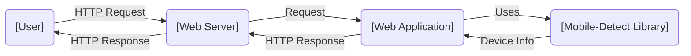
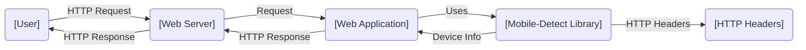
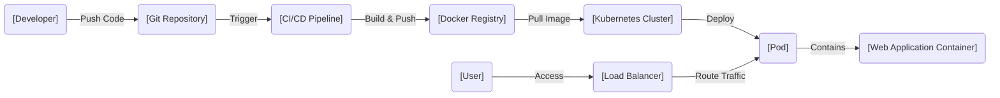
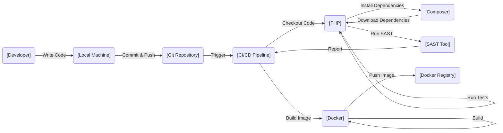

# BUSINESS POSTURE

Business Priorities and Goals:

The primary goal of the Mobile-Detect project is to provide a lightweight, efficient, and reliable PHP library for detecting mobile devices (including tablets) and their specific features. This enables developers to tailor their web applications and content for optimal user experience on different devices. The project prioritizes ease of use, performance, and accuracy.

Business Risks:

- Inaccurate Device Detection: Incorrectly identifying a device or its capabilities can lead to a suboptimal user experience, potentially causing user frustration and impacting engagement. This is a major risk as it directly affects the core purpose of the library.
- Performance Overhead: If the library introduces significant performance overhead, it can negatively impact website loading times, especially on mobile devices with limited resources. This contradicts the project's goal of being lightweight.
- Maintenance and Updates: The mobile device landscape is constantly evolving. Failure to keep the library updated with new devices and browser updates can lead to decreased accuracy and eventual obsolescence.
- Security Vulnerabilities: While the library's primary function isn't security-related, vulnerabilities in the code could potentially be exploited, although the attack surface is likely small.
- Compatibility Issues: Compatibility problems with different PHP versions or server configurations could limit the library's adoption and usefulness.

# SECURITY POSTURE

Existing Security Controls:

- security control: Input Validation: The library likely performs some level of input validation on the user-agent string and other HTTP headers to prevent unexpected behavior or potential vulnerabilities. Implemented in `Mobile_Detect.php`.
- security control: Regular Expression Best Practices: The library uses regular expressions extensively. It's assumed that best practices for writing secure and efficient regular expressions are followed to mitigate risks like ReDoS (Regular Expression Denial of Service). Implemented in `Mobile_Detect.php`.
- security control: Community Scrutiny: Being an open-source project on GitHub, the code is subject to community scrutiny, which can help identify and address potential security issues. Described in the project's README and contribution guidelines.
- security control: Dependency Management: The project appears to have minimal external dependencies, reducing the risk of supply chain attacks. Described in `composer.json`.

Accepted Risks:

- accepted risk: Limited Scope: The library's scope is limited to device detection, reducing the overall attack surface.
- accepted risk: Server-Side Execution: The library runs on the server-side, mitigating some client-side risks.

Recommended Security Controls:

- security control: Static Code Analysis: Integrate static code analysis tools (e.g., PHPStan, Psalm) into the development workflow to identify potential security vulnerabilities and code quality issues.
- security control: Regular Security Audits: Conduct periodic security audits of the codebase, focusing on regular expressions and input validation.

Security Requirements:

- Authentication: Not applicable, as the library doesn't handle user authentication.
- Authorization: Not applicable, as the library doesn't handle user authorization.
- Input Validation: The library must validate all inputs, primarily the user-agent string and HTTP headers, to prevent unexpected behavior and potential vulnerabilities. This includes checking for data type, length, and format.
- Cryptography: Not directly applicable, as the library's primary function doesn't involve encryption or cryptographic operations. However, if the library were to handle sensitive data (which it currently doesn't), appropriate cryptographic measures should be used.

# DESIGN

## C4 CONTEXT

Element Descriptions:

- User:
  1.  Name: User
  2.  Type: Person
  3.  Description: A person using a web browser on a device (desktop, mobile, tablet, etc.).
  4.  Responsibilities: Initiates HTTP requests to the web server.
  5.  Security controls: Browser security settings, HTTPS.

- Web Server:
  1.  Name: Web Server
  2.  Type: System
  3.  Description: A web server (e.g., Apache, Nginx) that receives HTTP requests from users and forwards them to the web application.
  4.  Responsibilities: Receives HTTP requests, forwards requests to the web application, serves static content, handles SSL/TLS termination.
  5.  Security controls: Firewall, TLS configuration, access controls, intrusion detection system.

- Web Application:
  1.  Name: Web Application
  2.  Type: System
  3.  Description: The web application that utilizes the Mobile-Detect library to tailor content based on the user's device.
  4.  Responsibilities: Processes user requests, uses the Mobile-Detect library, generates dynamic content, interacts with other systems (databases, APIs, etc.).
  5.  Security controls: Input validation, output encoding, authentication, authorization, session management.

- Mobile-Detect Library:
  1.  Name: Mobile-Detect Library
  2.  Type: Library
  3.  Description: The Mobile-Detect PHP library used for detecting mobile devices.
  4.  Responsibilities: Parses user-agent strings and HTTP headers, provides device information (type, OS, browser, etc.).
  5.  Security controls: Input validation, regular expression best practices.

## C4 CONTAINER

Element Descriptions:

- User:
  1.  Name: User
  2.  Type: Person
  3.  Description: A person using a web browser on a device (desktop, mobile, tablet, etc.).
  4.  Responsibilities: Initiates HTTP requests to the web server.
  5.  Security controls: Browser security settings, HTTPS.

- Web Server:
  1.  Name: Web Server
  2.  Type: System
  3.  Description: A web server (e.g., Apache, Nginx) that receives HTTP requests from users and forwards them to the web application.
  4.  Responsibilities: Receives HTTP requests, forwards requests to the web application, serves static content, handles SSL/TLS termination.
  5.  Security controls: Firewall, TLS configuration, access controls, intrusion detection system.

- Web Application:
  1.  Name: Web Application
  2.  Type: System
  3.  Description: The web application that utilizes the Mobile-Detect library to tailor content based on the user's device.
  4.  Responsibilities: Processes user requests, uses the Mobile-Detect library, generates dynamic content, interacts with other systems (databases, APIs, etc.).
  5.  Security controls: Input validation, output encoding, authentication, authorization, session management.

- Mobile-Detect Library:
  1.  Name: Mobile-Detect Library
  2.  Type: Library
  3.  Description: The Mobile-Detect PHP library used for detecting mobile devices.
  4.  Responsibilities: Parses user-agent strings and HTTP headers, provides device information (type, OS, browser, etc.).
  5.  Security controls: Input validation, regular expression best practices.

- HTTP Headers:
  1.  Name: HTTP Headers
  2.  Type: Data
  3.  Description: HTTP headers, including the User-Agent string, provided by the user's browser.
  4.  Responsibilities: Contains information about the user's browser and device.
  5.  Security controls: Input validation within the Mobile-Detect library.

## DEPLOYMENT

Possible Deployment Solutions:

1.  Traditional Web Server: Deploy the PHP application and the Mobile-Detect library on a traditional web server (Apache, Nginx) with PHP installed.
2.  Cloud-Based Web Hosting: Deploy the application and library on a cloud platform like AWS, Google Cloud, or Azure using their web hosting services (e.g., AWS Elastic Beanstalk, Google App Engine, Azure App Service).
3.  Containerized Deployment: Package the application and the Mobile-Detect library within a Docker container and deploy it using a container orchestration platform like Kubernetes or Docker Swarm.

Chosen Solution (Containerized Deployment with Kubernetes):

Element Descriptions:

- Developer:
  1.  Name: Developer
  2.  Type: Person
  3.  Description: A developer working on the web application.
  4.  Responsibilities: Writes code, commits changes to the Git repository.
  5.  Security controls: Code review, secure coding practices.

- Git Repository:
  1.  Name: Git Repository
  2.  Type: System
  3.  Description: A Git repository (e.g., GitHub, GitLab) hosting the application code and the Mobile-Detect library.
  4.  Responsibilities: Stores code, tracks changes, triggers CI/CD pipelines.
  5.  Security controls: Access controls, branch protection rules.

- CI/CD Pipeline:
  1.  Name: CI/CD Pipeline
  2.  Type: System
  3.  Description: A CI/CD pipeline (e.g., Jenkins, GitLab CI, GitHub Actions) that automates the build, test, and deployment process.
  4.  Responsibilities: Builds the Docker image, runs tests, pushes the image to the Docker registry, deploys the application to Kubernetes.
  5.  Security controls: Secure build environment, vulnerability scanning, automated testing.

- Docker Registry:
  1.  Name: Docker Registry
  2.  Type: System
  3.  Description: A Docker registry (e.g., Docker Hub, AWS ECR, Google Container Registry) storing the Docker image of the web application.
  4.  Responsibilities: Stores Docker images, provides access control.
  5.  Security controls: Access controls, image vulnerability scanning.

- Kubernetes Cluster:
  1.  Name: Kubernetes Cluster
  2.  Type: System
  3.  Description: A Kubernetes cluster managing the deployment and scaling of the web application.
  4.  Responsibilities: Orchestrates containers, manages resources, provides networking and load balancing.
  5.  Security controls: Network policies, role-based access control (RBAC), pod security policies.

- Pod:
  1.  Name: Pod
  2.  Type: System
  3.  Description: A Kubernetes Pod running an instance of the web application container.
  4.  Responsibilities: Runs the web application container.
  5.  Security controls: Resource limits, security context.

- Web Application Container:
  1.  Name: Web Application Container
  2.  Type: Container
  3.  Description: A Docker container containing the web application and the Mobile-Detect library.
  4.  Responsibilities: Runs the web application code, uses the Mobile-Detect library.
  5.  Security controls: Minimal base image, regular updates, vulnerability scanning.

- Load Balancer:
  1. Name: Load Balancer
  2. Type: System
  3. Description: A load balancer distributing traffic across multiple Pods.
  4. Responsibilities: Distributes traffic, provides a single point of access to the application.
  5. Security controls: TLS termination, DDoS protection.

- User:
  1. Name: User
  2. Type: Person
  3. Description: End-user accessing application.
  4. Responsibilities: Access application.
  5. Security controls: N/A.

## BUILD

Build Process Description:

1.  Developer: The developer writes code on their local machine and commits changes to a Git repository (e.g., GitHub).
2.  Git Repository: The Git repository stores the code and triggers the CI/CD pipeline upon new commits.
3.  CI/CD Pipeline: The CI/CD pipeline (e.g., GitHub Actions, Jenkins) checks out the code from the repository.
4.  Composer: Composer, the PHP dependency manager, installs the project's dependencies, including the Mobile-Detect library (if it's used as a dependency) and any testing frameworks.
5.  PHP: The PHP interpreter executes the test suite and runs a Static Application Security Testing (SAST) tool.
6.  SAST Tool: A SAST tool (e.g., PHPStan, Psalm) analyzes the code for potential security vulnerabilities and code quality issues. The results are reported back to the CI/CD pipeline.
7.  Docker: If the tests pass and the SAST tool doesn't report any critical issues, Docker builds a container image containing the web application and its dependencies.
8.  Docker Registry: The Docker image is pushed to a Docker registry (e.g., Docker Hub, AWS ECR).

Security Controls in Build Process:

- security control: Dependency Management (Composer): Composer ensures that the correct versions of dependencies are installed, reducing the risk of using vulnerable libraries. `composer.json` and `composer.lock` files define dependencies.
- security control: Static Application Security Testing (SAST): The SAST tool helps identify potential security vulnerabilities in the code before deployment. Integration with CI/CD pipeline.
- security control: Automated Testing: The test suite helps ensure that the code functions correctly and doesn't introduce any regressions. Integration with CI/CD pipeline.
- security control: Secure Build Environment: The CI/CD pipeline should run in a secure environment with limited access and appropriate security measures.
- security control: Image Scanning: Docker images should be scanned for vulnerabilities before being pushed to the registry.

# RISK ASSESSMENT

Critical Business Processes:

-   Serving web content tailored to the user's device.
-   Providing accurate device detection information to web applications.

Data Protection:

-   Data Sensitivity: The Mobile-Detect library itself does not handle or store any sensitive user data. It primarily processes the User-Agent string and other HTTP headers, which are generally considered low-sensitivity data. However, the web application using the library might handle sensitive data, but that's outside the scope of the library itself.
-   Data to Protect: While the library doesn't directly handle sensitive data, the integrity of the device detection information is crucial. Incorrect or manipulated device information could lead to incorrect content rendering or potentially be used to bypass security measures implemented by the web application.

# QUESTIONS & ASSUMPTIONS

Questions:

-   What specific PHP versions are officially supported by the library?
-   Are there any known compatibility issues with specific web servers or server configurations?
-   What is the process for reporting and addressing security vulnerabilities discovered in the library?
-   What is the expected frequency of updates to keep up with the evolving mobile device landscape?
-   Are there any plans to add support for Client Hints?

Assumptions:

-   BUSINESS POSTURE: The project prioritizes accuracy, performance, and ease of use. The project maintainers are responsive to community feedback and security concerns.
-   SECURITY POSTURE: The library follows secure coding practices, particularly regarding regular expressions. The project has minimal external dependencies. The user-agent string is treated as untrusted input and is properly validated.
-   DESIGN: The library is used as a dependency within a larger PHP web application. The web application is responsible for handling user authentication, authorization, and other security-related concerns. The deployment environment is secure and follows best practices. The build process includes automated testing and security checks.