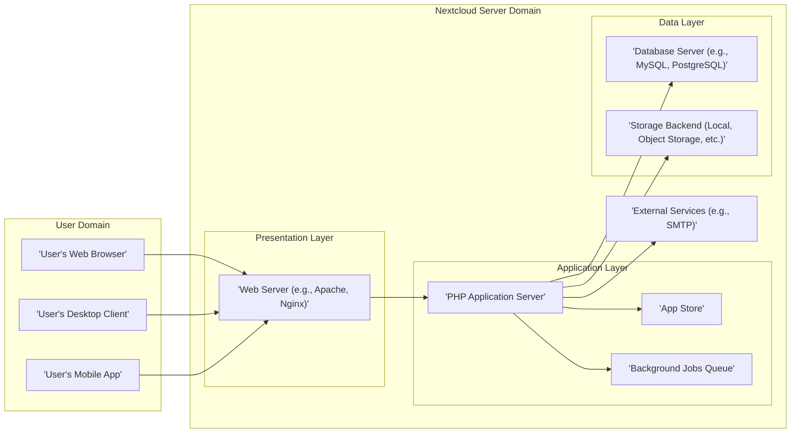
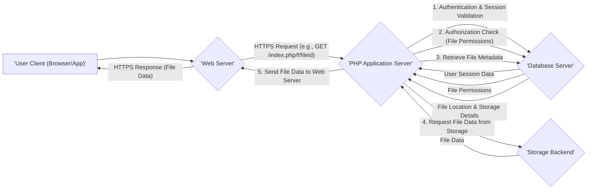

# Project Design Document: Nextcloud Server

**Version:** 1.1
**Date:** October 26, 2023
**Author:** AI Software Architect

## 1. Introduction

This document provides an enhanced architectural design of the Nextcloud Server project, based on the publicly available codebase at [https://github.com/nextcloud/server](https://github.com/nextcloud/server). Building upon the previous version, this document offers a more detailed and refined overview of the system's components, interactions, and data flow, specifically tailored for subsequent threat modeling activities.

## 2. Goals and Objectives

The primary goals of the Nextcloud Server project remain:

*   Providing a self-hosted platform for file storage, synchronization, and sharing.
*   Offering a suite of integrated collaborative applications, including calendar, contacts, mail, and office document editing.
*   Ensuring extensibility and customization through a robust app ecosystem.
*   Prioritizing user control over data and emphasizing data privacy.
*   Enabling cross-platform accessibility through web browsers, dedicated desktop clients, and mobile applications.

## 3. High-Level Architecture

The Nextcloud Server employs a layered architecture, clearly separating concerns and facilitating maintainability.

## 4. Detailed Component Description

This section provides a more in-depth description of the core components within the Nextcloud Server.

*   **User's Web Browser:**  Serves as the primary graphical user interface (GUI) for accessing and interacting with Nextcloud functionalities. It renders the web application provided by the server.
*   **User's Desktop Client:** A native application installed on user's computers, enabling seamless file synchronization between local devices and the Nextcloud server. It often operates in the background.
*   **User's Mobile App:**  Native applications for Android and iOS platforms, offering mobile-optimized access to files, contacts, calendars, and other Nextcloud features.
*   **Web Server (e.g., Apache, Nginx):**  Acts as the entry point for all client requests. Its responsibilities include:
    *   Receiving and routing incoming HTTP/HTTPS requests.
    *   Serving static content (images, CSS, JavaScript).
    *   Handling TLS/SSL termination for secure communication.
    *   Proxying dynamic requests to the PHP Application Server.
*   **PHP Application Server:** The central component responsible for the core logic and functionality of Nextcloud. Key responsibilities include:
    *   **Authentication and Authorization:** Verifying user identities and managing access permissions.
    *   **Request Handling:** Processing user requests and generating appropriate responses.
    *   **Business Logic Execution:** Implementing the core functionalities of file management, sharing, collaboration, and application-specific logic.
    *   **Data Access Layer:** Interacting with the Database Server and Storage Backend to retrieve and persist data.
    *   **API Endpoints:** Providing RESTful APIs for communication with clients and apps.
    *   **Event Handling:** Managing and responding to system events.
*   **App Store:** A curated repository of installable applications (written in PHP) that extend Nextcloud's core functionalities. It provides a mechanism for discovering, installing, and managing these extensions.
*   **Background Jobs Queue:** Manages asynchronous tasks that do not require immediate user interaction. This improves responsiveness and allows for resource-intensive operations to be processed in the background. Examples include:
    *   Generating file previews and thumbnails.
    *   Processing large file uploads.
    *   Sending email notifications.
    *   Running scheduled maintenance tasks.
*   **Database Server (e.g., MySQL, PostgreSQL):**  Provides persistent storage for structured data. It stores:
    *   User account information (usernames, hashed passwords, email addresses).
    *   File metadata (filenames, paths, ownership, sharing permissions, version history).
    *   Application configurations and settings.
    *   Data specific to installed applications (e.g., calendar events, contact details).
*   **Storage Backend (Local, Object Storage, etc.):**  The physical or logical location where user files are stored. Nextcloud supports various options, offering flexibility in deployment and scalability:
    *   Local file system storage on the server.
    *   Object storage services (e.g., Amazon S3, OpenStack Swift, Azure Blob Storage).
    *   Network file systems (e.g., SMB/CIFS, NFS).
    *   External storage providers (accessed via APIs).
*   **External Services (e.g., SMTP):** Integrations with external services to provide additional functionalities. For example, an SMTP server is used for sending email notifications to users.

## 5. Data Flow: File Access

This section details the sequence of actions when a user requests to access a file.

**Detailed Data Flow Steps:**

1. The **User Client** (web browser or app) sends an HTTPS request to the **Web Server** to access a specific file.
2. The **Web Server** forwards the request to the **PHP Application Server**.
3. The **PHP Application Server** first performs **authentication and session validation** by querying the **Database Server** to verify the user's identity and active session.
4. The **Database Server** returns the user's session data to the **PHP Application Server**.
5. Next, the **PHP Application Server** performs an **authorization check** by querying the **Database Server** to ensure the user has the necessary permissions to access the requested file.
6. The **Database Server** returns the file permissions to the **PHP Application Server**.
7. If authorized, the **PHP Application Server** retrieves the **file metadata** (including its storage location) from the **Database Server**.
8. The **Database Server** provides the file's location and storage details to the **PHP Application Server**.
9. The **PHP Application Server** then requests the actual **file data** from the appropriate **Storage Backend** based on the retrieved metadata.
10. The **Storage Backend** retrieves the file data and sends it back to the **PHP Application Server**.
11. The **PHP Application Server** sends the **file data** to the **Web Server**.
12. The **Web Server** sends the **file data** as an HTTPS response back to the **User Client**.

## 6. Key Interactions and Interfaces

*   **User Client <-> Web Server:**  Communication primarily occurs over HTTPS, utilizing standard web protocols.
*   **Web Server <-> PHP Application Server:** Typically via FastCGI Process Manager (FPM) for efficient handling of PHP requests.
*   **PHP Application Server <-> Database Server:**  Communication through database-specific protocols (e.g., MySQL protocol, PostgreSQL protocol) using database drivers.
*   **PHP Application Server <-> Storage Backend:**  Interaction depends on the storage backend type:
    *   Local storage: Direct file system calls.
    *   Object storage:  API calls over HTTP/HTTPS (e.g., AWS SDK, OpenStack SDK).
    *   Network file systems:  Standard network file sharing protocols (e.g., SMB/CIFS, NFS).
*   **PHP Application Server <-> App Store:**  Internal APIs and database interactions to manage app installations and updates.
*   **PHP Application Server <-> Background Jobs Queue:**  Utilizes a message queue system (e.g., Redis, database queues) for asynchronous task management.
*   **PHP Application Server <-> External Services:**  Communication via various protocols depending on the service (e.g., SMTP for email, REST APIs for other integrations).

## 7. Security Considerations (Detailed)

This section expands on the initial security considerations, providing more specific examples and categorizations relevant for threat modeling.

*   **Authentication and Authorization:** Ensuring only legitimate users access the system and have appropriate permissions.
    *   **Strong Password Policies:** Enforcement of complex and unique passwords.
    *   **Multi-Factor Authentication (MFA):**  Support for 2FA or other MFA methods.
    *   **Brute-Force Protection:** Mechanisms to prevent automated password guessing attacks (e.g., rate limiting, account lockout).
    *   **Role-Based Access Control (RBAC):**  Granular control over user permissions based on roles.
    *   **Secure Session Management:**  Using secure cookies (HttpOnly, Secure flags), session timeouts, and protection against session fixation and hijacking.
*   **Data Protection:** Safeguarding data at rest and in transit.
    *   **Encryption at Rest:** Encrypting data stored in the Storage Backend (server-side encryption).
    *   **Encryption in Transit:**  Enforcing HTTPS for all communication between clients and the server.
    *   **Data Loss Prevention (DLP):** Features or integrations to prevent sensitive data from leaving the system inappropriately.
*   **Application Security:** Protecting the application logic and preventing common web vulnerabilities.
    *   **Input Validation and Sanitization:**  Rigorous validation of all user inputs to prevent injection attacks (SQL injection, XSS, command injection).
    *   **Output Encoding:**  Proper encoding of output data to prevent XSS vulnerabilities.
    *   **Cross-Site Request Forgery (CSRF) Protection:**  Using tokens to prevent unauthorized actions on behalf of authenticated users.
    *   **Clickjacking Protection:**  Implementing measures to prevent embedding the Nextcloud interface in malicious iframes.
    *   **Secure File Handling:**
        *   Antivirus scanning of uploaded files.
        *   Prevention of path traversal vulnerabilities during file access.
        *   Secure generation of file previews and thumbnails to avoid exploitation of image processing libraries.
    *   **Dependency Management:**  Regularly updating third-party libraries and dependencies to patch known vulnerabilities.
*   **Infrastructure Security:** Securing the underlying infrastructure on which Nextcloud is deployed.
    *   **Operating System Hardening:**  Securing the server operating system.
    *   **Firewall Configuration:**  Restricting network access to necessary ports and services.
    *   **Regular Security Updates:**  Keeping the operating system and other system software up-to-date.
*   **Database Security:** Protecting the database from unauthorized access and data breaches.
    *   **Strong Database Credentials:**  Using strong and unique passwords for database users.
    *   **Principle of Least Privilege:**  Granting only necessary permissions to database users.
    *   **Network Segmentation:**  Isolating the database server from public networks.
    *   **Regular Security Audits:**  Monitoring database activity for suspicious behavior.
*   **App Security:**  Mitigating risks associated with third-party applications.
    *   **App Signing and Verification:**  Mechanisms to verify the authenticity and integrity of apps.
    *   **Permissions Management for Apps:**  Controlling the access rights granted to installed applications.
    *   **Security Audits of Popular Apps:**  Community or vendor-led security reviews of widely used apps.
*   **Logging and Monitoring:**  Tracking system activity for security analysis and incident response.
    *   Comprehensive logging of authentication attempts, access requests, and errors.
    *   Centralized log management for easier analysis.
    *   Real-time monitoring for suspicious activity.

## 8. Deployment Considerations

Nextcloud Server offers flexible deployment options:

*   **On-Premises Deployment:**  Installation on physical or virtual servers within the user's infrastructure, providing maximum control over the environment.
    *   Requires managing the underlying operating system, web server, database, and storage.
*   **Cloud-Based Deployment:**  Deployment on cloud infrastructure platforms (e.g., AWS, Azure, Google Cloud) leveraging managed services.
    *   Reduces the operational burden of managing infrastructure components.
    *   Offers scalability and high availability options.
*   **Containerized Deployment:**  Deployment using containerization technologies like Docker and orchestration platforms like Kubernetes.
    *   Provides portability and simplifies deployment and management.
    *   Facilitates scaling and resilience.
*   **Managed Nextcloud Providers:** Utilizing services offered by third-party providers who handle the installation, maintenance, and security of the Nextcloud instance.

## 9. Future Considerations

*   Detailed design documentation for individual core applications (e.g., Files, Calendar, Contacts, Mail).
*   Specific security architecture for the app store and the app installation/update process.
*   In-depth analysis of security mechanisms implemented within each component.
*   Consideration of scalability and high availability architectures, including load balancing and database replication.
*   Detailed design of the notification system and its security implications.

This enhanced design document provides a more comprehensive and detailed understanding of the Nextcloud Server architecture, making it a more effective foundation for conducting thorough threat modeling and identifying potential security vulnerabilities.