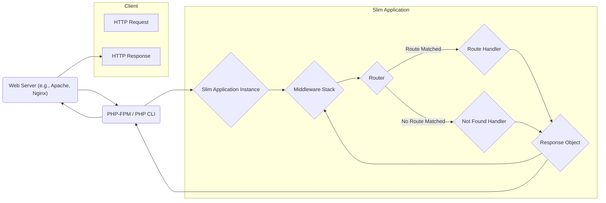

# Project Design Document: Slim Framework

**Version:** 1.1
**Date:** October 26, 2023
**Author:** AI Software Architect

## 1. Introduction

This document provides a detailed design overview of the Slim Framework, a PHP microframework for building web applications and APIs. This document aims to clearly articulate the architecture, components, and data flow within the framework to facilitate effective threat modeling. The information presented here is based on the publicly available source code of the Slim Framework found at [https://github.com/slimphp/slim](https://github.com/slimphp/slim). This revision includes more detail on component interactions and security considerations to better support threat modeling activities.

## 2. Goals and Objectives

The primary goals of the Slim Framework are to:

*   Provide a minimal and flexible foundation for building web applications.
*   Offer a robust routing mechanism to map HTTP requests to specific handlers.
*   Implement a middleware system for request and response processing, enabling cross-cutting concerns.
*   Be easily extensible and adaptable to various application needs through its architecture.
*   Maintain a lightweight footprint and high performance, suitable for microservices and APIs.

## 3. High-Level Architecture

The Slim Framework follows a request/response lifecycle pattern, heavily utilizing middleware to intercept and process requests before they reach route handlers and to modify responses before they are sent to the client. This layered approach is central to its design.

**Key Components:**

*   **HTTP Request:** The raw incoming request from the client, containing headers, body, and URI information.
*   **Web Server:**  Software like Apache or Nginx that acts as the entry point, receiving client requests and forwarding them to the PHP environment.
*   **PHP-FPM / PHP CLI:** The PHP interpreter environment responsible for executing the Slim application code.
*   **Slim Application Instance (`\Slim\App`):** The core object that orchestrates the application lifecycle, manages routing, and dispatches requests through the middleware pipeline. It also holds the dependency injection container.
*   **Middleware Stack (`\Slim\MiddlewareDispatcher`):** An ordered collection of callable middleware that intercept and process both incoming requests and outgoing responses. The order of middleware is crucial.
*   **Router (`\Slim\Routing\RouteCollector` and `\Slim\Routing\Router`):**  Responsible for defining and matching routes based on the request URI and HTTP method. It identifies the appropriate handler for a given request.
*   **Route (`\Slim\Routing\Route`):** Represents a specific endpoint, associating a URI pattern, HTTP methods, and a callable handler. It may also contain route-specific middleware.
*   **Route Handler (Callable):**  A function, closure, or invokable class that contains the application logic to process the request and generate a response. This is where the core business logic resides.
*   **Not Found Handler (`\Slim\Handlers\NotFoundHandler`):**  Invoked by the Router when no matching route is found for the incoming request, typically returning a 404 error.
*   **Response Object (`\Slim\Psr7\Response`):**  Represents the HTTP response to be sent back to the client, including headers, status code, and body.

## 4. Detailed Design

### 4.1. Application Initialization

*   The application lifecycle begins with the instantiation of the `\Slim\App` class.
*   Configuration parameters, such as display error details, can be set during initialization or later through methods on the `App` instance.
*   The `App` instance initializes the dependency injection container (PSR-11 compatible), the router, and the middleware dispatcher.
*   Service providers or factories can be registered within the container for managing dependencies.

### 4.2. Routing

*   Routes are defined fluently using methods like `get()`, `post()`, `put()`, `delete()`, `patch()`, and `options()` on the `App` instance.
*   Each route definition takes a URI pattern (which can include named placeholders for parameters) and a callable handler.
*   Route parameters defined within the URI pattern (e.g., `/users/{id}`) are extracted and made available to the route handler. The Router is responsible for securely extracting and potentially validating these parameters.
*   Route groups allow for applying common middleware or prefixes to a set of related routes.
*   The `Router` component iterates through the defined routes to find a match for the incoming request's URI and method. Route matching order can be significant.
*   If a match is found, the corresponding `Route` object is identified, and its associated handler and any route-specific middleware are prepared for execution.
*   If no match is found, the `NotFoundHandler` is invoked, which by default returns a 404 response. This behavior can be customized.

### 4.3. Middleware

*   Middleware are implemented as callables (functions, closures, or invokable classes) that adhere to a specific signature, receiving a `Request` object and a handler (the next middleware or the route handler).
*   Global middleware are added to the application's middleware stack using the `add()` method on the `App` instance. The order in which middleware are added determines their execution order during request processing.
*   Route-specific middleware can be attached to individual routes or route groups, executing only for those specific endpoints.
*   Each middleware has the opportunity to inspect and modify the `Request` object before it reaches subsequent middleware or the route handler.
*   Middleware can also generate a `Response` directly, effectively short-circuiting the rest of the middleware stack and the route handler.
*   During response processing, middleware are executed in the reverse order of their addition, allowing them to modify the `Response` object before it is sent to the client. This is crucial for tasks like adding security headers or logging.

### 4.4. Request Handling

*   Upon receiving a request, the `App` instance dispatches it through the `MiddlewareDispatcher`.
*   The `MiddlewareDispatcher` iterates through the middleware stack, executing each middleware in order.
*   Each middleware receives the current `Request` object and a callable representing the next middleware in the chain (or the route handler if it's the last middleware).
*   The middleware can perform actions such as authentication, authorization, request logging, input sanitization, and more.
*   After the middleware stack has been processed, the `Router` is invoked to match the request to a defined route.
*   If a route is matched, the route's specific middleware (if any) are executed, followed by the route handler.
*   The route handler receives the `Request` object (potentially modified by middleware) and is responsible for generating a `Response` object.

### 4.5. Response Handling

*   The `Response` object is typically generated by the route handler.
*   The `MiddlewareDispatcher` then processes the middleware stack again, but in reverse order.
*   Each middleware has the opportunity to inspect and modify the `Response` object. This is commonly used for adding headers (e.g., security headers), setting cookies, or logging the response.
*   Finally, the `Response` object is returned to the PHP environment, which sends it back to the web server and ultimately to the client.

### 4.6. Dependency Injection Container

*   Slim utilizes a PSR-11 compatible dependency injection container (by default, `Pimple` or can be configured with others).
*   Services and dependencies can be registered in the container as singletons or factories.
*   Route handlers and middleware can declare dependencies in their constructors, which are then resolved and injected by the container. This promotes loose coupling and testability.
*   The container can be accessed through the `App` instance.

### 4.7. Error Handling

*   Slim provides a default error handler that is invoked when exceptions are thrown during request processing.
*   Developers can customize the error handler by registering a custom handler in the dependency injection container under the `errorHandler` key.
*   Error handlers receive the thrown exception and the `Request` object, allowing them to log the error, generate a user-friendly error response, or perform other error-handling tasks.
*   The `displayErrorDetails` setting controls whether detailed error information is included in the response, which should be disabled in production environments to prevent information leakage.

## 5. Data Flow

The following outlines the typical data flow within a Slim application, highlighting potential points of interaction and modification:

1. **Client sends an HTTP Request.**
2. **Web Server receives the request and passes it to PHP-FPM/PHP CLI.**
3. **The Slim Application Instance is invoked.**
4. **The Middleware Stack processes the Request (in order of addition):**
    *   Each middleware inspects and potentially modifies the `Request` object.
    *   Middleware can generate a `Response`, short-circuiting further processing.
5. **The Router attempts to match the Request to a defined Route:**
    *   The Router compares the request URI and method with registered routes.
    *   Route parameters are extracted.
6. **If a Route is matched:**
    *   Route-specific middleware (if any) are executed.
    *   The associated Route Handler is invoked, receiving the `Request` object.
    *   The Route Handler processes the request and generates a `Response` object.
7. **If no Route is matched:**
    *   The Not Found Handler is invoked, generating a 404 Response.
8. **The Middleware Stack processes the Response (in reverse order of addition):**
    *   Each middleware inspects and potentially modifies the `Response` object (e.g., adding headers).
9. **The Slim Application sends the Response back to PHP-FPM/PHP CLI.**
10. **PHP-FPM/PHP CLI sends the Response to the Web Server.**
11. **The Web Server sends the HTTP Response back to the Client.**

## 6. Security Considerations

This section details potential areas of security concern that should be thoroughly explored during threat modeling.

*   **Input Validation and Sanitization:** Slim does not provide built-in input validation or sanitization. Developers must implement this within their middleware or route handlers to prevent vulnerabilities like Cross-Site Scripting (XSS), SQL Injection, and command injection. Failing to validate route parameters is a common vulnerability.
*   **Output Encoding:**  Slim does not automatically encode output. Developers are responsible for encoding data before rendering it in responses to prevent XSS attacks. This includes HTML escaping, URL encoding, and JavaScript escaping as needed.
*   **Middleware Security:**  The security of the application heavily relies on the security of its middleware. Malicious or poorly written middleware can introduce vulnerabilities, bypass security checks, or leak sensitive information. Careful review and auditing of middleware is essential.
*   **Routing Security:**  Improperly configured routes or overly permissive route patterns can expose unintended endpoints or administrative functionalities. Ensure routes are specific and follow the principle of least privilege. Be mindful of potential route collisions or shadowing.
*   **Dependency Vulnerabilities:**  Slim relies on third-party components (e.g., the dependency injection container, PSR-7 implementation). Vulnerabilities in these dependencies can impact the application's security. Regularly update dependencies and perform security audits.
*   **Error Handling and Information Disclosure:**  Verbose error messages in production environments can leak sensitive information about the application's internal workings, database structure, or file paths. Ensure `displayErrorDetails` is disabled in production. Custom error handlers should log errors securely without exposing sensitive data to the client.
*   **Session Management Security:**  While Slim doesn't provide built-in session management, developers often integrate external libraries. Secure session management practices are crucial, including using secure session IDs, HTTPOnly and Secure flags for cookies, and proper session invalidation.
*   **Cross-Site Request Forgery (CSRF) Protection:**  Slim does not provide built-in CSRF protection. Developers must implement CSRF protection mechanisms, typically involving synchronizer tokens, especially for state-changing requests.
*   **File Upload Security:**  If the application handles file uploads, rigorous validation of file types, sizes, and content is necessary to prevent malicious uploads. Store uploaded files outside the webroot and consider using a dedicated storage service.
*   **Authentication and Authorization:** Slim provides building blocks but doesn't enforce specific authentication or authorization mechanisms. Developers must implement these using middleware or within route handlers. Securely storing and managing credentials is paramount.
*   **HTTP Header Security:**  Developers should ensure appropriate security headers are set in responses (e.g., `Content-Security-Policy`, `X-Frame-Options`, `Strict-Transport-Security`) using middleware to mitigate various client-side attacks.
*   **Denial of Service (DoS) Attacks:**  Consider implementing rate limiting or other mechanisms to protect against DoS attacks at the application or web server level.

## 7. Deployment Considerations

*   Slim applications are typically deployed on web servers like Apache or Nginx with PHP-FPM for improved performance and security.
*   Proper web server configuration is crucial for security, including setting appropriate file permissions, disabling unnecessary modules, and configuring virtual hosts securely.
*   Enforce HTTPS by configuring SSL/TLS certificates on the web server or a reverse proxy. Redirect HTTP traffic to HTTPS.
*   Consider using a reverse proxy (e.g., Varnish, Cloudflare) for added security benefits like DDoS protection, caching, and SSL termination.
*   Regularly update PHP and web server software to patch security vulnerabilities.
*   Implement proper logging and monitoring to detect and respond to security incidents.

## 8. Assumptions and Constraints

*   This design document is based on the current understanding of the Slim Framework's architecture as of the latest available information on its GitHub repository.
*   It assumes a standard deployment environment using a web server and PHP-FPM.
*   Specific security implementations are the responsibility of the application developer using the framework and are not inherently enforced by Slim.
*   This document focuses on the core framework components and their interactions, particularly from a security perspective, and does not delve into specific application logic built using Slim.
*   It is assumed that developers using Slim are familiar with general web security best practices.

This improved document provides a more detailed and security-focused overview of the Slim Framework's design, making it more suitable for effective threat modeling. The expanded security considerations and detailed component descriptions should aid in identifying potential vulnerabilities and developing appropriate mitigation strategies.
