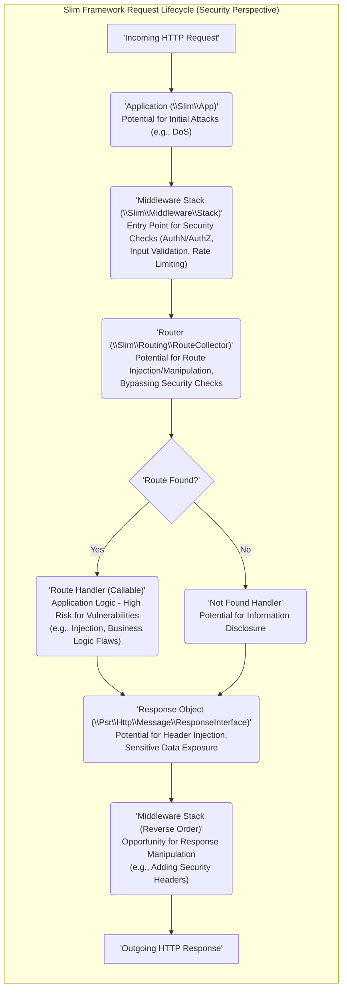

## Project Design Document: Slim Framework (Improved)

**1. Introduction**

This document provides an enhanced architectural design of the Slim Framework, a PHP micro-framework, specifically tailored for subsequent threat modeling activities. It delves into the framework's core components, elucidates the data flow with a security-centric perspective, outlines deployment considerations highlighting security implications, and details inherent security features and common best practices. This document aims to serve as a robust foundation for identifying potential security vulnerabilities and attack vectors within the Slim Framework ecosystem.

**2. Project Overview**

*   **Project Name:** Slim Framework
*   **Project Repository:** [https://github.com/slimphp/slim](https://github.com/slimphp/slim)
*   **Project Description:** Slim is a lean PHP micro-framework designed to facilitate the rapid creation of both simple and sophisticated web applications and RESTful APIs. At its core, Slim functions as a request dispatcher, receiving HTTP requests, routing them to appropriate application logic, and generating HTTP responses.
*   **Key Features:**
    *   Precise HTTP Routing:  Maps specific HTTP request methods and Uniform Resource Identifiers (URIs) to designated application logic handlers. This mapping is crucial for understanding potential entry points.
    *   Extensible Middleware Pipeline: Enables the interception and manipulation of both incoming HTTP requests and outgoing responses. Middleware plays a vital role in implementing security measures.
    *   PSR-7 HTTP Message Compliance: Adheres to the PHP-FIG PSR-7 standard for HTTP message interfaces, ensuring interoperability and predictable data structures for requests and responses.
    *   Integrated Dependency Injection Container: Manages application dependencies, promoting modularity and testability. Understanding dependency injection is important for identifying potential injection vulnerabilities.
    *   Customizable Error Handling: Provides mechanisms for managing exceptions and errors gracefully. Proper error handling is crucial to prevent information leakage.
    *   Flexible Templating Engine Integration: Supports integration with various PHP templating engines, requiring careful consideration of output encoding for security.

**3. Architectural Design**

The Slim Framework operates on a request/response lifecycle, primarily orchestrated by its routing mechanism and the middleware pipeline. Understanding this flow is key to identifying where security checks and vulnerabilities might exist.

**3.1. Core Components (Detailed for Security):**

*   **Application (`\Slim\App`):** The central nervous system of the framework. It encapsulates the router, the middleware stack, the dependency injection container, and application-wide settings. From a security perspective, misconfigured settings or vulnerabilities within the application object itself can have broad impact.
*   **Router (`\Slim\Routing\RouteCollector` and `\Slim\Routing\RouteParser`):**  Responsible for mapping incoming HTTP requests to specific route handlers based on URI and HTTP method. Security concerns here include:
    *   **Route Definition Vulnerabilities:**  Poorly defined routes can lead to unintended access or allow bypassing of security checks.
    *   **Parameter Handling:** How route parameters are extracted and validated is critical to prevent injection attacks.
*   **Middleware (`\Slim\Middleware\Stack`):** A layered sequence of callable units that intercept and process HTTP requests and responses. Middleware is a critical point for implementing security controls:
    *   **Authentication Middleware:** Verifies the identity of the requester. Vulnerabilities here can lead to unauthorized access.
    *   **Authorization Middleware:** Determines if an authenticated user has permission to access a resource. Flaws can lead to privilege escalation.
    *   **Input Validation Middleware:**  Sanitizes and validates incoming data. Absence or flaws can lead to injection attacks.
    *   **Security Headers Middleware:** Sets HTTP headers to enhance client-side security (e.g., CSP, HSTS). Misconfiguration can weaken security posture.
*   **Request (`\Psr\Http\Message\ServerRequestInterface`):** Represents the incoming HTTP request. Security considerations include:
    *   **Header Manipulation:**  Understanding how headers are parsed and used is important for preventing header injection attacks.
    *   **Body Parsing:**  How the request body is parsed (e.g., JSON, XML) can introduce vulnerabilities if not handled carefully.
*   **Response (`\Psr\Http\Message\ResponseInterface`):** Represents the outgoing HTTP response. Security considerations include:
    *   **Header Injection:**  Careless manipulation of response headers can lead to vulnerabilities.
    *   **Sensitive Data Exposure:** Ensuring sensitive data is not inadvertently included in the response body.
*   **Route (`\Slim\Routing\Route`):**  A specific mapping between a URI pattern, HTTP method, and a callable handler. Security implications arise from:
    *   **Overly Permissive Routes:** Routes that are too broad can expose unintended functionality.
    *   **Lack of Input Validation:** If the associated handler doesn't validate input, it can be vulnerable.
*   **Route Handler (Callable):** The application logic executed upon a successful route match. This is where most application-specific vulnerabilities reside:
    *   **Business Logic Flaws:**  Vulnerabilities in the application's core logic.
    *   **Database Interactions:**  Susceptible to SQL injection if not properly handled.
    *   **External API Calls:**  Potential for vulnerabilities if external APIs are not interacted with securely.
*   **Dependency Injection Container (`\Psr\Container\ContainerInterface`):** Manages the instantiation and dependencies of objects. Security implications include:
    *   **Dependency Confusion:**  If dependencies are not managed correctly, it could lead to using vulnerable versions.
    *   **Service Injection Vulnerabilities:**  If not configured properly, it could allow malicious code to be injected.
*   **Error Handler (`\Slim\Interfaces\ErrorHandlerInterface`):** Manages uncaught exceptions and errors. Security concerns include:
    *   **Information Disclosure:**  Detailed error messages in production can reveal sensitive information.
    *   **Denial of Service:**  Improper error handling could lead to application crashes.

**3.2. Data Flow (Security Focused):**

**3.3. Key Interactions (Security Implications):**

*   The `Application` receives the initial request, making it a potential target for denial-of-service attacks if not adequately protected at the infrastructure level.
*   The `Middleware Stack` is the primary line of defense. Properly implemented middleware is crucial for authentication, authorization, input validation, and other security measures. Bypassing or misconfiguring middleware can create significant vulnerabilities.
*   The `Router` determines the application logic to be executed. Vulnerabilities in route definitions or parameter handling can lead to unauthorized access or the execution of unintended code.
*   The `Route Handler` is where the core application logic resides and is often the source of many vulnerabilities if secure coding practices are not followed.
*   The `Response` object must be carefully constructed to avoid header injection and the unintentional disclosure of sensitive information.
*   The `Error Handler` plays a critical role in preventing information leakage by ensuring that detailed error messages are not exposed in production environments.

**4. Deployment Considerations (Security Focused):**

*   **Web Server (Apache/Nginx):**  The web server configuration is paramount for security. This includes:
    *   **TLS/SSL Configuration:** Enforcing HTTPS with strong ciphers is essential.
    *   **Security Headers:** Configuring headers like `Strict-Transport-Security`, `Content-Security-Policy`, `X-Frame-Options`, and `X-Content-Type-Options` at the web server level.
    *   **Access Control:** Restricting access to sensitive files and directories.
*   **PHP Interpreter (PHP-FPM):** Secure PHP configuration is crucial:
    *   **`disable_functions`:** Disabling potentially dangerous PHP functions.
    *   **`open_basedir`:** Restricting file system access.
    *   **Error Reporting:**  Configuring error reporting appropriately for production.
*   **Containerization (Docker):**  Container security best practices should be followed:
    *   **Base Image Security:** Using minimal and trusted base images.
    *   **Vulnerability Scanning:** Regularly scanning container images for vulnerabilities.
    *   **Principle of Least Privilege:** Running containers with minimal necessary privileges.
*   **Cloud Platforms (AWS, Azure, GCP):** Leveraging cloud-specific security features:
    *   **Firewalls and Network Segmentation:**  Controlling network access to the application.
    *   **Identity and Access Management (IAM):**  Managing access to cloud resources.
    *   **Web Application Firewalls (WAFs):**  Protecting against common web attacks.
*   **Reverse Proxies & Load Balancers:** These can provide additional security benefits:
    *   **DDoS Protection:**  Mitigating distributed denial-of-service attacks.
    *   **SSL Termination:**  Offloading SSL encryption and decryption.
    *   **Centralized Security Policies:**  Enforcing security policies across multiple instances.

**5. Security Considerations (In-depth):**

*   **Input Handling (Developer Responsibility):** Slim relies on developers to implement robust input validation and sanitization within route handlers and middleware. Failure to do so can lead to:
    *   **Cross-Site Scripting (XSS):**  Malicious scripts injected into web pages.
    *   **SQL Injection:**  Exploiting vulnerabilities in database queries.
    *   **Command Injection:**  Executing arbitrary commands on the server.
    *   **Path Traversal:**  Accessing files and directories outside the intended scope.
*   **Output Encoding (Developer Responsibility):** Developers must ensure proper encoding of data displayed in templates or returned in API responses to prevent XSS attacks. Different encoding strategies are needed depending on the output context (HTML, JavaScript, URLs).
*   **CSRF Protection (Implementation Required):** Slim does not provide built-in CSRF protection. Developers must implement this, typically using middleware to generate and validate tokens.
*   **HTTPS Enforcement:** While Slim doesn't enforce HTTPS itself, it's crucial to configure web servers or use middleware to redirect HTTP traffic to HTTPS, protecting data in transit.
*   **Error Handling (Configuration is Key):**  Properly configuring Slim's error handler is essential to prevent the disclosure of sensitive information through error messages in production environments. Logging errors appropriately is also important for debugging and security monitoring.
*   **Dependency Management (Composer Security):** Using Composer is vital, but developers should be aware of potential vulnerabilities in dependencies. Regularly updating dependencies and using tools like `composer audit` is recommended.
*   **Security Headers (Middleware Implementation):**  Utilizing middleware to set security-related HTTP headers is a best practice. Understanding the purpose and configuration of headers like `Content-Security-Policy`, `X-Frame-Options`, `Strict-Transport-Security`, and `X-Content-Type-Options` is crucial.
*   **Rate Limiting (Middleware Implementation):** Implementing rate limiting middleware can help mitigate brute-force attacks and denial-of-service attempts by limiting the number of requests from a specific IP address within a given timeframe.

**6. Assumptions and Dependencies (Security Context):**

*   It is assumed that developers using the Slim Framework have a basic understanding of web application security principles and are aware of common vulnerabilities.
*   The security of any third-party middleware or libraries used within a Slim application is the responsibility of the developers integrating them. Careful selection and regular updates are crucial.
*   This design document focuses on the security aspects of the core Slim Framework. The security of the specific application logic built using Slim is the responsibility of the application developers.

**7. Out of Scope (Security Boundaries):**

*   Detailed vulnerability analysis of specific middleware or third-party packages (this would be part of a separate assessment of those components).
*   Operating system level security hardening (this is typically addressed in infrastructure security).
*   Database security configurations and best practices (this is a separate domain).
*   Specific application logic vulnerabilities (this requires code review and application-specific testing).
*   Detailed performance testing and optimization (while performance can have security implications, it's not the primary focus here).

This improved document provides a more detailed and security-focused architectural overview of the Slim Framework. It highlights potential areas of concern and serves as a more robust foundation for conducting thorough threat modeling exercises to identify and mitigate security risks effectively.