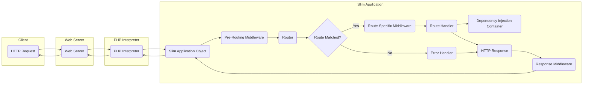
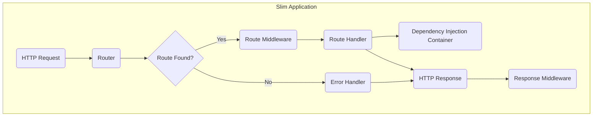
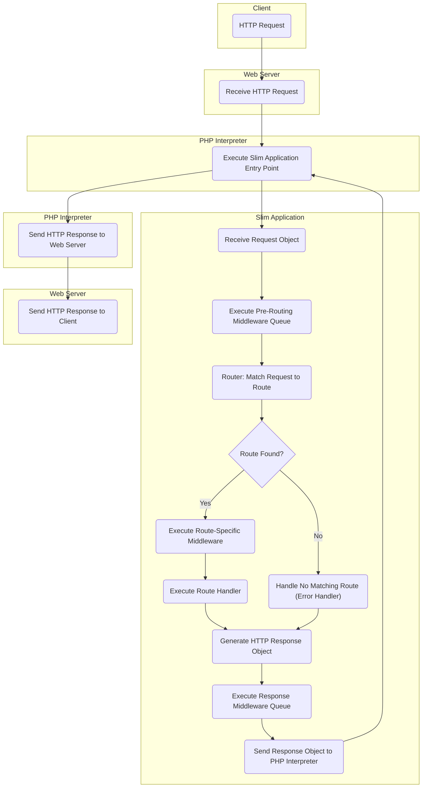

# Project Design Document: Slim Framework

**Version:** 1.1
**Date:** October 26, 2023
**Author:** AI Software Architect

## 1. Introduction

This document provides an enhanced architectural design of the Slim Framework, a PHP micro-framework for building web applications and APIs. This revised document is specifically tailored for threat modeling activities, offering a more detailed understanding of the system's components, data flow, and potential security considerations.

### 1.1. Purpose

The primary purpose of this document is to provide a comprehensive architectural overview of the Slim Framework to facilitate effective and targeted threat modeling. It aims to clearly identify key components, their interactions, and potential vulnerabilities that could be exploited.

### 1.2. Scope

This document focuses on the core architectural elements and the complete request lifecycle within a typical Slim Framework application. It emphasizes the framework's internal workings and its immediate interactions with the PHP environment and the web server. The scope does not extend to the specifics of individual applications built on Slim or the intricacies of external services they might integrate with, unless directly relevant to the framework's core functionality.

### 1.3. Target Audience

This document is intended for:

* Security engineers and architects responsible for performing threat modeling and security assessments.
* Developers building and maintaining applications using the Slim Framework.
* Operations teams involved in deploying and managing Slim-based applications.

## 2. Overview

The Slim Framework is a minimalist PHP framework designed for rapid development of robust web applications and RESTful APIs. Its core strengths lie in its streamlined routing mechanism, flexible middleware system, and efficient handling of HTTP requests and responses. While providing essential tools, Slim remains unopinionated about specific application structures, allowing developers flexibility in adopting patterns like MVC or others.

## 3. Architectural Design

A Slim application's architecture is centered around processing incoming HTTP requests and generating corresponding HTTP responses. The following components are fundamental to its operation:

* **HTTP Request Object (PSR-7):** Represents the incoming HTTP request from a client. This object encapsulates all request details, including headers, body, query parameters, and attributes.
* **HTTP Response Object (PSR-7):** Represents the outgoing HTTP response to be sent back to the client. This object contains headers, body content, and the HTTP status code.
* **Router:** The component responsible for mapping incoming HTTP requests to specific route handlers. It analyzes the request method and URI against defined routes.
* **Route Handlers (Actions/Controllers):** Callable PHP functions or methods that contain the application's core business logic. They are executed when the Router matches a request to a defined route. These handlers process the request and generate the response.
* **Middleware Queue:** An ordered collection of middleware components. Middleware intercepts HTTP requests before they reach the route handler and/or intercepts HTTP responses before they are sent. This allows for cross-cutting concerns like authentication, logging, request/response modification, and more.
* **Dependency Injection Container (PSR-11):** A central repository for managing application dependencies. Slim leverages a PSR-11 compatible container to inject dependencies into route handlers and middleware, promoting loose coupling and testability.
* **Error Handler:**  A component responsible for catching and managing exceptions and errors that occur during the request lifecycle. Slim provides a default error handler and allows for custom implementations to control error reporting and logging.
* **Application Object:** The central orchestrator of the request lifecycle. It receives the request, manages the middleware queue, dispatches the request to the Router, and ultimately sends the response.

## 4. Data Flow

The processing of an HTTP request within a Slim application follows a well-defined sequence:

1. A client initiates an HTTP request directed towards the web server.
2. The web server (e.g., Apache, Nginx) receives the request and forwards it to the PHP interpreter.
3. The Slim application's entry point script (typically located at `public/index.php`) is executed.
4. The **Slim Application Object** receives the incoming **HTTP Request Object**.
5. **Pre-Routing Middleware Processing:** The application object iterates through the registered middleware queue. Each middleware component has the opportunity to:
    * Inspect and modify the **HTTP Request Object**.
    * Generate and return an **HTTP Response Object**, effectively short-circuiting the request lifecycle.
    * Pass control to the next middleware in the queue.
6. The **Router** receives the **HTTP Request Object**.
7. **Route Matching:** The Router attempts to match the request URI and HTTP method against the defined routes.
8. **Route Resolution:**
    * **Successful Match:** If a matching route is found:
        * **Route-Specific Middleware Processing:** Any middleware specifically associated with the matched route is executed.
        * The corresponding **Route Handler** is invoked.
        * The Route Handler processes the request, potentially interacting with models, databases, or external services.
        * The Route Handler generates an **HTTP Response Object**.
    * **No Match:** If no matching route is found, the request is passed to the **Error Handler**.
9. **Response Middleware Processing:** The application object iterates through the middleware queue in reverse order. Each middleware component has the opportunity to:
    * Inspect and modify the **HTTP Response Object**.
10. The **Slim Application Object** sends the final **HTTP Response Object** back to the PHP interpreter.
11. The PHP interpreter transmits the response back to the web server.
12. The web server delivers the **HTTP Response** to the originating client.

## 5. Security Considerations for Threat Modeling

Understanding the architecture allows for targeted threat identification. Key security considerations within a Slim application include:

* **Input Validation & Sanitization:** Route Handlers must rigorously validate and sanitize all user-provided input from the **HTTP Request Object** (query parameters, request body, headers, cookies) to prevent injection vulnerabilities (SQL Injection, Cross-Site Scripting (XSS), Command Injection, etc.).
* **Authentication & Authorization:** Middleware is the primary mechanism for implementing authentication (verifying user identity) and authorization (granting access to resources). Vulnerabilities in authentication/authorization middleware can lead to unauthorized access. Secure storage and handling of credentials are also critical.
* **Session Management:** If the application uses sessions, secure session management practices are essential to prevent session hijacking and fixation attacks. This includes using secure session IDs, proper session invalidation, and the `HttpOnly` and `Secure` flags for session cookies.
* **Output Encoding:** When rendering dynamic content, especially user-generated content, proper output encoding is crucial to prevent XSS attacks. Context-aware encoding should be used based on where the data is being rendered (HTML, JavaScript, URL, etc.).
* **Cross-Site Request Forgery (CSRF) Protection:** For state-changing requests (e.g., POST, PUT, DELETE), implementing CSRF protection mechanisms (e.g., synchronizer tokens) is vital to prevent malicious requests originating from other websites.
* **Dependency Vulnerabilities:** The libraries and components managed by the **Dependency Injection Container** can contain security vulnerabilities. Regularly updating dependencies and performing security audits are necessary.
* **Error Handling & Information Disclosure:**  Detailed error messages exposed to clients can reveal sensitive information about the application's internal workings. Error handlers should log detailed errors internally but provide generic, non-revealing messages to the client.
* **Routing Security:**  Carefully define routes and restrict access to sensitive functionalities. Avoid exposing administrative or internal endpoints through easily guessable or predictable URLs. Implement proper authorization checks within route handlers or middleware.
* **Middleware Ordering & Configuration:** The order in which middleware is executed is critical. Incorrect ordering can lead to security bypasses (e.g., authentication middleware being executed after a vulnerable component). Securely configure middleware and understand its implications.
* **HTTP Header Security:**  Setting appropriate security-related HTTP headers in the **HTTP Response Object** (e.g., `Content-Security-Policy`, `X-Frame-Options`, `Strict-Transport-Security`, `X-Content-Type-Options`) can mitigate various client-side attacks.
* **Mass Assignment Vulnerabilities:** When binding request data to application models or entities, ensure proper whitelisting of allowed fields to prevent attackers from modifying unintended data.
* **File Upload Security:** If the application handles file uploads, implement robust validation (file type, size, content) and store uploaded files securely to prevent malicious uploads and potential code execution vulnerabilities.

## 6. Technologies Used

* **PHP:** The core programming language for the framework and applications.
* **PSR-7 (HTTP Message Interfaces):** Standard interfaces for representing HTTP requests and responses, ensuring interoperability.
* **PSR-11 (Container Interface):** Standard interface for dependency injection containers, promoting flexibility and testability.
* **Composer:** The primary dependency management tool for PHP projects, used to manage Slim and its dependencies.
* **Web Server (e.g., Apache, Nginx):**  Handles incoming HTTP requests and serves the Slim application.

## 7. Diagrams

### 7.1. Component Diagram

### 7.2. Detailed Request Flow Diagram

## 8. Future Considerations

* **Integration Security:** As Slim applications integrate with more external services (databases, APIs, message queues), thorough threat modeling of these integrations will be crucial, focusing on authentication, authorization, and data exchange security.
* **API Security Best Practices:** For applications exposing APIs, adherence to API security best practices (e.g., OAuth 2.0 for authorization, API rate limiting, input validation for API endpoints) will be paramount.
* **Cloud Deployment Security:** The security of the cloud environment where the Slim application is deployed (e.g., container security, infrastructure security, access controls) significantly impacts the overall security posture.
* **Security Auditing & Logging:** Implementing comprehensive security auditing and logging mechanisms will be essential for detecting and responding to security incidents. This includes logging authentication attempts, authorization failures, and suspicious activity.
* **Regular Security Assessments:** Periodic penetration testing and vulnerability assessments are recommended to identify and address potential security weaknesses in the application and its infrastructure.

This document provides a detailed architectural foundation for conducting thorough threat modeling of Slim Framework applications. By understanding the components, data flow, and potential security considerations outlined here, security professionals and developers can proactively identify and mitigate potential risks.