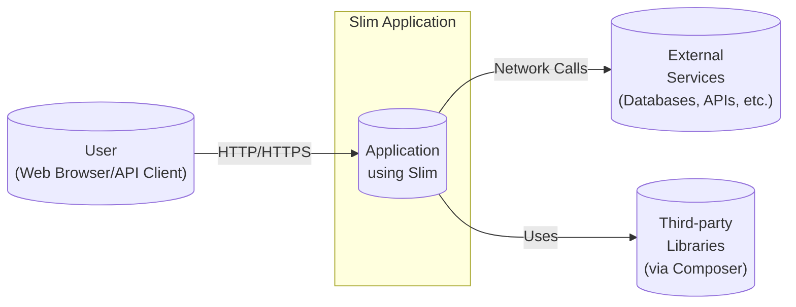
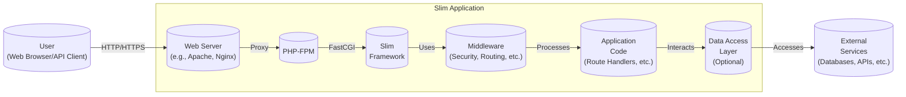
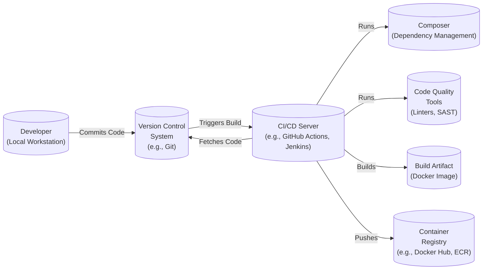

Okay, let's create a design document for the Slim PHP framework, keeping in mind its use for threat modeling later.

# BUSINESS POSTURE

Slim is a PHP micro-framework designed for creating APIs and web applications.  It's positioned as a lightweight alternative to larger, more opinionated frameworks.  The business priorities and goals that Slim addresses are:

*   Rapid Development:  Enable developers to quickly build and deploy web applications and APIs.
*   Flexibility:  Provide a minimal core with the ability to easily integrate other libraries and components as needed.  Avoid imposing a rigid structure.
*   Performance:  Offer good performance by minimizing overhead.
*   Maintainability:  Keep the codebase small and understandable, making it easier to maintain and extend.
*   Ease of Learning: Have a low barrier to entry for developers familiar with PHP.

Based on these, the most important business risks are:

*   Security Vulnerabilities:  As a web framework, any security vulnerabilities in Slim could be exploited to compromise applications built with it. This is the paramount risk.
*   Dependency Issues:  Reliance on third-party components (via Composer) introduces the risk of supply chain attacks or vulnerabilities in those dependencies.
*   Performance Bottlenecks:  If Slim itself introduces performance bottlenecks, it undermines one of its core value propositions.
*   Lack of Features (Mis-scoped):  While aiming for minimalism, if Slim lacks essential features, developers might choose other frameworks, impacting adoption.
*   Breaking Changes:  Major updates that introduce breaking changes could disrupt existing applications and deter upgrades.

# SECURITY POSTURE

Slim, being a framework, provides building blocks but the ultimate security posture depends heavily on how it's used by developers. Here's a breakdown:

*   security control: Routing Security: Slim's routing mechanism itself doesn't inherently enforce authentication or authorization. It's the developer's responsibility to implement these checks within route handlers or middleware. (Implemented in application code using Slim).
*   security control: Middleware Support: Slim's middleware architecture is crucial for security. It allows developers to inject security checks (authentication, authorization, input validation, CSRF protection, etc.) into the request/response pipeline. (Implemented via middleware components).
*   security control: Dependency Management (Composer): Slim relies on Composer for dependency management. This is a standard practice in the PHP ecosystem, but it introduces a supply chain security aspect. (Described in composer.json and managed by Composer).
*   security control: PSR-7 Compliance: Slim uses PSR-7 (HTTP message interfaces) and PSR-15 (HTTP server request handlers) standards. This promotes interoperability and allows the use of well-vetted HTTP libraries. (Implemented in Slim's core).
*   accepted risk: Developer Responsibility: Slim, by design, leaves many security decisions to the developer. This is an accepted risk, as it's a micro-framework, and the onus is on the application developer to implement appropriate security controls.
*   accepted risk: Limited Built-in Security Features: Slim doesn't include built-in features like ORM, templating engines, or form validation libraries. While this keeps it lightweight, it means developers need to choose and integrate these components, potentially introducing security risks if not done carefully.

Recommended Security Controls (High Priority):

*   security control: Input Validation Middleware: A dedicated middleware component for validating all incoming request data (query parameters, request body, headers) is highly recommended. This should be configurable and enforce strict validation rules.
*   security control: CSRF Protection Middleware: A middleware component to protect against Cross-Site Request Forgery attacks is essential for any web application.
*   security control: Security Headers Middleware: A middleware to automatically set security-related HTTP headers (e.g., X-Content-Type-Options, X-Frame-Options, Strict-Transport-Security, Content-Security-Policy) is highly recommended.
*   security control: Secure by Default Configuration: Slim should strive to have secure defaults for any configuration options it provides.

Security Requirements:

*   Authentication: Slim itself doesn't provide authentication mechanisms. Applications built with Slim *must* implement authentication using middleware or external libraries. The chosen mechanism should be appropriate for the application's security needs (e.g., API keys, JWT, OAuth 2.0).
*   Authorization: Similar to authentication, authorization is the responsibility of the application developer. Role-Based Access Control (RBAC) or Attribute-Based Access Control (ABAC) should be considered, implemented via middleware or within route handlers.
*   Input Validation: All input from any source (request parameters, headers, body) *must* be strictly validated. This includes data type validation, length checks, format validation, and sanitization where appropriate.
*   Cryptography: Slim should encourage the use of secure cryptographic practices.  If Slim provides any cryptographic utilities, they *must* use strong, up-to-date algorithms and secure key management.  Applications should use HTTPS for all communication.
*   Output Encoding: If Slim is used to generate HTML, proper output encoding *must* be used to prevent Cross-Site Scripting (XSS) vulnerabilities.

# DESIGN

## C4 CONTEXT



Element Descriptions:

*   Element:
    *   Name: User (Web Browser/API Client)
    *   Type: Person
    *   Description: Represents a user interacting with the Slim application, either through a web browser or an API client.
    *   Responsibilities: Initiates requests to the application, receives and processes responses.
    *   Security controls: Uses HTTPS for secure communication, may implement client-side security measures (e.g., browser security settings, API key handling).

*   Element:
    *   Name: Application using Slim
    *   Type: Software System
    *   Description: The web application or API built using the Slim framework.
    *   Responsibilities: Handles incoming requests, processes data, interacts with external services, generates responses.
    *   Security controls: Implements authentication, authorization, input validation, output encoding, CSRF protection, and other security measures as needed. Uses secure coding practices.

*   Element:
    *   Name: External Services (Databases, APIs, etc.)
    *   Type: Software System
    *   Description: External systems that the Slim application interacts with, such as databases, other APIs, message queues, etc.
    *   Responsibilities: Provide specific services to the Slim application (e.g., data storage, payment processing).
    *   Security controls: Implement their own security controls, such as access control, encryption, and auditing. The Slim application should use secure communication protocols (e.g., TLS) and appropriate authentication mechanisms when interacting with these services.

*   Element:
    *   Name: Third-party Libraries (via Composer)
    *   Type: Software System
    *   Description: Libraries and components managed by Composer that the Slim application depends on.
    *   Responsibilities: Provide specific functionalities used by the Slim application.
    *   Security controls: The security of these libraries is crucial. Regular updates and vulnerability scanning are essential. The Slim application should use only trusted and well-maintained libraries.

## C4 CONTAINER



Element Descriptions:

*   Element:
    *   Name: Web Server (e.g., Apache, Nginx)
    *   Type: Container
    *   Description: The web server that receives incoming HTTP requests.
    *   Responsibilities: Handles initial request processing, serves static assets, and forwards dynamic requests to PHP-FPM.
    *   Security controls: Configured securely (e.g., disabling unnecessary modules, using HTTPS, restricting access).

*   Element:
    *   Name: PHP-FPM
    *   Type: Container
    *   Description: The FastCGI Process Manager for PHP.
    *   Responsibilities: Executes PHP code in response to requests.
    *   Security controls: Runs with appropriate user permissions, configured with secure settings (e.g., limiting resource usage, disabling dangerous functions).

*   Element:
    *   Name: Slim Framework
    *   Type: Container
    *   Description: The core Slim framework code.
    *   Responsibilities: Provides routing, dependency injection, and other core functionalities.
    *   Security controls: Follows secure coding practices, uses PSR-7 and PSR-15 compliant components.

*   Element:
    *   Name: Middleware (Security, Routing, etc.)
    *   Type: Container
    *   Description: Middleware components that intercept and process requests and responses.
    *   Responsibilities: Implement cross-cutting concerns like security, logging, and error handling.
    *   Security controls: Implement authentication, authorization, input validation, CSRF protection, security headers, and other security checks.

*   Element:
    *   Name: Application Code (Route Handlers, etc.)
    *   Type: Container
    *   Description: The application-specific code written by developers.
    *   Responsibilities: Handles business logic, interacts with data access layer, generates responses.
    *   Security controls: Follows secure coding practices, uses validated data, performs output encoding.

*   Element:
    *   Name: Data Access Layer (Optional)
    *   Type: Container
    *   Description: An optional layer that abstracts data access from the application code.
    *   Responsibilities: Interacts with databases or other data sources.
    *   Security controls: Uses parameterized queries or an ORM to prevent SQL injection, enforces access control to data.

*   Element:
    *   Name: External Services (Databases, APIs, etc.)
    *   Type: Software System
    *   Description: External systems that the application interacts with.
    *   Responsibilities: Provide specific services to the application.
    *   Security controls: Implement their own security controls. The application should use secure communication and authentication.

*   Element:
    *   Name: User (Web Browser/API Client)
    *   Type: Person
    *   Description: Represents a user interacting with the Slim application.
    *   Responsibilities: Initiates requests to the application.
    *   Security controls: Uses HTTPS for secure communication.

## DEPLOYMENT

Possible deployment solutions:

1.  Traditional LAMP/LEMP stack: Apache/Nginx + PHP-FPM + MySQL on a single server or multiple servers.
2.  Cloud-based deployments: Using platforms like AWS, Google Cloud, Azure, or DigitalOcean, with various configurations (e.g., VMs, containers, serverless functions).
3.  Containerized deployments: Using Docker and container orchestration tools like Kubernetes or Docker Swarm.

Chosen solution (for detailed description): Containerized deployment using Docker and Kubernetes.

```mermaid
graph LR
    subgraph Kubernetes Cluster
        subgraph Namespace (e.g., "slim-app")
            subgraph Deployment ("slim-app-deployment")
                A[("Pod 1\n(Web Server + PHP-FPM + Slim App)")]
                B[("Pod 2\n(Web Server + PHP-FPM + Slim App)")]
                C[("Pod 3\n(Web Server + PHP-FPM + Slim App)")]
            end
            subgraph Service ("slim-app-service")
                D[("Load Balancer\n(e.g., Ingress)")]
            end
            E[("Persistent\nVolume\n(Optional)")]
        end
    end
        F[("External\nDatabase\n(e.g., Cloud SQL)")]
        G[("External\nServices\n(e.g., Cloud APIs)")]

    H[("User\n(Web Browser/API Client)")]

    H -- HTTPS --> D
    D -- Routes --> A
    D -- Routes --> B
    D -- Routes --> C
    A -- Accesses --> E
    B -- Accesses --> E
    C -- Accesses --> E
    A -- Connects --> F
    B -- Connects --> F
    C -- Connects --> F
    A -- Connects --> G
    B -- Connects --> G
    C -- Connects --> G

```

Element Descriptions:

*   Element:
    *   Name: Kubernetes Cluster
    *   Type: Infrastructure Node
    *   Description: The Kubernetes cluster that manages the deployment.
    *   Responsibilities: Orchestrates containers, manages resources, provides networking and scaling.
    *   Security controls: RBAC, network policies, pod security policies, secrets management, regular security audits.

*   Element:
    *   Name: Namespace (e.g., "slim-app")
    *   Type: Logical Grouping
    *   Description: A logical grouping of resources within the Kubernetes cluster.
    *   Responsibilities: Isolates the Slim application from other applications in the cluster.
    *   Security controls: Network policies to restrict traffic between namespaces.

*   Element:
    *   Name: Deployment ("slim-app-deployment")
    *   Type: Kubernetes Resource
    *   Description: Defines the desired state of the Slim application deployment (number of replicas, container image, etc.).
    *   Responsibilities: Manages the creation and scaling of Pods.
    *   Security controls: Image vulnerability scanning, resource limits, liveness and readiness probes.

*   Element:
    *   Name: Pod (e.g., Pod 1, Pod 2, Pod 3)
    *   Type: Container
    *   Description: A single instance of the Slim application running in a container.
    *   Responsibilities: Runs the web server, PHP-FPM, and the Slim application code.
    *   Security controls: Runs as a non-root user, uses a minimal base image, has resource limits, and uses security context settings.

*   Element:
    *   Name: Service ("slim-app-service")
    *   Type: Kubernetes Resource
    *   Description: Provides a stable endpoint for accessing the Slim application Pods.
    *   Responsibilities: Load balances traffic across Pods.
    *   Security controls: Can be configured with TLS termination and network policies.

*   Element:
    *   Name: Load Balancer (e.g., Ingress)
    *   Type: Infrastructure Node
    *   Description: Exposes the Slim application to external traffic.
    *   Responsibilities: Routes traffic to the Service.
    *   Security controls: Can be configured with TLS termination, WAF, and access control rules.

*   Element:
    *   Name: Persistent Volume (Optional)
    *   Type: Storage
    *   Description: Provides persistent storage for the application (if needed).
    *   Responsibilities: Stores data that needs to persist across Pod restarts.
    *   Security controls: Encryption at rest, access control.

*   Element:
    *   Name: External Database (e.g., Cloud SQL)
    *   Type: Software System
    *   Description: The database used by the Slim application.
    *   Responsibilities: Stores application data.
    *   Security controls: Access control, encryption at rest and in transit, regular backups.

*   Element:
    *   Name: External Services (e.g., Cloud APIs)
    *   Type: Software System
    *   Description: Other external services used by the Slim application.
    *   Responsibilities: Provide specific functionalities.
    *   Security controls: Secure communication, authentication, and authorization.

*   Element:
    *   Name: User (Web Browser/API Client)
    *   Type: Person
    *   Description: Represents a user interacting with the Slim application.
    *   Responsibilities: Initiates requests to the application.
    *   Security controls: Uses HTTPS for secure communication.

## BUILD

The build process for a Slim application typically involves using Composer to manage dependencies and potentially other tools for tasks like asset compilation or code generation.  A CI/CD pipeline is highly recommended.



Build Process Description:

1.  Developer commits code to the version control system (e.g., Git).
2.  The commit triggers a build on the CI/CD server (e.g., GitHub Actions, Jenkins).
3.  The CI/CD server fetches the code from the repository.
4.  Composer is used to install project dependencies. This step should include checking for known vulnerabilities in dependencies (e.g., using tools like `composer audit` or dedicated security scanners).
5.  Code quality tools are run:
    *   Linters (e.g., PHP_CodeSniffer) to enforce coding standards.
    *   Static Application Security Testing (SAST) tools (e.g., Psalm, Phan, PHPStan with security extensions) to identify potential security vulnerabilities in the code.
6.  If all checks pass, a Docker image is built, containing the application code, dependencies, and a web server/PHP-FPM configuration.
7.  The Docker image is pushed to a container registry (e.g., Docker Hub, Amazon ECR).

Security Controls in Build Process:

*   security control: Dependency Vulnerability Scanning: Regularly scan dependencies for known vulnerabilities using tools like `composer audit` or dedicated security platforms.
*   security control: SAST: Integrate Static Application Security Testing tools into the build pipeline to identify potential security vulnerabilities in the code.
*   security control: Image Scanning: Scan the built Docker image for vulnerabilities before pushing it to the registry.
*   security control: Least Privilege: The build process should run with the least necessary privileges.
*   security control: Build Automation: The entire build process should be automated to ensure consistency and repeatability.
*   security control: Signed Commits: Developers should sign their commits to ensure code integrity.
*   security control: Infrastructure as Code: Define the CI/CD pipeline and deployment configuration as code (e.g., using YAML files for GitHub Actions or Kubernetes manifests) to ensure reproducibility and auditability.

# RISK ASSESSMENT

*   Critical Business Processes:
    *   API/Application Availability: Ensuring the application is accessible and responsive to users.
    *   Data Integrity: Maintaining the accuracy and consistency of data processed and stored by the application.
    *   User Authentication and Authorization: Protecting user accounts and ensuring only authorized users can access specific resources.
    *   Secure Data Handling: Protecting sensitive data from unauthorized access, disclosure, or modification.

*   Data Sensitivity:
    *   User Data (PII): Names, email addresses, passwords (hashed and salted), addresses, phone numbers, etc. (High Sensitivity)
    *   Financial Data: Payment card details, transaction history (if applicable). (High Sensitivity)
    *   Authentication Tokens: API keys, JWTs, session tokens. (High Sensitivity)
    *   Application Data: Data specific to the application's functionality. (Sensitivity varies depending on the application).
    *   Configuration Data: Database credentials, API keys for external services. (High Sensitivity)

# QUESTIONS & ASSUMPTIONS

*   Questions:
    *   What specific external services will applications built with Slim typically interact with? (This helps in understanding the attack surface.)
    *   What is the expected level of security expertise of developers using Slim? (This informs the recommendations for security controls and documentation.)
    *   Are there any specific compliance requirements (e.g., GDPR, HIPAA, PCI DSS) that applications built with Slim need to adhere to?
    *   What is the typical scale of applications built with Slim (number of users, requests per second)? (This helps in assessing performance and scalability requirements.)
    *   What are the plans for long-term support and maintenance of Slim? (This is important for addressing security vulnerabilities and ensuring the framework's longevity.)

*   Assumptions:
    *   BUSINESS POSTURE: Assumes that developers prioritize rapid development and flexibility, but also understand the importance of security.
    *   SECURITY POSTURE: Assumes that developers will use middleware to implement most security controls. Assumes that developers will use Composer for dependency management. Assumes that developers are familiar with basic web security concepts.
    *   DESIGN: Assumes a standard web application architecture with a web server, PHP-FPM, and potentially a database. Assumes that containerization (Docker) and orchestration (Kubernetes) are viable deployment options. Assumes that a CI/CD pipeline will be used for building and deploying applications.