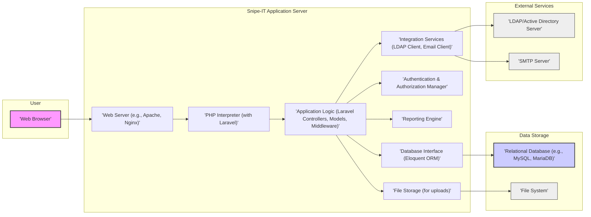
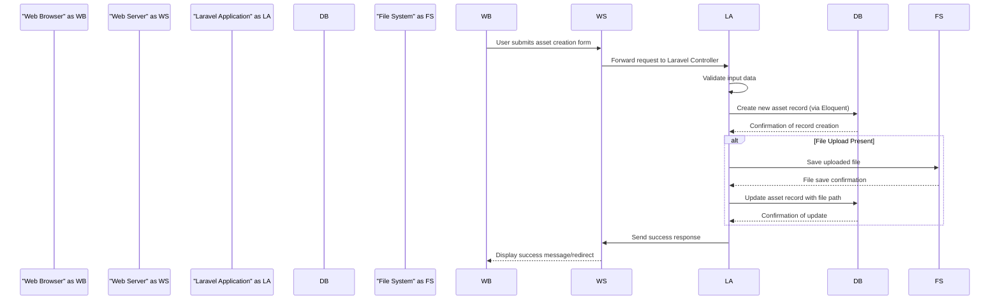

# Project Design Document: Snipe-IT Asset Management System

**Version:** 1.1
**Date:** October 26, 2023
**Prepared By:** Gemini (AI Architecture Expert)

## 1. Introduction

This document provides a detailed design overview of the Snipe-IT asset management system, an open-source IT asset management solution. This document is intended to serve as a foundation for subsequent threat modeling activities. It outlines the system's architecture, key components, data flow, and security considerations.

### 1.1. Purpose

The primary purpose of this document is to provide a comprehensive architectural description of Snipe-IT to facilitate effective threat modeling. It aims to identify potential vulnerabilities and security risks associated with the system's design and implementation.

### 1.2. Scope

This document covers the core components and functionalities of the Snipe-IT application as described in the provided GitHub repository. It focuses on the software architecture, data flow, and interactions between different parts of the system. It includes:

*   Web application components, including the front-end and back-end layers.
*   Database interactions and data storage mechanisms.
*   User authentication and authorization mechanisms, including local and external authentication.
*   Key integrations with external services such as LDAP and email servers.
*   High-level deployment considerations and common deployment patterns.

This document does not cover:

*   Specific deployment environments or detailed infrastructure configurations.
*   In-depth code-level implementation details of individual functions or modules.
*   Specific versions of third-party libraries or dependencies beyond their general function.

### 1.3. Target Audience

This document is intended for:

*   Security engineers and analysts responsible for threat modeling, penetration testing, and security assessments.
*   Software developers involved in the development, maintenance, and extension of the Snipe-IT application.
*   System administrators and DevOps engineers responsible for deploying, configuring, and managing Snipe-IT instances.

## 2. System Overview

Snipe-IT is a web-based IT asset management system designed to help organizations track and manage their hardware and software assets throughout their lifecycle. It provides features for:

*   Comprehensive asset tracking: Managing details of hardware, software licenses, consumables, and components.
*   User and location management: Organizing assets by users, departments, and physical locations.
*   Reporting and auditing: Generating reports on asset status, depreciation, and other key metrics.
*   Integration capabilities: Connecting with external systems for user authentication (LDAP/AD) and notifications (email).
*   Customization: Allowing administrators to define custom fields, asset statuses, and workflows.
*   API access: Providing programmatic access to asset data and functionalities (though not explicitly detailed in the initial overview, it's a common feature in such systems).

The system is primarily built using the PHP programming language and leverages the Model-View-Controller (MVC) architectural pattern provided by the Laravel framework. It relies on a relational database (typically MySQL or MariaDB) for persistent data storage.

## 3. Architectural Design

### 3.1. High-Level Architecture Diagram

### 3.2. Component Description

*   **Web Browser:** The client-side interface through which users interact with the Snipe-IT application via HTTP requests and responses.
*   **Web Server (e.g., Apache, Nginx):**  Receives incoming HTTP requests from users, serves static content (HTML, CSS, JavaScript), and forwards dynamic requests to the PHP interpreter. Handles SSL/TLS termination for secure connections.
*   **PHP Interpreter (with Laravel):** Executes the PHP code of the Snipe-IT application. The Laravel framework provides structure and tools for routing, templating (Blade), request handling, and security features.
*   **Application Logic (Laravel Controllers, Models, Middleware):**
    *   **Controllers:** Handle incoming requests, interact with models to retrieve or manipulate data, and return responses (views or data).
    *   **Models:** Represent database tables and provide an interface for querying and manipulating data using Eloquent ORM.
    *   **Middleware:**  Intercept HTTP requests to perform actions like authentication, authorization, logging, and request modification before they reach the controllers.
*   **Database Interface (Eloquent ORM):** Laravel's Eloquent ORM simplifies database interactions by mapping database tables to PHP objects, providing a more developer-friendly way to query and manipulate data. It helps in preventing SQL injection vulnerabilities through parameterized queries.
*   **Relational Database (e.g., MySQL, MariaDB):** Stores persistent data for the application, including asset details, user information, configurations, audit logs, and other application data.
*   **Authentication & Authorization Manager:**  Handles user authentication (verifying user credentials) and authorization (determining what actions a user is allowed to perform). This component manages user sessions and enforces access control policies based on roles and permissions.
*   **Reporting Engine:** Generates reports and dashboards based on the data stored in the database. This may involve direct database queries or using Laravel's collection features to process and present data.
*   **Integration Services (LDAP Client, Email Client):**
    *   **LDAP Client:**  Facilitates communication with LDAP or Active Directory servers for user authentication and synchronization.
    *   **Email Client:**  Handles sending email notifications for various events, such as password resets, asset assignment alerts, and reports, typically using SMTP.
*   **File Storage (for uploads):** Manages uploaded files, such as asset images or document attachments. This could be the local file system or a cloud-based storage service.
*   **File System:**  The underlying file system where uploaded files are stored.
*   **LDAP/Active Directory Server:**  An external directory service used for centralizing user account management and authentication.
*   **SMTP Server:**  An external mail server used for sending emails on behalf of the Snipe-IT application.

### 3.3. Data Flow

The following outlines key data flows within the Snipe-IT application:

*   **User Authentication (Local):**
    1. User submits login credentials (username/email and password) via the web browser.
    2. The web server forwards the request to the Laravel application.
    3. Laravel's authentication middleware intercepts the request.
    4. The authentication manager queries the database to verify the user's credentials (typically by comparing a hashed password).
    5. If successful, a session is created, and a session cookie is sent to the browser.
    6. If unsuccessful, an error message is returned to the user.

*   **User Authentication (LDAP):**
    1. User submits login credentials.
    2. The Laravel application, upon detecting LDAP authentication is configured, uses the LDAP client to connect to the LDAP server.
    3. The LDAP client attempts to authenticate the user against the LDAP directory.
    4. If successful, user information may be synchronized with the local Snipe-IT database. A session is created.
    5. If unsuccessful, an error message is returned.

*   **Creating a New Asset:**
    1. An authenticated user fills out the "create asset" form in the web browser.
    2. The browser sends the form data to the web server.
    3. Laravel's controller receives the request, validates the input data.
    4. The controller uses the asset model to create a new asset record in the database via Eloquent ORM.
    5. If file uploads are involved (e.g., asset image), the files are saved to the file storage.
    6. The controller sends a success response back to the browser, potentially redirecting to the asset's view page.

*   **Generating a Report:**
    1. An authenticated user navigates to the reporting section and selects report parameters.
    2. The browser sends a request to the Laravel application.
    3. The reporting engine (or a specific controller action) queries the database for the necessary data.
    4. The data is processed and formatted.
    5. The report is generated (e.g., as HTML, PDF, CSV) and sent back to the user's browser.

**Data Flow Diagram for Creating a New Asset:**

## 4. Security Considerations

This section outlines key security considerations based on the system's architecture and common web application vulnerabilities.

### 4.1. Authentication and Authorization

*   **Secure Password Storage:** Passwords for local accounts should be securely hashed using strong, salted hashing algorithms (e.g., bcrypt, Argon2) provided by Laravel.
*   **Protection Against Brute-Force Attacks:** Implement mechanisms to prevent brute-force attacks on login forms, such as rate limiting and account lockout policies.
*   **LDAP/Active Directory Security:** Secure communication (LDAPS) should be used for LDAP integration to protect credentials in transit. Ensure proper configuration of LDAP queries to prevent information disclosure.
*   **Session Management Security:** Use secure, HTTP-only, and SameSite cookies for session management to mitigate risks of session hijacking and cross-site scripting attacks. Implement appropriate session timeouts.
*   **Role-Based Access Control (RBAC) Enforcement:**  Ensure that RBAC is correctly implemented and enforced throughout the application to prevent unauthorized access to features and data. Regularly review and update roles and permissions.

### 4.2. Data Security

*   **Data at Rest Encryption:** Sensitive data in the database (e.g., API keys, potentially other sensitive asset information) should be encrypted at rest. Consider using database-level encryption or application-level encryption.
*   **Data in Transit Encryption:** Enforce HTTPS (TLS) for all communication between the web browser and the server to protect data in transit from eavesdropping and manipulation. Ensure proper SSL/TLS configuration.
*   **Input Validation and Sanitization:** Implement robust input validation on all user-supplied data to prevent injection attacks (SQL injection, cross-site scripting, command injection). Sanitize data before displaying it to users. Laravel provides built-in validation features that should be utilized.
*   **Output Encoding:** Properly encode output data before rendering it in web pages to prevent cross-site scripting (XSS) vulnerabilities. Use Laravel's Blade templating engine, which provides automatic escaping by default.
*   **File Upload Security:** Implement security measures for file uploads, including validating file types and sizes, sanitizing file names, and storing uploaded files outside the web root to prevent direct access. Scan uploaded files for malware if necessary.

### 4.3. Infrastructure Security

*   **Web Server Hardening:** Secure the web server (Apache or Nginx) by disabling unnecessary modules, configuring appropriate access controls, and keeping the server software up-to-date with security patches.
*   **Database Security Hardening:** Secure the database server by using strong passwords, restricting network access, disabling unnecessary features, and keeping the database software up-to-date.
*   **Operating System Security:**  Harden the operating system hosting the application and database by applying security patches, configuring firewalls, and implementing access controls.
*   **Regular Security Audits and Penetration Testing:** Conduct regular security audits and penetration testing to identify potential vulnerabilities in the application and infrastructure.

### 4.4. Third-Party Integrations

*   **LDAP Integration Security:** Use secure protocols (LDAPS) and carefully configure LDAP queries to prevent unauthorized access to directory information. Store LDAP credentials securely if necessary.
*   **Email Security:** Configure SPF, DKIM, and DMARC records for the sending email domain to prevent email spoofing. Use secure authentication mechanisms for connecting to the SMTP server.

### 4.5. Logging and Auditing

*   **Comprehensive Logging:** Log important events, including user logins, failed login attempts, asset modifications, administrative actions, and errors. Include sufficient detail for auditing and security monitoring.
*   **Secure Log Storage:** Store logs securely and restrict access to authorized personnel. Consider using a centralized logging system.
*   **Regular Log Review:** Regularly review logs for suspicious activity and potential security incidents.

## 5. Dependencies

*   **Programming Language:** PHP (minimum version as specified in `composer.json`)
*   **Framework:** Laravel (version specified in `composer.json`)
*   **Database:** Relational database system (e.g., MySQL, MariaDB, PostgreSQL) with appropriate PHP extension (e.g., `pdo_mysql`, `pdo_pgsql`).
*   **Web Server:** Apache or Nginx with PHP-FPM.
*   **PHP Extensions:**  Ensure required PHP extensions are enabled (e.g., `openssl`, `mbstring`, `tokenizer`, `XML`, `cURL`, `JSON`). Refer to Laravel's and Snipe-IT's documentation for a complete list.
*   **Composer:** PHP dependency management tool.
*   **JavaScript Libraries:**  Likely uses various JavaScript libraries for front-end functionality (e.g., jQuery, potentially a front-end framework like Vue.js or React, though not explicitly stated).

## 6. Deployment Considerations

*   **Deployment Environment:** Can be deployed on various environments, including:
    *   **On-premises servers:** Requires managing the underlying infrastructure.
    *   **Virtual Machines (VMs):** Provides more isolation than bare metal.
    *   **Cloud Platforms (IaaS, PaaS):** Offers scalability and managed services (e.g., AWS, Azure, Google Cloud).
    *   **Containerization (Docker, Kubernetes):** Enables consistent deployments and scalability.
*   **Web Server Configuration:**  Properly configure virtual hosts, set appropriate file permissions, and enable necessary modules.
*   **Database Configuration:** Secure database credentials, configure access controls, and optimize database settings for performance.
*   **HTTPS Configuration:** Obtain and configure SSL/TLS certificates for secure communication. Enforce HTTPS redirects.
*   **Environment Variables:** Store sensitive configuration information (e.g., database credentials, API keys) in environment variables rather than directly in code.
*   **Regular Updates and Patching:** Establish a process for regularly updating the application, its dependencies, and the underlying operating system and server software to address security vulnerabilities.

## 7. Future Considerations

*   **API Security Enhancements:** If an API is present, implement robust authentication and authorization mechanisms (e.g., OAuth 2.0), rate limiting, and input validation for API endpoints.
*   **Multi-Factor Authentication (MFA):** Implement MFA for user logins to add an extra layer of security.
*   **Security Headers Implementation:**  Configure security headers (e.g., Content Security Policy (CSP), HTTP Strict Transport Security (HSTS), X-Frame-Options, X-XSS-Protection, X-Content-Type-Options) to mitigate various client-side attacks.
*   **Web Application Firewall (WAF):** Consider using a WAF to protect against common web application attacks.
*   **Intrusion Detection/Prevention System (IDS/IPS):** Implement an IDS/IPS to monitor network traffic for malicious activity.
*   **Code Security Reviews:** Conduct regular code security reviews to identify potential vulnerabilities in the application code.

This document provides a more detailed architectural understanding of the Snipe-IT system, enhancing its value for threat modeling activities. Continuous review and updates are recommended as the system evolves.