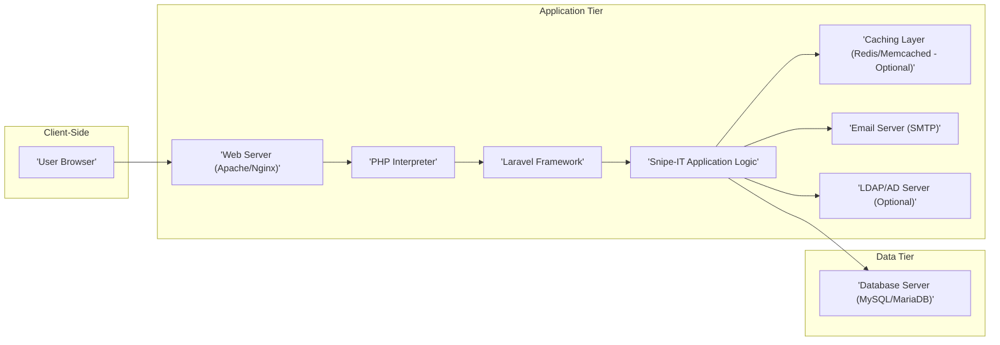
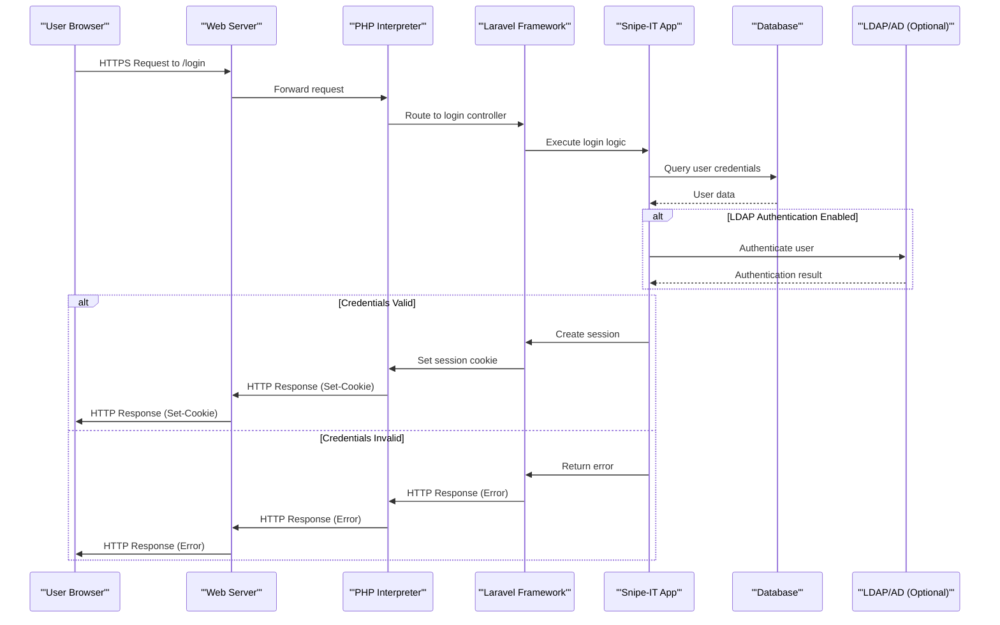
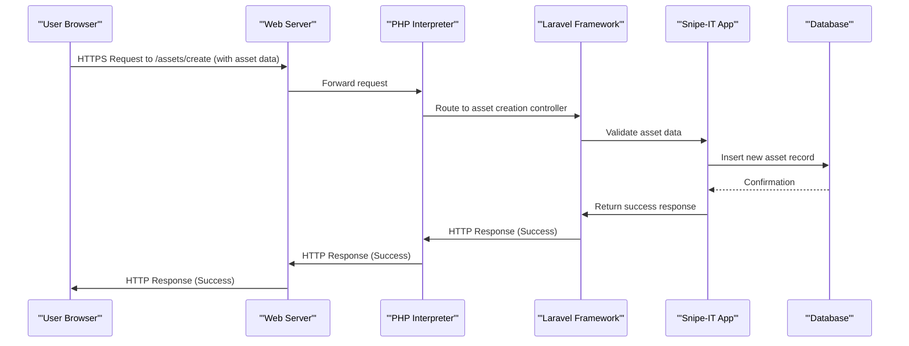

# Project Design Document: Snipe-IT Asset Management System

**Version:** 1.1
**Date:** October 26, 2023
**Author:** Gemini (AI Architecture Expert)

## 1. Introduction

This document provides an enhanced and detailed design overview of the Snipe-IT asset management system. It elaborates on the system's architecture, components, data flows, and critical security considerations. This document is intended to serve as a robust foundation for subsequent threat modeling activities and provides a deeper understanding of the system's inner workings.

## 2. Goals and Objectives

The primary goal of Snipe-IT is to offer a sophisticated and user-friendly web-based solution for the comprehensive management of IT assets. Key objectives include:

*   Meticulously tracking hardware and software assets throughout their entire lifecycle, from procurement to disposal.
*   Efficiently managing asset assignments to individual users, specific departments, and physical locations.
*   Generating insightful and customizable reports on asset inventory levels, depreciation schedules, maintenance history, and other relevant organizational metrics.
*   Providing a centralized and easily accessible platform for all asset-related information, fostering better collaboration and decision-making.
*   Enabling streamlined asset auditing processes and proactive maintenance scheduling to minimize downtime and maximize asset utilization.

## 3. High-Level Architecture

Snipe-IT is architected as a traditional, yet robust, three-tier web application:

*   **Presentation Tier (Client-Side):** The interactive user interface accessed through standard web browsers by end-users and administrators.
*   **Application Tier (Server-Side):** The core of the system, responsible for processing user requests, executing business logic, and managing data interactions.
*   **Data Tier (Database):** The persistent and secure storage mechanism for all application data, ensuring data integrity and availability.

## 4. Component Details

This section provides a more in-depth look at the key components that constitute the Snipe-IT system.

### 4.1. Presentation Tier (Client-Side)

*   **Technology:** Primarily utilizes HTML for structure, CSS for styling, and JavaScript for dynamic behavior. While Snipe-IT leverages server-side rendering with Blade templates, JavaScript enhances user experience through interactive elements.
*   **Functionality:**
    *   Presents the user interface, allowing users to interact with the application's features and data.
    *   Renders dynamic web pages based on data received from the application tier, providing a real-time view of asset information.
    *   Captures user input through forms and interactive elements, sending requests to the application tier for processing.
    *   Displays data in a user-friendly and organized manner, often utilizing tables, charts, and other visual aids.
*   **Key Considerations:**
    *   Ensuring cross-browser compatibility across various modern web browsers and their versions.
    *   Implementing a responsive design that adapts seamlessly to different screen sizes and devices (desktops, tablets, mobile phones).
    *   Adhering to accessibility standards (WCAG) to ensure usability for users with disabilities.

### 4.2. Application Tier (Server-Side)

*   **Web Server (Apache/Nginx):**
    *   **Technology:**  Industry-standard web servers, typically Apache HTTP Server or Nginx, chosen for their reliability and performance.
    *   **Functionality:**
        *   Acts as the entry point for all incoming HTTP requests from client browsers.
        *   Routes these requests to the appropriate PHP interpreter for processing.
        *   Efficiently serves static content such as CSS stylesheets, JavaScript files, and image assets.
        *   Handles the crucial task of SSL/TLS termination, ensuring secure encrypted communication over HTTPS.
*   **PHP Interpreter:**
    *   **Technology:**  PHP, with the specific version dictated by Snipe-IT's system requirements, ensuring compatibility and access to necessary features.
    *   **Functionality:**
        *   Executes the core PHP code that constitutes the Snipe-IT application's logic.
        *   Interacts closely with the Laravel framework, leveraging its features and structure.
        *   Processes incoming user requests, performs necessary data manipulation, and generates appropriate responses to be sent back to the client.
*   **Laravel Framework:**
    *   **Technology:** A robust and widely-used PHP framework providing a structured foundation for web application development.
    *   **Functionality:**
        *   Provides a powerful routing mechanism to map incoming URLs to specific controllers and actions within the application.
        *   Offers an elegant Object-Relational Mapper (ORM) called Eloquent, simplifying database interactions and data management.
        *   Manages user authentication (verifying user identity) and authorization (controlling access to resources).
        *   Provides the Blade templating engine for creating dynamic and reusable HTML views.
        *   Incorporates built-in security features to mitigate common web vulnerabilities like Cross-Site Request Forgery (CSRF) and Cross-Site Scripting (XSS) attacks.
*   **Snipe-IT Application Logic:**
    *   **Technology:**  Custom PHP code specifically developed to implement the core asset management functionalities of Snipe-IT.
    *   **Functionality:**
        *   Manages the creation, modification, retrieval, and deletion of asset records and related information.
        *   Handles user account management, including registration, login, and the assignment of roles and permissions.
        *   Implements workflows for managing asset assignments to users, facilitating check-in and check-out processes.
        *   Generates various reports and dashboards to provide insights into asset inventory, utilization, and other key metrics.
        *   Provides API endpoints to enable integration with other systems and services.
*   **Caching Layer (Redis/Memcached - Optional):**
    *   **Technology:**  In-memory data stores like Redis or Memcached, used to enhance performance.
    *   **Functionality:**
        *   Stores frequently accessed data in memory, reducing the need to query the database repeatedly, thereby improving response times.
        *   Decreases the load on the primary database server, contributing to overall system stability.
        *   Can be utilized for managing user sessions, providing a fast and efficient way to track user activity.
*   **Email Server (SMTP):**
    *   **Technology:**  A Simple Mail Transfer Protocol (SMTP) server, which could be a locally installed server (e.g., Sendmail, Postfix) or a third-party email service provider (e.g., SendGrid, Mailgun).
    *   **Functionality:**
        *   Facilitates the sending of email notifications for various events within the application, such as password reset requests, asset assignment confirmations, and system alerts.
*   **LDAP/AD Server (Optional):**
    *   **Technology:**  Lightweight Directory Access Protocol (LDAP) or Active Directory (AD) server, used for centralized user management in organizational environments.
    *   **Functionality:**
        *   Enables user authentication against an existing directory service, streamlining the login process and reducing the need for separate credentials.
        *   Simplifies user management by integrating with existing organizational user directories.

### 4.3. Data Tier (Database)

*   **Database Server (MySQL/MariaDB):**
    *   **Technology:**  Robust and widely used relational database management systems (RDBMS).
    *   **Functionality:**
        *   Provides persistent storage for all of Snipe-IT's critical data, ensuring data durability and availability. This includes:
            *   Detailed asset information, encompassing name, serial number, model, status, purchase date, and more.
            *   User account details, including usernames, hashed passwords, roles, and permissions.
            *   Location data, defining the physical locations of assets.
            *   Comprehensive asset assignment history, tracking who has which asset and when.
            *   Application configuration settings, customizing the behavior of Snipe-IT.
            *   Detailed audit logs, recording significant actions within the system.
        *   Ensures data integrity through constraints, relationships, and transaction management.
        *   Supports efficient data retrieval and manipulation using Structured Query Language (SQL).

## 5. Data Flow Diagrams

This section visually represents the flow of data through the Snipe-IT system for common user interactions.

### 5.1. User Login

### 5.2. Creating a New Asset

## 6. Security Considerations

Security is of paramount importance for an asset management system like Snipe-IT, which handles sensitive organizational data. This section expands on the key security considerations.

*   **Authentication and Authorization:**
    *   Employ robust password hashing algorithms (e.g., bcrypt, Argon2) with sufficient salt to protect user credentials.
    *   Enforce strong password policies, including minimum length, complexity requirements, and regular password rotation.
    *   Implement Role-Based Access Control (RBAC) meticulously to restrict access to sensitive data and functionalities based on user roles and permissions.
    *   Strongly consider implementing Multi-Factor Authentication (MFA) to add an extra layer of security beyond username and password.
    *   Conduct regular security audits of user permissions to ensure they align with the principle of least privilege.
*   **Input Validation and Output Encoding:**
    *   Thoroughly validate all user inputs on the server-side to prevent various injection attacks, including SQL injection, Cross-Site Scripting (XSS), and command injection.
    *   Apply appropriate output encoding to prevent XSS vulnerabilities when displaying user-generated content, ensuring that data is rendered safely in the user's browser.
*   **Session Management:**
    *   Utilize secure session cookies with the `HttpOnly` flag to prevent client-side JavaScript access and the `Secure` flag to ensure transmission only over HTTPS.
    *   Implement session fixation protection mechanisms to prevent attackers from hijacking legitimate user sessions.
    *   Configure appropriate session timeout settings to automatically invalidate inactive sessions, reducing the risk of unauthorized access.
*   **Cross-Site Request Forgery (CSRF) Protection:**
    *   Ensure Laravel's built-in CSRF protection is enabled and properly utilized for all state-changing requests (e.g., form submissions).
*   **Data Protection:**
    *   Encrypt sensitive data at rest, such as database passwords, API keys, and potentially other confidential information, using strong encryption algorithms.
    *   Protect data in transit by enforcing the use of HTTPS (TLS/SSL) for all communication between the client and the server.
    *   Perform regular database backups and store them securely in a separate location to ensure data recovery in case of disaster.
*   **Logging and Auditing:**
    *   Implement comprehensive logging of user actions, system events, security-related events, and errors to facilitate monitoring and incident response.
    *   Store audit logs securely and review them regularly for suspicious activity or potential security breaches.
*   **Dependency Management:**
    *   Maintain an up-to-date inventory of all dependencies (PHP libraries, JavaScript libraries, etc.) used by Snipe-IT.
    *   Regularly update dependencies to patch known security vulnerabilities and ensure compatibility.
    *   Implement automated dependency scanning tools to identify potential security risks.
*   **File Upload Security:**
    *   If file uploads are permitted, implement strict validation of file types and sizes to prevent malicious uploads.
    *   Store uploaded files outside the web root to prevent direct access and potential execution of malicious scripts. Serve them through a controlled mechanism.
    *   Consider integrating malware scanning tools to scan uploaded files for malicious content.
*   **Email Security:**
    *   Utilize secure SMTP connections (TLS) to encrypt email communication.
    *   Implement Sender Policy Framework (SPF), DomainKeys Identified Mail (DKIM), and Domain-based Message Authentication, Reporting & Conformance (DMARC) records to prevent email spoofing and phishing attacks.
*   **Infrastructure Security:**
    *   Harden the underlying operating system and web server by applying security patches and following security best practices.
    *   Implement firewalls and intrusion detection/prevention systems (IDS/IPS) to protect the server infrastructure.
    *   Regularly patch operating systems, web server software, and other system components to address known vulnerabilities.

## 7. Deployment Considerations

Snipe-IT offers flexibility in deployment options, catering to various organizational needs and infrastructure setups.

*   **On-Premise:**  Deployed on physical or virtual servers within the organization's own data center or infrastructure, providing maximum control over the environment.
*   **Cloud-Based:** Deployed on cloud platforms like Amazon Web Services (AWS), Microsoft Azure, or Google Cloud Platform (GCP), leveraging the scalability and managed services offered by these providers.
*   **Containerized:** Deployed using containerization technologies like Docker, enabling consistent deployments across different environments, and often orchestrated using platforms like Kubernetes for scalability and management.

Key deployment considerations include:

*   **Scalability:** The architecture should be designed to scale horizontally or vertically to accommodate increasing numbers of assets, users, and data volume.
*   **High Availability:** Implement redundancy for critical components (e.g., web servers, database servers) to ensure continuous availability and minimize downtime.
*   **Backup and Recovery:** Establish robust and automated backup and recovery procedures for the database and application files to ensure data protection and business continuity.
*   **Monitoring:** Implement comprehensive monitoring tools to track system performance metrics (CPU usage, memory utilization, disk I/O), application logs, and security events to proactively identify and address potential issues.

## 8. Future Considerations

The following are potential future enhancements and areas for further development of Snipe-IT:

*   **Improved Reporting and Analytics:**  Enhance reporting capabilities with more advanced filtering, customization options, and data visualization tools to provide deeper insights into asset data.
*   **Integration with Other Systems:**  Expand integration capabilities with other IT management systems, such as help desk software, monitoring platforms, and procurement systems, to create a more unified IT ecosystem.
*   **Mobile Applications:**  Develop native mobile applications for iOS and Android platforms to enable asset management tasks on the go, such as asset check-in/out and inventory updates.
*   **Automated Asset Discovery:**  Implement features for automated discovery of network-connected assets, reducing manual data entry and ensuring a more accurate inventory.
*   **Enhanced Security Features:**  Explore and integrate advanced security features like user behavior analytics, threat intelligence feeds, and anomaly detection to further strengthen the security posture of the system.

This enhanced document provides a more detailed and comprehensive overview of the Snipe-IT asset management system's design. It serves as a valuable resource for understanding the system's architecture, components, and security considerations, making it an even more effective foundation for conducting thorough threat modeling activities.
