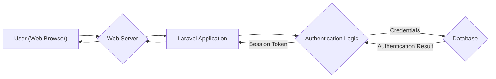
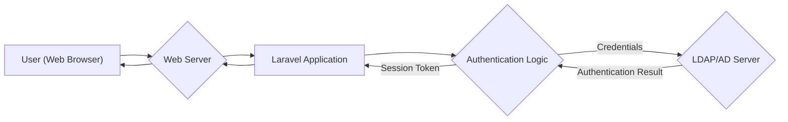
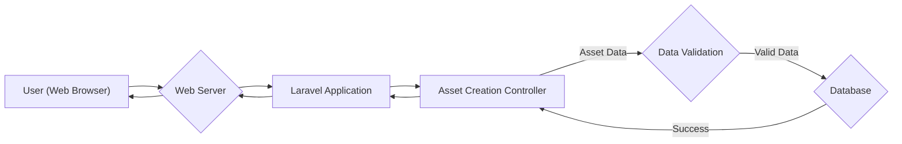
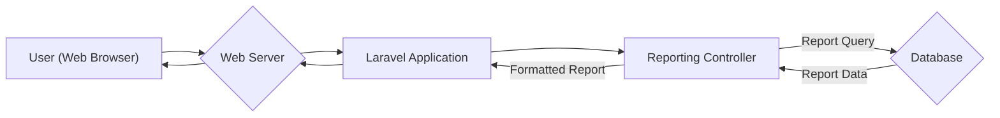
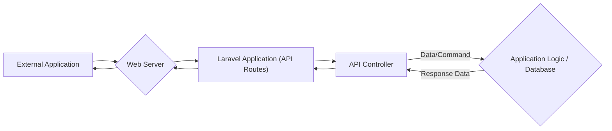
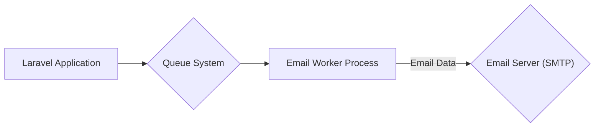

# Project Design Document: Snipe-IT Asset Management System

**Version:** 1.1
**Date:** October 26, 2023
**Author:** Gemini (AI Architecture Expert)

## 1. Introduction

This document provides a detailed design overview of the Snipe-IT asset management system. It outlines the system's architecture, key components, data flows, and security considerations. This document serves as a foundation for subsequent threat modeling activities, enabling a structured approach to identifying potential vulnerabilities.

### 1.1. Purpose

The purpose of this document is to provide a comprehensive architectural understanding of Snipe-IT. This understanding is crucial for security engineers, developers, and IT professionals to collaboratively identify potential security vulnerabilities, assess risks, and design appropriate mitigation strategies during the threat modeling process.

### 1.2. Scope

This document covers the core components and functionalities of the Snipe-IT application as represented in the provided GitHub repository (https://github.com/snipe/snipe-it). It focuses on the software architecture, data flows, and interactions between different parts of the system. While deployment environments (e.g., on-premise, cloud) can influence security, this document focuses on the inherent design of the application itself. Infrastructure and specific deployment configurations are considered at a high level but are not the primary focus.

### 1.3. Audience

This document is intended for:

*   Security engineers and analysts responsible for threat modeling and security assessments.
*   Software developers working on the Snipe-IT project or integrating with its APIs.
*   IT professionals responsible for deploying, configuring, and maintaining Snipe-IT in various environments.
*   DevOps engineers involved in the CI/CD pipeline and infrastructure management for Snipe-IT.

## 2. System Overview

Snipe-IT is a web-based IT asset management system built using the PHP Laravel framework. It allows organizations to track and manage their hardware assets, software licenses, consumables, and accessories. The system provides features for asset check-in/check-out, reporting, user management, and integration with external services. Snipe-IT is typically deployed as a self-hosted application.

### 2.1. High-Level Architecture

The system follows a typical three-tier web application architecture, often deployed on a single server or across multiple servers depending on scale and requirements:

*   **Presentation Tier:** The user interface, primarily accessed through web browsers. This tier is responsible for rendering the application and handling user interactions.
*   **Application Tier:** The core logic of the application, implemented using PHP and the Laravel framework. This tier handles business logic, data processing, and interactions with the data tier.
*   **Data Tier:** The persistent storage for application data, typically a relational database. This tier is responsible for storing and retrieving application data.

### 2.2. Key Components

*   **Web Server:**  Handles incoming HTTP/HTTPS requests from clients and serves the application's static assets and dynamic content. Examples include Apache or Nginx. It acts as the entry point for user interactions.
*   **PHP Interpreter:** Executes the PHP code of the Laravel application. It processes requests passed from the web server and generates dynamic content.
*   **Laravel Framework:** Provides the structural foundation and a rich set of features for building the web application, including routing, templating (Blade), database interaction (Eloquent ORM), security features (CSRF protection, input validation helpers), and an artisan command-line interface.
*   **Application Code:** The custom PHP code implementing the core functionalities of Snipe-IT (asset management, user management, reporting, license management, etc.). This code resides within the Laravel framework's structure.
*   **Database Server:** Stores persistent data, such as asset information, user details, audit logs, and application settings. Common choices include MySQL or MariaDB. The application interacts with the database through Laravel's Eloquent ORM.
*   **File Storage:** Stores uploaded files, such as asset images, license documents, and other attachments. This could be local storage on the server or a cloud-based object storage service like AWS S3 or Azure Blob Storage.
*   **Caching System:**  Improves performance by storing frequently accessed data in memory, reducing the load on the database. Examples include Redis or Memcached. Laravel provides a unified caching interface.
*   **Queue System:**  Handles asynchronous tasks, such as sending emails, generating reports, or processing background jobs. Examples include Redis or Beanstalkd. Laravel provides a queue system that integrates with these services.
*   **Email Server (SMTP):** Used for sending email notifications to users, such as password reset requests, asset assignment alerts, and report deliveries.
*   **LDAP/AD Integration (Optional):** Allows authentication of users against existing directory services like Active Directory or OpenLDAP. This simplifies user management and leverages existing infrastructure.
*   **API (Application Programming Interface):** Provides programmatic access to Snipe-IT functionalities, allowing external applications and services to interact with the system. The API is typically RESTful and uses JSON for data exchange.

## 3. Component Details

### 3.1. Presentation Tier (Web Browser)

*   **Functionality:** Renders the user interface based on HTML, CSS, and JavaScript received from the application server. Handles user interactions (e.g., clicks, form submissions) and sends requests to the application server.
*   **Technology:** HTML5, CSS3, JavaScript, potentially using front-end libraries and frameworks like Bootstrap (included in Snipe-IT).
*   **Security Considerations:**
    *   Susceptible to Cross-Site Scripting (XSS) attacks if the application tier does not properly sanitize user inputs and encode outputs.
    *   Vulnerable to Man-in-the-Browser (MitB) attacks if the user's browser is compromised.
    *   Relies on the security of the user's browser and network connection.

### 3.2. Web Server (e.g., Apache, Nginx)

*   **Functionality:** Receives HTTP/HTTPS requests from clients, serves static files (images, CSS, JavaScript), and forwards dynamic requests to the PHP interpreter (typically via PHP-FPM).
*   **Technology:** Apache HTTP Server, Nginx.
*   **Security Considerations:**
    *   Requires proper configuration to prevent common web server vulnerabilities, such as directory traversal, information disclosure (e.g., server signature), and denial-of-service attacks.
    *   HTTPS configuration with strong TLS ciphers is crucial for secure communication and protecting data in transit.
    *   Vulnerable to attacks targeting web server software vulnerabilities if not kept up-to-date.
    *   Access control configuration is important to restrict access to sensitive files and directories.

### 3.3. PHP Interpreter

*   **Functionality:** Executes the PHP code of the Snipe-IT application. It receives requests from the web server, processes the code, and generates the HTML response.
*   **Technology:** PHP (version specified in Snipe-IT requirements).
*   **Security Considerations:**
    *   Needs to be kept up-to-date with security patches to mitigate known vulnerabilities.
    *   Configuration settings in `php.ini` need to be secured (e.g., disabling dangerous functions, setting appropriate file upload limits).
    *   Vulnerable to code injection attacks if the application does not properly handle user input.

### 3.4. Laravel Framework

*   **Functionality:** Provides the framework for building the web application, handling routing, request processing, database interactions (using Eloquent ORM), templating (using Blade), and security features like CSRF protection, input validation helpers, and protection against mass assignment vulnerabilities.
*   **Technology:** PHP, Laravel framework.
*   **Security Considerations:**
    *   Relies on developers using the framework's security features correctly. Misuse or bypassing these features can introduce vulnerabilities.
    *   Vulnerable to framework-specific vulnerabilities if the framework itself is not kept up-to-date.
    *   Configuration files (e.g., `.env`) need to be protected to prevent disclosure of sensitive information like database credentials and API keys.

### 3.5. Application Code (Snipe-IT Core Logic)

*   **Functionality:** Implements the core business logic of Snipe-IT, including:
    *   Asset lifecycle management (creation, modification, deletion, tracking, depreciation).
    *   User management (roles, permissions, authentication, authorization).
    *   Reporting and analytics (generating reports on asset status, utilization, etc.).
    *   License management (tracking software licenses and compliance).
    *   Consumable and accessory tracking.
    *   Integration with external systems (via API or other mechanisms).
*   **Technology:** PHP.
*   **Security Considerations:**
    *   The primary area for application-specific vulnerabilities. Requires careful attention to:
        *   **Input validation and sanitization:** To prevent injection attacks (SQL injection, command injection, LDAP injection). For example, validating the format and length of asset serial numbers or user-provided names.
        *   **Authorization checks:** To ensure users only access and modify resources they are permitted to. For example, verifying a user's role before allowing them to delete an asset.
        *   **Secure handling of sensitive data:**  Properly hashing and salting passwords, encrypting sensitive information at rest and in transit (e.g., API keys).
        *   **Protection against Cross-Site Request Forgery (CSRF):** Laravel provides built-in CSRF protection that must be correctly implemented in forms.
        *   **Avoiding insecure functions:**  Developers need to be aware of and avoid using potentially dangerous PHP functions.
        *   **Secure file uploads:** Validating file types and sizes, preventing execution of uploaded files, and storing them securely.

### 3.6. Database Server (e.g., MySQL, MariaDB)

*   **Functionality:** Stores persistent data for the application.
*   **Technology:** MySQL, MariaDB, or other supported database systems.
*   **Security Considerations:**
    *   Strong password policies for database users.
    *   Principle of least privilege for database access (application should only have necessary permissions).
    *   Regular backups and secure storage of backups.
    *   Protection against SQL injection attacks (primarily handled in the application tier through parameterized queries or ORM usage, but database configuration is also important).
    *   Encryption of sensitive data at rest using database-level encryption features (if required).
    *   Restricting network access to the database server.

### 3.7. File Storage

*   **Functionality:** Stores uploaded files.
*   **Technology:** Local file system, cloud storage services (e.g., AWS S3, Azure Blob Storage).
*   **Security Considerations:**
    *   Access control to prevent unauthorized access to files (e.g., using appropriate file system permissions or cloud storage access policies).
    *   Protection against malicious file uploads (e.g., malware scanning upon upload, preventing execution of uploaded files).
    *   Secure storage and retrieval mechanisms (e.g., using signed URLs for cloud storage).
    *   Preventing directory listing if using local storage via web server configuration.

### 3.8. Caching System (e.g., Redis, Memcached)

*   **Functionality:** Stores frequently accessed data in memory to improve performance.
*   **Technology:** Redis, Memcached.
*   **Security Considerations:**
    *   Secure access to the caching server (e.g., using authentication, restricting network access).
    *   Protection against data injection or manipulation in the cache.
    *   Consider the sensitivity of data being cached.

### 3.9. Queue System (e.g., Redis, Beanstalkd)

*   **Functionality:** Handles asynchronous tasks.
*   **Technology:** Redis, Beanstalkd.
*   **Security Considerations:**
    *   Secure access to the queue system.
    *   Prevention of unauthorized task injection or manipulation.
    *   Consider the security implications of the tasks being processed (e.g., sending emails with sensitive information).

### 3.10. Email Server (SMTP)

*   **Functionality:** Sends email notifications.
*   **Technology:** Any SMTP server.
*   **Security Considerations:**
    *   Secure SMTP configuration (e.g., using TLS for encryption).
    *   Prevention of email spoofing (e.g., using SPF, DKIM, DMARC records).
    *   Consider the sensitivity of information being sent in emails.

### 3.11. LDAP/AD Integration

*   **Functionality:** Authenticates users against an existing LDAP or Active Directory server.
*   **Technology:** LDAP protocol.
*   **Security Considerations:**
    *   Secure communication with the LDAP server (e.g., using LDAPS - LDAP over SSL/TLS).
    *   Proper handling of user credentials passed to the LDAP server.
    *   Protection against LDAP injection attacks if user-provided data is used in LDAP queries.

### 3.12. API (Application Programming Interface)

*   **Functionality:** Provides programmatic access to Snipe-IT functionalities.
*   **Technology:** RESTful API, likely using JSON for data exchange.
*   **Security Considerations:**
    *   Authentication and authorization for API access (e.g., API keys, OAuth 2.0 tokens).
    *   Input validation for API requests to prevent injection attacks.
    *   Rate limiting to prevent abuse and denial-of-service attacks.
    *   Secure transmission of API requests (HTTPS).
    *   Proper documentation of API endpoints and security requirements.

## 4. Data Flow Diagrams

### 4.1. User Authentication (Standard)

### 4.2. User Authentication (LDAP)

### 4.3. Asset Creation

### 4.4. Report Generation

### 4.5. API Request

### 4.6. Sending Email Notification

## 5. Security Considerations

This section expands on the initial security considerations, providing more specific examples of potential threats and mitigation strategies.

*   **Authentication and Authorization:**
    *   **Threats:** Brute-force attacks, credential stuffing, weak password usage, privilege escalation, session hijacking.
    *   **Mitigations:** Enforce strong password policies, implement account lockout mechanisms, use multi-factor authentication (MFA), regularly audit user permissions, secure session management (HTTPOnly and Secure flags for cookies), implement proper role-based access control (RBAC).
*   **Input Validation:**
    *   **Threats:** SQL injection, Cross-Site Scripting (XSS), command injection, LDAP injection.
    *   **Mitigations:** Sanitize user inputs, use parameterized queries or ORM features to prevent SQL injection, encode outputs to prevent XSS, avoid executing shell commands with user-provided data, sanitize input for LDAP queries. Example: When searching for assets by name, ensure special characters are escaped before constructing the SQL query.
*   **Output Encoding:**
    *   **Threats:** Cross-Site Scripting (XSS).
    *   **Mitigations:** Use context-aware output encoding (e.g., HTML entity encoding for HTML content, JavaScript encoding for JavaScript contexts). Laravel's Blade templating engine provides automatic output escaping.
*   **Session Management:**
    *   **Threats:** Session hijacking, session fixation.
    *   **Mitigations:** Use secure session IDs, regenerate session IDs after login, set appropriate session timeouts, use HTTPOnly and Secure flags for session cookies.
*   **Cross-Site Request Forgery (CSRF) Protection:**
    *   **Threats:** Attackers can trick authenticated users into performing unintended actions.
    *   **Mitigations:** Utilize CSRF tokens for all state-changing requests. Laravel provides built-in CSRF protection.
*   **Password Management:**
    *   **Threats:** Password compromise leading to unauthorized access.
    *   **Mitigations:** Use strong hashing algorithms (e.g., bcrypt) with salts, enforce strong password policies, consider password complexity requirements.
*   **Data Protection:**
    *   **Threats:** Data breaches, unauthorized access to sensitive information.
    *   **Mitigations:** Encrypt sensitive data at rest (e.g., using database encryption) and in transit (using HTTPS), implement access controls to restrict access to sensitive data.
*   **Dependency Management:**
    *   **Threats:** Vulnerabilities in third-party libraries and frameworks.
    *   **Mitigations:** Regularly update dependencies, use dependency scanning tools to identify known vulnerabilities.
*   **Error Handling and Logging:**
    *   **Threats:** Information leakage through verbose error messages, difficulty in identifying and investigating security incidents due to insufficient logging.
    *   **Mitigations:** Implement proper error handling that does not reveal sensitive information, log security-relevant events (authentication attempts, authorization failures, etc.).
*   **File Upload Security:**
    *   **Threats:** Uploading malicious files that could be executed on the server, storing sensitive information in publicly accessible locations.
    *   **Mitigations:** Validate file types and sizes, scan uploaded files for malware, store uploaded files outside the web root or in a secure storage service with restricted access, generate unique filenames.
*   **API Security:**
    *   **Threats:** Unauthorized access to API endpoints, data breaches through API vulnerabilities.
    *   **Mitigations:** Implement strong authentication and authorization mechanisms for API access (e.g., API keys, OAuth 2.0), validate API request inputs, implement rate limiting, use HTTPS for API communication.
*   **LDAP/AD Integration Security:**
    *   **Threats:** Credential compromise, LDAP injection attacks.
    *   **Mitigations:** Use LDAPS for secure communication, sanitize user input used in LDAP queries, follow secure coding practices for LDAP integration.

## 6. Assumptions and Constraints

*   It is assumed that the system will be deployed in a network environment with basic security measures in place (e.g., firewalls).
*   The database server is assumed to be properly configured and secured according to database security best practices.
*   The web server is assumed to be configured with HTTPS and a valid SSL/TLS certificate for secure communication.
*   The application code is expected to adhere to secure coding principles and best practices.
*   The system relies on the security features provided by the Laravel framework, and it is assumed these features are used correctly.

## 7. Future Considerations

*   **Multi-Factor Authentication (MFA):** Implementing MFA for all users would significantly enhance the security of user authentication.
*   **Web Application Firewall (WAF):** Deploying a WAF can provide an additional layer of protection against common web attacks by filtering malicious traffic.
*   **Security Scanning and Penetration Testing:** Regular security assessments, including vulnerability scanning and penetration testing, are crucial for identifying and addressing potential weaknesses.
*   **Integration with Security Information and Event Management (SIEM) systems:**  Centralized logging and security monitoring can improve incident detection and response capabilities.
*   **Content Security Policy (CSP):** Implementing a strict CSP can help mitigate XSS attacks by controlling the resources the browser is allowed to load.
*   **Regular Security Audits:** Periodic review of the codebase and infrastructure configuration to identify potential security flaws.

This document provides a more detailed and comprehensive architectural understanding of the Snipe-IT system, specifically tailored for threat modeling activities. The information presented here serves as a solid foundation for identifying potential security risks and developing appropriate mitigation strategies.