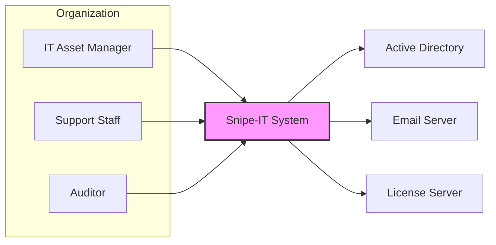
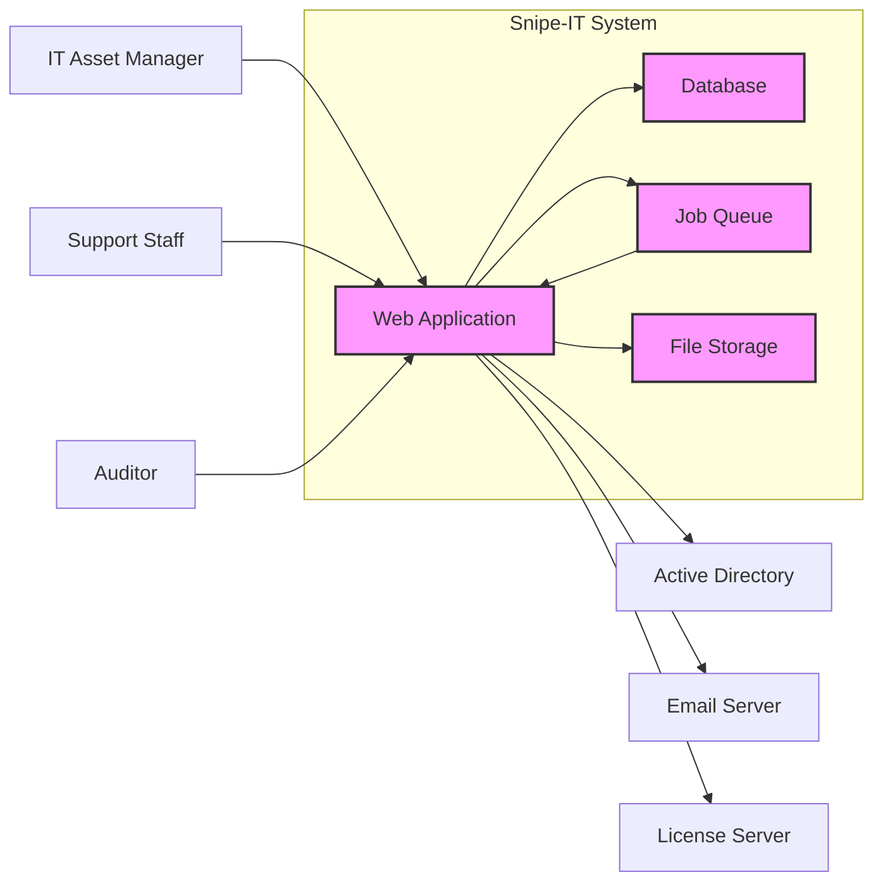
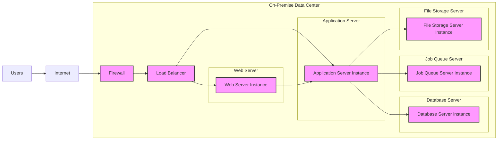
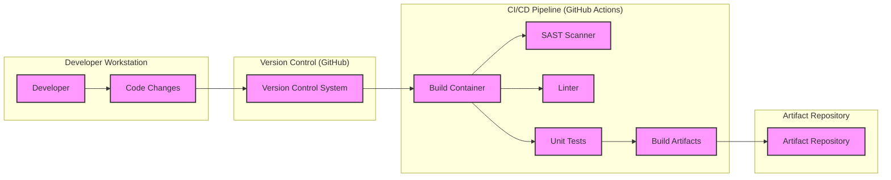

# BUSINESS POSTURE

Snipe-IT is a free and open source IT asset management system. It is designed to help organizations track and manage their IT assets, software licenses, and accessories.

Business Priorities and Goals:
- Centralized Asset Management: Provide a single source of truth for all IT assets within an organization.
- Efficient Asset Tracking: Streamline the process of tracking asset locations, assignments, and maintenance.
- Cost Optimization: Improve asset utilization and reduce unnecessary purchases by providing visibility into existing assets.
- Compliance and Auditing: Facilitate compliance with software licensing agreements and simplify asset audits.
- Improved IT Support: Enable faster troubleshooting and resolution of IT issues by providing asset information to support teams.

Business Risks:
- Data Loss: Loss of asset data due to system failures, security breaches, or human error.
- Unauthorized Access: Unauthorized access to asset information, potentially leading to data breaches or misuse of assets.
- System Downtime: Downtime of the asset management system, disrupting IT operations and asset tracking.
- Data Integrity: Corruption or manipulation of asset data, leading to inaccurate asset records and poor decision-making.
- Compliance Violations: Failure to properly manage software licenses, leading to legal and financial repercussions.

# SECURITY POSTURE

Existing Security Controls:
- security control: HTTPS encryption for web traffic. Implemented in web server configuration.
- security control: Authentication and authorization for user access. Implemented within the application code.
- security control: Input validation to prevent common web vulnerabilities. Implemented within the application code.
- security control: Regular security updates and patches. Described in project documentation and release notes.
- security control: Password hashing for storing user credentials. Implemented within the application code.

Accepted Risks:
- accepted risk: Reliance on community contributions for security vulnerability identification and patching.
- accepted risk: Potential for vulnerabilities in third-party dependencies.
- accepted risk: Security configuration is the responsibility of the user deploying the application.

Recommended Security Controls:
- security control: Implement a Web Application Firewall (WAF) to protect against common web attacks.
- security control: Regularly perform vulnerability scanning and penetration testing.
- security control: Implement security information and event management (SIEM) for security monitoring and incident response.
- security control: Enforce multi-factor authentication (MFA) for user logins.
- security control: Implement database encryption at rest.

Security Requirements:
- Authentication:
  - requirement: Secure user authentication mechanism to verify user identity.
  - requirement: Support for strong password policies and enforcement.
  - requirement: Option for multi-factor authentication.
- Authorization:
  - requirement: Role-based access control (RBAC) to manage user permissions and access to features and data.
  - requirement: Principle of least privilege should be applied to user roles.
- Input Validation:
  - requirement: Comprehensive input validation on all user inputs to prevent injection attacks (SQL injection, XSS, etc.).
  - requirement: Input sanitization and encoding to mitigate risks from malicious input.
- Cryptography:
  - requirement: Use of strong encryption algorithms for sensitive data in transit and at rest.
  - requirement: Secure storage and management of cryptographic keys.
  - requirement: Proper implementation of hashing algorithms for password storage.

# DESIGN

## C4 CONTEXT

Context Diagram Elements:

- Element:
  - Name: IT Asset Manager
  - Type: User
  - Description: Personnel responsible for managing and tracking IT assets within the organization.
  - Responsibilities: Managing asset inventory, assigning assets to users, generating reports, and configuring the Snipe-IT system.
  - Security controls: User authentication to Snipe-IT system, role-based access control within Snipe-IT.

- Element:
  - Name: Support Staff
  - Type: User
  - Description: IT support personnel who use asset information to troubleshoot issues and provide support.
  - Responsibilities: Accessing asset information to diagnose problems, track asset status, and update asset details.
  - Security controls: User authentication to Snipe-IT system, role-based access control within Snipe-IT.

- Element:
  - Name: Auditor
  - Type: User
  - Description: Internal or external auditors who need to access asset data for compliance and auditing purposes.
  - Responsibilities: Reviewing asset inventory, software license compliance, and generating audit reports.
  - Security controls: User authentication to Snipe-IT system, role-based access control within Snipe-IT, audit logging within Snipe-IT.

- Element:
  - Name: Snipe-IT System
  - Type: Software System
  - Description: Web-based IT asset management application for tracking hardware, software, and accessories.
  - Responsibilities: Asset inventory management, user management, reporting, integration with external systems, and providing a user interface for asset management tasks.
  - Security controls: HTTPS, Authentication, Authorization, Input Validation, Password Hashing, potentially WAF, SIEM, MFA, Database Encryption.

- Element:
  - Name: Active Directory
  - Type: External System
  - Description: Directory service used for user authentication and authorization within the organization.
  - Responsibilities: User account management, authentication, and authorization.
  - Security controls: Active Directory security policies, access controls, authentication protocols (Kerberos, LDAP).

- Element:
  - Name: Email Server
  - Type: External System
  - Description: Email server used for sending notifications and alerts from the Snipe-IT system.
  - Responsibilities: Sending email notifications for asset assignments, alerts, and reports.
  - Security controls: Email server security configurations, SMTP authentication, TLS encryption for email transmission.

- Element:
  - Name: License Server
  - Type: External System
  - Description: System used to manage software licenses within the organization. Snipe-IT might integrate with it to track license usage.
  - Responsibilities: Software license management, tracking license usage, and providing license information to Snipe-IT.
  - Security controls: License server security controls, access controls, license management protocols.

## C4 CONTAINER

Container Diagram Elements:

- Element:
  - Name: Web Application
  - Type: Container
  - Description: PHP application serving the user interface and handling business logic.
  - Responsibilities: Handling user requests, implementing business logic, interacting with the database, job queue, file storage, and external systems.
  - Security controls: HTTPS, Authentication, Authorization, Input Validation, Session Management, potentially WAF, SAST during build.

- Element:
  - Name: Database
  - Type: Container
  - Description: Relational database (e.g., MySQL, MariaDB) storing application data, including asset information, user details, and settings.
  - Responsibilities: Persistent storage of application data, data retrieval, and data integrity.
  - Security controls: Database access controls, database user authentication, data encryption at rest, regular backups, database vulnerability scanning.

- Element:
  - Name: Job Queue
  - Type: Container
  - Description: Message queue system (e.g., Redis, Beanstalkd) for asynchronous task processing, such as sending emails and generating reports.
  - Responsibilities: Queuing and processing background tasks, improving application responsiveness.
  - Security controls: Access controls to the job queue, secure communication with the web application.

- Element:
  - Name: File Storage
  - Type: Container
  - Description: Storage for uploaded files, such as asset images and attachments. Could be local file system or cloud storage.
  - Responsibilities: Storing and retrieving uploaded files.
  - Security controls: Access controls to file storage, input validation on file uploads, malware scanning of uploaded files, secure storage configurations.

## DEPLOYMENT

Deployment Architecture Option: On-Premise Deployment

Deployment Diagram Elements:

- Element:
  - Name: Firewall
  - Type: Infrastructure
  - Description: Network firewall to control inbound and outbound traffic to the data center.
  - Responsibilities: Network security, access control, and traffic filtering.
  - Security controls: Firewall rules, intrusion detection/prevention system (IDS/IPS).

- Element:
  - Name: Load Balancer
  - Type: Infrastructure
  - Description: Load balancer to distribute traffic across multiple web/application server instances for high availability and scalability.
  - Responsibilities: Traffic distribution, load balancing, and high availability.
  - Security controls: SSL termination, load balancing algorithms, health checks.

- Element:
  - Name: Web Server Instance
  - Type: Infrastructure
  - Description: Server instance running a web server (e.g., Apache, Nginx) to serve static content and proxy requests to the application server.
  - Responsibilities: Serving static content, handling HTTPS, and proxying requests.
  - Security controls: Web server hardening, HTTPS configuration, access logging.

- Element:
  - Name: Application Server Instance
  - Type: Infrastructure
  - Description: Server instance running the Snipe-IT web application (PHP).
  - Responsibilities: Running the application code, processing requests, and interacting with other containers.
  - Security controls: Application server hardening, application-level security controls, regular patching.

- Element:
  - Name: Database Server Instance
  - Type: Infrastructure
  - Description: Server instance running the database system (e.g., MySQL, MariaDB).
  - Responsibilities: Database management, data storage, and data retrieval.
  - Security controls: Database server hardening, database access controls, database encryption, regular backups.

- Element:
  - Name: Job Queue Server Instance
  - Type: Infrastructure
  - Description: Server instance running the job queue system (e.g., Redis, Beanstalkd).
  - Responsibilities: Job queue management and processing.
  - Security controls: Job queue server hardening, access controls.

- Element:
  - Name: File Storage Server Instance
  - Type: Infrastructure
  - Description: Server instance providing file storage. Could be a dedicated server or NAS.
  - Responsibilities: File storage and retrieval.
  - Security controls: File server hardening, access controls, storage encryption.

## BUILD

Build Process Diagram Elements:

- Element:
  - Name: Developer
  - Type: Person
  - Description: Software developer contributing code to the Snipe-IT project.
  - Responsibilities: Writing code, committing changes, and participating in code reviews.
  - Security controls: Secure development practices, code review process, access control to development environment.

- Element:
  - Name: Code Changes
  - Type: Artifact
  - Description: Source code modifications made by the developer.
  - Responsibilities: Implementing new features, fixing bugs, and improving code quality.
  - Security controls: Code review, version control.

- Element:
  - Name: Version Control System (GitHub)
  - Type: System
  - Description: GitHub repository used for managing the source code.
  - Responsibilities: Source code management, version control, collaboration, and code history tracking.
  - Security controls: Access controls, branch protection, audit logging, secure communication (HTTPS, SSH).

- Element:
  - Name: CI/CD Pipeline (GitHub Actions)
  - Type: System
  - Description: Automated build pipeline using GitHub Actions for building, testing, and packaging the application.
  - Responsibilities: Automated build process, running security scans, executing tests, and creating build artifacts.
  - Security controls: Secure pipeline configuration, access controls to pipeline, secret management, build environment security.

- Element:
  - Name: Build Container
  - Type: Container
  - Description: Containerized build environment used for consistent and reproducible builds.
  - Responsibilities: Providing a consistent build environment, isolating build processes.
  - Security controls: Container image security, minimal container image, vulnerability scanning of container image.

- Element:
  - Name: SAST Scanner
  - Type: Tool
  - Description: Static Application Security Testing tool to identify potential security vulnerabilities in the source code.
  - Responsibilities: Static code analysis for security vulnerabilities.
  - Security controls: SAST tool configuration, vulnerability reporting.

- Element:
  - Name: Linter
  - Type: Tool
  - Description: Code linter to enforce code style and identify potential code quality issues.
  - Responsibilities: Code quality checks, style enforcement.
  - Security controls: Linter configuration, code quality reporting.

- Element:
  - Name: Unit Tests
  - Type: Process
  - Description: Automated unit tests to verify the functionality of individual code components.
  - Responsibilities: Ensuring code functionality and preventing regressions.
  - Security controls: Test coverage, test environment security.

- Element:
  - Name: Build Artifacts
  - Type: Artifact
  - Description: Packaged application ready for deployment (e.g., ZIP file, Docker image).
  - Responsibilities: Deployable application package.
  - Security controls: Artifact signing, artifact integrity checks, secure artifact storage.

- Element:
  - Name: Artifact Repository
  - Type: System
  - Description: Repository for storing and managing build artifacts.
  - Responsibilities: Artifact storage, versioning, and distribution.
  - Security controls: Access controls, artifact integrity checks, secure storage.

# RISK ASSESSMENT

Critical Business Processes:
- Asset Inventory Management: Maintaining an accurate and up-to-date inventory of IT assets.
- Asset Assignment and Tracking: Tracking asset locations and assignments to users or departments.
- Software License Management: Ensuring compliance with software licensing agreements.
- Audit and Reporting: Generating reports for asset audits and compliance checks.

Data Sensitivity:
- Asset Information: Contains details about hardware, software, and accessories, including serial numbers, purchase dates, locations, and assigned users. Sensitivity: Moderate.
- User Information: Contains user names, contact details, and roles within the organization. Sensitivity: Moderate to High (depending on data stored and organizational policies).
- Software License Keys: May contain software license keys. Sensitivity: High.
- Audit Logs: Contains logs of user activities and system events. Sensitivity: Moderate.

# QUESTIONS & ASSUMPTIONS

Questions:
- What is the expected scale of deployment (number of assets, users)?
- What are the specific compliance requirements for asset management?
- What is the organization's tolerance for system downtime?
- Are there any specific integrations with other systems beyond Active Directory, Email Server, and License Server?
- What is the preferred deployment environment (on-premise, cloud, hybrid)?

Assumptions:
- BUSINESS POSTURE: The primary goal is to efficiently manage IT assets and improve asset tracking for cost optimization and compliance.
- SECURITY POSTURE: Basic security controls like HTTPS, authentication, and input validation are assumed to be in place. The organization is concerned about data loss, unauthorized access, and system downtime.
- DESIGN: A typical web application architecture with a web application, database, job queue, and file storage is assumed. On-premise deployment is considered as a primary deployment option for detailed description. GitHub Actions is used for CI/CD.