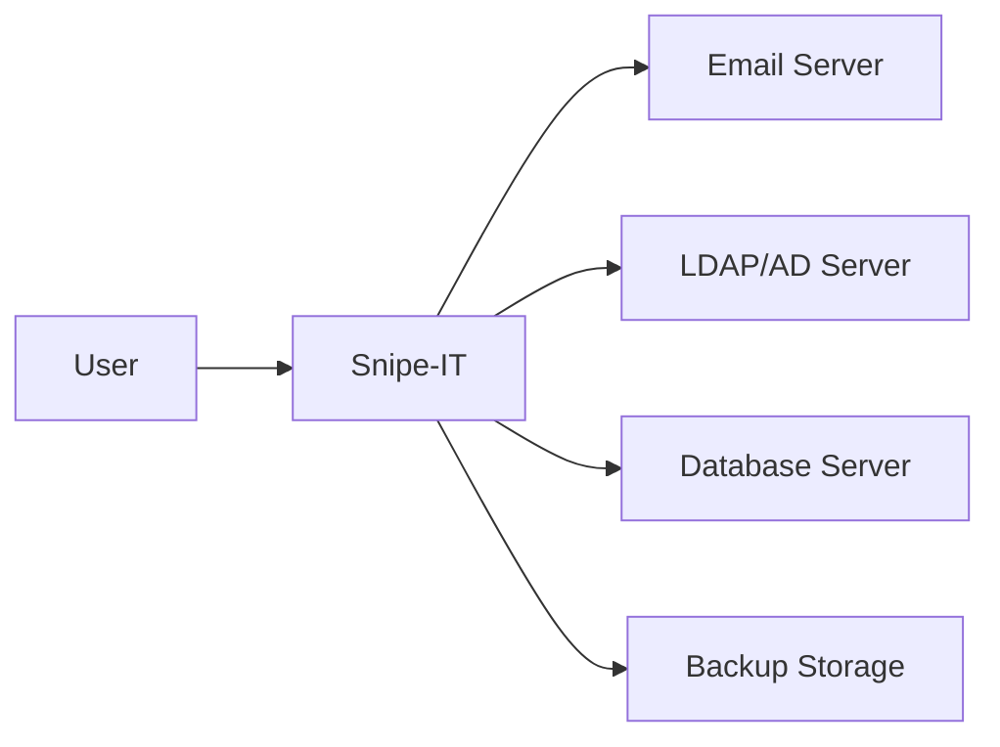
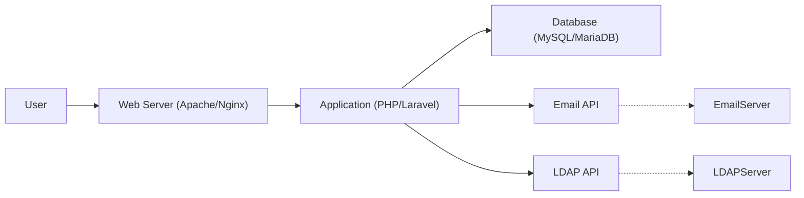
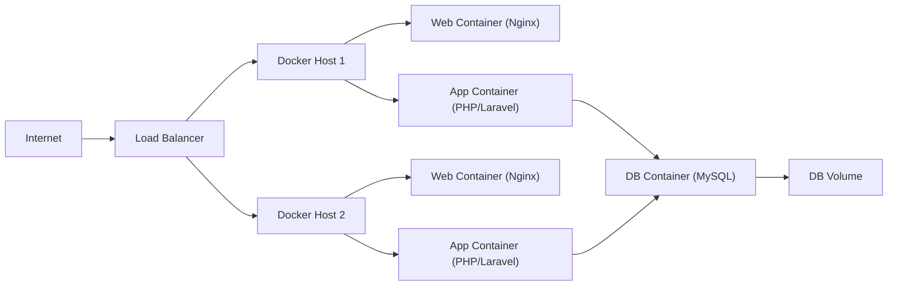
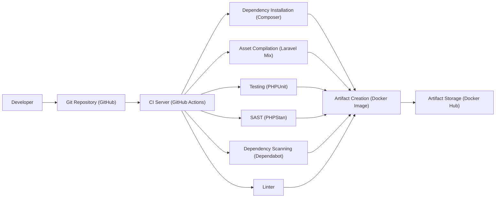

Okay, let's create a design document for the Snipe-IT project, focusing on aspects relevant for threat modeling.

# BUSINESS POSTURE

Snipe-IT is an open-source IT asset management system.  The business priorities revolve around providing a reliable, efficient, and user-friendly platform for organizations to track their physical and digital assets.  The project aims to solve the problem of disorganized asset tracking, which can lead to financial losses, compliance issues, and security vulnerabilities.  Given its open-source nature and wide adoption, the project likely has a moderate risk appetite, balancing rapid development and feature additions with the need for stability and security.  A Fortune 500 company adopting Snipe-IT would have a lower risk appetite than a startup, demanding more rigorous security controls and compliance features.

Business Priorities:

*   Provide a centralized repository for all IT assets.
*   Enable efficient tracking of asset lifecycle (procurement, deployment, maintenance, disposal).
*   Facilitate accurate reporting and auditing of assets.
*   Support compliance with relevant regulations (e.g., GDPR, CCPA, SOX).
*   Reduce costs associated with asset loss, misplacement, and inefficient management.
*   Improve IT operational efficiency.

Most Important Business Risks:

*   Data Breach: Unauthorized access to sensitive asset data (including personal data if used to track employee-assigned devices).
*   Data Loss: Loss of asset data due to system failure, human error, or malicious activity.
*   System Downtime: Inability to access the asset management system, disrupting IT operations.
*   Compliance Violations: Failure to meet regulatory requirements related to asset management and data protection.
*   Reputational Damage: Loss of trust due to security incidents or data breaches.
*   Financial Loss: Due to lost or stolen assets, regulatory fines, or operational inefficiencies.

# SECURITY POSTURE

Existing Security Controls (based on the GitHub repository and common practices):

*   security control: Authentication: User authentication with username/password, and optional two-factor authentication (2FA). Implemented in application code and configurable via settings.
*   security control: Authorization: Role-based access control (RBAC) to restrict user permissions based on their roles. Implemented in application code, defining permissions for different user roles.
*   security control: Input Validation: Validation of user inputs to prevent common web vulnerabilities like cross-site scripting (XSS) and SQL injection. Implemented in application code, using frameworks and libraries.
*   security control: Encryption: HTTPS for secure communication between the client and server. Configurable via web server settings. Data at rest encryption is optional and depends on the database configuration.
*   security control: Auditing: Logging of user actions and system events. Implemented in application code, writing logs to files or a database.
*   security control: Regular Updates: The project maintainers release regular updates to address security vulnerabilities and bug fixes. Described in release notes and documentation.
*   security control: Dependency Management: Use of package managers (like Composer for PHP) to manage dependencies and keep them updated. Described in project documentation and `composer.json` file.

Accepted Risks:

*   accepted risk: Reliance on Third-Party Libraries: The project depends on numerous third-party libraries, which may introduce vulnerabilities.
*   accepted risk: Configuration Errors: The security of the system depends heavily on proper configuration by the administrator.
*   accepted risk: Limited Built-in Security Features: Some advanced security features (e.g., intrusion detection, advanced threat protection) are not built-in and require external tools or services.

Recommended Security Controls:

*   Implement a robust Web Application Firewall (WAF) to protect against common web attacks.
*   Integrate with a Security Information and Event Management (SIEM) system for centralized security monitoring and alerting.
*   Conduct regular penetration testing and vulnerability assessments.
*   Implement a strong password policy and enforce it.
*   Provide detailed security documentation and best practices for administrators.
*   Consider offering a hosted version with enhanced security features and support.

Security Requirements:

*   Authentication:
    *   Support for strong passwords and password complexity rules.
    *   Enforcement of 2FA for all users, or at least for administrative accounts.
    *   Integration with existing identity providers (e.g., LDAP, Active Directory, SAML).
    *   Protection against brute-force attacks (e.g., account lockout).
    *   Secure session management (e.g., using HTTP-only cookies, secure cookies, session timeouts).

*   Authorization:
    *   Fine-grained access control to all resources and functionalities.
    *   Regular review and auditing of user roles and permissions.
    *   Principle of least privilege: Users should only have access to the resources they need.

*   Input Validation:
    *   Strict validation of all user inputs on both the client-side and server-side.
    *   Use of output encoding to prevent XSS attacks.
    *   Parameterized queries or ORM to prevent SQL injection.
    *   Protection against other common web vulnerabilities (e.g., CSRF, file upload vulnerabilities).

*   Cryptography:
    *   Use of strong, industry-standard cryptographic algorithms and protocols.
    *   Secure storage of sensitive data (e.g., passwords, API keys) using hashing and salting.
    *   Encryption of data in transit using HTTPS.
    *   Optional encryption of data at rest.
    *   Proper key management practices.

# DESIGN

## C4 CONTEXT

C4 Context Element List:

*   Element:
    *   Name: User
    *   Type: Person
    *   Description: A person who interacts with Snipe-IT to manage IT assets.
    *   Responsibilities: Create, read, update, and delete asset records; generate reports; manage users and settings (depending on permissions).
    *   Security controls: Authentication, Authorization, 2FA (optional).

*   Element:
    *   Name: Snipe-IT
    *   Type: Software System
    *   Description: The Snipe-IT asset management system.
    *   Responsibilities: Provide a web interface for managing assets; store asset data; handle user authentication and authorization; send email notifications; integrate with external systems.
    *   Security controls: Input validation, output encoding, parameterized queries, HTTPS, auditing, regular updates.

*   Element:
    *   Name: Email Server
    *   Type: Software System
    *   Description: An external email server used by Snipe-IT to send notifications.
    *   Responsibilities: Relay emails from Snipe-IT to users.
    *   Security controls: Secure communication with Snipe-IT (e.g., using TLS).

*   Element:
    *   Name: LDAP/AD Server
    *   Type: Software System
    *   Description: An optional external LDAP or Active Directory server for user authentication and synchronization.
    *   Responsibilities: Authenticate users; provide user information to Snipe-IT.
    *   Security controls: Secure communication with Snipe-IT (e.g., using LDAPS).

*   Element:
    *   Name: Database Server
    *   Type: Software System
    *   Description: The database server used to store Snipe-IT data.
    *   Responsibilities: Store and retrieve asset data, user data, and other system data.
    *   Security controls: Access control, encryption (optional), regular backups.

*   Element:
    *   Name: Backup Storage
    *   Type: Software System
    *   Description: Storage location for database and application backups.
    *   Responsibilities: Securely store backups for disaster recovery.
    *   Security controls: Access control, encryption (optional).

## C4 CONTAINER

C4 Container Element List:

*   Element:
    *   Name: User
    *   Type: Person
    *   Description: A person interacting with the Snipe-IT web interface.
    *   Responsibilities: Same as in the Context diagram.
    *   Security controls: Same as in the Context diagram.

*   Element:
    *   Name: Web Server (Apache/Nginx)
    *   Type: Container
    *   Description: The web server that hosts the Snipe-IT application.
    *   Responsibilities: Handle HTTP requests, serve static files, and forward requests to the application server.
    *   Security controls: HTTPS configuration, access control, regular updates.

*   Element:
    *   Name: Application (PHP/Laravel)
    *   Type: Container
    *   Description: The Snipe-IT application code, built using PHP and the Laravel framework.
    *   Responsibilities: Handle business logic, user authentication, authorization, data access, and API interactions.
    *   Security controls: Input validation, output encoding, parameterized queries, authentication, authorization, auditing.

*   Element:
    *   Name: Database (MySQL/MariaDB)
    *   Type: Container
    *   Description: The database that stores Snipe-IT data.
    *   Responsibilities: Store and retrieve data.
    *   Security controls: Access control, encryption (optional), regular backups.

*   Element:
    *   Name: Email API
    *   Type: API
    *   Description: API for sending emails.
    *   Responsibilities: Send emails.
    *   Security controls: API keys, rate limiting.

*   Element:
    *   Name: LDAP API
    *   Type: API
    *   Description: API for LDAP integration.
    *   Responsibilities: Authenticate with LDAP.
    *   Security controls: Secure connection.

*   Element:
    *   Name: Email Server
    *   Type: Software System
    *   Description: External email server.
    *   Responsibilities: Send emails.
    *   Security controls: Secure communication.

*   Element:
    *   Name: LDAP Server
    *   Type: Software System
    *   Description: External LDAP server.
    *   Responsibilities: Authenticate users.
    *   Security controls: Secure communication.

## DEPLOYMENT

Possible Deployment Solutions:

1.  Traditional LAMP/LEMP Stack: Deploying Snipe-IT on a Linux server with Apache/Nginx, MySQL/MariaDB, and PHP.
2.  Docker Containerization: Deploying Snipe-IT using Docker containers for the web server, application, and database.
3.  Cloud-Based Deployment: Deploying Snipe-IT on a cloud platform like AWS, Azure, or Google Cloud using virtual machines, managed databases, and other cloud services.
4.  Kubernetes: Deploying using Kubernetes cluster.

Chosen Solution (Docker Containerization): This is a popular and recommended approach for deploying Snipe-IT, offering portability, scalability, and ease of management.

Deployment Element List:

*   Element:
    *   Name: Internet
    *   Type: External
    *   Description: The public internet.
    *   Responsibilities: Route traffic to the load balancer.
    *   Security controls: Firewall, DDoS protection.

*   Element:
    *   Name: Load Balancer
    *   Type: Infrastructure
    *   Description: Distributes incoming traffic across multiple Docker hosts.
    *   Responsibilities: Load balancing, SSL termination (optional).
    *   Security controls: HTTPS configuration, access control.

*   Element:
    *   Name: Docker Host 1, Docker Host 2
    *   Type: Infrastructure
    *   Description: Servers running Docker Engine.
    *   Responsibilities: Host Docker containers.
    *   Security controls: Operating system hardening, Docker security best practices.

*   Element:
    *   Name: Web Container 1, Web Container 2
    *   Type: Container
    *   Description: Docker containers running the Nginx web server.
    *   Responsibilities: Serve static files, forward requests to the application container.
    *   Security controls: HTTPS configuration, access control.

*   Element:
    *   Name: App Container 1, App Container 2
    *   Type: Container
    *   Description: Docker containers running the Snipe-IT application (PHP/Laravel).
    *   Responsibilities: Handle business logic, data access.
    *   Security controls: Input validation, output encoding, parameterized queries.

*   Element:
    *   Name: DB Container
    *   Type: Container
    *   Description: Docker container running the MySQL database.
    *   Responsibilities: Store and retrieve data.
    *   Security controls: Access control, encryption (optional).

*   Element:
    *   Name: DB Volume
    *   Type: Storage
    *   Description: Persistent volume for storing database data.
    *   Responsibilities: Persist data across container restarts.
    *   Security controls: Access control, encryption (optional).

## BUILD

Snipe-IT uses Composer for dependency management and Laravel Mix (Webpack) for asset compilation. A typical build process might involve the following steps:

1.  Developer: A developer makes changes to the code and pushes them to a Git repository (e.g., GitHub).
2.  Continuous Integration (CI) Server (Optional): A CI server (e.g., GitHub Actions, Travis CI, Jenkins) detects the changes and triggers a build.
3.  Dependency Installation: Composer installs the required PHP dependencies.
4.  Asset Compilation: Laravel Mix compiles JavaScript, CSS, and other assets.
5.  Testing: Automated tests (unit tests, integration tests) are executed.
6.  Security Scans:
    *   Static Application Security Testing (SAST): A SAST tool (e.g., PHPStan, Psalm) analyzes the code for potential security vulnerabilities.
    *   Dependency Scanning: A tool like Dependabot or Snyk checks for known vulnerabilities in the project's dependencies.
    *   Linter: Code style check.
7.  Artifact Creation: The build process creates a deployable artifact (e.g., a Docker image, a ZIP file).
8.  Artifact Storage: The artifact is stored in a repository (e.g., Docker Hub, a private registry).

# RISK ASSESSMENT

Critical Business Processes to Protect:

*   Asset Tracking and Management: Ensuring the accuracy and availability of asset data.
*   Reporting and Auditing: Generating accurate reports for compliance and decision-making.
*   User Management: Controlling access to the system and protecting user data.

Data to Protect and Sensitivity:

*   Asset Data: Information about IT assets, including serial numbers, models, locations, purchase dates, and assigned users. Sensitivity: Medium to High (depending on the type of assets and the organization).
*   User Data: Usernames, passwords (hashed), email addresses, roles, and permissions. Sensitivity: High.
*   Configuration Data: System settings, API keys, database credentials. Sensitivity: High.
*   Audit Logs: Records of user actions and system events. Sensitivity: Medium.

# QUESTIONS & ASSUMPTIONS

Questions:

*   What specific compliance requirements (e.g., GDPR, CCPA, SOX) apply to the organizations using Snipe-IT?
*   What is the expected scale of deployment (number of assets, users, concurrent requests)?
*   Are there any existing security tools or services (e.g., WAF, SIEM) that Snipe-IT needs to integrate with?
*   What is the process for handling security vulnerabilities reported by external researchers?
*   What level of support and maintenance is provided to users?

Assumptions:

*   BUSINESS POSTURE: The organization deploying Snipe-IT has a basic understanding of IT security principles and best practices.
*   SECURITY POSTURE: The underlying operating system and infrastructure are properly secured and maintained.
*   DESIGN: The database is configured with strong passwords and access controls. Regular backups are performed and stored securely. The web server is configured to use HTTPS.