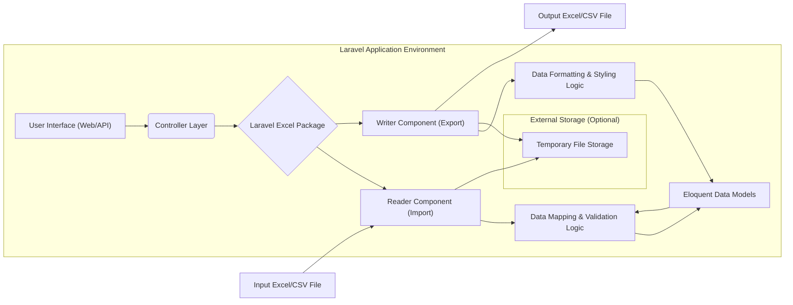
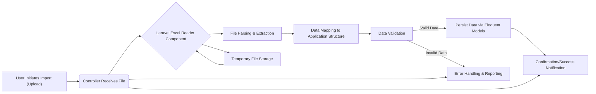
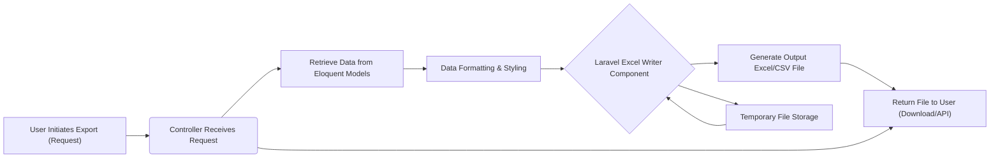

## Project Design Document: Laravel Excel Integration (Improved)

**1. Introduction**

This document provides a detailed design of a system integrating the `spartnernl/laravel-excel` package (referred to as "Laravel Excel") within a Laravel application. Its primary purpose is to offer a clear and comprehensive understanding of the system's architecture, components, and data flow. This detailed description is specifically intended to serve as the foundation for subsequent threat modeling activities, enabling the identification of potential security vulnerabilities and the design of appropriate mitigation strategies.

**2. Goals and Objectives**

*   Clearly define the architectural components and their interactions when utilizing Laravel Excel for importing and exporting data.
*   Illustrate the complete data flow during both import and export operations, highlighting key transformation points.
*   Pinpoint critical interaction points and data processing steps that are relevant for a thorough security analysis.
*   Provide a comprehensive and easily understandable overview of the system to facilitate effective and targeted threat modeling sessions.

**3. High-Level Architecture**

The system centers around a Laravel application that leverages the Laravel Excel package to manage the import and export of data to and from Excel (.xlsx, .csv, etc.) files.

**4. Component Details**

*   **User Interface (Web/API):** This represents the entry point for users or external systems to initiate import or export functionalities. This could be a web form allowing file uploads or API endpoints receiving data or triggering export processes.
*   **Controller Layer:** Laravel controllers are responsible for handling incoming HTTP requests. In the context of Laravel Excel, controllers will:
    *   Receive uploaded files during import operations.
    *   Receive data or requests to initiate export operations, potentially with specific parameters.
    *   Instantiate and interact with the Laravel Excel package to perform import or export tasks.
    *   Manage responses to the user or calling system, including success messages, error details, or file downloads.
*   **Laravel Excel Package:** This is the core third-party package responsible for the complex tasks of reading and writing various Excel and CSV file formats. It provides an abstraction layer over underlying libraries like PHPSpreadsheet.
*   **Reader Component (Import):** A specific component within the Laravel Excel package dedicated to parsing and extracting data from uploaded Excel or CSV files. It handles different file formats, encodings, and configurations specified within the package or by the user.
*   **Writer Component (Export):** A specific component within the Laravel Excel package responsible for generating Excel or CSV files based on provided data. It manages formatting, styling, and configuration options for the output file.
*   **Data Mapping & Validation Logic:** This layer defines the rules and processes for transforming data extracted from the imported file into the application's data model structure. It includes validation steps to ensure data integrity and adherence to business rules. This logic is typically implemented within Laravel services or form request classes.
*   **Data Formatting & Styling Logic:** This layer defines how data from the application's data models is formatted and styled for export into an Excel or CSV file. This includes formatting dates, numbers, applying specific cell styles, and configuring worksheet layouts.
*   **Eloquent Data Models:** These are the PHP classes representing the data structures within the Laravel application. Imported data is typically persisted into the database through these models, and data for export is retrieved from them.
*   **Input Excel/CSV File:** The source file containing the data to be imported into the application.
*   **Output Excel/CSV File:** The file generated by the export process, containing data from the application.
*   **Temporary File Storage (Optional):**  Laravel Excel might utilize temporary file storage during the import or export process, especially for large files. This could be the system's temporary directory or a configured disk within the Laravel application.

**5. Data Flow**

This section details the step-by-step movement and transformation of data during both import and export operations.

**5.1. Import Operation**

*   **User Initiates Import (Upload):** The user starts the import process by uploading an Excel or CSV file through the application's user interface or API.
*   **Controller Receives File:** The designated Laravel controller receives the uploaded file, typically through an HTTP request.
*   **Laravel Excel Reader Component:** The controller instantiates and utilizes the Laravel Excel package's reader component, providing the file path or stream.
*   **File Parsing & Extraction:** The reader component parses the file content, extracting data from rows and columns based on the file format.
*   **Data Mapping to Application Structure:** The extracted data is transformed and mapped to the application's internal data model structure, often involving custom logic defined in services or form requests.
*   **Data Validation:** The mapped data is validated against predefined rules, either within the Eloquent models or through dedicated validation logic, to ensure data integrity.
*   **Persist Data via Eloquent Models:** If the data is valid, it is used to create or update records in the application's database using Eloquent ORM methods.
*   **Error Handling & Reporting:** If the data is invalid, an error is generated, and appropriate error handling mechanisms are triggered, potentially logging the error and informing the user.
*   **Confirmation/Success Notification:** The user is notified of the successful completion or failure of the import operation.
*   **Temporary File Storage:** The reader component might utilize temporary file storage during the parsing process, especially for large files.

**5.2. Export Operation**

*   **User Initiates Export (Request):** The user starts the export process, potentially specifying data filters, desired file format, or other export options.
*   **Controller Receives Request:** The designated Laravel controller receives the export request, including any parameters.
*   **Retrieve Data from Eloquent Models:** The controller retrieves the necessary data from the application's database using Eloquent models, potentially applying filters based on the user's request.
*   **Data Formatting & Styling:** The retrieved data is formatted and styled according to the desired output format, including date and number formatting, cell styles, and worksheet layout configurations.
*   **Laravel Excel Writer Component:** The controller instantiates and utilizes the Laravel Excel package's writer component, providing the data to be exported and any formatting configurations.
*   **Generate Output Excel/CSV File:** The writer component generates the Excel or CSV file based on the provided data and formatting instructions.
*   **Return File to User (Download/API):** The generated file is returned to the user, typically as a downloadable file or as part of an API response.
*   **Temporary File Storage:** The writer component might utilize temporary file storage during the file generation process, especially for large datasets.

**6. Security Considerations (Detailed)**

This section outlines potential security vulnerabilities and threats associated with the use of Laravel Excel, providing a basis for threat modeling.

*   **File Upload Vulnerabilities (Import):**
    *   **Unrestricted File Type Upload:** Allowing the upload of arbitrary file types could enable attackers to upload and potentially execute malicious scripts on the server. **Threat:** Remote Code Execution. **Mitigation:** Implement strict file type validation based on MIME types and file extensions.
    *   **Insufficient File Size Limits:** Lack of proper file size limits can lead to denial-of-service (DoS) attacks by exhausting server resources. **Threat:** Denial of Service. **Mitigation:** Implement appropriate file size limits at the web server and application level.
    *   **Malicious File Content (Formula Injection/CSV Injection):**  Uploaded Excel or CSV files might contain malicious formulas or scripts that could be executed when opened by a user's spreadsheet software, potentially leading to information disclosure or further attacks on the user's machine. **Threat:** Client-Side Exploitation, Information Disclosure. **Mitigation:** Sanitize data during import, educate users about the risks of opening untrusted files, and consider disabling formula execution in exported files where appropriate.
    *   **Path Traversal:** Vulnerabilities in file handling logic could allow attackers to upload files to arbitrary locations on the server. **Threat:** Arbitrary File Write, Potential Remote Code Execution. **Mitigation:** Ensure proper validation and sanitization of file paths.
*   **Data Injection Vulnerabilities (Import):**
    *   **CSV Injection (Formula Injection):** As mentioned above, this is a significant risk during import. **Threat:** Client-Side Exploitation, Information Disclosure. **Mitigation:** Sanitize imported data, especially fields that might be interpreted as formulas.
    *   **Indirect SQL Injection:** If imported data is not properly sanitized before being used in database queries (even with Eloquent), vulnerabilities might arise in raw queries or through complex relationships. **Threat:** Data Breach, Data Manipulation. **Mitigation:**  Always use parameterized queries or Eloquent's query builder, and sanitize input data.
*   **Data Exposure Vulnerabilities (Export):**
    *   **Exposure of Sensitive Data in Exported Files:** Exported files might inadvertently contain sensitive information that should not be shared with unauthorized users. **Threat:** Information Disclosure, Privacy Violation. **Mitigation:** Implement proper authorization checks before allowing exports, and carefully review the data being exported.
    *   **Insecure Temporary File Handling:** Improper handling of temporary files created during import or export could expose sensitive data if these files are not properly secured or deleted. **Threat:** Information Disclosure. **Mitigation:** Ensure temporary files are stored securely with appropriate permissions and are deleted after use.
*   **Authentication and Authorization Vulnerabilities:**
    *   **Lack of Authorization for Import/Export Functionality:**  If import and export features are not properly protected by authentication and authorization mechanisms, unauthorized users could potentially access or manipulate data. **Threat:** Unauthorized Access, Data Manipulation. **Mitigation:** Implement robust authentication and authorization checks to ensure only authorized users can perform these actions.
*   **Error Handling and Information Disclosure:**
    *   **Verbose Error Messages:** Detailed error messages during import or export could reveal sensitive information about the system's internal workings or data structures to attackers. **Threat:** Information Disclosure. **Mitigation:** Implement generic error messages for users and log detailed errors securely.
*   **Dependency Vulnerabilities:**
    *   **Vulnerabilities in Underlying Libraries:**  Laravel Excel relies on underlying libraries like PHPSpreadsheet, which might have known vulnerabilities. **Threat:** Various, depending on the vulnerability. **Mitigation:** Regularly update dependencies and monitor security advisories.

**7. Assumptions and Constraints**

*   The Laravel application has a well-defined and implemented authentication and authorization system.
*   The server environment where the Laravel application is hosted is properly secured and configured according to security best practices.
*   The `spartnernl/laravel-excel` package is used as documented and intended by its developers.
*   File storage and retrieval mechanisms within the Laravel application are handled securely, including appropriate permissions and encryption where necessary.
*   Users are expected to upload files that generally conform to the expected Excel or CSV formats, although the system should handle potential variations and errors gracefully.

**8. Future Considerations**

*   Implementation of background job processing using Laravel Queues for handling large import and export operations to improve performance and user experience.
*   Development of more granular role-based access control (RBAC) for import and export functionalities, allowing for more precise control over who can perform specific actions.
*   Integration of advanced data validation and sanitization techniques, potentially using dedicated libraries, to further mitigate data injection risks.
*   Implementation of comprehensive auditing and logging of import and export activities for security monitoring and compliance purposes.
*   Consideration of using signed URLs for accessing exported files to enhance security and prevent unauthorized access.
