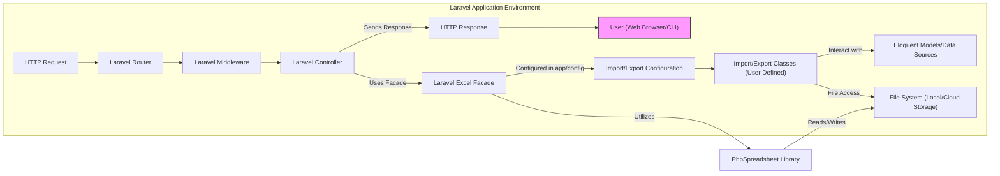
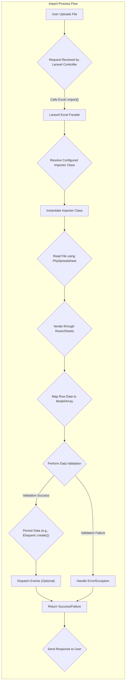
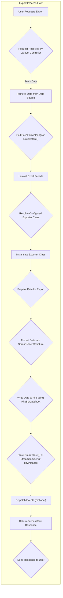
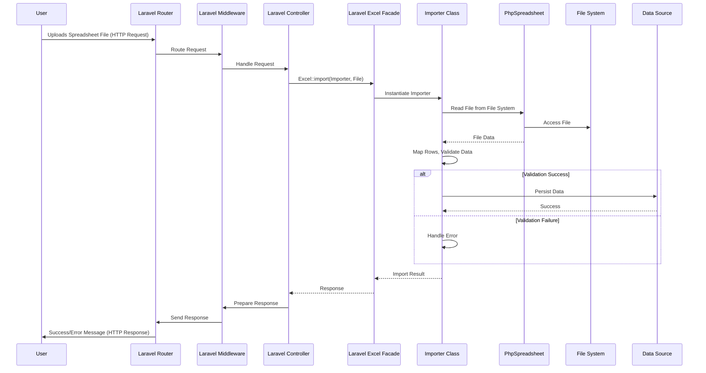
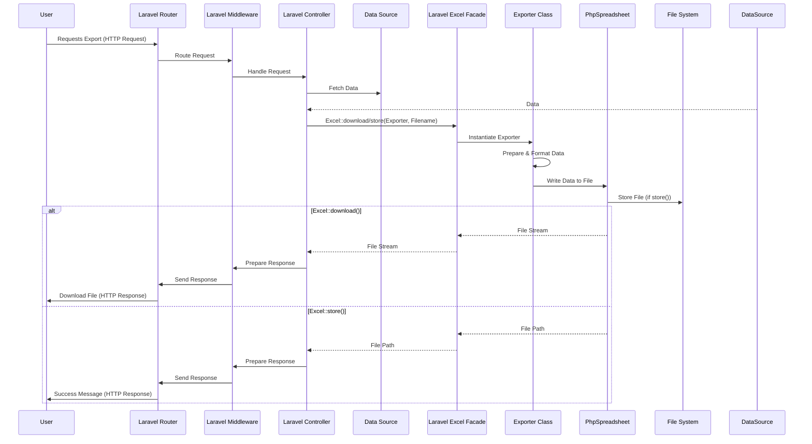

# Project Design Document: Laravel Excel Integration

**Version:** 1.1
**Date:** October 26, 2023
**Author:** AI Software Architect

## 1. Introduction

This document provides a detailed and improved design overview of the Laravel Excel package (specifically focusing on the project located at [https://github.com/spartnernl/laravel-excel](https://github.com/spartnernl/laravel-excel)). This design aims to clearly articulate the architecture, components, and data flows within the package to facilitate more effective threat modeling. The document focuses on the core functionalities of importing and exporting data using this package within a Laravel application context, providing greater detail and clarity than the previous version.

## 2. Goals

The primary goals of this design document are:

*   To provide a more comprehensive and clearer understanding of the Laravel Excel package's architecture and functionality.
*   To illustrate the data flow during import and export operations with greater granularity.
*   To identify key components and interaction points that are highly relevant for detailed security analysis and threat modeling.
*   To serve as an enhanced and more informative foundation for subsequent threat modeling activities.

## 3. Scope

This document covers the following aspects of the Laravel Excel package in detail:

*   The core components of the package involved in both import and export operations.
*   The typical data flow during import and export processes, including potential variations and error handling.
*   The interaction of the package with the encompassing Laravel application, including events and middleware.
*   Interaction with external resources, such as different file storage systems.

This document still does not cover:

*   Specific implementation details of every single class and method within the package's codebase.
*   Highly specialized configuration options beyond standard import and export scenarios.
*   The intricate internal workings of the underlying PHPExcel/PhpSpreadsheet library in extreme detail.
*   Highly specific and unique use cases or integrations within particular and diverse Laravel applications.

## 4. Architectural Overview

The Laravel Excel package functions as an integral part of a Laravel application. Its core purpose is to facilitate the seamless transfer of data between structured application data and spreadsheet files.

Here's an improved high-level architectural diagram illustrating the interactions:

**Components:**

*   **User (Web Browser/CLI):** Initiates import or export requests, either through a web interface or command-line tools.
*   **HTTP Request:** The initial request made by the user to the Laravel application.
*   **Laravel Router:** Directs incoming HTTP requests to the appropriate controller.
*   **Laravel Middleware:**  Handles pre-processing and post-processing of requests (e.g., authentication, authorization).
*   **Laravel Controller:**  Manages user requests, orchestrates the interaction with the Laravel Excel package.
*   **Laravel Excel Facade:** Provides a simplified and convenient interface for interacting with the underlying Laravel Excel functionality.
*   **Import/Export Configuration:** Configuration settings (typically in `config/excel.php`) that define how imports and exports should behave.
*   **Import/Export Classes (User Defined):** Classes created by the developer that define the specific logic for mapping data between spreadsheets and the application's data structures. These classes implement interfaces or extend abstract classes provided by the package.
*   **Eloquent Models/Data Sources:** Represents the application's data, often database tables accessed using Laravel's Eloquent ORM, but can also include other data sources.
*   **File System (Local/Cloud Storage):**  The storage location for spreadsheet files. This can be the local server's file system or a cloud-based storage service like Amazon S3 or Google Cloud Storage.
*   **PhpSpreadsheet Library:** The underlying PHP library responsible for reading and writing various spreadsheet file formats (e.g., XLSX, CSV).
*   **HTTP Response:** The response sent back to the user after the import or export operation is completed.

## 5. Detailed Design: Import Process

The import process involves taking data from a spreadsheet file and integrating it into the Laravel application's data.

**Steps:**

1. **User Uploads File:** The user uploads a spreadsheet file (e.g., XLSX, CSV) through a web form or a command-line interface.
2. **Request Received by Laravel Controller:** The Laravel controller responsible for handling the import request receives the uploaded file.
3. **Laravel Excel Facade:** The controller calls the `Excel::import()` method, providing the path to the uploaded file and the name of the configured importer class.
4. **Resolve Configured Importer Class:** The Laravel Excel facade uses the provided configuration to determine which importer class should be used.
5. **Instantiate Importer Class:** An instance of the user-defined importer class is created.
6. **Read File using PhpSpreadsheet:** The importer class utilizes the PhpSpreadsheet library to open and read the contents of the uploaded file.
7. **Iterate through Rows/Sheets:** The importer iterates through the rows and potentially different sheets within the spreadsheet file.
8. **Map Row Data to Model/Array:**  For each row, the importer class maps the spreadsheet data to the corresponding properties of an Eloquent model or a simple array structure. This mapping is defined within the importer class.
9. **Perform Data Validation:** Optionally, the importer class can implement validation rules to ensure the data from the spreadsheet conforms to the expected format and constraints.
10. **Persist Data (e.g., Eloquent::create()):** If validation is successful, the processed data is persisted to the database or another data store, typically using Eloquent model methods like `create()` or `update()`.
11. **Handle Error/Exception:** If validation fails or an error occurs during processing, the importer class handles the error, potentially logging it or throwing an exception.
12. **Dispatch Events (Optional):** Laravel events can be dispatched at various stages of the import process (e.g., before import, after each row import, after successful import) to allow other parts of the application to react to the import process.
13. **Return Success/Failure:** The import operation returns a status indicating whether the import was successful or not.
14. **Send Response to User:** The Laravel controller sends a response back to the user, providing feedback on the success or failure of the import operation, potentially including error messages.

## 6. Detailed Design: Export Process

The export process involves generating a spreadsheet file from data residing within the Laravel application.

**Steps:**

1. **User Requests Export:** The user initiates an export request, typically by clicking a button or accessing a specific URL.
2. **Request Received by Laravel Controller:** The Laravel controller responsible for handling the export request receives the request.
3. **Retrieve Data from Data Source:** The controller fetches the data that needs to be exported from the application's data sources (e.g., database using Eloquent queries).
4. **Call Excel::download() or Excel::store():** The controller calls either `Excel::download()` to trigger an immediate download to the user's browser or `Excel::store()` to save the generated file to a specified location on the file system or cloud storage. The configured exporter class and filename are provided.
5. **Laravel Excel Facade:** The call is routed to the Laravel Excel facade.
6. **Resolve Configured Exporter Class:** The facade uses the provided configuration to determine the appropriate exporter class to use.
7. **Instantiate Exporter Class:** An instance of the user-defined exporter class is created.
8. **Prepare Data for Export:** The exporter class may perform some initial processing or transformation of the data before it's formatted into the spreadsheet.
9. **Format Data into Spreadsheet Structure:** The exporter class defines how the application's data should be structured and formatted within the spreadsheet (e.g., column headers, data types, styling).
10. **Write Data to File using PhpSpreadsheet:** The exporter class utilizes the PhpSpreadsheet library to create the spreadsheet file and write the formatted data into it.
11. **Store File (if store()) or Stream to User (if download()):** If `Excel::store()` was called, the generated file is saved to the specified storage location. If `Excel::download()` was called, the file is streamed directly to the user's browser for download.
12. **Dispatch Events (Optional):** Laravel events can be dispatched at various stages of the export process (e.g., before export, after file generation) to allow other parts of the application to react.
13. **Return Success/File Response:** The export operation returns a success status or the file content itself (for downloads).
14. **Send Response to User:** The Laravel controller sends a response back to the user, either initiating the file download or providing a confirmation message.

## 7. Data Flow Diagrams

### 7.1 Improved Import Data Flow

### 7.2 Improved Export Data Flow

## 8. Security Considerations

Based on the refined architecture and data flows, here are more detailed security considerations for threat modeling:

*   **File Upload Vulnerabilities (Import):**
    *   **Malicious File Execution:** Uploading files that could be interpreted and executed by the server (e.g., PHP files disguised as spreadsheets).
    *   **File Content Injection:** Injecting malicious code or scripts into spreadsheet cells that could be executed when the data is processed or displayed.
    *   **File Decompression Bombs (Zip Bombs):** Uploading specially crafted compressed files that consume excessive server resources when decompressed.
    *   **Path Traversal:** Manipulating file paths during upload to overwrite critical system files.
*   **Data Injection and Manipulation (Import):**
    *   **Formula Injection:** Injecting malicious formulas into spreadsheet cells that could be executed by spreadsheet software, potentially leading to information disclosure or remote code execution on the user's machine.
    *   **Data Integrity Issues:** Tampering with data within the spreadsheet to manipulate application logic or database records.
    *   **Denial of Service through Data:** Uploading spreadsheets with an extremely large number of rows or complex formulas that overwhelm the server during processing.
*   **Data Exposure and Leakage (Export):**
    *   **Unauthorized Access to Exported Files:** Lack of proper access controls on the storage location for exported files, allowing unauthorized users to download sensitive data.
    *   **Information Disclosure in Metadata:** Sensitive information being inadvertently included in the spreadsheet metadata (e.g., author, company).
    *   **Exposure through Temporary Files:** Insecure handling of temporary files created during the export process.
*   **Authentication and Authorization:**
    *   **Missing or Weak Authentication:** Lack of proper authentication mechanisms to verify the identity of users performing import and export operations.
    *   **Insufficient Authorization:**  Users being able to perform import or export operations on data they are not authorized to access.
*   **Cross-Site Scripting (XSS):**
    *   **Stored XSS:** If data imported from spreadsheets is stored in the database and later displayed to other users without proper sanitization, it could lead to stored XSS vulnerabilities.
*   **Cross-Site Request Forgery (CSRF):**
    *   **Unprotected Import/Export Endpoints:**  Import and export endpoints not being protected against CSRF attacks, allowing attackers to trick authenticated users into performing unintended actions.
*   **Dependency Vulnerabilities:**
    *   **Vulnerabilities in PhpSpreadsheet:** Exploitable vulnerabilities in the underlying PhpSpreadsheet library that could be leveraged by attackers.
    *   **Outdated Laravel Excel Package:** Using an outdated version of the Laravel Excel package with known security vulnerabilities.
*   **File Storage Security:**
    *   **Insecure Permissions:** Incorrect file system permissions on the storage directory, allowing unauthorized access.
    *   **Lack of Encryption:** Storing exported files without encryption, making them vulnerable if the storage is compromised.
*   **Data Validation and Sanitization (Import):**
    *   **Insufficient Validation Rules:**  Not having comprehensive validation rules to catch malicious or malformed data.
    *   **Improper Sanitization:** Failing to properly sanitize data imported from spreadsheets before using it in the application.

## 9. Assumptions and Constraints

The following assumptions and constraints are considered in this design:

*   The underlying Laravel application is assumed to be configured with standard security best practices, including protection against common web vulnerabilities and secure session management.
*   The focus remains on the core import and export functionalities provided by the Laravel Excel package. Highly customized implementations or third-party integrations are not explicitly covered.
*   The PhpSpreadsheet library is assumed to be a trusted dependency, and regular updates are recommended to address potential vulnerabilities.
*   The security of the underlying file storage mechanisms (local or cloud-based) is considered a separate responsibility, and this design assumes appropriate security measures are in place for file storage.
*   Developers using this package are expected to implement appropriate authorization checks within their Laravel application to control access to import and export functionalities.

This improved document provides a more detailed and nuanced understanding of the Laravel Excel package's architecture and data flows, offering a stronger foundation for comprehensive threat modeling activities. The expanded security considerations highlight potential attack vectors and areas that require careful attention during security assessments.