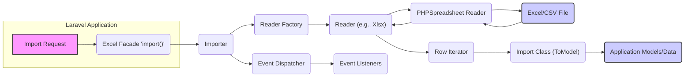
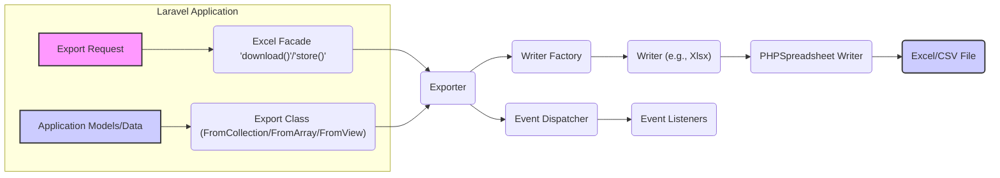

# Project Design Document: Laravel Excel

**Version:** 1.1
**Date:** October 26, 2023
**Author:** AI Software Architect

## 1. Introduction

This document provides an enhanced design overview of the `laravel-excel` project, a widely used Laravel package for seamless import and export of Excel and CSV files. Building upon the previous version, this document offers a more detailed understanding of the project's architecture, components, and data flow, specifically tailored for effective threat modeling.

## 2. Goals

* Provide a clear, concise, and more detailed description of the `laravel-excel` package's architecture and functionality.
* Identify and elaborate on key components and their interactions within the package, including specific Concerns.
* Offer a more granular outline of the data flow during both import and export operations, highlighting potential transformation points.
* Emphasize potential areas of security concern with more specific examples for future threat modeling exercises.

## 3. Non-Goals

* This document still does not aim to provide a detailed, line-by-line code-level analysis of the package.
* It does not cover every single implementation detail of each class or method, focusing on the core architectural elements.
* It does not include an exhaustive list of all possible configurations or options, but will touch upon key security-relevant configurations.
* The primary focus remains on the core import and export functionalities relevant to security analysis.

## 4. High-Level Architecture

The `laravel-excel` package serves as an intermediary layer, simplifying the interaction between Laravel applications and the robust PHPSpreadsheet library. Its architecture is structured around a set of well-defined concepts that facilitate efficient and flexible file handling:

* **Readers:**  Specialized components responsible for parsing and extracting data from various Excel and CSV file formats.
* **Writers:** Dedicated components for formatting and writing data into Excel and CSV files.
* **Imports:** Classes that define the logic for mapping data read from a file to specific application models or data structures.
* **Exports:** Classes that define how data from application models or other data sources should be structured and written to a file.
* **Concerns:**  Traits that provide modular and reusable functionalities to Imports and Exports, such as handling headers, chunking data, formatting cells, and defining column mappings.
* **Queues:**  Integration with Laravel's queue system to enable asynchronous processing of import and export tasks, improving performance and user experience.
* **Events:**  A mechanism for triggering custom actions or logic at different stages of the import and export lifecycle, allowing for extensibility and monitoring.
* **Factories:**  Used to create instances of Readers and Writers based on the file type.

## 5. Detailed Component Description

This section provides a more in-depth look at the key components involved in the import and export processes, including specific Concerns.

### 5.1. Import Process

The import process transforms data from an external file into a format usable within the Laravel application.

* **`Maatwebsite\Excel\Facades\Excel::import()`:** The primary entry point, accepting an `Import` class instance and the file path or UploadedFile object.
* **`Maatwebsite\Excel\Importer`:**  The central orchestrator of the import process. It resolves the appropriate Reader, processes the file, and utilizes the provided `Import` class.
* **`Maatwebsite\Excel\Reader`:**  An abstraction layer for different file readers (e.g., `Xlsx`, `Csv`). It uses PHPSpreadsheet to parse the file content.
    * **`PhpOffice\PhpSpreadsheet\Reader\*`:** The underlying PHPSpreadsheet reader classes responsible for the actual file parsing.
* **`Maatwebsite\Excel\Concerns\ToModel` (Interface):**  Implemented by the `Import` class to define the transformation logic for each row of data into an application model.
* **`Maatwebsite\Excel\Concerns\WithHeadingRow` (Interface):**  Indicates that the first row should be treated as headers, influencing how data is mapped.
* **`Maatwebsite\Excel\Concerns\WithChunkReading` (Interface):** Enables processing large files in chunks, reducing memory consumption. This involves iterating through rows in batches.
* **`Maatwebsite\Excel\Concerns\WithBatchInserts` (Interface):** Optimizes database inserts by performing them in batches.
* **`Maatwebsite\Excel\Concerns\WithValidation` (Interface):** Allows defining validation rules for each row of data before processing.
* **Event Listeners:**  React to events like `BeforeImport`, `AfterImport`, `BeforeRow`, `AfterRow`, allowing for custom logic injection at various stages.

**Data Flow Diagram (Import):**

### 5.2. Export Process

The export process retrieves data from the Laravel application and writes it to an Excel or CSV file.

* **`Maatwebsite\Excel\Facades\Excel::download()` or `Maatwebsite\Excel\Facades\Excel::store()`:** The primary entry points. `download()` sends the file as an HTTP response, while `store()` saves it to the filesystem. They accept an `Export` class instance and the desired filename.
* **`Maatwebsite\Excel\Exporter`:**  The central orchestrator for the export process. It resolves the appropriate Writer, retrieves the data, and uses the provided `Export` class for formatting.
* **`Maatwebsite\Excel\Writer`:** An abstraction layer for different file writers (e.g., `Xlsx`, `Csv`). It utilizes PHPSpreadsheet to generate the file content.
    * **`PhpOffice\PhpSpreadsheet\Writer\*`:** The underlying PHPSpreadsheet writer classes responsible for generating the file in the specified format.
* **`Maatwebsite\Excel\Concerns\FromCollection` (Interface):** Implemented by the `Export` class to provide a `Collection` of data to be exported.
* **`Maatwebsite\Excel\Concerns\FromArray` (Interface):** Implemented by the `Export` class to provide an array of data for export.
* **`Maatwebsite\Excel\Concerns\FromView` (Interface):** Allows rendering a Laravel Blade view to generate the export content.
* **`Maatwebsite\Excel\Concerns\WithHeadings` (Interface):**  Defines the header row for the exported file.
* **`Maatwebsite\Excel\Concerns\WithMapping` (Interface):**  Allows transforming data from the source before it is written to the file (e.g., formatting dates, combining fields).
* **`Maatwebsite\Excel\Concerns\WithStyles` (Interface):** Enables applying styling to the exported spreadsheet.
* **Event Listeners:**  Respond to events like `BeforeExport`, `AfterExport`, allowing for custom actions before or after the export process.

**Data Flow Diagram (Export):**

## 6. Dependencies

The `laravel-excel` package's core dependency remains:

* **PHPOffice/PhpSpreadsheet:** A fundamental PHP library for reading and writing various spreadsheet file formats. It handles the low-level details of file parsing, data manipulation, and file generation. Vulnerabilities in this dependency can directly impact `laravel-excel`.

## 7. Security Considerations

This section expands on potential security concerns, providing more specific examples.

* **File Upload Vulnerabilities:**
    * **Unrestricted File Types:** Allowing upload of arbitrary file types could lead to remote code execution if the server attempts to process them. **Mitigation:** Strictly validate file extensions and MIME types.
    * **File Size Limits:**  Lack of file size limits can lead to denial-of-service attacks by exhausting server resources. **Mitigation:** Implement appropriate file size limits.
    * **Malicious File Content:** Even with valid extensions, files can contain malicious content (e.g., formula injection in Excel). **Mitigation:** Sanitize data during import and consider using read-only modes where possible.
* **Data Injection:**
    * **SQL Injection:** If imported data is directly used in raw SQL queries without proper sanitization, it can lead to SQL injection vulnerabilities. **Mitigation:** Use Laravel's Eloquent ORM or prepared statements.
    * **Cross-Site Scripting (XSS):** If exported data is displayed in a web browser without proper encoding, it could lead to XSS vulnerabilities. **Mitigation:** Ensure proper output encoding when displaying exported data.
    * **Formula Injection:**  Excel formulas can execute commands or access external data. **Mitigation:** Be cautious when importing data from untrusted sources and consider disabling formula execution or sanitizing formulas.
* **Denial of Service (DoS):**
    * **Large File Processing:**  Attempting to process extremely large or complex Excel files can consume excessive CPU and memory, leading to DoS. **Mitigation:** Utilize chunk reading, set appropriate PHP memory limits and execution timeouts, and potentially offload processing to queues.
    * **Zip Bomb:** Maliciously crafted Excel files (which are essentially zipped XML files) can be very small but expand to enormous sizes when unzipped, causing resource exhaustion. **Mitigation:** Implement checks on the extracted size of the file.
* **Information Disclosure:**
    * **Sensitive Data in Exports:** Exported files might inadvertently contain sensitive information. **Mitigation:** Implement proper access controls for exported files and ensure only necessary data is included.
    * **Temporary File Security:**  Ensure temporary files created during import/export are securely handled and deleted after processing. **Mitigation:** Use secure temporary directories and ensure proper cleanup.
* **Dependency Vulnerabilities:**
    * **Outdated PhpSpreadsheet:**  Vulnerabilities in the underlying `PhpSpreadsheet` library can directly impact the security of `laravel-excel`. **Mitigation:** Regularly update the `laravel-excel` package and its dependencies.
* **Server-Side Request Forgery (SSRF):**
    * While less common, if import functionality allows specifying external file URLs, it could be exploited for SSRF. **Mitigation:** Avoid allowing users to specify arbitrary URLs for import or implement strict validation and sanitization.
* **Configuration Issues:**
    * **Insecure Default Settings:** Review default configurations for potential security weaknesses. **Mitigation:**  Harden configurations based on security best practices.

## 8. Deployment Considerations

Secure deployment of applications using `laravel-excel` requires attention to several aspects:

* **File Storage Security:**  Ensure that directories used for temporary file storage during import and the destination directories for exported files have appropriate permissions to prevent unauthorized access.
* **Queue Security:** If using queued imports or exports, secure the queue infrastructure to prevent unauthorized job execution or data manipulation.
* **Resource Limits:** Configure PHP `memory_limit` and `max_execution_time` appropriately to prevent resource exhaustion during file processing, but also consider potential DoS vectors.
* **Web Server Configuration:** Configure the web server (e.g., Nginx, Apache) to prevent direct access to temporary upload directories.
* **Input Validation:** Implement robust input validation on the server-side to prevent malicious file uploads or data injection attempts.

## 9. Future Considerations

* **More Detailed Error Handling Analysis:**  A deeper analysis of how the package handles errors and exceptions could reveal potential information disclosure vulnerabilities.
* **Configuration Hardening Guide:**  Providing specific recommendations for hardening the `laravel-excel` configuration.
* **Integration with Security Scanning Tools:**  Exploring how `laravel-excel` usage can be effectively analyzed by static and dynamic application security testing (SAST/DAST) tools.

This improved design document provides a more comprehensive and detailed understanding of the `laravel-excel` package, specifically focusing on aspects relevant to security. The enhanced descriptions of components, data flows, and security considerations will be invaluable for conducting thorough and effective threat modeling activities.