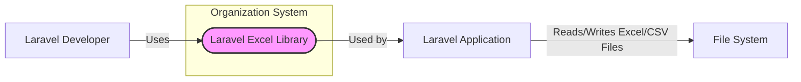
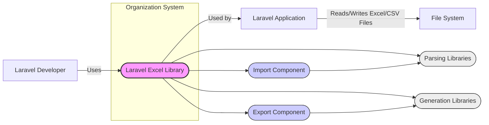
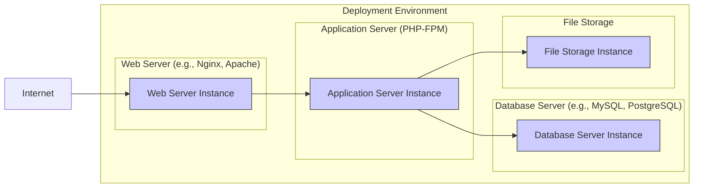

# BUSINESS POSTURE

The `laravel-excel` library is a package for the Laravel framework that enables developers to import and export Excel and CSV files.

*   Business Priorities:
    *   Ease of Integration: The library should be easy to integrate into existing and new Laravel applications.
    *   Data Interchange: Facilitate seamless data exchange between Laravel applications and external systems or users through Excel and CSV formats.
    *   Developer Productivity:  Provide a simple and efficient API for handling Excel and CSV data, reducing development time and effort.
    *   Data Accuracy: Ensure accurate and reliable data import and export processes, minimizing data loss or corruption.

*   Business Goals:
    *   Enable Laravel applications to efficiently process and manage data in Excel and CSV formats.
    *   Streamline data import and export workflows for users interacting with Laravel applications.
    *   Reduce the complexity of handling spreadsheet data within Laravel projects.
    *   Improve the overall functionality and versatility of Laravel applications by adding robust Excel and CSV capabilities.

*   Business Risks:
    *   Data Integrity Risk: Incorrect parsing or formatting of Excel/CSV files could lead to data corruption or loss during import and export processes.
    *   Data Breach Risk: Vulnerabilities in the library or its dependencies could be exploited to gain unauthorized access to sensitive data contained within Excel/CSV files.
    *   Denial of Service Risk: Processing maliciously crafted or excessively large Excel/CSV files could lead to resource exhaustion and denial of service for applications using the library.
    *   Compatibility Risk:  Incompatibility with certain Excel/CSV file formats or versions could limit the library's usability and require additional development effort.
    *   Supply Chain Risk:  Vulnerabilities in third-party libraries or dependencies used by `laravel-excel` could introduce security risks into applications using the library.

# SECURITY POSTURE

*   Security Controls:
    *   security control: Laravel Framework Security: The library benefits from the security features provided by the Laravel framework, such as protection against common web vulnerabilities (CSRF, XSS, SQL Injection when used with Eloquent ORM). Implemented by: Laravel Framework. Described in: Laravel documentation.
    *   security control: Input Validation: Laravel provides input validation mechanisms that can be used to validate data imported from Excel/CSV files. Implemented by: Laravel Application using the library. Described in: Laravel documentation.
    *   security control: Dependency Management: Composer is used to manage dependencies, allowing for updates and security patches of underlying libraries. Implemented by: Composer. Described in: Composer documentation.
    *   security control: Open Source Review: As an open-source project, the code is publicly available for review, increasing the likelihood of identifying and addressing security vulnerabilities. Implemented by: Community and maintainers. Described in: GitHub repository.

*   Accepted Risks:
    *   accepted risk: Vulnerabilities in third-party libraries: The library relies on external libraries for parsing and generating Excel/CSV files. Vulnerabilities in these libraries could indirectly affect `laravel-excel`. Mitigation: Dependency updates and security scanning.
    *   accepted risk: Misuse by developers: Developers using the library might not implement proper input validation or security measures in their applications, leading to vulnerabilities. Mitigation: Documentation and best practices guidelines.
    *   accepted risk: Complexity of file formats: Excel and CSV formats can be complex and have various features, increasing the potential for parsing vulnerabilities. Mitigation: Thorough testing and use of well-established parsing libraries.

*   Recommended Security Controls:
    *   security control: Dependency Scanning: Implement automated dependency scanning to identify and address known vulnerabilities in third-party libraries used by `laravel-excel`.
    *   security control: Static Application Security Testing (SAST): Integrate SAST tools into the development process to automatically analyze the library's code for potential security vulnerabilities.
    *   security control: Dynamic Application Security Testing (DAST): Perform DAST on applications using `laravel-excel` to identify runtime vulnerabilities related to file handling and data processing.
    *   security control: Security Code Review: Conduct regular security code reviews by experienced security professionals to identify and address potential security flaws in the library's code.
    *   security control: Input Sanitization Examples: Provide clear examples and best practices in the documentation for sanitizing and validating data imported from Excel/CSV files to prevent common injection attacks.
    *   security control: Rate Limiting: For applications using `laravel-excel` to handle file uploads, implement rate limiting to mitigate potential denial-of-service attacks through excessive file uploads.

*   Security Requirements:
    *   Authentication: Not directly applicable to the library itself. Authentication is the responsibility of the Laravel application using the library to control access to import/export functionalities.
    *   Authorization: Not directly applicable to the library itself. Authorization is the responsibility of the Laravel application using the library to control which users or roles can perform import/export operations.
    *   Input Validation:
        *   Requirement: The library and applications using it MUST validate all data imported from Excel/CSV files to prevent injection attacks (e.g., CSV injection, formula injection) and data corruption.
        *   Requirement: Input validation SHOULD include checks for data type, format, length, and allowed characters.
        *   Requirement: The library SHOULD provide mechanisms or guidance for developers to easily validate imported data.
    *   Cryptography:
        *   Requirement: If sensitive data is handled within Excel/CSV files, the Laravel application using the library MUST implement appropriate encryption mechanisms to protect data at rest and in transit.
        *   Requirement: The library itself does not need to implement cryptography, but it SHOULD not hinder the ability of applications to implement encryption when needed.

# DESIGN

## C4 CONTEXT



*   C4 Context Elements:
    *   Element:
        *   Name: Laravel Excel Library
        *   Type: Software System
        *   Description: A Laravel package that provides functionality to import and export Excel and CSV files within Laravel applications.
        *   Responsibilities:
            *   Parsing Excel and CSV files into data structures usable by Laravel applications.
            *   Generating Excel and CSV files from Laravel data structures.
            *   Providing an API for developers to easily integrate Excel and CSV functionality into their Laravel applications.
        *   Security controls:
            *   Relies on underlying parsing libraries (accepted risk: vulnerabilities in these libraries).
            *   Input validation guidance for developers in documentation (recommended security control).
    *   Element:
        *   Name: Laravel Developer
        *   Type: Person
        *   Description: Software developers who use the `laravel-excel` library to build Laravel applications.
        *   Responsibilities:
            *   Integrating the `laravel-excel` library into Laravel applications.
            *   Using the library's API to implement import and export functionalities.
            *   Implementing security controls in their applications, such as input validation and authorization, when using the library.
        *   Security controls:
            *   Responsible for implementing application-level security controls (security control: Laravel Framework Security, security control: Input Validation).
    *   Element:
        *   Name: Laravel Application
        *   Type: Software System
        *   Description: A web application built using the Laravel framework that utilizes the `laravel-excel` library.
        *   Responsibilities:
            *   Providing user interfaces and business logic for importing and exporting data using Excel and CSV files.
            *   Handling user authentication and authorization for import/export functionalities.
            *   Validating and sanitizing data imported from Excel/CSV files.
            *   Storing and processing data imported from Excel/CSV files.
        *   Security controls:
            *   Implements Laravel Framework Security features (security control: Laravel Framework Security).
            *   Should implement input validation for data from Excel/CSV files (security control: Input Validation, recommended security control: Input Sanitization Examples).
            *   Should implement authentication and authorization controls.
    *   Element:
        *   Name: File System
        *   Type: External System
        *   Description: The local or remote file system where Excel and CSV files are stored and accessed by the Laravel application.
        *   Responsibilities:
            *   Storing Excel and CSV files.
            *   Providing access to Excel and CSV files for the Laravel application.
        *   Security controls:
            *   File system permissions to control access to files.
            *   Encryption at rest for sensitive data stored in files (security requirement: Cryptography - application responsibility).

## C4 CONTAINER



*   C4 Container Elements:
    *   Element:
        *   Name: Laravel Excel Library
        *   Type: Software System (Container in this context)
        *   Description: A Laravel package providing Excel and CSV import/export functionality. Composed of several components.
        *   Responsibilities:
            *   Orchestrating import and export operations.
            *   Providing a high-level API for developers.
            *   Managing interactions between components.
        *   Security controls:
            *   Inherits security considerations from its components.
    *   Element:
        *   Name: Import Component
        *   Type: Software Component
        *   Description: Handles the import of data from Excel and CSV files.
        *   Responsibilities:
            *   Receiving file input.
            *   Delegating parsing to Parsing Libraries.
            *   Transforming parsed data into a format usable by Laravel applications.
        *   Security controls:
            *   Input validation (security requirement: Input Validation).
            *   Error handling for malformed files.
    *   Element:
        *   Name: Export Component
        *   Type: Software Component
        *   Description: Handles the export of data to Excel and CSV files.
        *   Responsibilities:
            *   Receiving data from Laravel applications.
            *   Formatting data for Excel/CSV output.
            *   Delegating file generation to Generation Libraries.
        *   Security controls:
            *   Output encoding to prevent injection vulnerabilities in generated files.
    *   Element:
        *   Name: Parsing Libraries
        *   Type: External Library
        *   Description: Third-party libraries used for parsing Excel and CSV file formats (e.g., PhpSpreadsheet).
        *   Responsibilities:
            *   Low-level parsing of Excel and CSV file formats.
            *   Handling different file formats and versions.
        *   Security controls:
            *   Dependency scanning (recommended security control: Dependency Scanning).
            *   Regular updates to address vulnerabilities (security control: Dependency Management).
    *   Element:
        *   Name: Generation Libraries
        *   Type: External Library
        *   Description: Third-party libraries used for generating Excel and CSV file formats (e.g., PhpSpreadsheet).
        *   Responsibilities:
            *   Low-level generation of Excel and CSV file formats.
            *   Ensuring correct file format and structure.
        *   Security controls:
            *   Dependency scanning (recommended security control: Dependency Scanning).
            *   Regular updates to address vulnerabilities (security control: Dependency Management).
    *   Element:
        *   Name: Laravel Developer, Laravel Application, File System
        *   Type: Person, Software System, External System
        *   Description: Same as in C4 Context diagram.
        *   Responsibilities: Same as in C4 Context diagram.
        *   Security controls: Same as in C4 Context diagram.

## DEPLOYMENT

Deployment of the `laravel-excel` library is as part of a Laravel application. A typical deployment architecture for a Laravel application is described below.



*   Deployment Elements:
    *   Element:
        *   Name: Web Server Instance (WS1)
        *   Type: Infrastructure - Web Server
        *   Description: Handles incoming HTTP requests from the internet and serves static content. Proxies dynamic requests to the Application Server. Examples: Nginx, Apache.
        *   Responsibilities:
            *   Receiving and routing HTTP requests.
            *   Serving static files.
            *   TLS termination (HTTPS).
            *   Basic security features like request filtering.
        *   Security controls:
            *   HTTPS configuration for secure communication.
            *   Web Application Firewall (WAF) integration (optional).
            *   Rate limiting to prevent DoS attacks.
    *   Element:
        *   Name: Application Server Instance (AS1)
        *   Type: Infrastructure - Application Server
        *   Description: Executes the Laravel application code, including the `laravel-excel` library, using PHP-FPM.
        *   Responsibilities:
            *   Running the Laravel application.
            *   Processing business logic.
            *   Interacting with the database and file storage.
            *   Executing `laravel-excel` library functions for import/export.
        *   Security controls:
            *   Application-level security controls (security control: Laravel Framework Security).
            *   Input validation and sanitization (security requirement: Input Validation, recommended security control: Input Sanitization Examples).
            *   Secure coding practices.
    *   Element:
        *   Name: Database Server Instance (DB1)
        *   Type: Infrastructure - Database Server
        *   Description: Stores application data, typically a relational database like MySQL or PostgreSQL.
        *   Responsibilities:
            *   Storing and managing application data.
            *   Providing data persistence.
            *   Handling database queries from the Application Server.
        *   Security controls:
            *   Database access controls and authentication.
            *   Data encryption at rest and in transit (optional, security requirement: Cryptography - application responsibility if sensitive data is stored).
            *   Regular security patching.
    *   Element:
        *   Name: File Storage Instance (FS1)
        *   Type: Infrastructure - File Storage
        *   Description: Stores files, including Excel and CSV files processed by the application. Can be local storage or cloud storage (e.g., AWS S3).
        *   Responsibilities:
            *   Storing Excel and CSV files.
            *   Providing file access to the Application Server.
        *   Security controls:
            *   File system permissions and access controls.
            *   Data encryption at rest (optional, security requirement: Cryptography - application responsibility if sensitive data is stored).
            *   Regular backups.
    *   Element:
        *   Name: Internet
        *   Type: External Environment
        *   Description: The public internet from which users access the Laravel application.
        *   Responsibilities:
            *   Providing network connectivity for users.
        *   Security controls:
            *   None directly controlled by the application deployment, but represents the external threat landscape.

## BUILD

```mermaid
flowchart LR
    subgraph "Developer Environment"
        DEV["Developer"]
    end
    subgraph "Version Control System (e.g., GitHub)"
        VCS["VCS Repository"]
    end
    subgraph "CI/CD Pipeline (e.g., GitHub Actions)"
        CI["CI/CD System"]
    end
    subgraph "Package Registry (e.g., Packagist)"
        REG["Package Registry"]
    end

    DEV -->|Code Changes| VCS
    VCS -->|Trigger Build| CI
    CI -->|Build & Test| VCS
    CI -->|Security Checks (SAST, Dependency Scan)| CI
    CI -->|Publish Package| REG
    REG -->|Dependency Download| Laravel Application Build Process

    style DEV fill:#ccf,stroke:#333,stroke-width:1px
    style VCS fill:#ccf,stroke:#333,stroke-width:1px
    style CI fill:#ccf,stroke:#333,stroke-width:1px
    style REG fill:#ccf,stroke:#333,stroke-width:1px
```

*   Build Elements:
    *   Element:
        *   Name: Developer (DEV)
        *   Type: Person
        *   Description: Software developers who contribute code to the `laravel-excel` library.
        *   Responsibilities:
            *   Writing and testing code for the library.
            *   Submitting code changes to the Version Control System.
            *   Following secure coding practices.
        *   Security controls:
            *   Code review process.
            *   Security awareness training.
    *   Element:
        *   Name: Version Control System (VCS)
        *   Type: Software System
        *   Description: A system for managing and tracking changes to the library's source code, e.g., GitHub.
        *   Responsibilities:
            *   Storing the source code repository.
            *   Managing code versions and branches.
            *   Controlling access to the codebase.
        *   Security controls:
            *   Access control and authentication for developers.
            *   Branch protection rules.
            *   Audit logging of code changes.
    *   Element:
        *   Name: CI/CD System (CI)
        *   Type: Software System
        *   Description: An automated system for building, testing, and publishing the library, e.g., GitHub Actions.
        *   Responsibilities:
            *   Automating the build process.
            *   Running unit and integration tests.
            *   Performing security checks (SAST, dependency scanning).
            *   Publishing the library package to the Package Registry.
        *   Security controls:
            *   Automated security checks (recommended security control: SAST, recommended security control: Dependency Scanning).
            *   Secure build environment.
            *   Access control for CI/CD pipelines.
    *   Element:
        *   Name: Package Registry (REG)
        *   Type: Software System
        *   Description: A public registry for PHP packages, e.g., Packagist, where the `laravel-excel` library is published and distributed.
        *   Responsibilities:
            *   Hosting and distributing the library package.
            *   Providing package versioning and management.
        *   Security controls:
            *   Package signing (if supported by the registry).
            *   Vulnerability scanning of published packages (by the registry).
    *   Element:
        *   Name: Laravel Application Build Process
        *   Type: Process
        *   Description: The process of building a Laravel application that depends on the `laravel-excel` library.
        *   Responsibilities:
            *   Downloading dependencies from the Package Registry (including `laravel-excel`).
            *   Building and deploying the Laravel application.
        *   Security controls:
            *   Dependency integrity checks (using Composer's lock file).
            *   Application-level security build and deployment processes.

# RISK ASSESSMENT

*   Critical Business Processes:
    *   Data Import from Excel/CSV: Processes that rely on importing data from Excel/CSV files into the Laravel application for business operations (e.g., data entry, system integration, reporting).
    *   Data Export to Excel/CSV: Processes that rely on exporting data from the Laravel application to Excel/CSV files for reporting, data sharing, or external system integration.

*   Data Sensitivity:
    *   Sensitivity Level: Data handled by `laravel-excel` can range from low to high sensitivity depending on the application using it and the content of the Excel/CSV files.
    *   Examples of Sensitive Data: Personally Identifiable Information (PII), financial data, confidential business data, health records, etc. Excel/CSV files are often used to exchange sensitive data.
    *   Data Protection Requirements: Applications using `laravel-excel` to handle sensitive data MUST implement appropriate security measures to protect data confidentiality, integrity, and availability, including encryption, access control, and input validation.

# QUESTIONS & ASSUMPTIONS

*   Questions:
    *   What types of Laravel applications will be using this library? (e.g., internal tools, public-facing applications, data analytics platforms).
    *   What kind of data will be processed using this library, and what is the sensitivity level of this data?
    *   Are there any specific regulatory compliance requirements that applications using this library need to adhere to (e.g., GDPR, HIPAA, PCI DSS)?
    *   What are the performance and scalability requirements for applications using this library?
    *   Are there any specific Excel/CSV file formats or features that are heavily used or need special consideration?

*   Assumptions:
    *   The `laravel-excel` library is intended for general-purpose use within Laravel applications for importing and exporting Excel and CSV data.
    *   Security is a relevant concern for applications using this library, especially when handling potentially sensitive data.
    *   Developers using this library are expected to have a basic understanding of Laravel security best practices and will implement necessary security controls in their applications.
    *   The library is deployed as part of standard Laravel application deployments in typical web server environments.
    *   The build process for the library utilizes common open-source tools and practices, including version control and CI/CD.