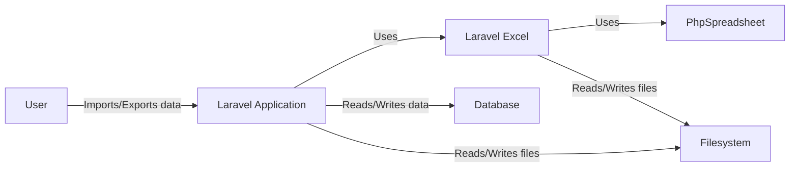
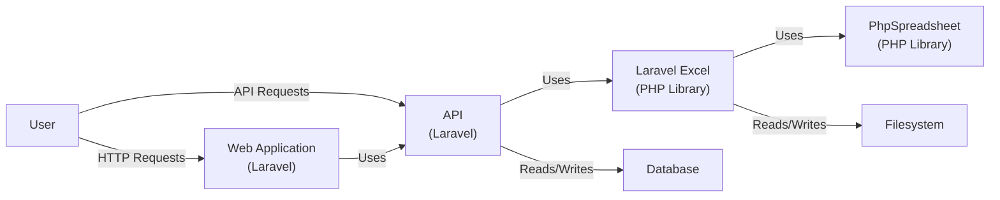
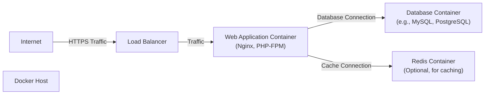
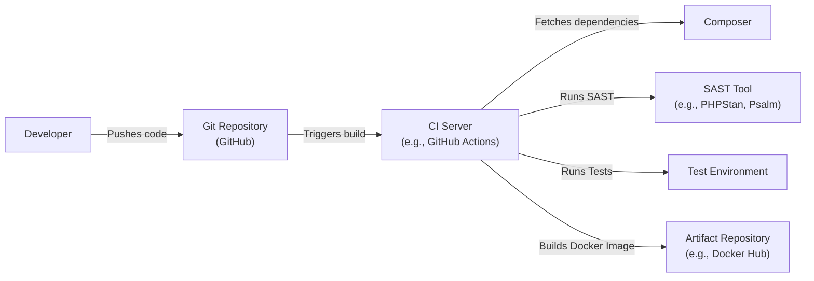

Okay, let's create a design document for the `spartnernl/laravel-excel` project.

# BUSINESS POSTURE

Business Priorities and Goals:

*   Provide an easy and efficient way to import and export Excel and CSV files within Laravel applications.
*   Reduce development time for tasks involving spreadsheet data manipulation.
*   Offer a clean and intuitive API for developers.
*   Maintain high performance and scalability for handling large datasets.
*   Ensure compatibility with various Laravel versions and PHP configurations.
*   Provide good documentation and support to the user community.

Most Important Business Risks:

*   Data breaches or leaks due to vulnerabilities in the library or its dependencies.
*   Data corruption or loss during import/export operations.
*   Performance bottlenecks impacting application responsiveness.
*   Compatibility issues with different environments or Laravel/PHP versions.
*   Lack of adoption due to poor documentation or complex usage.
*   Reputational damage due to security incidents or unresolved bugs.

# SECURITY POSTURE

Existing Security Controls:

*   security control: The project is open-source, allowing for community review and contributions, which can help identify and address security vulnerabilities. (GitHub repository)
*   security control: Dependency management via Composer, enabling updates to address vulnerabilities in third-party libraries. (composer.json)
*   security control: Relies on established Laravel framework features, which have their own security mechanisms. (Laravel documentation)
*   security control: Uses PhpSpreadsheet library, a mature and widely-used library for handling spreadsheet files. (composer.json)

Accepted Risks:

*   accepted risk: Relies on the security of third-party dependencies (PhpSpreadsheet, Laravel framework, etc.).
*   accepted risk: Potential for vulnerabilities related to file handling, especially if user-provided files are not properly validated.
*   accepted risk: The library's functionality may be misused to perform malicious actions if not implemented securely within the application.

Recommended Security Controls:

*   security control: Implement robust input validation and sanitization for all user-provided data, including file uploads and configuration options.
*   security control: Enforce strict file type validation to prevent the processing of potentially malicious files (e.g., files with macros or executable content).
*   security control: Implement security scanning tools (SAST, DAST) in the CI/CD pipeline to detect vulnerabilities early.
*   security control: Provide clear security guidelines and best practices in the documentation.
*   security control: Regularly update dependencies to address known vulnerabilities.
*   security control: Consider implementing a Content Security Policy (CSP) to mitigate XSS risks if the library interacts with web views.
*   security control: Implement rate limiting and resource limits to prevent denial-of-service attacks.

Security Requirements:

*   Authentication: Not directly applicable to the library itself, but applications using it should implement proper authentication mechanisms.
*   Authorization: Not directly applicable to the library itself, but applications should control access to import/export functionality based on user roles and permissions.
*   Input Validation:
    *   Strictly validate file types and sizes.
    *   Sanitize all user-provided data used in file operations.
    *   Validate data read from spreadsheets against expected formats and constraints.
*   Cryptography:
    *   If sensitive data is stored in spreadsheets, consider using encryption at rest (e.g., encrypting the files before storage).
    *   Use secure communication channels (HTTPS) when transmitting spreadsheet data.
*   Output Encoding:
    *   Ensure that data exported to spreadsheets is properly encoded to prevent injection vulnerabilities.

# DESIGN

## C4 CONTEXT

Element Descriptions:

*   Element:
    *   Name: User
    *   Type: Person
    *   Description: A user of the Laravel application that utilizes the Laravel Excel package.
    *   Responsibilities: Initiates import and export operations, provides data, and views results.
    *   Security controls: Authentication and authorization within the Laravel application.

*   Element:
    *   Name: Laravel Application
    *   Type: Software System
    *   Description: The web application built using the Laravel framework that integrates Laravel Excel.
    *   Responsibilities: Handles user requests, interacts with the database and filesystem, and uses Laravel Excel for spreadsheet operations.
    *   Security controls: Laravel framework security features, application-specific security logic, input validation, output encoding.

*   Element:
    *   Name: Laravel Excel
    *   Type: Software System
    *   Description: The Laravel Excel package, providing an abstraction layer for spreadsheet import/export.
    *   Responsibilities: Provides an API for interacting with PhpSpreadsheet, handles file operations, and manages data conversion.
    *   Security controls: Input validation, reliance on PhpSpreadsheet security.

*   Element:
    *   Name: PhpSpreadsheet
    *   Type: Library
    *   Description: A third-party PHP library for reading and writing spreadsheet files.
    *   Responsibilities: Handles low-level spreadsheet file parsing and generation.
    *   Security controls: Security measures implemented within the PhpSpreadsheet library itself.

*   Element:
    *   Name: Database
    *   Type: Database
    *   Description: The database used by the Laravel application.
    *   Responsibilities: Stores application data, which may be imported from or exported to spreadsheets.
    *   Security controls: Database security measures (access control, encryption, etc.).

*   Element:
    *   Name: Filesystem
    *   Type: Filesystem
    *   Description: The server's filesystem.
    *   Responsibilities: Stores uploaded files and generated spreadsheet files.
    *   Security controls: Filesystem permissions, access controls.

## C4 CONTAINER

Element Descriptions:

*   Element:
    *   Name: User
    *   Type: Person
    *   Description: A user of the Laravel application.
    *   Responsibilities: Interacts with the web application or API.
    *   Security controls: Authentication and authorization within the Laravel application.

*   Element:
    *   Name: Web Application (Laravel)
    *   Type: Web Application
    *   Description: The user interface of the Laravel application.
    *   Responsibilities: Handles user interactions, displays data, and communicates with the API.
    *   Security controls: Laravel framework security features, input validation, output encoding, CSRF protection.

*   Element:
    *   Name: API (Laravel)
    *   Type: API
    *   Description: The backend API of the Laravel application.
    *   Responsibilities: Processes requests, interacts with the database and Laravel Excel, and returns responses.
    *   Security controls: API authentication, authorization, input validation, rate limiting.

*   Element:
    *   Name: Laravel Excel (PHP Library)
    *   Type: Library
    *   Description: The Laravel Excel package.
    *   Responsibilities: Provides an abstraction layer for spreadsheet import/export.
    *   Security controls: Input validation, reliance on PhpSpreadsheet security.

*   Element:
    *   Name: PhpSpreadsheet (PHP Library)
    *   Type: Library
    *   Description: The PhpSpreadsheet library.
    *   Responsibilities: Handles low-level spreadsheet file parsing and generation.
    *   Security controls: Security measures within PhpSpreadsheet.

*   Element:
    *   Name: Database
    *   Type: Database
    *   Description: The application's database.
    *   Responsibilities: Stores application data.
    *   Security controls: Database security measures (access control, encryption).

*   Element:
    *   Name: Filesystem
    *   Type: Filesystem
    *   Description: The server's filesystem.
    *   Responsibilities: Stores uploaded and generated files.
    *   Security controls: Filesystem permissions, access controls.

## DEPLOYMENT

Possible Deployment Solutions:

1.  Traditional Web Server (Apache/Nginx) + PHP-FPM:  Common for Laravel applications.
2.  Containerized Deployment (Docker):  Provides isolation and portability.
3.  Serverless Deployment (AWS Lambda, Azure Functions, Google Cloud Functions):  Scalable and cost-effective for specific use cases.
4.  Platform as a Service (PaaS) (Heroku, AWS Elastic Beanstalk):  Simplified deployment and management.

Chosen Solution (for detailed description): Containerized Deployment (Docker)

Element Descriptions:

*   Element:
    *   Name: Internet
    *   Type: External
    *   Description: The public internet.
    *   Responsibilities: Source of user requests.
    *   Security controls: Firewall, DDoS protection.

*   Element:
    *   Name: Load Balancer
    *   Type: Load Balancer
    *   Description: Distributes traffic across multiple web application containers.
    *   Responsibilities: Handles incoming traffic, SSL termination (optional), health checks.
    *   Security controls: SSL/TLS configuration, access control lists.

*   Element:
    *   Name: Docker Host
    *   Type: Server
    *   Description: The physical or virtual server running Docker.
    *   Responsibilities: Hosts the Docker containers.
    *   Security controls: Operating system security, Docker daemon security.

*   Element:
    *   Name: Web Application Container (Nginx, PHP-FPM)
    *   Type: Docker Container
    *   Description: Contains the web server (Nginx) and PHP-FPM to run the Laravel application.
    *   Responsibilities: Serves web requests, executes PHP code.
    *   Security controls: Container isolation, minimal base image, secure configuration.

*   Element:
    *   Name: Database Container (e.g., MySQL, PostgreSQL)
    *   Type: Docker Container
    *   Description: Contains the database server.
    *   Responsibilities: Stores application data.
    *   Security controls: Container isolation, database security configuration, data encryption.

*   Element:
    *   Name: Redis Container (Optional, for caching)
    *   Type: Docker Container
    *   Description: Contains the Redis server for caching.
    *   Responsibilities: Provides caching services to the web application.
    *   Security controls: Container isolation, Redis security configuration.

## BUILD

Build Process Description:

1.  Developer commits and pushes code changes to the Git repository (GitHub).
2.  The CI server (e.g., GitHub Actions) is triggered by the push event.
3.  The CI server checks out the code from the repository.
4.  Composer is used to install project dependencies, including Laravel Excel and PhpSpreadsheet.  Composer.lock ensures consistent dependency versions.
5.  A Static Application Security Testing (SAST) tool (e.g., PHPStan, Psalm) is run to analyze the code for potential vulnerabilities.
6.  Automated tests (unit tests, integration tests) are executed within a test environment.
7.  If all tests and security checks pass, a Docker image is built, containing the application code and its dependencies.
8.  The Docker image is pushed to an artifact repository (e.g., Docker Hub).

Security Controls in Build Process:

*   security control: Dependency management with Composer, ensuring consistent and up-to-date dependencies.
*   security control: SAST tool integration to identify potential vulnerabilities in the code.
*   security control: Automated testing to catch bugs and regressions.
*   security control: Building a Docker image with a minimal base image to reduce the attack surface.
*   security control: Using a secure artifact repository to store the built Docker image.
*   security control: Code reviews before merging changes into the main branch.

# RISK ASSESSMENT

Critical Business Processes:

*   Importing data from spreadsheets into the application's database.
*   Exporting data from the application's database to spreadsheets.
*   Generating reports in spreadsheet format.

Data Sensitivity:

*   The sensitivity of the data handled by Laravel Excel depends entirely on the application using it. The library itself doesn't inherently handle sensitive data, but it can be used to process:
    *   Personally Identifiable Information (PII)
    *   Financial data
    *   Proprietary business data
    *   Other sensitive information, depending on the application's purpose.

# QUESTIONS & ASSUMPTIONS

Questions:

*   What specific types of spreadsheets (e.g., file extensions, expected data formats) will be supported?
*   Are there any specific performance requirements or limitations (e.g., maximum file size, expected processing time)?
*   What are the specific deployment environments (e.g., cloud providers, operating systems)?
*   Are there any existing security policies or compliance requirements that need to be considered?
*   What level of error handling and logging is required?
*   What is the expected volume of import/export operations?

Assumptions:

*   BUSINESS POSTURE: The primary goal is to provide a convenient and reliable way to handle spreadsheet data within Laravel applications.
*   SECURITY POSTURE: The development team follows secure coding practices and keeps dependencies up to date. The application using Laravel Excel will implement its own security measures.
*   DESIGN: The library will be used primarily within a standard Laravel application environment. The most common deployment model will be containerized using Docker.