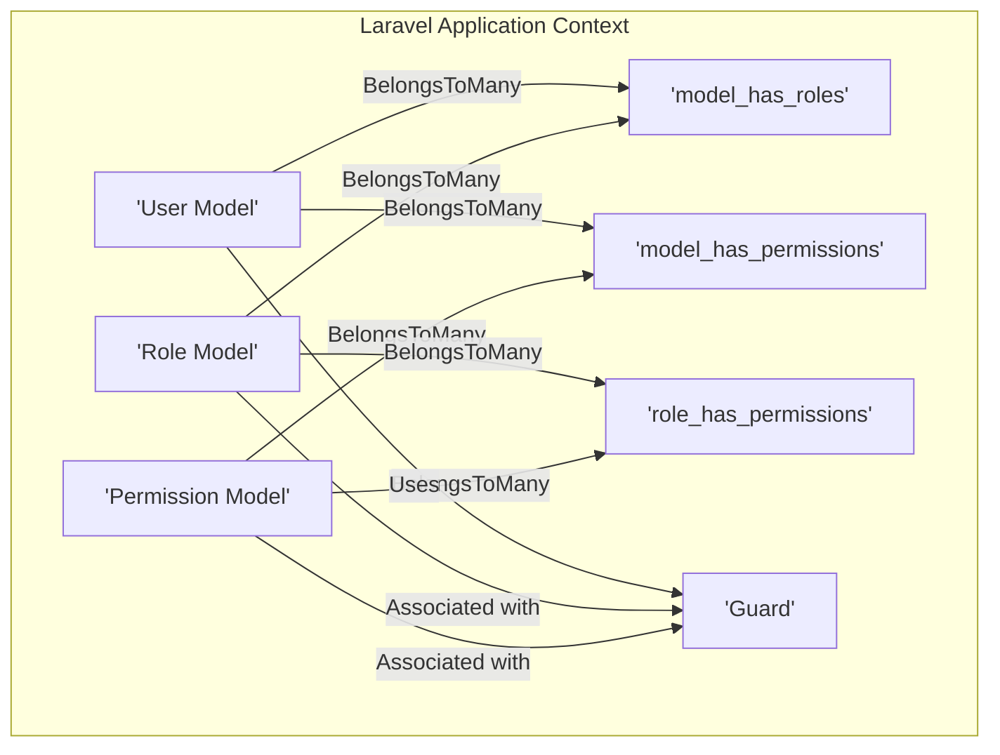
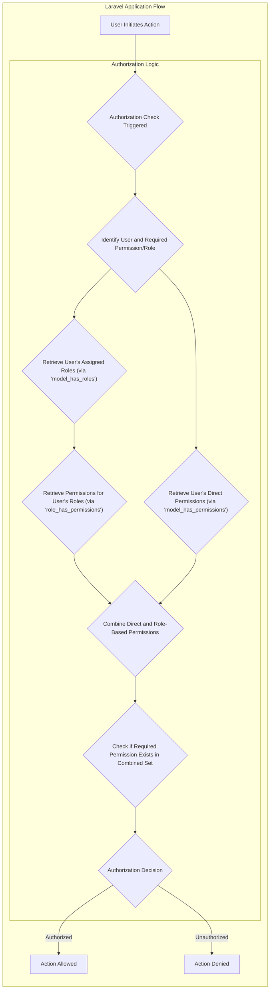

# Project Design Document: Laravel Permission Package

**Version:** 1.1
**Date:** October 26, 2023
**Author:** AI Software Architect

## 1. Introduction

This document provides an enhanced and detailed design overview of the `spatie/laravel-permission` package, a widely adopted authorization system for Laravel applications. This document aims to provide a clear and comprehensive articulation of the package's architecture, key components, and data flow, specifically tailored for subsequent threat modeling activities. This revision includes more granular details and clarifies certain aspects for better understanding.

## 2. Goals

The primary goals of the `spatie/laravel-permission` package are to:

* Provide a highly flexible and intuitive mechanism for managing user permissions and roles within Laravel applications.
* Enable developers to define fine-grained permissions representing specific actions or access rights.
* Facilitate the grouping of permissions into roles, which can then be assigned to users.
* Allow for the direct assignment of individual permissions to users, offering granular control.
* Offer a suite of convenient and expressive methods (e.g., middleware, blade directives, model traits, service providers) for enforcing authorization checks throughout the application.
* Seamlessly support multiple authentication guards (providers) within a single Laravel application, allowing for distinct permission sets for different user types.
* Ensure straightforward integration into both new and existing Laravel projects with minimal configuration.
* Leverage Laravel's existing features and conventions for a consistent development experience.

## 3. Architectural Overview

The `spatie/laravel-permission` package implements a robust role-based access control (RBAC) model, augmented with the ability to assign permissions directly to users. The core of the package revolves around several key entities and their well-defined relationships.

**Detailed Explanation of Components:**

* **'User Model':** Represents the application's user entity. This model is expected to utilize the `HasRoles` and `HasPermissions` traits provided by the package to establish the necessary relationships with roles and permissions. It acts as the subject of authorization checks.
* **'Role Model':** Represents a named collection of permissions. Roles serve as a convenient way to group related permissions and assign them to multiple users simultaneously. Roles are associated with a specific guard.
* **'Permission Model':** Represents a specific, atomic action or access right within the application (e.g., `edit articles`, `view reports`). Permissions are associated with a specific guard.
* **'Guard':**  Refers to Laravel's authentication guard (e.g., `web`, `api`, `admin`). The package supports associating roles and permissions with specific guards, enabling different authorization schemes for different parts of the application or user types.
* **'model_has_permissions' Pivot Table:**  A database pivot table that defines the many-to-many relationship between Eloquent models (typically the User model, but can be any model) and permissions. This allows for direct assignment of permissions to individual model instances. Includes `permission_id`, `model_type`, and `model_id` columns.
* **'model_has_roles' Pivot Table:** A database pivot table that defines the many-to-many relationship between Eloquent models (typically the User model) and roles. Includes `role_id`, `model_type`, and `model_id` columns.
* **'role_has_permissions' Pivot Table:** A database pivot table that defines the many-to-many relationship between roles and permissions. This establishes which permissions are included within each role. Includes `permission_id` and `role_id` columns.

## 4. Data Flow for Authorization Check

The typical data flow for determining if a user is authorized to perform a specific action involves the following steps, often triggered by middleware, blade directives, or direct method calls:

**Step-by-Step Breakdown:**

1. **User Initiates Action:** A user attempts to access a resource or perform an action within the application.
2. **Authorization Check Triggered:** The application's code, often through middleware, blade directives, or explicit calls to the package's methods, initiates an authorization check.
3. **Identify User and Required Permission/Role:** The system identifies the currently authenticated user and the specific permission or role required to perform the attempted action. This information is usually derived from route definitions, controller logic, or view templates.
4. **Retrieve User's Assigned Roles (via 'model_has_roles'):** The package queries the `model_has_roles` table to retrieve all roles associated with the current user for the relevant guard.
5. **Retrieve User's Direct Permissions (via 'model_has_permissions'):** The package queries the `model_has_permissions` table to retrieve all permissions directly assigned to the current user for the relevant guard.
6. **Retrieve Permissions for User's Roles (via 'role_has_permissions'):** For each role assigned to the user, the package queries the `role_has_permissions` table to retrieve the permissions associated with that role.
7. **Combine Direct and Role-Based Permissions:** The system aggregates the permissions directly assigned to the user and the permissions inherited through their roles into a comprehensive set of permissions.
8. **Check if Required Permission Exists in Combined Set:** The system checks if the permission required for the attempted action is present within the combined set of permissions. If checking against a role, it verifies if the user has the specified role.
9. **Authorization Decision:** Based on the presence or absence of the required permission or role, the system makes an authorization decision (allow or deny).
10. **Action Allowed/Denied:** The application proceeds with the action if authorized or returns an unauthorized response if access is denied.

## 5. Key Components and Functionality Deep Dive

This section provides a more in-depth look at the core components and functionalities offered by the `spatie/laravel-permission` package:

* **Traits for Models:**
    * `HasRoles`:  This trait is intended for use within the application's `User` model (or any other model that needs to have roles). It provides methods for managing role assignments, such as `assignRole()`, `removeRole()`, `hasRole()`, `getRoleNames()`, and relationships to the `Role` model.
    * `HasPermissions`: This trait is also intended for use within the application's `User` model (or other relevant models). It provides methods for directly managing permission assignments, such as `givePermissionTo()`, `revokePermissionTo()`, `hasPermissionTo()`, `getAllPermissions()`, and relationships to the `Permission` model.
    * `Role`: This trait is intended for use within the `Role` model provided by the package. It manages the relationship between roles and permissions, offering methods like `givePermissionTo()`, `revokePermissionTo()`, and `hasPermissionTo()`.
* **Eloquent Models:**
    * `Permission`:  An Eloquent model representing a single permission. Each permission typically has a unique name and is associated with a specific guard.
    * `Role`: An Eloquent model representing a collection of permissions. Each role has a unique name and is associated with a specific guard.
* **Database Migrations:** The package includes pre-built database migrations that create the necessary tables: `permissions`, `roles`, `model_has_permissions`, `model_has_roles`, and `role_has_permissions`. These migrations can be published and customized.
* **Configuration File (`permission.php`):** This configuration file allows developers to customize various aspects of the package, including:
    *  The names of the database tables used by the package.
    *  The names of the foreign key columns used in the pivot tables.
    *  The cache store and cache keys used for storing roles and permissions.
    *  The model class names to be used for `Permission` and `Role`.
* **Caching Mechanism:** The package leverages Laravel's caching system to significantly improve performance by caching user roles and permissions. This reduces the number of database queries required for authorization checks. Cache invalidation is handled automatically when roles or permissions are modified.
* **Blade Directives:** The package provides convenient Blade directives for performing authorization checks directly within view templates:
    * `@role($role)`: Checks if the current user has the specified role.
    * `@hasrole($role)`:  Alias for `@role`.
    * `@hasanyrole($roles)`: Checks if the current user has any of the specified roles.
    * `@hasallroles($roles)`: Checks if the current user has all of the specified roles.
    * `@can($permission)`: Checks if the current user has the specified permission.
    * `@cannot($permission)`: Checks if the current user does not have the specified permission.
    * `@unlessrole($role)`: The opposite of `@role`.
* **Middleware:** The package offers middleware for protecting routes based on user roles or permissions:
    * `role:<role>`: Allows access only to users with the specified role.
    * `permission:<permission>`: Allows access only to users with the specified permission.
    * `role_or_permission:<role1>|<role2>,<permission1>|<permission2>`: Allows access to users with any of the specified roles or permissions.
* **Artisan Commands:** The package includes helpful Artisan commands for managing roles and permissions:
    * `permission:create-role <name> [--guard_name=...]`: Creates a new role.
    * `permission:create-permission <name> [--guard_name=...]`: Creates a new permission.
* **Integration with Laravel Gates and Policies:** The package seamlessly integrates with Laravel's authorization gates and policies. Permissions defined using this package can be checked using `Gate::allows()` and within policy methods.
* **Support for Multiple Guards:** The package fully supports Laravel's multiple authentication guards. Roles and permissions can be associated with specific guards, allowing for distinct authorization logic for different user segments or application areas.
* **Service Provider:** The package includes a service provider that registers its components, middleware, and Blade directives with the Laravel application.

## 6. Security Considerations (Enhanced)

Building upon the initial considerations, here's a more detailed look at potential security concerns:

* **Authorization Bypass Vulnerabilities:**
    * **Logic Flaws in Package Methods:**  Potential vulnerabilities within the package's core authorization checking methods (`hasRole`, `hasPermissionTo`, etc.) could lead to incorrect authorization decisions.
    * **Incorrect Implementation by Developers:** Developers might misuse the package's features or implement custom authorization logic with flaws, leading to bypasses. For example, relying solely on client-side checks or not properly securing API endpoints.
    * **Race Conditions:** In highly concurrent environments, race conditions in permission checks or cache updates could potentially lead to temporary authorization bypasses.
* **Data Integrity Issues:**
    * **Unauthorized Modification of Role/Permission Assignments:**  Lack of proper access control for managing roles and permissions could allow malicious actors to grant themselves or others elevated privileges.
    * **Database Manipulation:** Direct manipulation of the database (if access is compromised) could lead to arbitrary changes in role and permission assignments.
    * **Mass Assignment Exploits:** If not properly guarded, mass assignment vulnerabilities could allow attackers to modify user roles or permissions through unexpected input fields.
* **Access Control for Management Operations:**
    * **Insufficient Protection of Admin Routes:**  Routes and controllers responsible for managing roles and permissions must be strictly protected and accessible only to authorized administrators.
    * **Lack of Audit Logging:**  Absence of proper audit logging for role and permission changes makes it difficult to track unauthorized modifications.
* **Cache-Related Vulnerabilities:**
    * **Cache Poisoning:** If the cache can be poisoned, attackers might be able to inject malicious role or permission data, leading to incorrect authorization decisions.
    * **Insecure Cache Storage:** If the cache storage is not properly secured, sensitive role and permission information could be exposed.
    * **Improper Cache Invalidation:**  Failures in cache invalidation logic could lead to users retaining outdated permissions, potentially granting them unauthorized access or denying legitimate access.
* **Guard Misconfiguration and Exploitation:**
    * **Incorrect Guard Assignment:**  Assigning roles or permissions to the wrong guard could lead to unintended access grants or denials.
    * **Guard Switching Vulnerabilities:**  Potential vulnerabilities in the application's guard switching mechanism could be exploited to bypass authorization checks.
* **SQL Injection Vulnerabilities:**
    * **Raw Queries:** Developers using raw SQL queries to interact with the permission tables without proper sanitization are susceptible to SQL injection attacks.
    * **Vulnerabilities in Custom Database Interactions:**  Any custom code that directly interacts with the permission tables needs to be carefully reviewed for SQL injection vulnerabilities.
* **Denial of Service (DoS):**
    * **Excessive Permission Checks:**  Performing a large number of complex permission checks could potentially lead to performance degradation and DoS.
    * **Cache Flooding:**  Attackers might attempt to flood the cache with invalid data related to permissions, impacting performance.

## 7. Assumptions and Constraints

The following assumptions and constraints are important to consider for this design:

* **Laravel Framework Dependency:** The package is tightly coupled with the Laravel framework and relies on its core functionalities.
* **Relational Database Requirement:**  The package requires a relational database supported by Laravel to store its data.
* **Functional Authentication System:**  A properly configured and functioning Laravel authentication system is a prerequisite for the package to operate correctly.
* **Developer Best Practices:** The security and effectiveness of the package heavily rely on developers following secure coding practices and correctly implementing the package's features.
* **Version Specifics:**  While this document outlines the general architecture, specific implementation details and features might vary across different versions of the `spatie/laravel-permission` package. It's recommended to consult the official documentation for the specific version being used.
* **No Custom Authorization Logic Conflicts:** It's assumed that any custom authorization logic implemented within the application does not conflict with the package's functionality in a way that introduces vulnerabilities.

This improved design document provides a more detailed and nuanced understanding of the `spatie/laravel-permission` package, making it even more suitable for comprehensive threat modeling exercises.