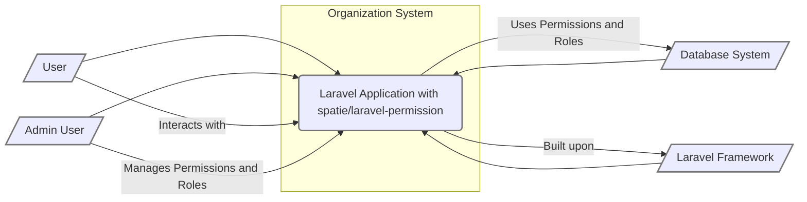
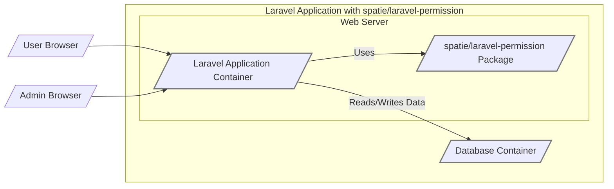
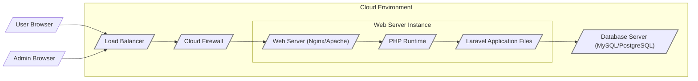
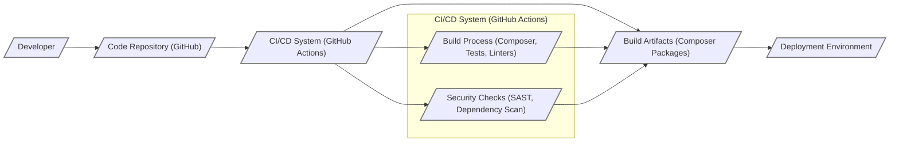

# BUSINESS POSTURE

This project, the `spatie/laravel-permission` Laravel package, aims to simplify and enhance the management of user roles and permissions within Laravel applications. It addresses the business need for robust and flexible access control, ensuring that users can only access the resources and functionalities they are authorized to use.

Business priorities this package addresses:
- Implement fine-grained access control to protect sensitive data and functionalities.
- Improve application security by enforcing the principle of least privilege.
- Enhance user management and administration capabilities.
- Support compliance requirements related to data access and authorization.
- Increase development efficiency by providing a reusable and well-tested solution for permissions management.

Most important business risks to be addressed:
- Unauthorized access to sensitive data or application functionalities, leading to data breaches or operational disruptions.
- Privilege escalation, where users gain access beyond their intended authorization level.
- Compliance violations due to inadequate access controls, resulting in legal and financial penalties.
- Operational inefficiencies and increased administrative overhead if access control is complex and difficult to manage.

# SECURITY POSTURE

Existing security controls:
- security control Laravel framework's built-in security features, including protection against common web vulnerabilities (CSRF, XSS, SQL injection). Implemented within the Laravel framework itself.
- security control Authentication mechanisms provided by Laravel, such as session-based authentication or Passport for API authentication. Implemented within the Laravel application using Laravel's authentication features.
- security control Database security measures, including access controls, encryption at rest and in transit, and regular backups. Implemented at the database server level and application configuration.

Accepted risks:
- accepted risk Potential vulnerabilities in the Laravel framework or underlying PHP runtime. Mitigated by keeping Laravel and PHP versions up to date.
- accepted risk Misconfiguration of the package or the Laravel application leading to unintended access control bypasses. Mitigated by thorough testing and security reviews.
- accepted risk Supply chain risks associated with third-party dependencies. Mitigated by using reputable package repositories and performing dependency vulnerability scanning.

Recommended security controls:
- security control Implement automated security testing, including unit tests and integration tests that specifically cover authorization logic.
- security control Conduct regular security code reviews of the application code, focusing on areas where permissions are enforced.
- security control Implement logging and monitoring of authorization events to detect and respond to suspicious activities.
- security control Follow secure coding practices throughout the development lifecycle, including input validation and output encoding where applicable in authorization logic.

Security requirements:
- Authentication: The package relies on the application's authentication system to identify users. It does not provide its own authentication mechanism. The application must ensure strong authentication practices are in place.
- Authorization: The primary purpose of this package is authorization. It must provide a robust and flexible mechanism to define and enforce permissions and roles, ensuring that only authorized users can access specific resources or perform actions. Authorization decisions should be consistently applied across the application.
- Input Validation: While the package itself doesn't directly handle user input, the application using it must validate all user inputs to prevent injection attacks that could potentially bypass authorization checks or manipulate permissions indirectly.
- Cryptography: Cryptography is not a core requirement for this package's functionality. However, if sensitive data related to roles or permissions is stored, encryption at rest should be considered at the database level. Secure communication channels (HTTPS) are essential to protect authorization tokens and session data in transit.

# DESIGN

## C4 CONTEXT

Context Diagram Elements:

- Element:
    - Name: Laravel Application with spatie/laravel-permission
    - Type: Software System
    - Description: The Laravel application that integrates the `spatie/laravel-permission` package to manage user roles and permissions. This is the system being designed.
    - Responsibilities:
        - Provide application functionalities to end-users.
        - Enforce access control policies based on roles and permissions defined by `spatie/laravel-permission`.
        - Interact with the database to store and retrieve application data and permission configurations.
        - Utilize the Laravel framework for core functionalities and security features.
    - Security controls:
        - security control Laravel framework security features (CSRF protection, etc.).
        - security control Application-level authentication and session management.
        - security control Input validation and output encoding within the application code.
        - security control Authorization enforcement using `spatie/laravel-permission` policies and guards.

- Element:
    - Name: User
    - Type: Person
    - Description: End-users of the Laravel application who interact with its functionalities. Their access is controlled by the permission system.
    - Responsibilities:
        - Access application features based on their assigned roles and permissions.
        - Authenticate to the application to establish their identity.
    - Security controls:
        - security control Strong password policies enforced by the application.
        - security control Multi-factor authentication (if implemented by the application).

- Element:
    - Name: Admin User
    - Type: Person
    - Description: Administrative users who manage the application's configuration, including roles and permissions using the `spatie/laravel-permission` package's features.
    - Responsibilities:
        - Define and manage roles and permissions within the application.
        - Assign roles to users.
        - Monitor user access and permissions.
    - Security controls:
        - security control Role-based access control to administrative functionalities.
        - security control Audit logging of administrative actions related to permissions.
        - security control Strong authentication and authorization for administrative access.

- Element:
    - Name: Database System
    - Type: Software System
    - Description: The database system used by the Laravel application to store application data, including user information, roles, and permissions managed by `spatie/laravel-permission`.
    - Responsibilities:
        - Persist application data, including user roles and permissions.
        - Provide data access to the Laravel application.
        - Ensure data integrity and availability.
    - Security controls:
        - security control Database access controls (user permissions, network restrictions).
        - security control Encryption at rest and in transit for sensitive data.
        - security control Regular database backups and disaster recovery plans.

- Element:
    - Name: Laravel Framework
    - Type: Software System
    - Description: The underlying Laravel PHP framework that provides the foundation for the application and the `spatie/laravel-permission` package.
    - Responsibilities:
        - Provide core functionalities for web application development (routing, templating, ORM, etc.).
        - Offer built-in security features and utilities.
        - Manage application lifecycle and dependencies.
    - Security controls:
        - security control Framework-level security features (CSRF protection, XSS prevention).
        - security control Regular security updates and patches provided by the Laravel community.

## C4 CONTAINER

Container Diagram Elements:

- Element:
    - Name: Laravel Application Container
    - Type: Web Application
    - Description: The main container representing the Laravel application, running within a web server environment (e.g., Apache, Nginx with PHP-FPM). It handles HTTP requests, application logic, and interacts with other containers.
    - Responsibilities:
        - Handle user requests and responses.
        - Implement application business logic.
        - Integrate and utilize the `spatie/laravel-permission` package for authorization.
        - Communicate with the Database Container to persist and retrieve data.
    - Security controls:
        - security control Web server security configurations (e.g., HTTPS, security headers).
        - security control Application-level firewall (if applicable).
        - security control Input validation and output encoding within the application code.
        - security control Session management and authentication mechanisms.
        - security control Authorization enforcement using the `spatie/laravel-permission` package.

- Element:
    - Name: spatie/laravel-permission Package
    - Type: Library
    - Description: A PHP library integrated into the Laravel Application Container, providing functionalities for managing roles and permissions. It is not a standalone deployable unit but a component within the application.
    - Responsibilities:
        - Provide APIs and functionalities to define roles and permissions.
        - Offer mechanisms to assign roles and permissions to users.
        - Enable authorization checks within the application code.
        - Interact with the Database Container to store and retrieve permission-related data.
    - Security controls:
        - security control Code review and security analysis of the package codebase (performed by the package maintainers and community).
        - security control Dependency vulnerability scanning to identify and mitigate risks from package dependencies.

- Element:
    - Name: Database Container
    - Type: Database
    - Description: The database system (e.g., MySQL, PostgreSQL) running in its own container or server, responsible for storing application data, including user information, roles, and permissions.
    - Responsibilities:
        - Persist application data, including user roles and permissions managed by `spatie/laravel-permission`.
        - Provide data access to the Laravel Application Container.
        - Ensure data integrity, availability, and confidentiality.
    - Security controls:
        - security control Database server security configurations (firewall, access controls).
        - security control Database user access management and least privilege principle.
        - security control Encryption at rest and in transit for database connections.
        - security control Regular database backups and disaster recovery procedures.

## DEPLOYMENT

Deployment Architecture: Cloud-based Web Hosting (e.g., AWS, Google Cloud, Azure)

Deployment Diagram Elements:

- Element:
    - Name: Load Balancer
    - Type: Infrastructure - Load Balancer
    - Description: Distributes incoming traffic across multiple Web Server Instances for scalability and high availability.
    - Responsibilities:
        - Distribute traffic evenly across web servers.
        - Health checks for web server instances.
        - SSL termination (optional).
    - Security controls:
        - security control DDoS protection.
        - security control SSL/TLS encryption for traffic termination.
        - security control Access control lists to restrict access to the load balancer management interface.

- Element:
    - Name: Cloud Firewall
    - Type: Infrastructure - Firewall
    - Description: Network firewall provided by the cloud provider to control inbound and outbound traffic to the Web Server Instance.
    - Responsibilities:
        - Filter network traffic based on configured rules.
        - Protect the Web Server Instance from unauthorized network access.
    - Security controls:
        - security control Network access control lists (ACLs) to restrict traffic to necessary ports and protocols.
        - security control Intrusion detection and prevention systems (IDS/IPS) (optional, depending on cloud provider and configuration).

- Element:
    - Name: Web Server (Nginx/Apache)
    - Type: Infrastructure - Web Server
    - Description: Web server software responsible for serving the Laravel application. It handles HTTP requests and passes PHP code to the PHP Runtime.
    - Responsibilities:
        - Serve static content.
        - Forward PHP requests to the PHP Runtime.
        - Manage web server configurations.
    - Security controls:
        - security control Web server hardening (disabling unnecessary modules, setting secure configurations).
        - security control Regular security updates and patching of the web server software.
        - security control Access logging and monitoring of web server activity.

- Element:
    - Name: PHP Runtime
    - Type: Software - Runtime Environment
    - Description: PHP runtime environment responsible for executing the Laravel application code.
    - Responsibilities:
        - Execute PHP code.
        - Manage PHP dependencies.
        - Provide necessary PHP extensions for the Laravel application.
    - Security controls:
        - security control Regular security updates and patching of the PHP runtime.
        - security control Secure PHP configuration (disabling dangerous functions, setting appropriate security directives).

- Element:
    - Name: Laravel Application Files
    - Type: Software - Application Deployment
    - Description: Deployed files of the Laravel application, including the `spatie/laravel-permission` package, application code, and configuration files.
    - Responsibilities:
        - Contain the application codebase.
        - Provide the application logic and functionalities.
        - Utilize the `spatie/laravel-permission` package for authorization.
    - Security controls:
        - security control File system permissions to restrict access to application files.
        - security control Regular vulnerability scanning of application dependencies.
        - security control Secure storage of sensitive configuration data (e.g., database credentials) using environment variables or secrets management services.

- Element:
    - Name: Database Server (MySQL/PostgreSQL)
    - Type: Infrastructure - Database Server
    - Description: Database server instance responsible for storing application data, including user roles and permissions.
    - Responsibilities:
        - Persist application data.
        - Provide data access to the Laravel application.
        - Ensure data integrity and availability.
    - Security controls:
        - security control Database server hardening and security configurations.
        - security control Database access controls and user permission management.
        - security control Encryption at rest and in transit for database connections.
        - security control Regular database backups and disaster recovery procedures.

## BUILD

Build Process Description:

1. Developer: Developers write code for the Laravel application and the integration with the `spatie/laravel-permission` package.
2. Code Repository (GitHub): Code is committed and pushed to a Git repository hosted on GitHub.
3. CI/CD System (GitHub Actions): Upon code changes, GitHub Actions, a CI/CD system, is triggered to automate the build process.
4. Build Process (Composer, Tests, Linters):
    - Composer is used to manage PHP dependencies, including the `spatie/laravel-permission` package.
    - Automated tests (unit, integration) are executed to ensure code quality and functionality.
    - Linters and code style checkers are run to enforce coding standards and identify potential code quality issues.
5. Security Checks (SAST, Dependency Scan):
    - Static Application Security Testing (SAST) tools are used to scan the codebase for potential security vulnerabilities.
    - Dependency scanning tools are used to identify known vulnerabilities in project dependencies, including the `spatie/laravel-permission` package and its dependencies.
6. Build Artifacts (Composer Packages): If the build process and security checks are successful, build artifacts are created. In the context of a Laravel application, these artifacts are typically the application code and dependencies managed by Composer.
7. Deployment Environment: Build artifacts are then deployed to the target deployment environment (e.g., cloud-based web hosting).

Build Process Security Controls:

- security control Secure Code Repository: Access control to the code repository, branch protection, and audit logging of code changes.
- security control CI/CD Pipeline Security: Secure configuration of the CI/CD pipeline, access control to CI/CD workflows and secrets, and audit logging of CI/CD activities.
- security control Dependency Management: Using Composer's `composer.lock` file to ensure consistent dependency versions and prevent dependency confusion attacks.
- security control Automated Testing: Unit tests and integration tests to verify the functionality and security of the application and authorization logic.
- security control Static Application Security Testing (SAST): SAST tools to identify potential security vulnerabilities in the codebase early in the development lifecycle.
- security control Dependency Vulnerability Scanning: Tools to scan project dependencies for known vulnerabilities and alert developers to update or mitigate risks.
- security control Build Artifact Integrity: Signing or checksumming build artifacts to ensure integrity and prevent tampering during deployment.
- security control Secret Management: Securely managing and storing sensitive credentials (API keys, database passwords) used in the build and deployment process, using CI/CD secrets management features.

# RISK ASSESSMENT

Critical business processes we are trying to protect:
- User authentication and authorization: Ensuring only authenticated and authorized users can access specific application features and data.
- Data access control: Protecting sensitive data from unauthorized access, modification, or deletion.
- Administrative functions: Securing administrative access to manage users, roles, permissions, and application configurations.

Data we are trying to protect and their sensitivity:
- User data (personal information, profiles): Sensitive data requiring confidentiality and integrity. Unauthorized access or modification can lead to privacy violations and reputational damage.
- Application data (business-critical information): Sensitivity depends on the nature of the application. Unauthorized access or modification can lead to financial loss, operational disruption, and compliance violations.
- Permission configurations (roles, permissions, assignments): Sensitive data that, if compromised, can lead to unauthorized access and privilege escalation. Requires confidentiality and integrity.

# QUESTIONS & ASSUMPTIONS

Questions:
- What type of application is this package being used for? (e.g., e-commerce, SaaS, internal tool). This will help to better understand the sensitivity of the data and critical business processes.
- What are the specific compliance requirements that the application needs to adhere to? (e.g., GDPR, HIPAA, PCI DSS). This will influence the required security controls.
- What is the organization's risk appetite? (e.g., startup vs. Fortune 500). This will help prioritize security controls and accepted risks.
- What authentication mechanism is used in the application? (e.g., session-based, JWT, OAuth). This will impact how authorization is integrated.
- What database system is being used? This can influence database security considerations.

Assumptions:
- Assumption: The application using this package handles sensitive user data.
- Assumption: The application is deployed in a cloud environment.
- Assumption: The organization values security and is willing to invest in implementing security controls.
- Assumption: The development team follows secure coding practices.
- Assumption: The application requires fine-grained access control based on roles and permissions.