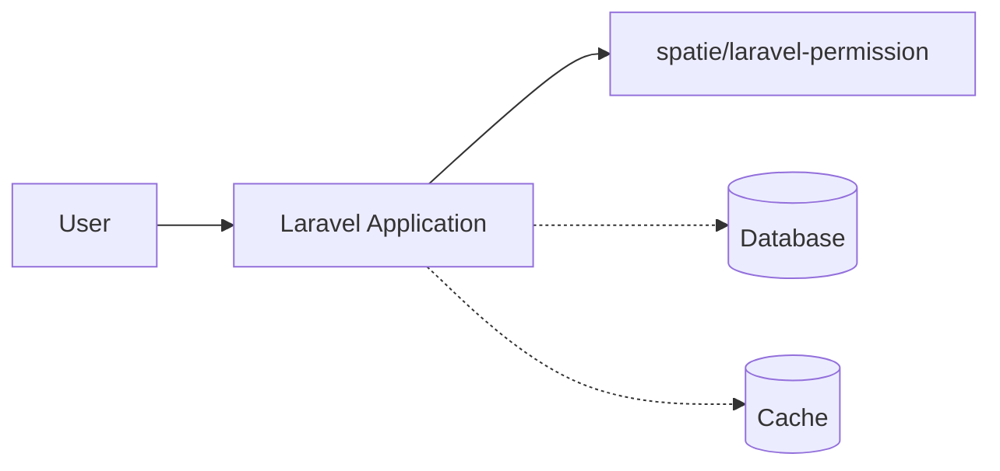
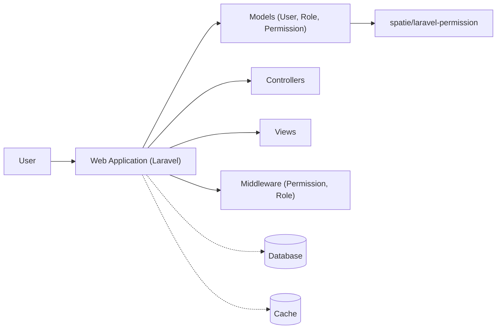
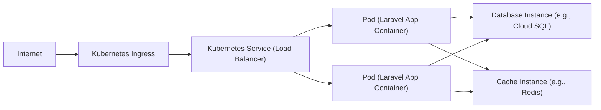
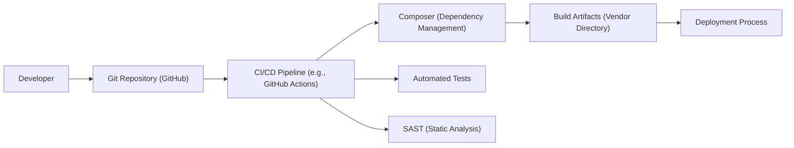

Okay, let's create a design document for the `spatie/laravel-permission` package.

# BUSINESS POSTURE

Business Priorities and Goals:

*   Provide a robust and flexible way to manage user permissions and roles within Laravel applications.
*   Simplify the implementation of authorization logic, reducing development time and potential errors.
*   Offer a well-maintained and widely adopted solution, ensuring community support and ongoing development.
*   Integrate seamlessly with Laravel's existing authentication and authorization systems.
*   Provide clear and comprehensive documentation.

Most Important Business Risks:

*   Incorrect permission/role implementation leading to unauthorized access to sensitive data or functionality.
*   Vulnerabilities within the package itself, potentially exploited to bypass security measures.
*   Lack of maintainability or updates, leading to compatibility issues with future Laravel versions.
*   Complexity in configuration or usage, increasing the likelihood of developer error.
*   Performance bottlenecks impacting application responsiveness.

# SECURITY POSTURE

Existing Security Controls:

*   security control: Leverages Laravel's built-in authentication system (described in Laravel documentation).
*   security control: Integrates with Laravel's authorization gates and policies (described in Laravel documentation).
*   security control: Uses database migrations to manage schema changes, ensuring consistency (migrations folder in the repository).
*   security control: Provides a caching mechanism to improve performance and reduce database load (configuration file and caching logic in the codebase).
*   security control: Offers Blade directives for convenient permission checks within views (Blade directives documentation).
*   security control: Provides middleware for route-level permission checks (middleware documentation).

Accepted Risks:

*   accepted risk: Relies on the underlying security of the Laravel framework and its dependencies.
*   accepted risk: Assumes developers will correctly configure and use the package's features.
*   accepted risk: Potential for performance issues if caching is not properly configured or if the database schema is not optimized.
*   accepted risk: The package stores permissions and roles in the database, making the database a critical security component.

Recommended Security Controls:

*   security control: Implement strict input validation on all user-provided data related to roles and permissions (e.g., role names, permission names).
*   security control: Regularly audit the database schema and data for inconsistencies or unexpected changes.
*   security control: Implement logging of all permission and role changes, including who made the change and when.
*   security control: Consider implementing two-factor authentication (2FA) for users with administrative privileges.
*   security control: Regularly review and update the package to the latest version to address any security vulnerabilities.
*   security control: Conduct security testing, including penetration testing, to identify potential vulnerabilities.

Security Requirements:

*   Authentication:
    *   The package should integrate seamlessly with Laravel's existing authentication system.
    *   Support for various authentication methods (e.g., email/password, social login, API tokens) should be possible through Laravel's configuration.

*   Authorization:
    *   The package should provide a clear and concise way to define roles and permissions.
    *   It should allow for granular permission assignments to individual users and roles.
    *   It should support checking permissions at multiple levels (e.g., route-level, controller-level, view-level).
    *   The authorization logic should be efficient and minimize performance overhead.

*   Input Validation:
    *   All input related to role and permission management (e.g., role names, permission names) should be strictly validated to prevent injection attacks.
    *   Validation rules should be clearly defined and enforced.

*   Cryptography:
    *   Sensitive data, such as user passwords, should be handled by Laravel's built-in authentication system and not directly by this package.
    *   If any cryptographic operations are performed within the package, they should use industry-standard algorithms and best practices.

# DESIGN

## C4 CONTEXT

Element Descriptions:

*   Element:
    *   Name: User
    *   Type: Person
    *   Description: A user interacting with the Laravel application.
    *   Responsibilities: Accessing and using the application's features.
    *   Security controls: Authentication and authorization managed by Laravel and spatie/laravel-permission.

*   Element:
    *   Name: Laravel Application
    *   Type: Software System
    *   Description: The web application built using the Laravel framework.
    *   Responsibilities: Providing the core application functionality.
    *   Security controls: Laravel's built-in security features, including authentication, authorization, CSRF protection, etc.

*   Element:
    *   Name: spatie/laravel-permission
    *   Type: Library/Package
    *   Description: The package providing role and permission management.
    *   Responsibilities: Managing roles, permissions, and their relationships to users.
    *   Security controls: Input validation, integration with Laravel's authorization system.

*   Element:
    *   Name: Database
    *   Type: Database
    *   Description: The database storing application data, including roles and permissions.
    *   Responsibilities: Persisting data.
    *   Security controls: Database access controls, encryption at rest (if applicable), regular backups.

*   Element:
    *   Name: Cache
    *   Type: Cache
    *   Description: The caching system used to improve performance.
    *   Responsibilities: Storing frequently accessed data to reduce database load.
    *   Security controls: Cache invalidation mechanisms, secure cache configuration.

## C4 CONTAINER

Element Descriptions:

*   Element:
    *   Name: User
    *   Type: Person
    *   Description: A user interacting with the Laravel application.
    *   Responsibilities: Accessing and using the application's features.
    *   Security controls: Authentication and authorization managed by Laravel and spatie/laravel-permission.

*   Element:
    *   Name: Web Application (Laravel)
    *   Type: Web Application
    *   Description: The main Laravel application.
    *   Responsibilities: Handling user requests, processing data, and rendering views.
    *   Security controls: Laravel's built-in security features, including authentication, authorization, CSRF protection, etc.

*   Element:
    *   Name: Models (User, Role, Permission)
    *   Type: Component
    *   Description: Eloquent models representing users, roles, and permissions.
    *   Responsibilities: Interacting with the database and providing an object-oriented interface to the data.
    *   Security controls: Data validation within models.

*   Element:
    *   Name: Controllers
    *   Type: Component
    *   Description: Laravel controllers handling user requests and business logic.
    *   Responsibilities: Processing user input, interacting with models, and returning responses.
    *   Security controls: Authorization checks using spatie/laravel-permission.

*   Element:
    *   Name: Views
    *   Type: Component
    *   Description: Laravel Blade templates rendering the user interface.
    *   Responsibilities: Displaying data to the user.
    *   Security controls: Using Blade directives for permission checks.

*   Element:
    *   Name: Middleware (Permission, Role)
    *   Type: Component
    *   Description: Laravel middleware provided by spatie/laravel-permission.
    *   Responsibilities: Enforcing permission and role checks on routes.
    *   Security controls: Restricting access to routes based on user permissions and roles.

*   Element:
    *   Name: Database
    *   Type: Database
    *   Description: The database storing application data, including roles and permissions.
    *   Responsibilities: Persisting data.
    *   Security controls: Database access controls, encryption at rest (if applicable), regular backups.

*   Element:
    *   Name: Cache
    *   Type: Cache
    *   Description: The caching system used to improve performance.
    *   Responsibilities: Storing frequently accessed data (like permissions) to reduce database load.
    *   Security controls: Cache invalidation mechanisms, secure cache configuration.

*   Element:
    *   Name: SpatiePermission
    *   Type: Library
    *   Description: Core logic of Spatie Permission package.
    *   Responsibilities: Provides core functionality for managing roles and permissions.
    *   Security controls: Input validation, integration with Laravel's authorization system.

## DEPLOYMENT

Possible Deployment Solutions:

1.  Traditional Web Server (Apache/Nginx) + PHP-FPM + Database Server (MySQL/PostgreSQL)
2.  Cloud-based Platform (e.g., AWS, Google Cloud, Azure) with managed services (e.g., AWS Elastic Beanstalk, Google App Engine, Azure App Service).
3.  Containerized Deployment (Docker) with orchestration (e.g., Kubernetes, Docker Swarm).
4.  Serverless Deployment (e.g., AWS Lambda, Google Cloud Functions, Azure Functions) - Less likely for a full Laravel application, but parts could be serverless.

Chosen Solution (for detailed description): Containerized Deployment (Docker) with Kubernetes.

Element Descriptions:

*   Element:
    *   Name: Internet
    *   Type: External Entity
    *   Description: The public internet.
    *   Responsibilities: Source of user requests.
    *   Security controls: Firewall, DDoS protection (typically provided by the cloud provider).

*   Element:
    *   Name: Kubernetes Ingress
    *   Type: Infrastructure Node
    *   Description: Entry point for external traffic into the Kubernetes cluster.
    *   Responsibilities: Routing traffic to the appropriate services.
    *   Security controls: TLS termination, SSL certificates, potentially a Web Application Firewall (WAF).

*   Element:
    *   Name: Kubernetes Service (Load Balancer)
    *   Type: Infrastructure Node
    *   Description: Load balances traffic across multiple pods.
    *   Responsibilities: Distributing traffic and providing a stable endpoint for the application.
    *   Security controls: Network policies.

*   Element:
    *   Name: Pod (Laravel App Container)
    *   Type: Container
    *   Description: A Kubernetes pod running the Laravel application container.
    *   Responsibilities: Running the application code.
    *   Security controls: Container security best practices (e.g., minimal base image, non-root user, read-only filesystem).

*   Element:
    *   Name: Database Instance (e.g., Cloud SQL)
    *   Type: Database
    *   Description: A managed database instance (e.g., Cloud SQL on Google Cloud).
    *   Responsibilities: Storing application data.
    *   Security controls: Database access controls, encryption at rest, regular backups, firewall rules.

*   Element:
    *   Name: Cache Instance (e.g., Redis)
    *   Type: Cache
    *   Description: A managed cache instance (e.g., Redis on Google Cloud Memorystore).
    *   Responsibilities: Storing frequently accessed data.
    *   Security controls: Access controls, secure configuration.

## BUILD

The `spatie/laravel-permission` package itself, being a library, doesn't have a complex build process in the same way a full application would. However, we can describe the process of integrating it into a Laravel application and the security considerations involved.

Build Process Description:

1.  Developer: The developer writes code and commits it to the Git repository.
2.  Git Repository: The code is stored in a Git repository (e.g., GitHub).
3.  CI/CD Pipeline: A CI/CD pipeline (e.g., GitHub Actions) is triggered by commits to the repository.
4.  Composer: Composer, PHP's dependency manager, is used to install the `spatie/laravel-permission` package and its dependencies. This is a critical step for supply chain security.
5.  Automated Tests: The CI pipeline runs automated tests, including unit tests and potentially integration tests, to ensure the code works as expected.
6.  SAST (Static Analysis): Static analysis tools (e.g., PHPStan, Psalm) are run to identify potential code quality and security issues.
7.  Build Artifacts: The result of the build process is a "vendor" directory containing all the installed dependencies, including `spatie/laravel-permission`.
8.  Deployment: The deployment process takes the build artifacts and deploys them to the target environment (as described in the Deployment section).

Security Controls in the Build Process:

*   security control: Dependency Management (Composer): Using Composer ensures that the correct versions of dependencies are installed. Composer.lock file should be committed to the repository to guarantee reproducible builds.
*   security control: Supply Chain Security: Regularly audit dependencies for known vulnerabilities (e.g., using tools like `composer audit` or Dependabot).
*   security control: Automated Tests: Running automated tests helps to catch bugs and regressions early in the development process.
*   security control: SAST (Static Analysis): Static analysis tools can identify potential security vulnerabilities in the code before it is deployed.
*   security control: Code Reviews: All code changes should be reviewed by another developer to ensure code quality and security.
*   security control: Secure CI/CD Configuration: The CI/CD pipeline itself should be configured securely, with appropriate access controls and secrets management.

# RISK ASSESSMENT

Critical Business Processes:

*   User authentication and authorization.
*   Access control to sensitive data and functionality.
*   Data integrity and confidentiality.
*   Application availability and performance.

Data Sensitivity:

*   User data (potentially including personal information, depending on the application). Sensitivity: Medium to High.
*   Roles and permissions data. Sensitivity: High.
*   Application-specific data (depending on the application). Sensitivity: Variable.

# QUESTIONS & ASSUMPTIONS

Questions:

*   What specific types of user data will be stored and processed by applications using this package?
*   What are the specific regulatory requirements (e.g., GDPR, CCPA) that apply to the applications using this package?
*   What is the expected load and performance requirements for applications using this package?
*   Are there any existing security policies or guidelines that need to be followed?
*   What level of access do developers have to production environments?

Assumptions:

*   BUSINESS POSTURE: The primary goal is to provide a secure and reliable way to manage permissions within Laravel applications.
*   SECURITY POSTURE: Developers will follow secure coding practices and properly configure the package. The underlying Laravel framework is secure.
*   DESIGN: The deployment environment will be properly secured, with appropriate network controls and access restrictions. The database will be secured and regularly backed up. The CI/CD pipeline will be configured securely.